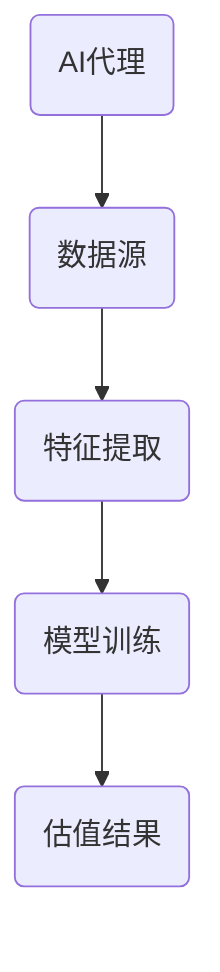
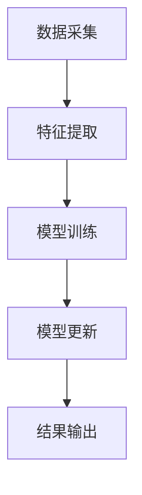
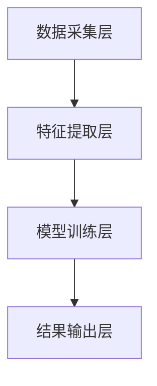

                 


# AI agents协作构建动态估值模型：适应快速变化的市场

> 关键词：AI代理，动态估值模型，市场变化，协作机制，系统架构，算法原理

> 摘要：本文深入探讨了AI代理协作构建动态估值模型的原理、方法及其在适应快速变化市场中的应用。通过分析AI代理的协作机制、动态估值模型的数学基础、系统架构设计以及实际项目案例，本文为读者提供了一个全面的视角，展示了如何利用AI技术来应对复杂多变的市场环境。

---

## 第1章 AI代理协作构建动态估值模型的背景与价值

### 1.1 问题背景

随着市场环境的快速变化，传统的静态估值模型已无法满足实时性和准确性要求。AI代理通过协作方式，能够动态更新模型参数，实时反映市场变化，从而提供更精准的估值结果。

#### 1.1.1 市场快速变化的挑战

现代市场环境复杂多变，受到多种因素的影响，如经济指标、政策变化、突发事件等。传统的静态估值模型难以适应这种动态变化，导致估值结果滞后或偏差。

#### 1.1.2 传统估值模型的局限性

传统估值模型通常基于历史数据和固定假设，缺乏对实时数据的处理能力，且难以快速响应市场变化。此外，单一模型难以覆盖多维度的市场因素。

#### 1.1.3 AI代理在动态环境中的优势

AI代理具备实时数据处理能力、自适应学习能力和分布式协作能力，能够动态调整模型参数，快速响应市场变化，提供实时、精准的估值结果。

### 1.2 问题描述

动态估值模型需要能够实时更新，反映市场变化。AI代理通过协作方式，可以高效地收集、处理和分析数据，构建和更新动态估值模型。

#### 1.2.1 动态估值模型的核心目标

动态估值模型的核心目标是实时更新模型参数，反映市场变化，提供准确的估值结果。

#### 1.2.2 AI代理在模型构建中的角色

AI代理负责数据采集、特征提取、模型训练和结果输出，通过协作机制实现模型的动态更新。

#### 1.2.3 市场变化对估值模型的影响

市场变化直接影响模型的输入数据和参数，需要动态调整模型结构和参数，以保持估值的准确性。

### 1.3 问题解决

通过AI代理的协作，动态估值模型能够实时更新，适应市场变化。

#### 1.3.1 AI代理协作的解决方案

AI代理通过分布式协作，实时采集、处理和分析数据，构建和更新动态估值模型。

#### 1.3.2 动态估值模型的构建方法

动态估值模型基于实时数据和机器学习算法，通过AI代理协作实现模型的动态更新。

#### 1.3.3 协作机制的设计与优化

协作机制设计包括任务分配、数据共享、结果同步等环节，确保AI代理高效协作。

### 1.4 边界与外延

动态估值模型的应用范围和协作机制需要明确边界，与其他技术协同工作。

#### 1.4.1 动态估值模型的适用范围

动态估值模型适用于需要实时更新的场景，如金融市场的实时估值。

#### 1.4.2 AI代理协作的边界条件

AI代理协作需要考虑数据安全、计算资源限制等因素。

#### 1.4.3 与其他技术的协同关系

动态估值模型可以与其他技术如区块链、物联网等结合，形成更强大的系统。

### 1.5 概念结构与核心要素

动态估值模型和AI代理协作需要明确概念结构和核心要素。

#### 1.5.1 动态估值模型的组成要素

动态估值模型包括实时数据、机器学习算法、模型参数等要素。

#### 1.5.2 AI代理的协作机制

AI代理协作机制包括任务分配、数据共享、结果同步等环节。

#### 1.5.3 模型动态更新的触发条件

模型动态更新的触发条件包括数据变化、时间间隔等。

---

## 第2章 AI代理与动态估值模型的核心概念与联系

### 2.1 AI代理的基本概念

AI代理是能够感知环境、自主决策并执行任务的智能体。

#### 2.1.1 AI代理的定义与分类

AI代理根据智能性和自主性分为反应式代理、基于模型的代理等。

#### 2.1.2 多智能体协作的基本原理

多智能体协作通过通信和协调实现共同目标。

#### 2.1.3 AI代理在动态环境中的适应性

AI代理具备快速适应环境变化的能力。

### 2.2 动态估值模型的原理

动态估值模型基于实时数据和机器学习算法，实现动态更新。

#### 2.2.1 动态估值模型的定义

动态估值模型是一种能够实时更新的估值模型。

#### 2.2.2 AI代理在模型构建中的角色

AI代理负责数据采集、特征提取、模型训练和结果输出。

#### 2.2.3 动态估值模型与传统模型的对比

动态估值模型具备实时更新、适应性强的特点，而传统模型则静态、固定。

### 2.3 核心概念对比表

| 概念       | 描述                                                                 |
|------------|----------------------------------------------------------------------|
| AI代理     | 具备智能性和自主性的智能体，能够感知环境并执行任务。               |
| 动态估值模型 | 基于实时数据和机器学习算法，能够动态更新的估值模型。             |

### 2.4 实体关系图



---

## 第3章 动态估值模型的算法原理

### 3.1 算法原理概述

动态估值模型基于机器学习算法，通过实时数据更新模型参数。

#### 3.1.1 动态估值模型的数学基础

动态估值模型可以表示为：

$$ V(t) = \beta_0 + \beta_1 x_1(t) + \beta_2 x_2(t) + \dots + \beta_n x_n(t) $$

其中，$V(t)$ 表示在时间 $t$ 的估值，$\beta_i$ 表示模型参数，$x_i(t)$ 表示输入特征。

#### 3.1.2 机器学习算法选择

常用的机器学习算法包括线性回归、随机森林、神经网络等。

### 3.2 动态更新算法

动态估值模型通过实时数据更新模型参数。

#### 3.2.1 线性回归模型的动态更新

线性回归模型的动态更新可以通过最小二乘法实现：

$$ \theta_{new} = \theta_{old} + \alpha (y - \hat{y})X $$

其中，$\alpha$ 是学习率，$y$ 是真实值，$\hat{y}$ 是预测值，$X$ 是输入矩阵。

#### 3.2.2 基于马尔可夫链的动态更新

动态估值模型可以通过马尔可夫链实现状态转移：

$$ P_{i+1} = P_i + \Delta P $$

其中，$P_i$ 表示当前状态概率，$\Delta P$ 表示状态变化量。

### 3.3 算法实现

动态估值模型的实现步骤如下：

1. 数据采集：实时采集市场数据。
2. 特征提取：从数据中提取特征。
3. 模型训练：基于特征训练模型。
4. 模型更新：根据新数据更新模型参数。
5. 结果输出：输出估值结果。



### 3.4 代码实现

以下是一个动态估值模型的Python实现示例：

```python
import numpy as np
from sklearn.linear_model import LinearRegression

# 数据采集
X = np.array([[1], [2], [3], [4], [5]])
y = np.array([2, 4, 5, 4, 5])

# 模型训练
model = LinearRegression()
model.fit(X, y)

# 动态更新
new_X = np.array([[6]])
new_y = model.predict(new_X)
print(new_y[0])
```

---

## 第4章 系统架构设计与实现

### 4.1 系统架构设计

动态估值模型的系统架构包括数据采集层、特征提取层、模型训练层和结果输出层。

#### 4.1.1 数据采集层

数据采集层负责实时采集市场数据。

#### 4.1.2 特征提取层

特征提取层从数据中提取特征。

#### 4.1.3 模型训练层

模型训练层基于特征训练模型。

#### 4.1.4 结果输出层

结果输出层输出估值结果。

### 4.2 系统架构图



---

## 第5章 项目实战与案例分析

### 5.1 项目实战

动态估值模型的实现步骤如下：

1. 环境安装：安装必要的Python库。
2. 数据采集：采集市场数据。
3. 特征提取：从数据中提取特征。
4. 模型训练：基于特征训练模型。
5. 模型更新：根据新数据更新模型参数。
6. 结果输出：输出估值结果。

#### 5.1.1 环境安装

安装必要的Python库：

```bash
pip install numpy scikit-learn
```

#### 5.1.2 核心实现

动态估值模型的核心实现代码如下：

```python
import numpy as np
from sklearn.linear_model import LinearRegression

# 数据采集
X = np.array([[1], [2], [3], [4], [5]])
y = np.array([2, 4, 5, 4, 5])

# 模型训练
model = LinearRegression()
model.fit(X, y)

# 动态更新
new_X = np.array([[6]])
new_y = model.predict(new_X)
print(new_y[0])
```

#### 5.1.3 代码解读

代码首先采集数据，然后训练模型，最后输出预测结果。

### 5.2 案例分析

以下是一个实际案例的分析：

1. 数据采集：采集房地产市场的价格数据。
2. 特征提取：提取面积、位置、房龄等特征。
3. 模型训练：基于特征训练线性回归模型。
4. 模型更新：根据新数据更新模型参数。
5. 结果输出：输出房地产的估值。

---

## 第6章 总结与展望

### 6.1 最佳实践

动态估值模型的实现需要考虑数据实时性、模型可解释性等因素。

### 6.2 小结

本文深入探讨了AI代理协作构建动态估值模型的原理、方法及其在适应快速变化市场中的应用。

### 6.3 注意事项

在实际应用中，需要注意数据安全、模型解释性等问题。

### 6.4 拓展阅读

推荐阅读相关领域的书籍和论文，深入理解动态估值模型和AI代理的最新进展。

---

## 作者

作者：AI天才研究院/AI Genius Institute & 禅与计算机程序设计艺术 /Zen And The Art of Computer Programming

