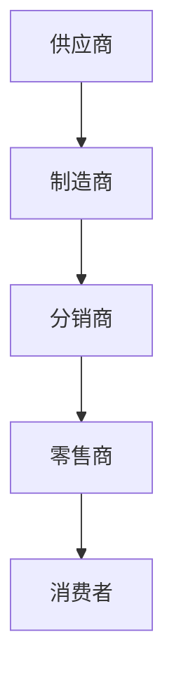
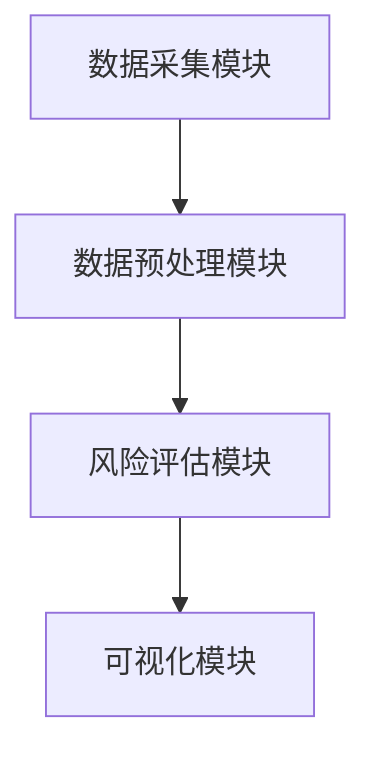
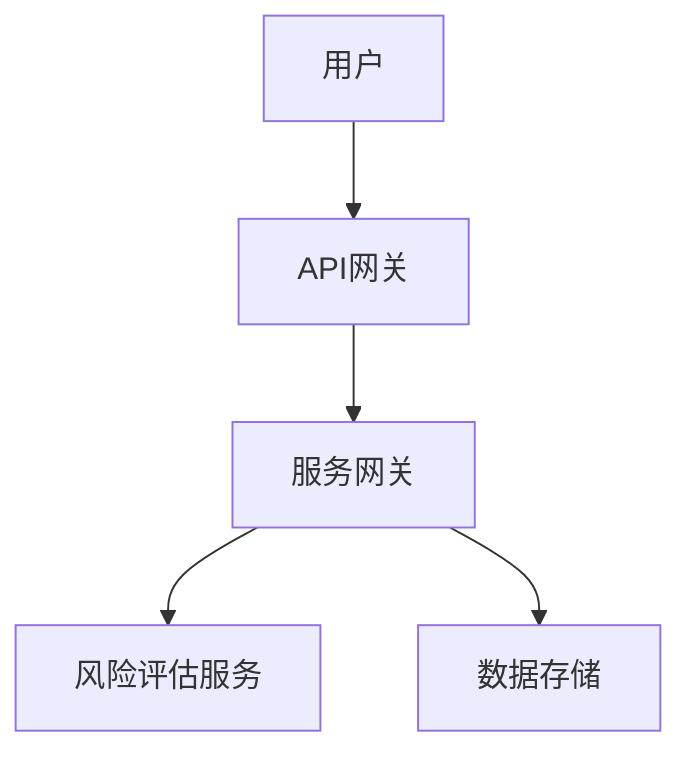
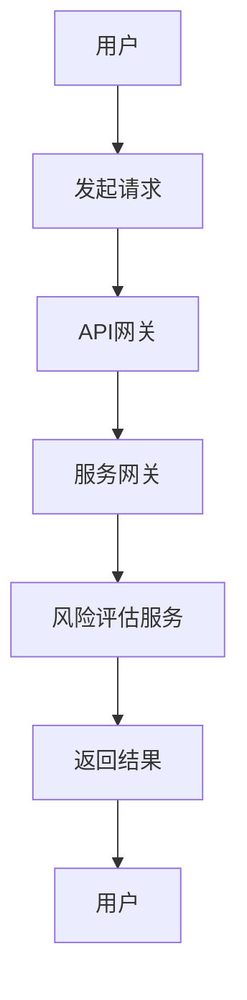

                 


# AI agents协作进行全球供应链风险评估：提高投资安全性

**关键词：** AI代理、供应链风险、投资安全性、协作机制、风险管理

**摘要：**  
本文探讨了AI代理如何协作进行全球供应链风险评估，以提高投资安全性。通过分析供应链的复杂性、AI代理的协作机制及其在风险评估中的应用，本文提供了从理论到实践的全面指导。通过详细讲解算法原理、系统架构设计和项目实战，读者可以掌握如何利用AI代理优化供应链风险管理，从而在投资决策中更具信心和安全性。

---

# 第一部分: 全球供应链风险评估的背景与挑战

## 第1章: 全球供应链风险评估概述

### 1.1 供应链的基本概念与重要性
#### 1.1.1 供应链的定义与组成部分
供应链是由供应商、制造商、分销商、零售商和消费者组成的复杂网络，涉及物流、信息流和资金流。  
**关键实体关系图（Mermaid）：**  


#### 1.1.2 全球供应链的特点与复杂性
全球供应链的特点包括全球化、复杂性和动态性。  
- 全球化：跨越多个国家和地区。  
- 复杂性：涉及多个参与者和环节。  
- 动态性：受市场变化、政策调整和自然灾害影响。  

#### 1.1.3 供应链风险的来源与影响
供应链风险包括供应中断、成本波动、质量问题等，直接影响企业的运营和投资收益。  

### 1.2 投资安全性的核心问题
#### 1.2.1 投资风险的定义与分类
投资风险包括市场风险、信用风险和操作风险等。  
- 市场风险：价格波动对投资的影响。  
- 信用风险：交易对手违约的风险。  
- 操作风险：系统故障或人为错误导致的风险。  

#### 1.2.2 供应链风险对投资的影响
供应链中断可能导致成本上升、交货延迟，进而影响企业利润和投资者信心。  

#### 1.2.3 提高投资安全性的关键因素
- 优化供应链管理。  
- 建立风险预警机制。  
- 利用AI技术进行实时监控和预测。  

### 1.3 AI代理在供应链管理中的作用
#### 1.3.1 AI代理的定义与特点
AI代理是能够感知环境并采取行动的智能体，具有自主性、反应性和协作性。  

#### 1.3.2 AI代理在供应链中的应用场景
- 实时监控物流状态。  
- 预测供应中断风险。  
- 优化库存管理。  

#### 1.3.3 AI代理协作的优势与潜力
通过协作，AI代理可以更高效地处理复杂任务，降低供应链风险。  

### 1.4 本章小结
本章介绍了供应链的基本概念、投资安全性的重要性以及AI代理在供应链管理中的潜力。

---

# 第二部分: AI代理协作的核心概念与原理

## 第2章: AI代理协作的基本原理

### 2.1 AI代理的定义与分类
#### 2.1.1 AI代理的定义与特点
AI代理可以分为简单反射代理和基于模型的代理。  

#### 2.1.2 基于AI代理的协作模式
- 分布式协作：代理独立决策。  
- 集中式协作：由中央控制器协调。  

### 2.2 AI代理协作的机制与流程
#### 2.2.1 多代理协作的基本框架
- 信息共享：代理之间共享数据和知识。  
- 协作任务分解：将复杂任务分解为子任务。  

#### 2.2.2 代理间的信息传递与协调
通过通信协议，代理可以实时交换信息并协调行动。  

#### 2.2.3 协作任务的分解与分配
将任务分解为子任务，并根据代理的能力进行分配。  

### 2.3 AI代理协作的关键技术
#### 2.3.1 多智能体系统（MAS）的概念
MAS是由多个智能体组成的系统，智能体之间通过协作完成任务。  

#### 2.3.2 代理间的通信协议
- RPC（远程过程调用）。  
- RESTful API。  

#### 2.3.3 基于强化学习的协作策略
通过强化学习，代理可以学习最优协作策略。  

### 2.4 本章小结
本章详细讲解了AI代理的定义、分类及其协作机制。

---

# 第三部分: 全球供应链风险评估的AI代理协作方法

## 第3章: 基于AI代理的风险评估方法

### 3.1 数据收集与预处理
#### 3.1.1 供应链数据的来源与类型
数据来源包括传感器、ERP系统和市场报告。  

#### 3.1.2 数据清洗与特征提取
- 数据清洗：去除噪声数据。  
- 特征提取：提取关键特征，如交货时间、成本波动。  

### 3.2 风险评估模型的构建与应用
#### 3.2.1 基于机器学习的风险评估模型
- 使用随机森林或XGBoost进行风险预测。  

#### 3.2.2 模型训练与优化
- 通过交叉验证优化模型参数。  

### 3.3 风险评估指标与可视化
#### 3.3.1 风险评估指标
- 风险概率：供应链中断的可能性。  
- 风险影响：中断对企业的影响程度。  

#### 3.3.2 风险可视化工具
- 使用Power BI或Tableau进行可视化。  

### 3.4 本章小结
本章介绍了基于AI代理的风险评估方法及其应用。

---

# 第四部分: 系统架构与设计

## 第4章: 系统架构与设计

### 4.1 系统功能设计
#### 4.1.1 系统功能模块
- 数据采集模块：收集供应链数据。  
- 风险评估模块：运行风险评估模型。  
- 可视化模块：展示风险评估结果。  

#### 4.1.2 系统功能流程图（Mermaid）


### 4.2 系统架构设计
#### 4.2.1 系统架构图（Mermaid）


### 4.3 接口设计与交互流程
#### 4.3.1 系统接口设计
- API接口：供其他系统调用。  

#### 4.3.2 交互流程图（Mermaid）


### 4.4 本章小结
本章详细讲解了系统架构设计及其各个模块的功能。

---

# 第五部分: 项目实战

## 第5章: 项目实战

### 5.1 项目背景与目标
#### 5.1.1 项目背景
某跨国企业希望利用AI代理优化供应链风险管理。  

### 5.2 环境搭建与核心代码实现
#### 5.2.1 环境搭建
- 安装Python、TensorFlow和Keras。  

#### 5.2.2 核心代码实现
```python
import numpy as np
from sklearn.ensemble import RandomForestClassifier

# 数据预处理
X = np.load('supply_chain_data.npy')
y = np.load('labels.npy')

# 模型训练
model = RandomForestClassifier()
model.fit(X, y)

# 预测风险
new_data = np.load('new_data.npy')
predictions = model.predict(new_data)
```

### 5.3 代码解读与分析
- 数据预处理：加载数据并进行清洗。  
- 模型训练：使用随机森林算法训练模型。  
- 预测风险：对新数据进行风险预测。  

### 5.4 项目小结
本章通过一个实际案例展示了如何利用AI代理进行供应链风险评估。

---

# 第六部分: 算法原理

## 第6章: 算法原理

### 6.1 算法原理概述
#### 6.1.1 算法选择与优化
- 使用强化学习算法优化协作策略。  

### 6.2 算法实现与代码解读
#### 6.2.1 强化学习算法实现
```python
import numpy as np
import gym

# 定义环境
class SupplyChainEnv(gym.Env):
    def __init__(self):
        super().__init__()
        self.state = None

    def step(self, action):
        # 状态转移和奖励计算
        pass

    def reset(self):
        # 初始化环境
        pass

# 强化学习算法实现
class Agent:
    def __init__(self):
        self.model = ...  # 初始化模型

    def act(self, state):
        # 根据状态采取行动
        pass
```

### 6.3 数学模型与公式
#### 6.3.1 风险评估的数学模型
$$ R = f(x_1, x_2, ..., x_n) $$
其中，$x_i$表示供应链中的各个因素，$R$表示风险值。  

### 6.4 本章小结
本章详细讲解了强化学习算法及其在供应链风险评估中的应用。

---

# 第七部分: 总结与展望

## 第7章: 总结与展望

### 7.1 全书总结
- 全球供应链风险评估的重要性。  
- AI代理在供应链管理中的潜力。  

### 7.2 未来展望
- 更先进的AI算法。  
- 更广泛的应用场景。  

### 7.3 最佳实践 tips
- 定期更新模型参数。  
- 建立完善的数据监控机制。  

### 7.4 本章小结
本章总结了全书内容，并展望了未来的发展方向。

---

**作者：AI天才研究院 & 禅与计算机程序设计艺术**

