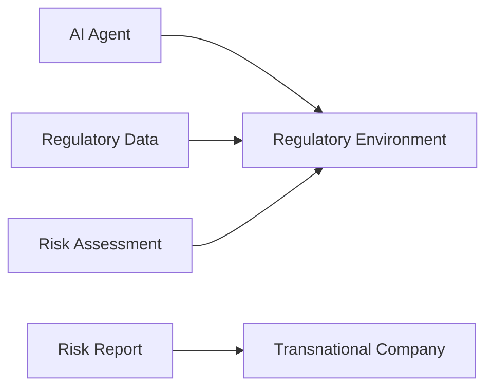
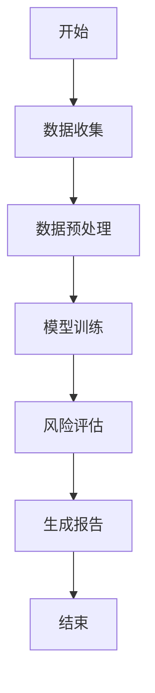
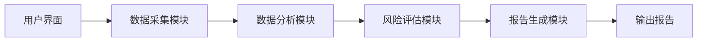

                 


# AI agents协作进行全球监管环境分析：评估跨国公司风险

## 关键词：AI agents, 全球监管环境分析, 跨国公司, 风险评估, 协作算法, 系统架构

## 摘要

随着全球化的深入，跨国公司在不同司法管辖区面临复杂的监管环境。本文探讨AI agents协作进行全球监管环境分析的方法，以评估和管理跨国公司的风险。通过详细阐述背景、核心概念、算法原理、系统架构和项目实战，本文为读者提供全面的解决方案，展示如何利用AI技术优化监管分析过程。

---

## 第一部分：背景介绍

### 第1章：问题背景与描述

跨国公司在全球范围内运营，需应对不同司法管辖区的复杂监管环境。传统监管分析方法依赖人工操作，效率低下且容易出错。AI agents的协作能力为解决这一问题提供了新思路。

#### 1.1 问题背景
- **全球化挑战**：跨国公司必须遵守不同地区的法律法规，监管环境复杂且动态变化。
- **传统方法局限**：人工分析耗时且容易遗漏细节，难以应对海量数据和复杂规则。
- **AI技术潜力**：AI agents可实时分析数据，提供动态反馈，优化决策过程。

#### 1.2 问题描述
- **监管风险**：跨国公司可能因不了解当地法规而面临法律风险。
- **信息不透明**：不同地区的法规差异大，信息获取困难。
- **效率低下**：传统监管分析耗时长，成本高。

#### 1.3 问题解决与边界
- **AI agents优势**：通过协作分析，AI agents能够高效处理复杂数据，提供实时反馈。
- **边界与外延**：明确AI代理的应用场景和限制，确保解决方案的可行性。

---

## 第二部分：核心概念与联系

### 第2章：AI agents与监管环境分析

AI agents协作进行监管环境分析，需理解其核心概念和相互关系。

#### 2.1 核心概念原理
- **AI agents定义**：智能代理，能够感知环境并采取行动。
- **监管环境分析**：对不同地区的法规进行系统性分析。

#### 2.2 核心概念属性对比
| 概念       | 属性               |
|------------|--------------------|
| AI agents   | 智能性、协作性      |
| 监管环境    | 复杂性、动态性      |

#### 2.3 实体关系图


---

## 第三部分：算法原理讲解

### 第3章：AI agents协作算法

AI agents协作算法包括数据收集、预处理、模型训练和反馈优化。

#### 3.1 算法流程


#### 3.2 数学模型
AI agents协作分析使用概率模型和决策树进行风险评估。概率模型：
$$P(R|E) = \frac{P(E|R)P(R)}{P(E)}$$

决策树用于分类和回归，帮助AI agents做出最优决策。

#### 3.3 代码实现
```python
import pandas as pd
from sklearn.tree import DecisionTreeClassifier

# 数据预处理
data = pd.read_csv('regulatory_data.csv')
X = data.drop('risk', axis=1)
y = data['risk']

# 模型训练
model = DecisionTreeClassifier()
model.fit(X, y)

# 预测风险
new_data = pd.DataFrame({'feature1': [value1], 'feature2': [value2]})
predicted_risk = model.predict(new_data)
```

---

## 第四部分：系统分析与架构设计

### 第4章：系统分析与架构方案

系统设计需考虑应用场景、功能模块和架构结构。

#### 4.1 系统分析
- **应用场景**：跨国公司需实时了解法规变化，优化合规策略。
- **功能需求**：数据收集、分析、报告生成。

#### 4.2 系统架构


#### 4.3 接口设计
- **数据接口**：API用于数据采集和传输。
- **用户接口**：直观界面供用户查看报告。

---

## 第五部分：项目实战

### 第5章：项目实战

通过实际案例展示AI agents协作的应用。

#### 5.1 环境安装
安装Python和相关库：
```bash
pip install pandas scikit-learn
```

#### 5.2 核心代码实现
```python
import pandas as pd
from sklearn.ensemble import RandomForestClassifier

# 数据加载
data = pd.read_csv('regulatory_data.csv')

# 特征选择
features = data.drop('risk', axis=1)
target = data['risk']

# 模型训练
model = RandomForestClassifier()
model.fit(features, target)

# 预测风险
test_data = pd.DataFrame({'feature1': [value1], 'feature2': [value2]})
predicted_risk = model.predict(test_data)
print(predicted_risk)
```

#### 5.3 案例分析
通过具体案例分析AI agents如何帮助跨国公司识别和管理监管风险，优化合规策略。

---

## 第六部分：最佳实践

### 第6章：最佳实践

总结经验和技巧，提供注意事项和拓展阅读。

#### 6.1 小结
- AI agents协作分析的优势和局限。
- 未来发展方向：更智能的算法和更广泛的应用场景。

#### 6.2 注意事项
- 数据隐私和安全问题。
- 模型的可解释性和透明度。

#### 6.3 拓展阅读
- 推荐书籍和资源，进一步了解AI在监管分析中的应用。

---

## 作者

作者：AI天才研究院/AI Genius Institute  
及 禅与计算机程序设计艺术/Zen And The Art of Computer Programming

