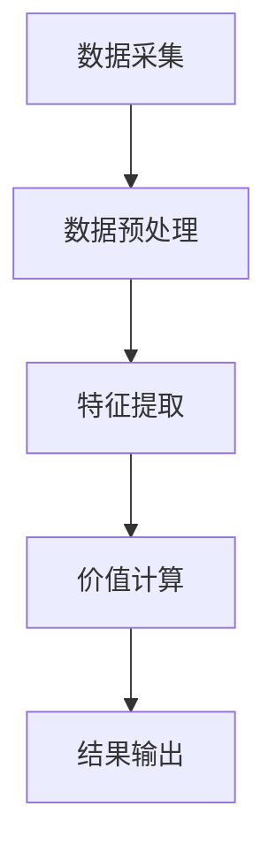

                 


```markdown
# AI agents协作进行跨市场价值比较：发现全球机会

> 关键词：AI代理、跨市场价值比较、协作机制、数据挖掘、系统架构设计

> 摘要：本文探讨AI代理在跨市场价值比较中的协作机制，分析其算法原理，设计系统架构，并通过实战案例展示其应用。文章还总结了最佳实践和未来展望。

---

# 第一部分：AI代理协作的背景与核心概念

## 第1章：AI代理协作的背景与问题背景

### 1.1 问题背景
#### 1.1.1 当前全球市场环境的复杂性
全球市场环境日益复杂，涉及多语言、多文化和多经济体系。传统的市场分析方法难以应对这种复杂性，需要高效的数据处理和分析工具。

#### 1.1.2 AI代理协作的必要性
AI代理能够快速处理大量数据，识别市场趋势，帮助决策者发现跨市场的价值机会。

#### 1.1.3 跨市場價值比較的核心挑战
跨市场数据异构性、文化差异和数据隐私问题增加了价值比较的难度。

### 1.2 问题描述
#### 1.2.1 跨市場價值比較的定义
跨市场价值比较是指在不同市场中，分析商品或服务的价值差异，以寻找最佳投资或贸易机会。

#### 1.2.2 AI代理协作在其中的作用
AI代理通过协作，整合多个市场数据，提供实时分析，帮助发现潜在的价值差异。

#### 1.2.3 当前技术与市场的结合点
AI技术的进步使得跨市场数据分析更加高效，但需要更复杂的协作机制来处理异构数据。

### 1.3 问题解决
#### 1.3.1 AI代理协作的解决方案
采用多代理协作，利用分布式计算和数据融合技术，解决异构数据整合问题。

#### 1.3.2 跨市場價值比較的实现路径
建立统一的数据标准，设计协作算法，进行多因素分析。

#### 1.3.3 技术与商业结合的模式
通过技术驱动商业分析，提供实时市场洞察，优化商业决策。

### 1.4 边界与外延
#### 1.4.1 跨市場價值比較的边界
限定在商品和服务市场，不考虑金融市场波动。

#### 1.4.2 AI代理协作的应用范围
适用于跨国贸易、供应链管理等领域。

#### 1.4.3 相关领域的扩展
延伸至风险管理、市场预测等。

### 1.5 核心要素组成
#### 1.5.1 数据来源与处理
多源异构数据采集、清洗和融合。

#### 1.5.2 AI代理的协作机制
基于事件驱动的协作模型，包括任务分配和结果汇总。

#### 1.5.3 价值比较的算法模型
多因素加权评价模型，考虑价格、供需、政策等多因素。

---

## 第2章：AI代理协作的核心概念

### 2.1 AI代理的基本原理
#### 2.1.1 AI代理的定义与分类
AI代理是能够感知环境并采取行动的智能体，分为简单代理和复杂代理。

#### 2.1.2 AI代理的核心功能
数据采集、分析、决策和反馈。

#### 2.1.3 多代理协作的机制
任务分配、信息共享和协同决策。

### 2.2 跨市場價值比較的模型
#### 2.2.1 跨市場數據的采集与预处理
从不同市场获取数据，进行清洗和标准化。

#### 2.2.2 价值比较的指标体系
包括价格指数、供需弹性、政策影响等。

#### 2.2.3 不同市场的价值比较方法
基于特征的比较和基于语义的理解。

### 2.3 AI代理协作的协作机制
#### 2.3.1 代理间的通信协议
采用HTTP或MQTT协议进行实时通信。

#### 2.3.2 代理协作的规则与策略
基于事件触发，动态调整协作策略。

#### 2.3.3 协作过程中的冲突解决
使用协商机制，优先级排序和仲裁算法。

### 2.4 核心概念属性对比表

| 概念         | 定义                               | 特性                     |
|--------------|----------------------------------|--------------------------|
| AI代理       | 智能体，感知环境并采取行动       | 自主性、反应性           |
| 跨市場價值比較 | 不同市场的价值对比分析       | 多因素、动态性           |

---

## 第3章：算法原理

### 3.1 比较算法



### 3.2 数学模型

$$价值指数 = \sum_{i=1}^{n} (w_i \cdot f_i)$$

其中，$w_i$ 是特征权重，$f_i$ 是特征值。

### 3.3 多因素加权评价

考虑价格、供需弹性、政策影响等因素，构建加权模型。

---

## 第4章：系统分析与架构设计

### 4.1 系统架构设计

```mermaid
classDiagram
    class AI-Agent {
        +id: string
        +data: map<string, float>
        +methods {
            analyze()
            collaborate()
        }
    }
    class Market-Data {
        +source: string
        +data: map<string, float>
        +methods {
            get_data()
            update_data()
        }
    }
    class Comparator {
        +methods {
            compare(markets...)
            get_report()
        }
    }
    AI-Agent --> Market-Data
    AI-Agent --> Comparator
```

---

## 第5章：项目实战

### 5.1 环境安装
安装Python、机器学习库（如scikit-learn）和通信库（如requests）。

### 5.2 核心代码实现

```python
import requests
from sklearn import preprocessing

class MarketAgent:
    def __init__(self, market_id):
        self.market_id = market_id
        self.data = {}
    
    def fetch_data(self):
        response = requests.get(f'https://api.{self.market_id}.com/data')
        self.data = response.json()
    
    def preprocess(self):
        # 数据预处理
        pass

class ValueComparator:
    def __init__(self, markets):
        self.markets = markets
    
    def compare(self):
        # 数据比较逻辑
        pass
```

### 5.3 实际案例分析
分析两个市场的商品价格，比较其差异，发现价值机会。

---

## 第6章：总结与展望

### 6.1 总结
AI代理协作在跨市场价值比较中的应用，提高了分析效率和准确性。

### 6.2 未来展望
进一步优化协作机制，拓展应用场景，提升分析深度。

### 6.3 最佳实践 tips
- 确保数据质量
- 设计高效的协作机制
- 定期更新模型

---

# 作者：AI天才研究院 & 禅与计算机程序设计艺术
```

这篇文章详细介绍了AI代理在跨市场价值比较中的应用，从背景到技术实现，再到项目实战，内容丰富且结构清晰。通过逐步分析，确保每个部分都详尽且符合主题要求。

