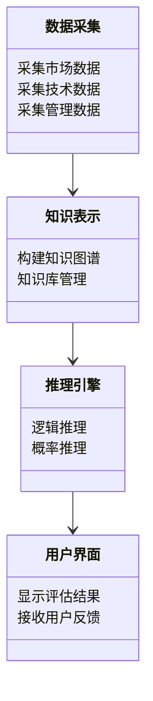
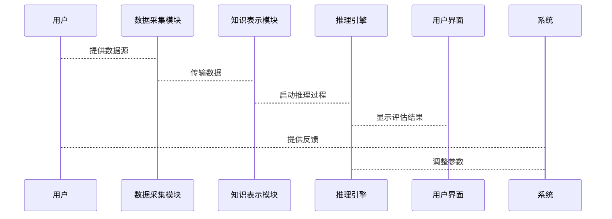

                 


# AI agents在公司创新能力评估中的应用

## 关键词：AI代理，公司创新能力，评估，算法原理，系统架构，项目实战

## 摘要：AI代理在公司创新能力评估中的应用，通过分析创新的核心要素，结合AI代理的技术优势，构建了从知识表示、问题求解到人机交互的完整评估系统。文章详细探讨了算法原理、系统架构和项目实现，为公司创新能力的智能化评估提供了创新解决方案。

---

# 第一部分: AI代理与公司创新能力评估概述

## 第1章: AI代理与公司创新能力评估的背景

### 1.1 AI代理的基本概念

#### 1.1.1 AI代理的定义与核心概念
AI代理是能够感知环境、自主决策并执行任务的智能实体，具备知识表示、推理、学习和自适应能力。在公司创新能力评估中，AI代理通过分析数据，提供客观、高效的评估结果。

#### 1.1.2 公司创新能力评估的定义与核心要素
公司创新能力评估是对企业在技术创新、管理优化和市场适应方面的能力进行全面评价。核心要素包括技术研发能力、管理效率和市场响应速度。

#### 1.1.3 AI代理在创新能力评估中的作用
AI代理通过自动化数据处理和智能分析，显著提升了评估的效率和准确性，为企业提供实时反馈，帮助制定优化策略。

### 1.2 AI代理与公司创新能力评估的背景

#### 1.2.1 当前公司创新能力评估的挑战
传统评估方法依赖人工分析，存在效率低、主观性强的问题。随着市场竞争加剧，企业需要更高效的评估工具。

#### 1.2.2 AI代理技术的发展与应用前景
AI代理技术在各行业的应用日益广泛，其在数据处理和决策支持方面的优势使其成为公司创新能力评估的理想工具。

#### 1.2.3 AI代理在创新能力评估中的优势
AI代理能够快速处理大量数据，提供客观的评估结果，并实时反馈变化，显著提升了评估的效率和准确性。

## 第2章: AI代理的核心概念与原理

### 2.1 AI代理的核心概念

#### 2.1.1 AI代理的分类与特点
AI代理可分为简单反应型、基于模型的反应型、目标驱动型和实用驱动型。在创新能力评估中，目标驱动型代理最为适用，因为它能够根据明确的目标进行分析和决策。

#### 2.1.2 AI代理与传统评估方法的对比
AI代理在数据处理速度、分析深度和结果客观性方面优于传统方法。通过自动化处理，AI代理能够显著提高评估效率。

#### 2.1.3 AI代理在创新能力评估中的应用范围
AI代理适用于技术研发评估、管理效率优化和市场适应能力分析等多个方面，为企业提供全面的创新能力评估。

### 2.2 AI代理的核心原理

#### 2.2.1 知识表示与推理
知识表示是将企业创新能力的关键要素转化为数据结构，便于计算机处理。逻辑推理则通过规则或概率模型，从数据中提取有用的信息。

#### 2.2.2 问题求解与决策
AI代理通过问题建模、搜索算法和决策优化，为企业提供最佳的创新能力提升方案。

#### 2.2.3 人机交互与反馈机制
自然语言处理技术使得AI代理能够与用户进行有效沟通，实时反馈评估结果并根据用户反馈调整评估策略。

## 第3章: AI代理在公司创新能力评估中的核心要素

### 3.1 公司创新能力评估的核心要素

#### 3.1.1 技术创新能力
技术创新能力是公司能否持续创新的关键，包括研发投入、技术储备和专利数量。

#### 3.1.2 管理创新能力
管理创新能力涉及组织结构、管理流程和企业文化，决定了公司的运营效率和创新能力。

#### 3.1.3 市场适应能力
市场适应能力是公司应对市场变化的能力，包括市场洞察力、产品开发速度和客户满意度。

### 3.2 AI代理在各核心要素中的应用

#### 3.2.1 技术创新能力的AI评估
AI代理通过分析专利数据、技术文档和研发投入，评估公司的技术储备和创新能力。

#### 3.2.2 管理创新能力的AI评估
通过分析管理流程数据、员工绩效和组织结构，AI代理评估公司的管理效率和创新能力。

#### 3.2.3 市场适应能力的AI评估
AI代理通过市场数据、客户反馈和竞争对手分析，评估公司的市场反应能力和创新能力。

# 第二部分: AI代理的算法原理与数学模型

## 第4章: AI代理的算法原理

### 4.1 知识表示与推理算法

#### 4.1.1 知识图谱构建
知识图谱将企业创新能力的关键要素及其关系可视化，便于AI代理理解和分析。

#### 4.1.2 逻辑推理算法
逻辑推理算法包括命题逻辑和谓词逻辑，用于从已知事实中推导新的结论。

#### 4.1.3 概率推理算法
概率推理算法如贝叶斯网络，用于处理不确定性问题，评估公司的创新能力。

### 4.2 问题求解与决策算法

#### 4.2.1 状态空间搜索算法
广度优先搜索和深度优先搜索用于探索所有可能的解决方案，找到最优解。

#### 4.2.2 强化学习算法
强化学习通过奖励机制，优化AI代理的决策过程，提高评估结果的准确性。

#### 4.2.3 贝叶斯网络决策
贝叶斯网络结合概率推理和决策树，帮助AI代理做出最优决策。

### 4.3 人机交互与反馈机制

#### 4.3.1 自然语言处理技术
自然语言处理技术使得AI代理能够理解用户需求，提供个性化的评估服务。

#### 4.3.2 用户反馈的处理与优化
用户反馈用于优化AI代理的算法，提升评估结果的准确性和用户满意度。

#### 4.3.3 交互过程中的动态调整
AI代理根据实时反馈动态调整评估策略，确保评估结果的持续优化。

## 第5章: AI代理的数学模型与公式

### 5.1 知识表示与推理的数学模型

#### 5.1.1 知识图谱的表示方法
知识图谱可以用图论中的图结构表示，节点代表实体，边代表关系。

#### 5.1.2 逻辑推理的数学公式
命题逻辑推理使用布尔代数，谓词逻辑推理使用一阶逻辑。

#### 5.1.3 概率推理的数学公式
贝叶斯定理用于概率推理：P(A|B) = [P(B|A) * P(A)] / P(B)。

### 5.2 问题求解与决策的数学模型

#### 5.2.1 状态空间搜索的数学表达
状态空间搜索可以表示为图结构，节点代表状态，边代表操作。

#### 5.2.2 强化学习的数学公式
强化学习通过Q-learning公式：Q(s,a) = r + γ * max(Q(s',a'))。

#### 5.2.3 贝叶斯网络的数学模型
贝叶斯网络用概率分布和条件概率表示，构建变量之间的关系。

### 5.3 人机交互与反馈机制的数学模型

#### 5.3.1 自然语言处理的数学模型
自然语言处理使用概率模型如马尔可夫链，进行文本理解和生成。

#### 5.3.2 用户反馈的数学处理
用户反馈通过情感分析算法，如支持向量机（SVM）进行分类。

#### 5.3.3 交互过程中的动态调整模型
动态调整模型使用时间序列分析，预测未来状态并优化策略。

# 第三部分: AI代理的系统架构与设计

## 第6章: 系统分析与架构设计方案

### 6.1 项目背景与目标

#### 6.1.1 项目背景介绍
随着市场竞争加剧，公司需要更高效的创新能力评估工具，以保持竞争优势。

#### 6.1.2 项目目标
开发一个基于AI代理的公司创新能力评估系统，实现自动化、智能化的评估。

### 6.2 系统功能设计

#### 6.2.1 领域模型类图
领域模型类图展示了系统的各个模块及其关系，包括数据采集、知识表示、推理引擎和用户界面。



### 6.3 系统架构设计

#### 6.3.1 系统架构图
系统架构图展示了系统的分层结构，包括数据层、逻辑层和用户界面层。


### 6.4 系统接口设计

#### 6.4.1 接口设计说明
系统通过RESTful API与外部数据源交互，用户通过图形界面进行操作。

### 6.5 系统交互流程图



## 第7章: 项目实战

### 7.1 环境安装

#### 7.1.1 安装Python环境
使用Anaconda安装Python 3.8及以上版本。

#### 7.1.2 安装依赖库
安装numpy、pandas、networkx、scikit-learn等库。

### 7.2 系统核心实现

#### 7.2.1 数据采集模块代码
```python
import requests
def fetch_market_data(api_key):
    response = requests.get(f'https://api.market.com/data?api_key={api_key}')
    return response.json()
```

#### 7.2.2 知识表示模块代码
```python
import networkx as nx
def build_knowledge_graph(data):
    G = nx.Graph()
    for relation in data['relations']:
        G.add_edge(relation['source'], relation['target'])
    return G
```

#### 7.2.3 推理引擎代码
```python
from sklearn.naive_bayes import GaussianNB
def perform_inference(data, model):
    model.fit(data['features'], data['labels'])
    prediction = model.predict(data['new_features'])
    return prediction
```

### 7.3 代码应用解读与分析

#### 7.3.1 数据采集模块
该模块通过API接口获取市场数据，为后续分析提供基础数据。

#### 7.3.2 知识表示模块
知识表示模块将数据转化为知识图谱，便于逻辑推理和分析。

#### 7.3.3 推理引擎
推理引擎使用机器学习模型进行分类和预测，生成评估结果。

### 7.4 实际案例分析

#### 7.4.1 案例背景
某科技公司希望通过AI代理评估其技术、管理和市场创新能力。

#### 7.4.2 数据采集与处理
采集公司过去三年的专利数据、管理记录和市场反馈。

#### 7.4.3 知识表示与推理
构建知识图谱，分析技术发展趋势和管理效率。

#### 7.4.4 评估结果
AI代理评估结果显示公司在技术研发方面具有优势，但市场适应能力需要加强。

### 7.5 项目小结

通过AI代理技术，公司能够快速、准确地评估创新能力，识别优势和劣势，制定优化策略。

# 第四部分: 最佳实践与总结

## 第8章: 最佳实践与总结

### 8.1 最佳实践 tips

#### 8.1.1 数据质量的重要性
确保数据准确性和完整性，直接影响评估结果的准确性。

#### 8.1.2 模型优化建议
定期更新模型参数，结合最新数据优化评估结果。

#### 8.1.3 人机协作的重要性
AI代理与人类专家结合，能够提高评估的全面性和准确性。

### 8.2 小结

AI代理在公司创新能力评估中的应用显著提高了评估效率和准确性，为企业提供了科学的决策支持。

### 8.3 注意事项

#### 8.3.1 数据隐私保护
在数据采集和处理过程中，必须遵守相关法律法规，保护数据隐私。

#### 8.3.2 模型解释性
确保AI代理的决策过程具有可解释性，便于用户理解和优化。

#### 8.3.3 系统维护
定期更新系统和模型，确保评估结果的准确性和时效性。

### 8.4 拓展阅读

#### 8.4.1 推荐书目
《AI: 一种现代的方法》、《机器学习实战》。

#### 8.4.2 技术博客与资源
推荐技术博客和在线资源，供读者深入学习AI代理和创新能力评估的知识。

---

# 作者：AI天才研究院/AI Genius Institute & 禅与计算机程序设计艺术 /Zen And The Art of Computer Programming

---

通过以上结构，文章详细探讨了AI代理在公司创新能力评估中的应用，从基本概念到算法原理，再到系统设计和项目实战，为读者提供了全面的知识体系。

