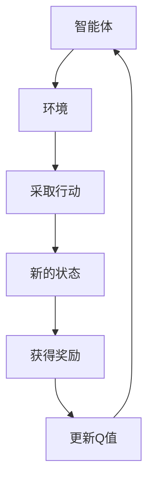
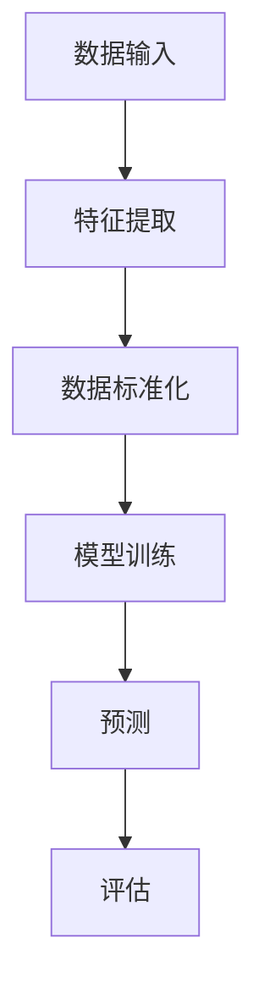
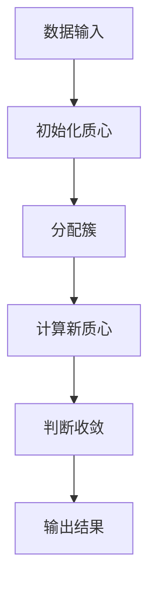

                 


## 第四章 AI代理的核心算法与数学模型

### 4.1 强化学习算法

#### 4.1.1 Q-learning算法

**Q-learning算法概述**

Q-learning是一种基于强化学习（Reinforcement Learning）的算法，主要用于通过试错法让智能体学习如何在环境中采取行动以获得最大累积奖励。它通过更新Q值表来学习最优策略，适用于离散动作空间和状态空间。

**Q-learning算法的流程图**



**Q-learning算法的数学模型**

Q-learning的更新公式为：
$$ Q(s, a) = (1 - \alpha) \cdot Q(s, a) + \alpha \cdot (r + \gamma \cdot \max Q(s', a')) $$

其中：
- \( \alpha \) 是学习率（0 < α < 1）
- \( \gamma \) 是折扣因子（0 < γ < 1）
- \( r \) 是即时奖励
- \( s' \) 是下一个状态
- \( a' \) 是下一个动作

**Q-learning算法的Python代码示例**

```python
import numpy as np

class QLearning:
    def __init__(self, state_space, action_space, learning_rate=0.1, gamma=0.9):
        self.state_space = state_space
        self.action_space = action_space
        self.lr = learning_rate
        self.gamma = gamma
        self.q_table = np.zeros((state_space, action_space))
    
    def take_action(self, state):
        # 选择动作，简化为随机选择（实际应用中可采用ε-greedy策略）
        return np.random.randint(self.action_space)
    
    def update(self, state, action, reward, next_state):
        # 更新Q值表
        self.q_table[state, action] = (1 - self.lr) * self.q_table[state, action] + \
                                        self.lr * (reward + self.gamma * np.max(self.q_table[next_state, :]))
    
    def get_max_action(self, state):
        # 返回最佳动作
        return np.argmax(self.q_table[state, :])
```

### 4.2 监督学习算法

#### 4.2.1 线性回归

**线性回归概述**

线性回归是一种统计分析方法，用于建立自变量与因变量之间的线性关系模型。在AI代理中，它常用于预测分析，如预测公司收入是否可持续。

**线性回归的流程图**



**线性回归的数学模型**

线性回归的最小二乘法公式为：
$$ \hat{y} = \theta_0 + \theta_1 x $$

其中：
- \( \theta_0 \) 是截距
- \( \theta_1 \) 是回归系数
- \( x \) 是自变量
- \( \hat{y} \) 是预测值

**线性回归的Python代码示例**

```python
import numpy as np
from sklearn.linear_model import LinearRegression

def linear_regression():
    # 示例数据
    X = np.array([[1], [2], [3], [4], [5]])
    y = np.array([2, 4, 5, 4, 6])
    
    # 创建模型
    model = LinearRegression()
    model.fit(X, y)
    
    # 预测
    print("预测值:", model.predict(np.array([[6]])))
    
    # 模型系数
    print("截距:", model.intercept_)
    print("回归系数:", model.coef_)

linear_regression()
```

### 4.3 无监督学习算法

#### 4.3.1 K均值聚类

**K均值聚类概述**

K均值聚类是一种无监督学习算法，用于将数据划分为K个簇，适用于模式识别和客户细分等场景，帮助公司识别不同类型的客户群体，优化商业模式。

**K均值聚类的流程图**



**K均值聚类的数学模型**

质心更新公式为：
$$ c_i^{(t+1)} = \frac{1}{n_i} \sum_{j \in C_i} x_j^{(t)} $$

其中：
- \( c_i \) 是第i个簇的质心
- \( n_i \) 是簇i中的数据点数量
- \( x_j \) 是簇i中的第j个数据点

**K均值聚类的Python代码示例**

```python
from sklearn.cluster import KMeans

def kmeans_clustering():
    # 示例数据
    X = np.array([[1, 2], [1, 3], [2, 2], [2, 3], [5, 6], [5, 7], [6, 6], [6, 7]])
    
    # 创建模型
    model = KMeans(n_clusters=2, random_state=0)
    model.fit(X)
    
    # 输出簇中心
    print("簇中心:", model.cluster_centers_)
    
    # 输出簇标签
    print("簇标签:", model.labels_)

kmeans_clustering()
```

---

通过以上详细讲解，我们介绍了Q-learning算法、线性回归和K均值聚类在AI代理中的应用。这些算法帮助AI代理在商业模式评估中进行预测和聚类分析，从而提供数据支持和决策优化。

