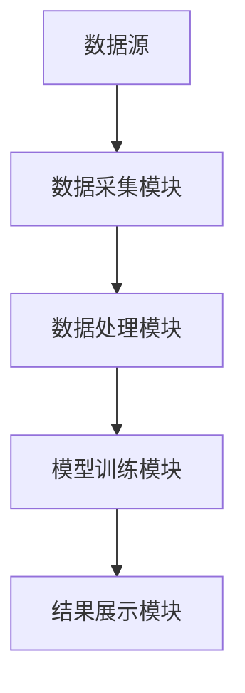
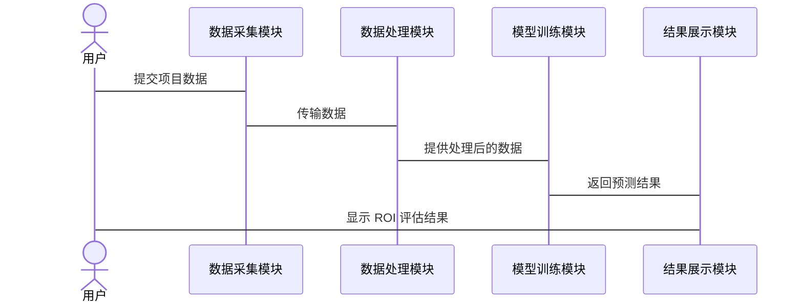

                 


# AI agents在公司数字化转型ROI评估中的应用

**关键词**：AI代理、数字化转型、ROI评估、投资回报率、人工智能

**摘要**：本文探讨了AI代理在公司数字化转型中的应用，特别是如何通过AI代理来评估和优化投资回报率。文章从基本概念到技术实现，再到实际案例，详细分析了AI代理在ROI评估中的作用，并提供了系统的架构设计和最佳实践。

---

## 目录

1. [AI代理与数字化转型概述](#ai代理与数字化转型概述)
2. [ROI评估的基础理论](#roi评估的基础理论)
3. [AI代理在数字化转型中的应用](#ai代理在数字化转型中的应用)
4. [AI代理驱动的ROI评估方法论](#ai代理驱动的roi评估方法论)
5. [技术实现与算法原理](#技术实现与算法原理)
6. [系统架构与设计](#系统架构与设计)
7. [项目实战与案例分析](#项目实战与案例分析)
8. [最佳实践与未来展望](#最佳实践与未来展望)

---

## 第一部分：AI代理与数字化转型概述

### 第1章：AI代理与数字化转型概述

#### 1.1 AI代理的基本概念

##### 1.1.1 AI代理的定义与核心要素

AI代理（Artificial Intelligence Agents）是指能够感知环境并采取行动以实现目标的智能实体。它们可以是软件程序、机器人或其他智能系统，具备以下核心要素：

- **自主性**：能够在没有外部干预的情况下运作。
- **反应性**：能够感知环境并做出实时反应。
- **目标导向**：通过采取行动来实现特定目标。
- **学习能力**：能够通过数据和经验改进自身性能。

##### 1.1.2 数字化转型的背景与目标

数字化转型是指利用数字技术改造或创新业务模式、流程、文化等，以提高效率、竞争力和客户体验。其目标包括：

- 提高业务效率。
- 创新商业模式。
- 改善客户体验。
- 增强数据驱动的决策能力。

##### 1.1.3 AI代理在数字化转型中的作用

AI代理在数字化转型中扮演着重要角色，尤其是在数据处理、流程优化和决策支持方面。它们可以帮助企业自动化重复性任务、提高决策速度和准确性，并提供实时反馈。

#### 1.2 数字化转型的挑战与机遇

##### 1.2.1 传统企业数字化转型的难点

- 数据孤岛：不同部门或系统之间的数据难以整合。
- 技术鸿沟：传统企业缺乏数字化技术的人才和经验。
- 文化障碍：员工可能对新技术持怀疑态度，阻碍转型。

##### 1.2.2 AI代理如何解决转型中的问题

AI代理可以通过自动化流程、智能决策和实时监控，帮助企业克服数字化转型中的技术与文化障碍。例如，AI代理可以自动化处理客户请求，减少人工干预，提高效率。

##### 1.2.3 数字化转型的未来趋势

随着AI技术的不断发展，未来的数字化转型将更加依赖AI代理。企业将更加注重数据驱动的决策和智能化的业务流程。

#### 1.3 本章小结

本章介绍了AI代理的基本概念和数字化转型的背景与目标，分析了AI代理在数字化转型中的作用及其面临的挑战与未来趋势。

---

## 第二部分：ROI评估的基础理论

### 第2章：ROI评估的基本概念

#### 2.1 ROI的定义与计算方法

##### 2.1.1 ROI的定义

ROI（Return On Investment）是指投资所获得的收益与投资成本的比率，用于衡量投资的效益。

##### 2.1.2 ROI的计算公式与应用

ROI的计算公式为：
$$ ROI = \frac{\text{净收益}}{\text{投资成本}} \times 100\% $$

ROI广泛应用于企业投资决策中，帮助企业评估项目的盈利能力。

##### 2.1.3 ROI评估的常见误区

- 仅关注短期收益，忽视长期价值。
- 忽略风险因素，只看收益。
- 数据不准确，导致评估结果不可靠。

#### 2.2 ROI评估的流程与方法

##### 2.2.1 项目收益的预测方法

- **历史数据分析法**：基于过去的数据预测未来的收益。
- **市场分析法**：通过市场研究预测收益。
- **情景分析法**：假设不同情景下的收益情况。

##### 2.2.2 投资成本的估算

投资成本包括直接成本和间接成本。直接成本如设备采购，间接成本如培训费用。

##### 2.2.3 ROI的动态评估与调整

在项目实施过程中，需要定期评估ROI，并根据实际情况进行调整。

#### 2.3 数据驱动的ROI评估模型

##### 2.3.1 数据收集与处理

收集与项目相关的数据，进行清洗和预处理，确保数据的准确性和完整性。

##### 2.3.2 数据分析与建模

使用统计分析和机器学习算法，建立预测模型，评估项目的潜在收益和成本。

##### 2.3.3 模型的验证与优化

通过回测和交叉验证，评估模型的准确性，并进行参数调优，优化模型性能。

#### 2.4 本章小结

本章介绍了ROI的基本概念、计算方法及评估流程，探讨了数据驱动的ROI评估模型及其应用。

---

## 第三部分：AI代理在数字化转型中的应用

### 第3章：AI代理在业务场景中的应用

#### 3.1 AI代理在客户互动中的应用

##### 3.1.1 智能客服系统

AI代理可以作为智能客服，通过自然语言处理技术，理解客户的问题并提供解决方案。

##### 3.1.2 客户行为分析

AI代理可以分析客户的浏览和购买行为，预测客户的需求，提供个性化服务。

##### 3.1.3 客户体验优化

通过实时监控客户互动，AI代理可以识别客户痛点，优化服务流程，提升客户满意度。

#### 3.2 AI代理在流程优化中的应用

##### 3.2.1 自动化流程管理

AI代理可以自动化处理业务流程中的重复性任务，如订单处理和库存管理。

##### 3.2.2 业务流程再造

通过AI代理的智能决策，优化业务流程，减少人工干预，提高效率。

##### 3.2.3 流程监控与反馈

AI代理可以实时监控流程执行情况，识别瓶颈并提供改进建议。

#### 3.3 AI代理在数据分析中的应用

##### 3.3.1 数据挖掘与预测

AI代理可以分析大量数据，识别模式和趋势，支持数据驱动的决策。

##### 3.3.2 数据可视化

通过生成图表和报告，AI代理帮助管理层直观了解业务状况。

##### 3.3.3 数据质量管理

AI代理可以识别和处理数据中的错误和不一致，确保数据的准确性。

---

## 第四部分：技术实现与算法原理

### 第4章：AI代理驱动的ROI评估方法论

#### 4.1 技术实现概述

AI代理通过机器学习算法分析数据，预测项目收益和成本，计算ROI。

#### 4.2 算法原理

##### 4.2.1 强化学习

强化学习是一种通过试错优化决策的算法，适用于动态环境下的ROI评估。

##### 4.2.2 监督学习

监督学习通过训练数据预测目标变量，适用于 ROI 的预测。

##### 4.2.3 算法实现步骤

1. 数据预处理：清洗和特征提取。
2. 模型训练：选择算法并训练模型。
3. 模型评估：验证模型的准确性和可靠性。
4. 模型部署：将模型应用于实际项目。

#### 4.3 数学模型

##### 4.3.1 收益预测模型

$$ \text{收益} = \beta_0 + \beta_1 x_1 + \beta_2 x_2 + \ldots + \beta_n x_n + \epsilon $$

##### 4.3.2 成本预测模型

$$ \text{成本} = \alpha_0 + \alpha_1 x_1 + \alpha_2 x_2 + \ldots + \alpha_m x_m + \delta $$

##### 4.3.3 ROI计算

$$ ROI = \frac{\text{收益} - \text{成本}}{\text{成本}} \times 100\% $$

#### 4.4 本章小结

本章详细讲解了AI代理驱动的ROI评估方法，包括技术实现和算法原理，以及数学模型的应用。

---

## 第五部分：系统架构与设计

### 第5章：系统架构与设计

#### 5.1 系统设计概述

系统架构包括数据采集模块、数据处理模块、模型训练模块和结果展示模块。

#### 5.2 系统架构图



#### 5.3 系统功能设计

##### 5.3.1 数据采集模块

负责收集项目相关的数据，如收益和成本数据。

##### 5.3.2 数据处理模块

对数据进行清洗、转换和特征提取，确保数据质量。

##### 5.3.3 模型训练模块

使用机器学习算法训练模型，预测项目的ROI。

##### 5.3.4 结果展示模块

将模型预测结果以图表和报告形式展示，便于管理层理解和决策。

#### 5.4 接口设计

系统需要与企业的数据系统、业务系统进行接口对接，确保数据的实时传输和处理。

#### 5.5 交互流程



---

## 第六部分：项目实战与案例分析

### 第6章：项目实战与案例分析

#### 6.1 项目介绍

假设某公司计划实施一个AI客服系统项目，评估其ROI。

#### 6.2 环境配置

安装Python、TensorFlow、Pandas等工具。

#### 6.3 核心代码实现

```python
import pandas as pd
import numpy as np
from sklearn.model_selection import train_test_split
from sklearn.linear_model import LinearRegression

# 数据加载
data = pd.read_csv('roi_data.csv')

# 数据预处理
X = data[['投资成本', '收益']]
y = data['ROI']

# 数据分割
X_train, X_test, y_train, y_test = train_test_split(X, y, test_size=0.2, random_state=42)

# 模型训练
model = LinearRegression()
model.fit(X_train, y_train)

# 模型预测
y_pred = model.predict(X_test)

# 模型评估
print('预测 ROI:', y_pred[:5])
print('真实 ROI:', y_test[:5])
```

#### 6.4 案例分析

通过实际数据，模型预测的ROI与真实ROI进行对比，验证模型的准确性。

#### 6.5 项目总结

AI代理在ROI评估中的应用能够显著提高评估的准确性和效率，为企业决策提供有力支持。

---

## 第七部分：最佳实践与未来展望

### 第7章：最佳实践与未来展望

#### 7.1 最佳实践

- **数据质量管理**：确保数据的准确性和完整性。
- **模型持续优化**：定期更新模型，适应业务变化。
- **跨部门协作**：技术团队与业务团队紧密合作，确保 ROI 评估的有效性。

#### 7.2 未来展望

随着AI技术的不断进步，AI代理在ROI评估中的应用将更加广泛和深入。未来的研究方向包括更复杂的算法、实时评估和多维度分析。

#### 7.3 小结

AI代理在数字化转型中的应用前景广阔，ROI评估是其重要应用之一。通过不断的技术创新和实践积累，企业可以更好地利用AI代理实现数字化转型的目标。

---

## 作者

**作者**：AI天才研究院/AI Genius Institute & 禅与计算机程序设计艺术/Zen And The Art of Computer Programming

---

本文通过系统地分析AI代理在数字化转型中的应用，特别是ROI评估方面，为企业提供了理论支持和实践指导。希望本文能为企业的数字化转型和投资决策提供有价值的参考。

