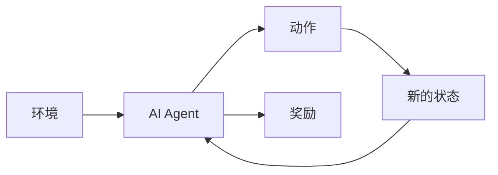
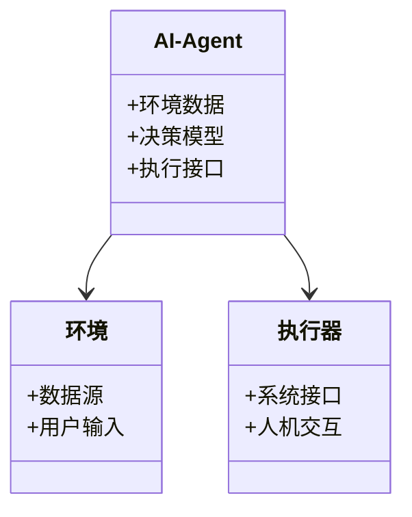
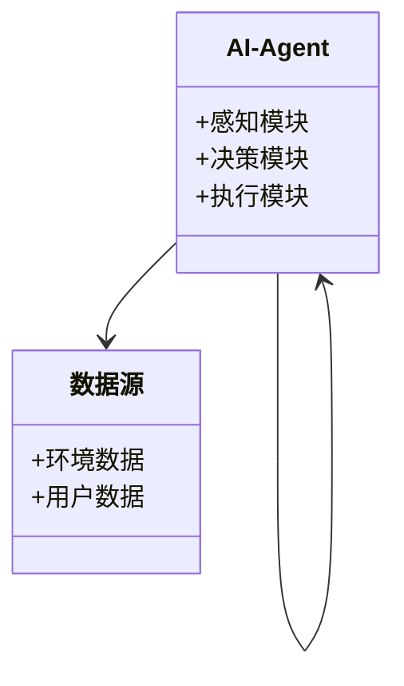

                 


# AI Agents在公司数字化转型效果评估中的应用

> 关键词：数字化转型, AI Agent, 效果评估, 机器学习, 数据驱动

> 摘要：本文深入探讨了AI Agent在公司数字化转型效果评估中的应用。通过分析AI Agent的核心原理、技术特点以及在效果评估中的具体应用场景，结合实际案例，展示了如何利用AI Agent提升数字化转型的效率和精准度。文章内容涵盖背景介绍、核心概念、算法原理、系统架构、项目实战等多个方面，为读者提供了全面而深入的技术解析。

---

# 第一部分: AI Agent与数字化转型效果评估基础

## 第1章: AI Agent与数字化转型概述

### 1.1 数字化转型的背景与挑战

#### 1.1.1 数字化转型的定义与目标
数字化转型是指通过信息技术的广泛应用，将企业的业务流程、文化、运营模式等进行全面数字化改造，以提升企业的竞争力和适应性。其核心目标包括提高效率、优化成本、增强客户体验、创新业务模式等。

#### 1.1.2 数字化转型的核心要素
- **技术驱动**：依赖云计算、大数据、人工智能等技术。
- **数据驱动**：以数据为基础，驱动决策和优化。
- **业务创新**：通过技术应用实现业务模式的创新。
- **组织变革**：数字化转型不仅涉及技术，还涉及组织结构和文化的调整。

#### 1.1.3 数字化转型的常见挑战
- **技术复杂性**：技术选型和集成难度大。
- **数据孤岛**：不同系统间数据难以整合。
- **组织阻力**：员工对新技术的接受度低。
- **效果评估**：如何量化数字化转型的效果是关键问题。

---

### 1.2 AI Agent的定义与特点

#### 1.2.1 AI Agent的基本概念
AI Agent（智能代理）是一种能够感知环境、自主决策并采取行动的智能系统。它可以基于数据和上下文进行推理，提供个性化的解决方案。

#### 1.2.2 AI Agent的核心能力
- **感知能力**：通过传感器、API等方式获取环境数据。
- **决策能力**：基于数据和模型进行推理，做出最优决策。
- **执行能力**：通过API或人机交互等方式执行决策。

#### 1.2.3 AI Agent与传统IT系统的区别
| 特性             | AI Agent                          | 传统IT系统                    |
|------------------|-----------------------------------|------------------------------|
| 智能性           | 高                                | 低                            |
| 自主性           | 高                                | 低                            |
| 适应性           | 高                                | 低                            |
| 数据依赖性       | 高                                | 低                            |

---

### 1.3 AI Agent在数字化转型中的作用

#### 1.3.1 AI Agent在企业决策中的价值
AI Agent可以通过实时数据分析，为企业提供基于数据的决策支持，显著提升决策的科学性和时效性。

#### 1.3.2 AI Agent在效率提升中的应用
AI Agent可以自动化处理重复性任务，优化资源配置，提升企业整体运营效率。

#### 1.3.3 AI Agent在数据驱动决策中的优势
AI Agent能够从海量数据中提取有价值的信息，帮助企业在复杂环境中做出最优决策。

---

## 第2章: 数字化转型效果评估的核心概念

### 2.1 数字化转型效果评估的背景

#### 2.1.1 为什么需要评估数字化转型效果
数字化转型是一个长期且复杂的过程，需要通过评估来验证目标的实现情况，并根据结果进行调整和优化。

#### 2.1.2 评估数字化转型效果的意义
- **验证目标实现**：确保数字化转型达到预期效果。
- **优化转型路径**：通过评估发现问题并调整策略。
- **提升投资回报**：量化数字化转型带来的经济效益。

---

### 2.2 评估指标与方法

#### 2.2.1 常见的数字化转型评估指标
- **效率指标**：如流程处理时间、资源利用率。
- **效果指标**：如业务增长、客户满意度。
- **成本指标**：如投资回报率、成本节约率。

#### 2.2.2 评估方法的选择与应用
- **定量评估**：基于数据的量化分析。
- **定性评估**：通过问卷、访谈等方式获取主观反馈。
- **混合评估**：结合定量和定性方法。

---

### 2.3 AI Agent在效果评估中的定位

#### 2.3.1 AI Agent如何辅助效果评估
AI Agent可以通过实时数据分析和预测，提供动态的评估结果，帮助企业在转型过程中及时调整策略。

#### 2.3.2 AI Agent在评估中的独特优势
- **实时性**：能够实时监控转型过程中的关键指标。
- **智能化**：通过机器学习模型，自动发现潜在问题并提出优化建议。

---

## 第3章: AI Agent的核心原理与技术

### 3.1 AI Agent的基本原理

#### 3.1.1 AI Agent的工作流程
1. **感知环境**：通过传感器或API获取环境数据。
2. **分析数据**：利用机器学习模型进行数据分析和推理。
3. **制定决策**：基于分析结果，生成最优决策。
4. **执行行动**：通过API或人机交互等方式执行决策。

#### 3.1.2 AI Agent的感知与决策机制
- **感知机制**：通过数据采集、API调用等方式获取环境信息。
- **决策机制**：基于机器学习模型进行推理和决策。

---

### 3.2 AI Agent的关键技术

#### 3.2.1 机器学习算法在AI Agent中的应用
- **监督学习**：用于分类、回归等任务。
- **无监督学习**：用于聚类、异常检测等任务。
- **强化学习**：用于序列决策和策略优化。

#### 3.2.2 自然语言处理在AI Agent中的应用
- **文本理解**：通过NLP技术理解用户意图。
- **对话生成**：生成自然语言的对话响应。

#### 3.2.3 知识图谱在AI Agent中的应用
- **知识表示**：将企业知识以图谱形式表示。
- **推理与问答**：基于知识图谱进行推理和问答。

---

### 3.3 AI Agent的算法原理

#### 3.3.1 强化学习算法



强化学习算法的核心是通过试错的方式，不断优化决策策略以获得最大化的累计奖励。其数学模型如下：

$$ R = \sum_{t=1}^{T} r_t $$

其中，\( R \) 是累计奖励，\( r_t \) 是第 \( t \) 步的奖励。

---

## 第4章: AI Agent在效果评估中的应用架构

### 4.1 系统整体架构



---

### 4.2 系统功能设计

#### 4.2.1 领域模型设计



---

## 第5章: 项目实战与案例分析

### 5.1 项目背景与目标

#### 5.1.1 项目背景
某公司希望通过数字化转型提升业务效率和客户满意度，计划引入AI Agent技术辅助效果评估。

#### 5.1.2 项目目标
- 实现AI Agent对数字化转型过程的实时监控和评估。
- 提供基于AI的优化建议，提升转型效果。

---

### 5.2 系统实现

#### 5.2.1 环境安装与配置
```bash
pip install numpy pandas scikit-learn transformers
```

#### 5.2.2 核心功能实现

```python
class AIAgent:
    def __init__(self, model):
        self.model = model

    def perceive(self, data):
        # 数据处理逻辑
        return processed_data

    def decide(self, data):
        # 模型推理
        prediction = self.model.predict(data)
        return prediction

    def act(self, action):
        # 执行动作
        return result
```

---

### 5.3 案例分析与结果解读

#### 5.3.1 实际案例
某电商公司引入AI Agent技术，通过实时监控销售数据和客户反馈，优化库存管理和客户服务流程，最终实现了销售额增长20%。

#### 5.3.2 结果解读
AI Agent通过实时数据分析和预测，帮助公司快速发现潜在问题并提出优化建议，显著提升了数字化转型的效果。

---

## 第6章: 总结与展望

### 6.1 总结

AI Agent在数字化转型效果评估中的应用具有重要意义。通过实时数据分析和智能决策，AI Agent能够显著提升评估的效率和精准度，为企业数字化转型提供强有力的支持。

---

### 6.2 最佳实践Tips

- **数据质量**：确保数据的完整性和准确性。
- **模型优化**：定期更新和优化机器学习模型。
- **人机协作**：AI Agent应与人类专家协同工作，而非完全替代人类。

---

### 6.3 展望

随着AI技术的不断进步，AI Agent在数字化转型效果评估中的应用将更加广泛和深入。未来，AI Agent将与区块链、物联网等技术结合，为企业提供更加智能化和个性化的评估解决方案。

---

作者：AI天才研究院/AI Genius Institute & 禅与计算机程序设计艺术 /Zen And The Art of Computer Programming

