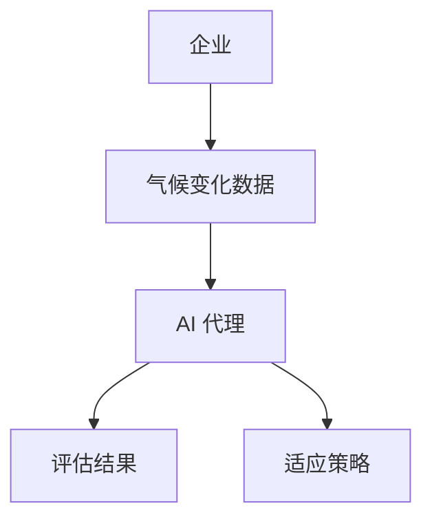
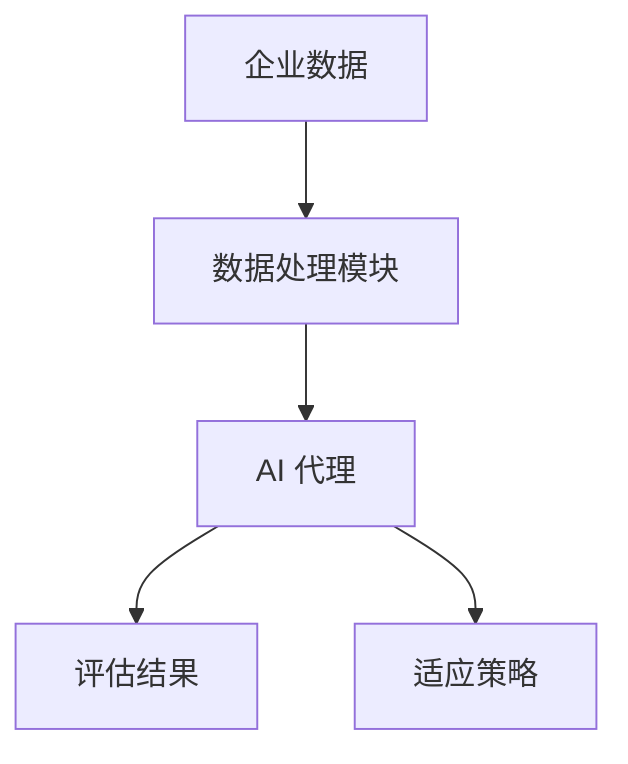
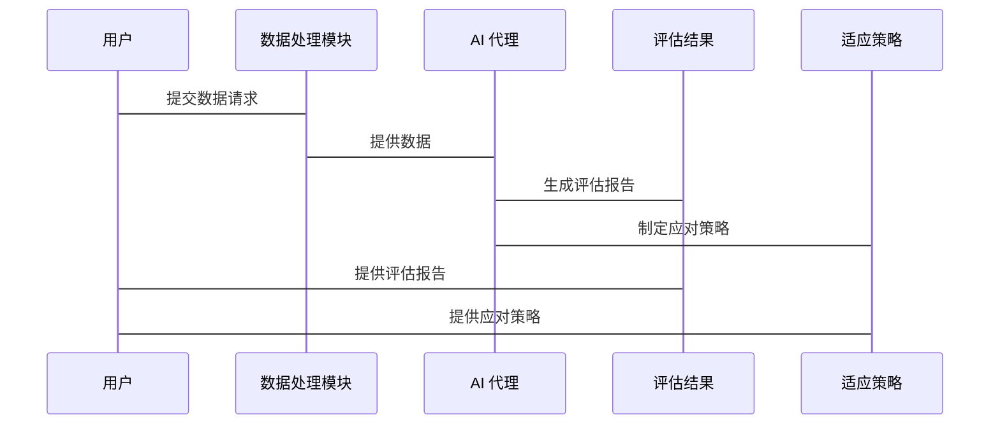

                 


# AI 代理在公司气候变化适应能力评估中的应用

## 关键词：AI 代理，气候变化，适应能力评估，强化学习，多智能体协作

## 摘要：  
随着气候变化的加剧，企业需要具备更强的适应能力以应对环境变化带来的风险。AI 代理（AI Agents）作为一种智能化工具，能够通过实时数据采集、分析和决策，帮助企业在气候变化适应能力评估中实现高效、精准的管理。本文将从AI 代理的基本概念、算法原理、系统架构到实际应用案例，全面探讨AI 代理在气候变化适应能力评估中的应用价值和实现路径。通过本文的分析，读者可以深入了解如何利用AI 代理技术提升企业的气候变化适应能力，从而在激烈的商业竞争中占据优势。

---

## 第一部分：AI 代理与气候变化适应能力评估的背景

### 第1章：气候变化对企业的影响

#### 1.1 气候变化对企业运营的影响
- **气候变化对企业供应链的影响**  
  气候变化可能导致极端天气事件（如洪水、干旱、飓风等），影响企业的供应链稳定性。例如，原材料供应中断或物流延迟可能造成生产停滞，进而影响企业的收入和声誉。
  
- **气候变化对企业财务风险的影响**  
  气候变化可能导致企业面临更高的运营成本（如灾害修复费用）、资产减值风险以及保险费用增加。这些都会对企业财务状况造成负面影响。
  
- **气候变化对企业声誉的影响**  
  如果企业未能有效应对气候变化带来的挑战，可能会面临公众舆论的压力，影响企业的品牌形象和客户忠诚度。

#### 1.2 企业气候变化适应能力评估的重要性
- **适应能力评估的定义**  
  气候变化适应能力评估是指通过分析企业应对气候变化影响的能力，识别潜在风险，并制定相应的应对策略。
  
- **适应能力评估的必要性**  
  企业需要通过适应能力评估，明确自身的脆弱性，制定有效的风险管理策略，从而在气候变化的挑战中保持竞争优势。
  
- **适应能力评估的边界与外延**  
  适应能力评估不仅包括对当前气候变化的影响分析，还应考虑未来气候变化的潜在风险，并结合企业的实际情况制定长期适应计划。

---

### 第2章：AI 代理在企业中的应用

#### 2.1 AI 代理的定义与特点
- **AI 代理的定义**  
  AI 代理是一种能够感知环境、自主决策并执行任务的智能实体。它能够通过与环境和其他代理的交互，动态调整自身的行为以实现目标。
  
- **AI 代理的核心特点**  
  - **自主性**：AI 代理能够自主决策，无需人工干预。  
  - **反应性**：AI 代理能够实时感知环境变化并做出反应。  
  - **协作性**：AI 代理能够与其他代理或系统协同工作，共同完成复杂任务。  

- **AI 代理与传统自动化工具的区别**  
  AI 代理不仅仅是一个执行任务的工具，它具备学习和适应能力，能够根据环境变化优化自身的行为。

#### 2.2 AI 代理在企业中的应用场景
- **智能客服**  
  AI 代理可以用于企业客服系统，通过自然语言处理技术为客户提供智能咨询服务，提高客户满意度。
  
- **智能推荐系统**  
  AI 代理可以根据客户的偏好和行为数据，推荐个性化的产品或服务，提升销售效率。
  
- **智能监控与预警**  
  AI 代理可以实时监控企业的运营数据，识别潜在风险并发出预警，帮助企业及时采取应对措施。

---

### 第3章：AI 代理在气候变化适应能力评估中的应用

#### 3.1 气候变化适应能力评估的核心概念
- **适应能力评估的指标体系**  
  适应能力评估需要考虑企业的资源、能力和策略三个维度。资源包括财务资源、人力资源等；能力包括应对能力、恢复能力等；策略包括风险管理策略、应急预案等。
  
- **适应能力评估的流程**  
  适应能力评估通常包括数据收集、风险识别、风险分析、应对策略制定和实施监控五个阶段。
  
- **适应能力评估的工具与方法**  
  适应能力评估可以采用定性和定量相结合的方法。定性方法包括问卷调查、访谈等；定量方法包括数据分析、模型模拟等。

#### 3.2 AI 代理在适应能力评估中的优势
- **提高评估效率**  
  AI 代理可以通过自动化数据采集和分析，快速完成适应能力评估的初步工作，大大缩短评估周期。
  
- **提高评估准确性**  
  AI 代理能够处理大量复杂的数据，通过机器学习算法识别潜在风险，评估结果更加准确。
  
- **实现实时监控与反馈**  
  AI 代理可以实时监控企业的运营数据，动态调整评估策略，帮助企业及时应对气候变化带来的挑战。

---

## 第二部分：AI 代理在气候变化适应能力评估中的核心概念与联系

### 第4章：AI 代理的核心原理

#### 4.1 AI 代理的基本原理
- **代理的定义与分类**  
  AI 代理可以根据智能水平分为简单代理和复杂代理。简单代理只能执行预设的任务，而复杂代理具备学习和适应能力，能够动态调整自身行为。
  
- **代理的感知与决策机制**  
  AI 代理通过传感器或数据接口感知环境信息，利用机器学习算法进行分析和决策，制定下一步行动方案。
  
- **代理的执行与反馈机制**  
  AI 代理根据决策结果执行具体操作，并通过反馈机制不断优化自身的行为，提高任务完成效率。

#### 4.2 AI 代理的算法原理
- **强化学习算法**  
  强化学习是一种通过试错机制优化代理行为的算法。代理通过与环境交互，不断探索和学习，最终找到最优策略。
  
- **多智能体协作算法**  
  多智能体协作算法用于管理多个AI 代理的协作行为，确保它们能够协同工作，共同完成复杂任务。
  
- **分布式决策算法**  
  分布式决策算法用于管理多个代理在不同节点上的决策过程，确保系统整体的协调性和一致性。

---

### 第5章：AI 代理的核心概念与联系

#### 5.1 核心概念原理
- **代理的感知与决策模型**  
  AI 代理通过感知环境信息，利用决策模型制定行动方案。感知模块负责数据采集，决策模块负责策略生成。
  
- **代理的协作机制**  
  多个AI 代理之间需要通过协作机制实现信息共享和任务分配，确保系统整体的高效运作。
  
- **代理的自适应能力**  
  AI 代理具备自适应能力，能够根据环境变化动态调整自身行为，提高系统的灵活性和适应性。

#### 5.2 核心概念属性特征对比表
| 特征       | 传统自动化工具 | AI 代理         |
|------------|----------------|-----------------|
| 智能性     | 低             | 高               |
| 学习能力   | 无             | 有               |
| 自适应能力 | 无             | 有               |

#### 5.3 ER 实体关系图


---

## 第三部分：AI 代理在气候变化适应能力评估中的算法原理

### 第6章：强化学习算法在 AI 代理中的应用

#### 6.1 强化学习算法概述
- **强化学习的基本概念**  
  强化学习是一种通过试错机制优化代理行为的算法。代理通过与环境交互，不断探索和学习，最终找到最优策略。
  
- **强化学习的核心要素**  
  - **状态空间**：代理所处的环境状态。  
  - **动作空间**：代理可以执行的动作。  
  - **奖励函数**：代理执行动作后获得的奖励或惩罚。  

- **强化学习的应用场景**  
  强化学习广泛应用于游戏AI、机器人控制等领域，其核心优势在于能够在复杂环境中找到最优解决方案。

#### 6.2 基于强化学习的 AI 代理算法
- **状态空间定义**  
  状态空间是指代理所处的所有可能状态。例如，在气候变化适应能力评估中，状态可能包括企业的财务状况、供应链状态等。
  
- **动作空间定义**  
  动作空间是指代理可以执行的所有可能动作。例如，代理可以采取的应对策略包括增加库存、调整生产计划等。
  
- **奖励函数设计**  
  奖励函数用于衡量代理行为的好坏。例如，当代理采取的策略有效降低了气候变化带来的风险时，代理会获得正奖励；反之则获得负奖励。
  
- **策略优化算法**  
  策略优化算法用于不断优化代理的决策策略，使其在长期运行中获得最大累计奖励。

---

### 第7章：多智能体协作算法在 AI 代理中的应用

#### 7.1 多智能体协作算法概述
- **多智能体协作的核心概念**  
  多智能体协作是指多个AI 代理通过协作完成复杂任务的过程。协作过程中，代理需要共享信息、分配任务并协调行动。

- **多智能体协作的优势**  
  多智能体协作能够提高系统的整体效率和灵活性，适用于复杂环境下的任务处理。

#### 7.2 多智能体协作算法的实现
- **任务分配与协调**  
  多智能体协作算法需要解决任务分配和协调问题。例如，代理可以根据自身的资源和能力，自主选择任务并与其他代理协作完成。

- **信息共享与同步**  
  多智能体协作需要实现信息共享和同步，确保所有代理对环境状态和任务进展有共同的理解。

- **冲突解决与协调机制**  
  在多智能体协作中，可能会出现任务冲突或资源竞争。代理需要通过冲突解决机制，确保系统的整体协调性和一致性。

---

## 第四部分：系统架构与项目实战

### 第8章：系统架构设计

#### 8.1 问题场景介绍
- 气候变化适应能力评估需要一个高效、智能的系统来实时监控企业的运营数据，识别潜在风险，并制定应对策略。

#### 8.2 系统功能设计
- **领域模型**  
  领域模型用于描述系统的功能和数据流。例如，系统需要采集企业的财务数据、供应链数据等，进行综合分析，生成适应能力评估报告。

#### 8.3 系统架构设计


#### 8.4 系统接口设计
- **数据接口**  
  系统需要与企业的数据库、第三方数据源等进行数据交互。
  
- **用户接口**  
  系统需要提供友好的用户界面，供企业用户查看评估结果和适应策略。

#### 8.5 系统交互设计


---

### 第9章：项目实战

#### 9.1 环境安装
- **安装Python**  
  需要安装Python 3.8及以上版本。
  
- **安装相关库**  
  需要安装numpy、pandas、scikit-learn等机器学习库。

#### 9.2 系统核心实现源代码
```python
import numpy as np
import pandas as pd
from sklearn import tree

# 数据处理模块
def preprocess_data(data):
    # 数据清洗和预处理
    data = data.dropna()
    data = pd.get_dummies(data)
    return data

# AI 代理算法实现
class AI-Agent:
    def __init__(self):
        self.model = tree.DecisionTreeClassifier()
    
    def train(self, data, target):
        self.model.fit(data, target)
    
    def predict(self, data):
        return self.model.predict(data)

# 评估结果生成
def generate_report(eval_results):
    # 生成适应能力评估报告
    report = {}
    report['status'] = 'high' if eval_results['risk'] > 0.7 else 'low'
    report['recommendations'] = eval_results['recommendations']
    return report
```

---

### 第10章：案例分析与实际应用

#### 10.1 案例分析
- **案例背景**  
  某制造企业面临气候变化带来的供应链中断风险。为了评估自身的适应能力，企业引入AI 代理技术，实时监控供应链数据，识别潜在风险，并制定应对策略。

#### 10.2 详细讲解剖析
- **数据采集与处理**  
  系统需要采集企业的供应链数据，包括供应商的地理位置、库存水平、运输路线等。
  
- **AI 代理算法实现**  
  AI 代理通过强化学习算法，优化企业的供应链管理策略，降低气候变化带来的风险。

#### 10.3 项目小结
- **项目成果**  
  通过AI 代理技术，企业能够实时监控供应链数据，识别潜在风险，并制定有效的应对策略，显著提升了自身的气候变化适应能力。

---

## 第五部分：总结与展望

### 第11章：总结与最佳实践

#### 11.1 最佳实践 tips
- **数据质量管理**  
  数据质量是AI 代理发挥效

