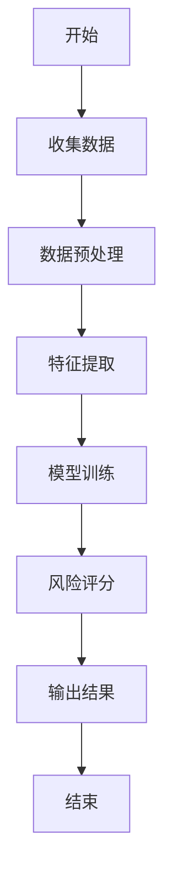
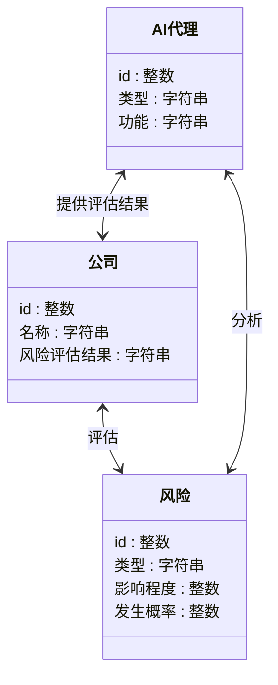
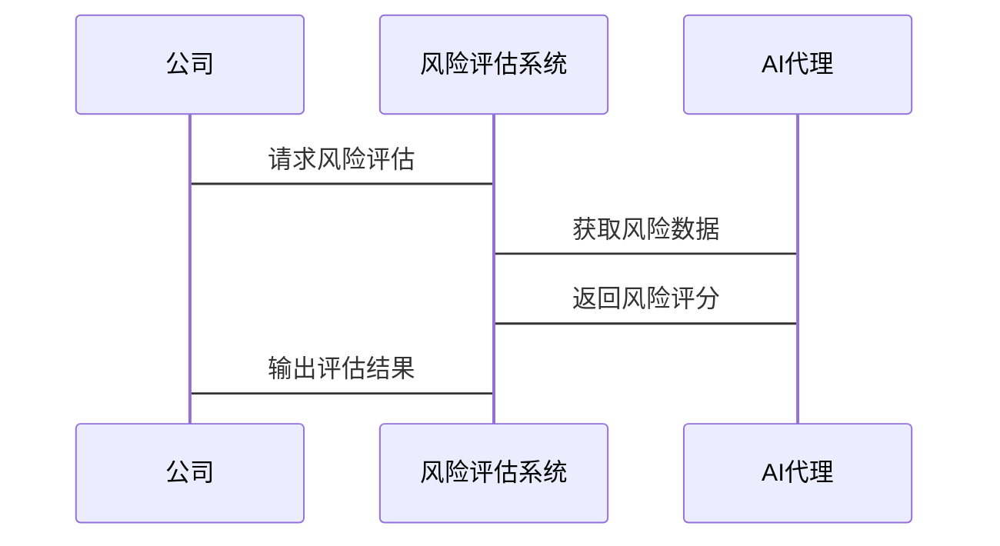

                 


# AI agents在公司环境风险暴露评估中的应用

> 关键词：AI代理, 环境风险评估, 企业风险管理, 人工智能技术, 系统安全

> 摘要：本文探讨了AI代理在公司环境风险暴露评估中的应用，详细分析了AI代理的核心概念、算法原理、系统架构设计及实际项目案例。文章首先介绍了AI代理的基本概念和环境风险评估的重要性，然后从技术角度详细阐述了AI代理如何帮助公司识别、评估和管理环境风险。通过实际项目案例和最佳实践，本文展示了AI代理在环境风险评估中的实际应用价值和优势。

---

## 第一部分: AI代理与公司环境风险暴露评估概述

### 第1章: AI代理与环境风险评估的基本概念

#### 1.1 AI代理的定义与特点
AI代理是人工智能技术的一种实现形式，能够根据环境信息自主决策并执行任务。其特点包括智能性、自主性、反应性和社会性。AI代理可以分为基于规则的代理、基于模型的代理和基于强化学习的代理，每种类型在环境风险评估中的应用各有侧重。

#### 1.2 环境风险暴露评估的定义与范围
环境风险暴露评估是指通过分析公司内外部环境因素，识别潜在风险并评估其对公司的影响程度。环境风险包括操作风险、合规风险、网络风险等，评估范围涵盖公司内部系统、供应链、合作伙伴等多个方面。

#### 1.3 AI代理在环境风险评估中的应用价值
AI代理能够显著提高环境风险评估的效率和准确性。通过实时数据分析和预测模型，AI代理可以帮助公司快速识别潜在风险，优化风险评估模型，并降低人为错误的影响。

### 第2章: AI代理与环境风险评估的核心概念

#### 2.1 环境风险评估的核心概念
环境风险评估的核心在于识别风险源、分析风险影响和制定应对策略。AI代理通过收集和分析大量数据，能够帮助公司更全面地识别潜在风险，并提供数据支持的决策依据。

#### 2.2 AI代理在环境风险评估中的角色
AI代理在环境风险评估中扮演着数据收集、风险识别、预测分析和决策支持的角色。通过机器学习算法，AI代理能够从海量数据中提取有价值的信息，帮助公司制定有效的风险管理策略。

#### 2.3 实体关系图（ER图）展示
以下是AI代理与环境风险评估相关实体的关系图：

```mermaid
erDiagram
    class 公司 {
        id : 整数
        名称 : 字符串
        风险评估结果 : 字符串
    }
    class 风险 {
        id : 整数
        类型 : 字符串
        影响程度 : 整数
        发生概率 : 整数
    }
    class AI代理 {
        id : 整数
        类型 : 字符串
        功能 : 字符串
    }
    公司 --> 风险 : 评估
    AI代理 --> 风险 : 分析
    AI代理 --> 公司 : 提供评估结果
```

---

## 第二部分: AI代理在环境风险评估中的算法原理

### 第3章: 风险评估模型的构建

#### 3.1 风险评估模型的数学公式
风险评分模型是环境风险评估的核心工具之一。以下是风险评分模型的数学公式：

$$
风险评分 = \beta_0 + \beta_1x_1 + \beta_2x_2 + ... + \beta_nx_n
$$

其中，$\beta_0$是模型的截距，$\beta_1, \beta_2, ..., \beta_n$是各风险因子的回归系数，$x_1, x_2, ..., x_n$是风险因子的具体数值。

#### 3.2 风险评估流程
以下是风险评估的流程图：



#### 3.3 算法实现
以下是风险评估模型的Python实现代码：

```python
import pandas as pd
from sklearn.linear_model import LinearRegression

# 数据预处理
data = pd.read_csv('风险数据.csv')
X = data.drop('风险评分', axis=1)
y = data['风险评分']

# 模型训练
model = LinearRegression()
model.fit(X, y)

# 风险评分预测
def 风险评分预测(X_new):
    return model.predict(X_new)
```

---

## 第三部分: 系统架构与设计

### 第4章: 系统架构设计

#### 4.1 领域模型设计
以下是领域模型的类图：



#### 4.2 系统交互设计
以下是系统交互的序列图：



---

## 第四部分: 项目实战与分析

### 第5章: 项目实战

#### 5.1 环境安装
安装必要的Python库：

```bash
pip install numpy pandas scikit-learn
```

#### 5.2 核心代码实现
以下是风险评估模型的实现代码：

```python
import numpy as np
import pandas as pd
from sklearn.model_selection import train_test_split
from sklearn.metrics import mean_squared_error

# 数据加载
data = pd.read_csv('风险数据.csv')

# 数据分割
X = data.drop('风险评分', axis=1)
y = data['风险评分']
X_train, X_test, y_train, y_test = train_test_split(X, y, test_size=0.2, random_state=42)

# 模型训练
model = LinearRegression()
model.fit(X_train, y_train)

# 模型预测
y_pred = model.predict(X_test)
mse = mean_squared_error(y_test, y_pred)
print(f'均方误差: {mse}')
print(f'决定系数: {model.score(X_test, y_test)}')
```

#### 5.3 代码解读与分析
上述代码实现了风险评估模型的训练和预测。均方误差（MSE）和决定系数（R²）用于评估模型的性能。通过调整模型参数和优化数据预处理步骤，可以进一步提高模型的准确性。

---

## 第五部分: 最佳实践与总结

### 第6章: 最佳实践

#### 6.1 数据质量管理
确保数据的完整性和准确性是提高风险评估模型性能的关键。建议定期清洗数据并更新模型。

#### 6.2 模型可解释性
选择可解释性较强的模型有助于更好地理解风险来源和影响因素。

#### 6.3 模型更新与维护
定期更新模型参数和数据，以应对环境风险的变化。

---

## 总结

本文详细探讨了AI代理在公司环境风险暴露评估中的应用，从核心概念到算法实现，再到系统架构设计和项目实战，全面分析了AI代理在环境风险评估中的价值和优势。通过实际案例和最佳实践，本文为读者提供了宝贵的经验和参考。

作者：AI天才研究院 & 禅与计算机程序设计艺术

