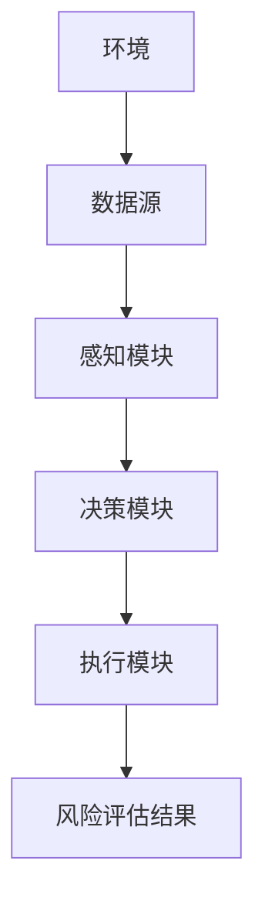

                 

# AI agents在公司环境风险评估中的应用

## 关键词：
AI代理，环境风险评估，风险管理，人工智能，公司环境

## 摘要：
随着全球化和信息化的深入发展，现代公司面临的环境风险日益复杂和多样化。传统的环境风险评估方法逐渐显现出效率低下、覆盖范围有限和实时性不足等局限性。为了应对这些挑战，人工智能（AI）代理技术逐渐被引入到公司环境风险评估中。AI代理凭借其强大的数据处理能力、自主决策能力和实时响应能力，正在成为环境风险评估领域的重要工具。本文将从AI代理的基本原理、算法实现、系统架构、项目实战等方面，深入探讨AI代理在公司环境风险评估中的应用，为相关领域的企业和研究者提供参考和借鉴。

---

# 第一部分: AI代理在公司环境风险评估中的背景介绍

## 第1章: 问题背景与描述

### 1.1 问题背景
#### 1.1.1 公司环境风险的传统评估方法
公司环境风险评估的传统方法主要包括基于经验的评估、基于指标的评估和基于模型的评估。这些方法通常依赖于人工数据收集和分析，效率较低，且难以覆盖所有潜在风险因素。

#### 1.1.2 传统方法的局限性
- 数据量大、维度高：传统方法难以处理海量数据，尤其是在实时性要求较高的场景下。
- 评估周期长：传统方法通常需要人工干预，导致评估周期较长。
- 灵活性不足：传统方法难以快速适应环境变化，尤其是突发事件的应对能力较弱。

#### 1.1.3 AI代理技术的引入
AI代理（Artificial Intelligence Agents）作为一种智能化的计算实体，能够通过感知环境、自主决策和执行操作来实现特定目标。将其引入环境风险评估领域，可以显著提升评估的效率和准确性。

### 1.2 问题描述
#### 1.2.1 环境风险评估的核心目标
环境风险评估的核心目标是识别、量化和应对公司运营中可能面临的环境风险，包括合规性风险、安全风险和财务风险等。

#### 1.2.2 当前环境风险评估的主要挑战
- 数据来源分散：环境风险涉及的因素众多，数据来源分散且格式不统一。
- 数据实时性要求高：环境风险评估需要实时跟踪和分析动态数据。
- 风险关联性复杂：不同风险因素之间可能存在复杂的关联性，难以通过传统方法进行建模。

#### 1.2.3 AI代理在环境风险评估中的定位
AI代理在环境风险评估中主要承担数据采集、风险识别、风险量化和风险应对的角色。它能够通过自动化的方式实时感知环境变化，快速识别潜在风险，并提供智能化的应对策略。

### 1.3 问题解决
#### 1.3.1 AI代理在环境风险评估中的优势
- 高效性：AI代理能够快速处理海量数据，显著提升评估效率。
- 实时性：AI代理可以实时感知环境变化，实现动态评估。
- 智能性：AI代理能够通过学习和推理，发现潜在风险并提出应对策略。

#### 1.3.2 AI代理技术的核心价值
- 提高风险评估的准确性：通过机器学习和数据分析，AI代理能够识别传统方法难以察觉的潜在风险。
- 降低运营成本：AI代理的自动化能力可以减少人工干预，降低运营成本。
- 提升决策效率：AI代理能够快速提供风险评估结果，为管理层决策提供支持。

#### 1.3.3 AI代理在环境风险评估中的应用场景
- **合规性风险评估**：通过分析公司运营是否符合相关法律法规和行业标准。
- **安全风险评估**：识别公司运营中的安全隐患，如网络安全、物理安全等。
- **财务风险评估**：分析公司财务数据，识别潜在的财务风险，如流动性风险、信用风险等。

### 1.4 边界与外延
#### 1.4.1 AI代理在环境风险评估中的适用范围
AI代理适用于需要实时数据处理和动态风险评估的场景，如金融行业、能源行业和制造业等。

#### 1.4.2 环境风险评估的边界条件
- 数据来源的可靠性：AI代理依赖于高质量的数据输入。
- 模型的准确性：AI代理的决策依赖于模型的训练和优化。
- 系统的可解释性：AI代理的决策过程需要能够被人类理解和验证。

#### 1.4.3 AI代理技术的可扩展性
AI代理可以通过模块化设计，快速扩展到新的应用场景。例如，从单一行业的风险评估扩展到跨行业的综合风险评估。

### 1.5 概念结构与核心要素
#### 1.5.1 环境风险评估的基本框架
环境风险评估的基本框架包括数据采集、风险识别、风险量化和风险应对四个阶段。

#### 1.5.2 AI代理技术的核心要素
- **感知机制**：通过传感器、API或其他数据源获取环境信息。
- **决策机制**：基于感知到的信息，利用机器学习算法进行风险评估和决策。
- **执行机制**：根据决策结果，执行相应的操作，如触发报警、调整策略等。

#### 1.5.3 环境风险评估与AI代理的结合模型
结合模型将环境风险评估的需求与AI代理的能力进行深度融合，形成一个高效的智能化评估系统。

---

## 第2章: 核心概念与联系

### 2.1 AI代理的基本原理
#### 2.1.1 AI代理的定义与分类
- **定义**：AI代理是一种能够感知环境、自主决策并执行操作的智能实体。
- **分类**：根据智能水平，AI代理可以分为反应式代理和认知式代理。

#### 2.1.2 AI代理的核心特征
| 特性 | 描述 |
|------|------|
| 智能性 | 能够通过学习和推理完成复杂任务 |
| 自主性 | 可以自主决策并执行操作 |
| 适应性 | 能够根据环境变化调整行为 |

#### 2.1.3 AI代理与环境风险评估的联系
- AI代理能够实时感知环境变化，快速识别潜在风险。
- AI代理可以通过机器学习算法，提高风险评估的准确性。

#### 2.1.4 AI代理的核心技术
- **感知技术**：包括数据采集、特征提取和数据预处理。
- **决策技术**：包括机器学习、深度学习和强化学习。
- **执行技术**：包括策略执行、结果反馈和系统优化。

### 2.2 AI代理的核心概念
#### 2.2.1 AI代理的核心概念
- **感知**：AI代理通过传感器或API获取环境数据。
- **决策**：基于感知数据，利用算法进行风险评估和决策。
- **执行**：根据决策结果，执行相应的操作。

#### 2.2.2 概念属性特征对比
| 概念 | 属性 | 特征 |
|------|------|------|
| 感知 | 数据来源 | 多样化 |
| 决策 | 算法类型 | 多样化 |
| 执行 | 操作类型 | 多样化 |

#### 2.2.3 实体关系图

---

### 下一章预告：算法原理讲解

下一章将详细讲解AI代理在环境风险评估中的算法原理，包括感知模型、决策模型和执行模型的实现细节，并通过Python代码和数学公式进行深入分析。

---

## 作者信息

作者：AI天才研究院/AI Genius Institute & 禅与计算机程序设计艺术 /Zen And The Art of Computer Programming

