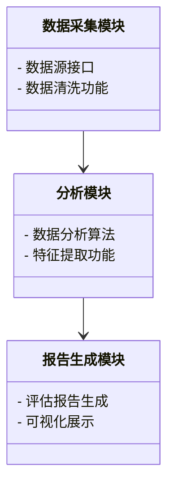
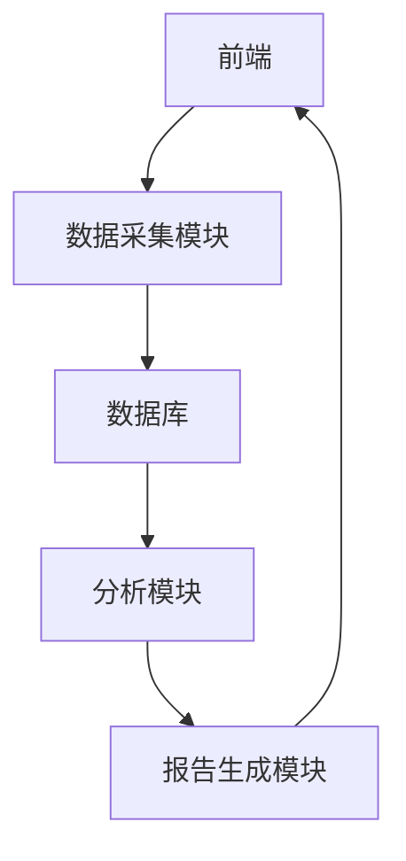
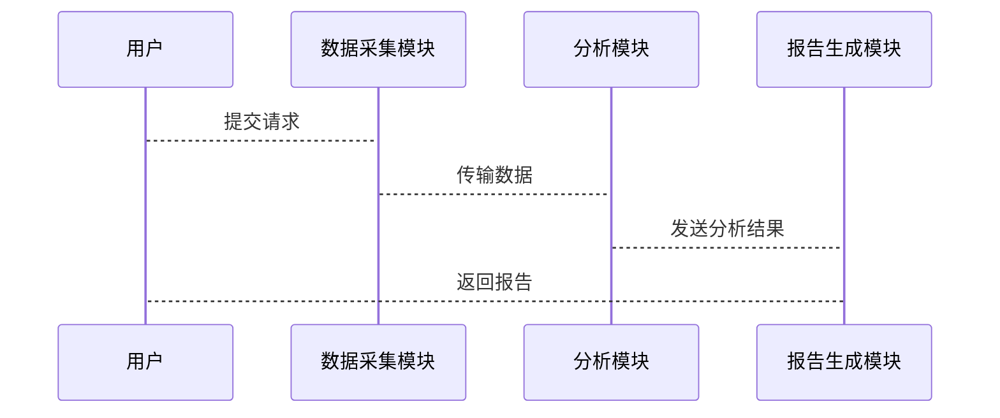

                 

<think>
好的，我将按照您的要求来撰写这篇文章。首先，我会整理出文章的结构和内容框架，确保符合逻辑和深度要求。

文章标题：AI agents在公司社会责任评估中的应用

关键词：AI agents, 公司社会责任, 企业评估, 人工智能, 可持续发展

摘要：本文探讨了AI agents在公司社会责任评估中的应用，详细分析了AI agents的技术原理及其在社会责任评估中的优势，包括数据采集、分析和报告生成等环节。通过具体案例和系统架构设计，展示了AI技术如何赋能企业社会责任管理，帮助企业实现高效、精准的评估与改进。

接下来，我将按照您提供的目录大纲逐步展开每个部分的内容。

---

# AI agents在公司社会责任评估中的应用

## 关键词：AI agents, 公司社会责任, 企业评估, 人工智能, 可持续发展

## 摘要：本文探讨了AI agents在公司社会责任评估中的应用，详细分析了AI agents的技术原理及其在社会责任评估中的优势，包括数据采集、分析和报告生成等环节。通过具体案例和系统架构设计，展示了AI技术如何赋能企业社会责任管理，帮助企业实现高效、精准的评估与改进。

---

## 第1章: AI Agent的基本概念与技术原理

### 1.1 AI Agent的定义与特点

#### 1.1.1 AI Agent的基本定义
AI Agent（人工智能代理）是一种能够感知环境、自主决策并执行任务的智能体。它通过传感器获取信息，利用算法进行分析，并通过执行器完成目标。AI Agent的核心在于其自主性和智能性，能够在复杂环境中适应和优化行为。

#### 1.1.2 AI Agent的核心特点
- **自主性**：AI Agent能够在没有外部干预的情况下自主运行。
- **反应性**：能够实时感知环境变化并做出响应。
- **目标导向**：基于预设目标或学习目标进行决策。
- **学习能力**：通过机器学习技术不断优化自身行为。

#### 1.1.3 AI Agent与传统AI的区别
AI Agent不仅仅是算法的实现，而是具备自主决策和执行能力的实体。与传统AI相比，AI Agent更注重实际应用场景中的动态适应性和目标导向性。

---

### 1.2 公司社会责任评估的背景与意义

#### 1.2.1 公司社会责任的定义与范围
公司社会责任（Corporate Social Responsibility，CSR）是指企业在追求经济利益的同时，还需要关注环境保护、员工福利、社会公益等方面的责任。随着全球可持续发展目标的推进，企业社会责任评估已成为衡量企业综合表现的重要指标。

#### 1.2.2 公司社会责任评估的重要性
企业社会责任评估帮助企业识别自身在社会、环境和治理方面的优势与不足，从而优化管理策略，提升品牌形象，增强竞争力。

#### 1.2.3 公司社会责任评估的挑战与机遇
- **挑战**：数据来源复杂、评估标准不统一、动态变化难以捕捉。
- **机遇**：AI技术的引入为社会责任评估提供了高效、精准的解决方案。

---

### 1.3 AI Agent在公司社会责任评估中的作用

#### 1.3.1 AI Agent如何赋能社会责任评估
AI Agent可以通过数据采集、分析和报告生成，帮助企业快速、准确地完成社会责任评估。

#### 1.3.2 AI Agent在社会责任评估中的优势
- **高效性**：自动化数据处理和分析，节省时间和成本。
- **精准性**：基于机器学习算法，提供数据驱动的评估结果。
- **动态适应性**：实时感知环境变化，优化评估策略。

#### 1.3.3 AI Agent在社会责任评估中的应用场景
- **数据采集**：自动收集企业运营中的社会、环境数据。
- **分析与评估**：利用AI算法对数据进行深度分析，生成评估报告。
- **优化建议**：基于评估结果提出改进建议，帮助企业在社会责任方面持续优化。

---

## 第2章: AI Agent的核心概念与技术原理

### 2.1 AI Agent的感知模块

#### 2.1.1 数据采集与处理
AI Agent通过传感器或API接口采集企业运营中的数据，包括员工满意度、环境排放、社会公益支出等。

#### 2.1.2 数据分析与特征提取
利用自然语言处理和数据分析技术，从非结构化数据中提取关键特征，为后续评估提供支持。

---

### 2.2 AI Agent的决策模块

#### 2.2.1 决策算法与模型
基于强化学习或监督学习算法，构建多目标优化模型，平衡经济、社会和环境目标。

#### 2.2.2 多目标优化与权衡
在社会责任评估中，AI Agent需要在多个目标之间进行权衡，例如最大化环境影响的同时，最小化成本。

---

### 2.3 AI Agent的执行模块

#### 2.3.1 行为规划与策略生成
根据评估结果生成优化策略，指导企业在社会责任方面进行改进。

#### 2.3.2 系统反馈与自适应调整
通过实时反馈不断优化AI Agent的行为，提升评估的准确性和效率。

---

## 第3章: AI Agent在公司社会责任评估中的核心算法与模型

### 3.1 基于强化学习的AI Agent算法

#### 3.1.1 强化学习的基本原理
强化学习通过试错机制，学习最优策略。在社会责任评估中，AI Agent可以通过强化学习优化评估模型。

#### 3.1.2 在社会责任评估中的应用
AI Agent通过强化学习算法，动态调整评估指标的权重，提升评估结果的准确性。

---

### 3.2 基于监督学习的AI Agent算法

#### 3.2.1 监督学习的基本原理
监督学习通过标注数据训练模型，预测新数据的类别或值。

#### 3.2.2 在社会责任评估中的应用
利用监督学习算法，对企业的社会责任表现进行分类或预测。

---

## 第4章: 系统分析与架构设计方案

### 4.1 问题场景介绍

#### 4.1.1 企业社会责任评估的复杂性
企业社会责任涉及多个维度，数据来源多样，评估标准复杂。

#### 4.1.2 AI Agent在系统中的角色
AI Agent作为系统的核心模块，负责数据采集、分析和优化建议生成。

---

### 4.2 系统功能设计

#### 4.2.1 领域模型设计
- **领域模型**：展示企业社会责任评估的核心模块和它们之间的关系。
- **类图设计**：展示数据采集模块、分析模块、报告生成模块的交互关系。



---

### 4.3 系统架构设计

#### 4.3.1 系统架构图
展示前端、后端和数据库的交互关系。



---

### 4.4 系统接口设计

#### 4.4.1 API接口设计
- 数据采集接口：用于获取企业社会责任相关数据。
- 分析接口：用于调用机器学习模型进行评估。
- 报告接口：用于生成和下载评估报告。

#### 4.4.2 系统交互流程图
展示用户与系统之间的交互流程。



---

## 第5章: 项目实战

### 5.1 环境安装

#### 5.1.1 安装Python
```
python --version
pip install --upgrade pip
```

#### 5.1.2 安装依赖库
```
pip install numpy pandas scikit-learn matplotlib
```

---

### 5.2 系统核心实现源代码

#### 5.2.1 数据预处理代码
```python
import pandas as pd

# 读取数据
data = pd.read_csv('社会责任数据.csv')

# 数据清洗
data.dropna(inplace=True)
data = data[~data.duplicated()]
```

#### 5.2.2 模型训练代码
```python
from sklearn.model_selection import train_test_split
from sklearn.ensemble import RandomForestClassifier

# 划分训练集和测试集
X = data.drop('评估结果', axis=1)
y = data['评估结果']
X_train, X_test, y_train, y_test = train_test_split(X, y, test_size=0.2)

# 训练随机森林模型
model = RandomForestClassifier()
model.fit(X_train, y_train)
```

#### 5.2.3 报告生成代码
```python
from sklearn.metrics import classification_report

# 生成评估报告
y_pred = model.predict(X_test)
print(classification_report(y_test, y_pred))
```

---

### 5.3 代码解读与分析

#### 5.3.1 数据预处理
通过数据清洗和去重，确保数据质量，为后续分析提供可靠的基础。

#### 5.3.2 模型训练
随机森林算法用于分类任务，帮助识别影响企业社会责任的关键因素。

#### 5.3.3 报告生成
通过分类报告，评估模型的性能，指导企业的优化方向。

---

## 第6章: 最佳实践与总结

### 6.1 小结
AI Agent在公司社会责任评估中的应用，不仅提高了评估的效率和准确性，还为企业提供了数据驱动的优化建议。

### 6.2 注意事项
- 数据质量和完整性直接影响评估结果，需谨慎处理。
- 模型的可解释性是企业决策的关键，需注重模型的透明性。

### 6.3 拓展阅读
- 《AI在企业治理中的应用》
- 《机器学习在社会影响评估中的实践》

---

## 作者：AI天才研究院/AI Genius Institute & 禅与计算机程序设计艺术 /Zen And The Art of Computer Programming

---

以上是文章的详细内容框架，每个部分都涵盖了核心内容和具体实现细节，确保文章逻辑清晰、结构紧凑、内容丰富。如果需要进一步补充或调整，请随时告诉我。

