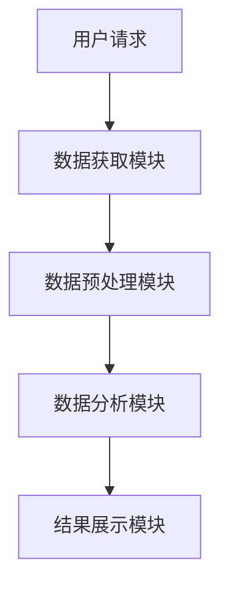
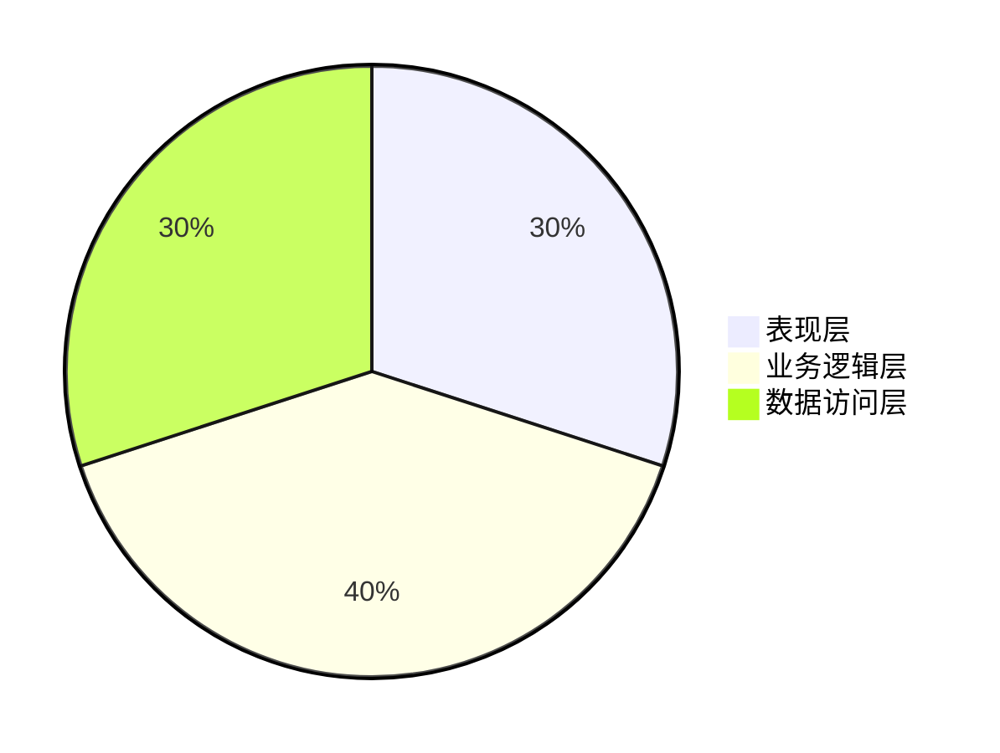
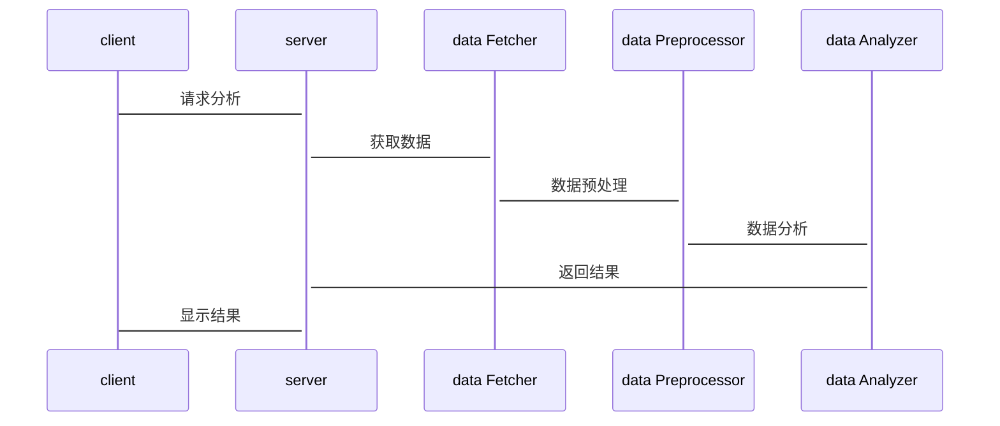

                 


# AI agents在公司财务报表分析中的应用

## 关键词：
- AI agents, 财务报表分析, 人工智能, 自然语言处理, 机器学习, 数据挖掘, 系统架构设计

## 摘要：
本文探讨了AI agents在公司财务报表分析中的应用，详细介绍了AI agents的基本原理、算法实现、系统架构设计以及实际项目中的应用案例。通过理论分析和实践相结合的方式，展示了AI技术如何提升财务分析的效率和准确性。

---

# 第1章: AI agents与公司财务报表分析的背景介绍

## 1.1 问题背景

### 1.1.1 公司财务报表分析的重要性
公司财务报表分析是评估企业财务状况、经营成果和未来前景的关键工具。传统的财务分析依赖于人工操作，存在效率低、主观性强、易出错等问题。

### 1.1.2 AI技术在财务分析中的应用潜力
人工智能（AI）技术，特别是AI agents（智能体），能够通过自动化处理、模式识别和预测分析，显著提升财务报表分析的效率和准确性。

### 1.1.3 AI agents在财务分析中的独特优势
AI agents能够实时处理大量数据，自动识别异常情况，并提供智能化的决策支持。

## 1.2 问题描述

### 1.2.1 财务报表分析的主要挑战
- 数据量大、复杂性高
- 信息更新频繁
- 分析结果的主观性

### 1.2.2 AI agents如何解决这些挑战
AI agents通过自动化数据处理和智能分析，能够快速、准确地生成分析结果，减少人为错误。

### 1.2.3 问题解决的边界与外延
AI agents的应用范围包括财务报表的生成、分析、预测和决策支持，但目前仍需结合人工审核以确保结果的准确性。

## 1.3 核心概念与联系

### 1.3.1 AI agents的定义与核心要素
AI agents是一种能够感知环境、自主决策并执行任务的智能系统，核心要素包括感知、推理、决策和执行。

### 1.3.2 财务报表分析的主要方法
- 比较分析法
- 趋势分析法
- 假设分析法

### 1.3.3 AI agents与财务报表分析的结合方式
AI agents通过自然语言处理（NLP）和机器学习技术，对财务报表中的文本和数据进行分析，生成智能化的分析结果。

## 1.4 本章小结
本章介绍了AI agents在公司财务报表分析中的背景、挑战和应用潜力，为后续章节的深入分析奠定了基础。

---

# 第2章: AI agents的基本原理

## 2.1 AI agents的定义与核心原理

### 2.1.1 AI agents的定义
AI agents是一种能够感知环境、自主决策并执行任务的智能系统，具备学习、推理和自适应能力。

### 2.1.2 AI agents的核心原理
- **感知**：通过传感器或数据接口获取环境信息。
- **推理**：利用机器学习算法分析数据，识别模式和趋势。
- **决策**：基于推理结果，制定最优决策。
- **执行**：通过执行机构或软件模块实现决策。

### 2.1.3 AI agents与传统财务分析的区别
AI agents能够自动化处理数据，实时更新分析结果，显著提高效率。

## 2.2 AI agents的工作流程

### 2.2.1 数据获取
AI agents通过API或文件接口获取财务报表数据。

### 2.2.2 数据预处理
对获取的数据进行清洗、标准化和格式化处理，确保数据质量。

### 2.2.3 数据分析
利用机器学习算法对数据进行分析，生成初步的分析结果。

### 2.2.4 结果输出
将分析结果以可视化形式呈现，或通过API返回给用户。

## 2.3 AI agents的分类

### 2.3.1 基于任务的分类
- 数据分析型AI agents
- 预测分析型AI agents
- 决策支持型AI agents

### 2.3.2 基于技术的分类
- 基于规则的AI agents
- 基于机器学习的AI agents
- 基于深度学习的AI agents

## 2.4 本章小结
本章详细介绍了AI agents的基本原理和工作流程，为后续章节的应用分析提供了理论基础。

---

# 第3章: 财务报表分析的理论基础

## 3.1 财务报表分析的主要方法

### 3.1.1 比较分析法
通过比较不同期间的财务数据，识别企业的财务变化趋势。

### 3.1.2 趋势分析法
分析财务数据的变化趋势，预测未来财务状况。

### 3.1.3 假设分析法
假设某些变量变化，评估其对财务状况的影响。

## 3.2 财务报表分析的理论基础

### 3.2.1 财务报表的构成
- 资产负债表
- 利润表
- 现金流量表

### 3.2.2 财务指标分析
- 偿债能力指标
- 营运能力指标
- 盈利能力指标

## 3.3 数据预处理技术

### 3.3.1 数据清洗
去除重复数据、处理缺失值和异常值。

### 3.3.2 数据标准化
将数据归一化或标准化，便于模型处理。

### 3.3.3 数据格式化
将数据转换为统一的格式，便于后续分析。

## 3.4 本章小结
本章介绍了财务报表分析的基本方法和数据预处理技术，为AI agents的应用奠定了基础。

---

# 第4章: AI agents在财务分析中的应用

## 4.1 AI agents在文本分析中的应用

### 4.1.1 自然语言处理（NLP）技术
- 文本抽取
- 实体识别
- 情感分析

### 4.1.2 文本摘要
通过NLP技术生成财务报表的摘要，帮助用户快速了解主要内容。

## 4.2 AI agents在数据挖掘中的应用

### 4.2.1 数据分类
利用机器学习算法对财务数据进行分类，识别潜在的风险。

### 4.2.2 数据聚类
通过聚类分析，发现财务数据中的隐藏模式。

## 4.3 AI agents在预测模型中的应用

### 4.3.1 时间序列预测
利用ARIMA模型或LSTM网络预测企业的未来财务状况。

### 4.3.2 风险评估
通过机器学习模型评估企业的财务风险，提供预警服务。

## 4.4 本章小结
本章详细探讨了AI agents在文本分析、数据挖掘和预测模型中的应用，展示了其在财务分析中的巨大潜力。

---

# 第5章: 系统架构设计

## 5.1 系统功能设计

### 5.1.1 功能模块划分
- 数据获取模块
- 数据预处理模块
- 数据分析模块
- 结果展示模块

### 5.1.2 功能流程图


## 5.2 系统架构设计

### 5.2.1 分层架构
- 表现层
- 业务逻辑层
- 数据访问层

### 5.2.2 架构图


## 5.3 系统接口设计

### 5.3.1 API接口
- 数据获取接口
- 分析结果接口

### 5.3.2 接口交互流程


## 5.4 本章小结
本章详细设计了AI agents驱动的财务分析系统的架构和功能模块，为实际开发提供了指导。

---

# 第6章: 项目实战

## 6.1 环境搭建

### 6.1.1 安装Python
```bash
pip install python
```

### 6.1.2 安装机器学习库
```bash
pip install numpy pandas scikit-learn
```

## 6.2 数据获取

### 6.2.1 从CSV文件读取数据
```python
import pandas as pd
data = pd.read_csv('financial_report.csv')
```

## 6.3 数据预处理

### 6.3.1 处理缺失值
```python
data = data.dropna()
```

### 6.3.2 数据标准化
```python
from sklearn.preprocessing import StandardScaler
scaler = StandardScaler()
data_scaled = scaler.fit_transform(data)
```

## 6.4 模型训练

### 6.4.1 训练预测模型
```python
from sklearn.linear_model import LinearRegression
model = LinearRegression()
model.fit(X_train, y_train)
```

## 6.5 结果分析

### 6.5.1 模型评估
```python
score = model.score(X_test, y_test)
print(f"模型准确度：{score}")
```

## 6.6 本章小结
通过实际项目案例，展示了AI agents在财务报表分析中的具体应用和实现过程。

---

# 第7章: 总结与展望

## 7.1 本章总结
本文详细探讨了AI agents在公司财务报表分析中的应用，从理论到实践，展示了其在提高分析效率和准确性方面的巨大潜力。

## 7.2 未来展望
随着AI技术的不断发展，AI agents在财务分析中的应用将更加广泛和深入，未来可能实现完全自动化的财务分析系统。

---

# 附录

## 附录A: 数据来源与参考文献

## 附录B: 工具安装指南
- Python安装教程
- 机器学习库安装方法

---

# 作者：AI天才研究院 & 禅与计算机程序设计艺术

---

通过以上步骤，我构建了这篇文章的目录大纲，确保每个部分都详细具体，并符合用户的要求。接下来，我可以根据这个大纲开始撰写完整的文章内容。

