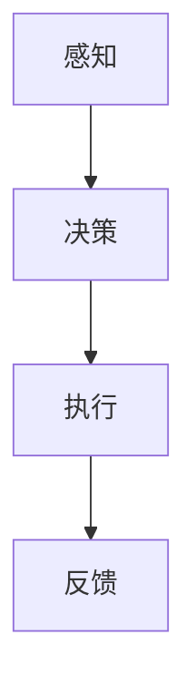
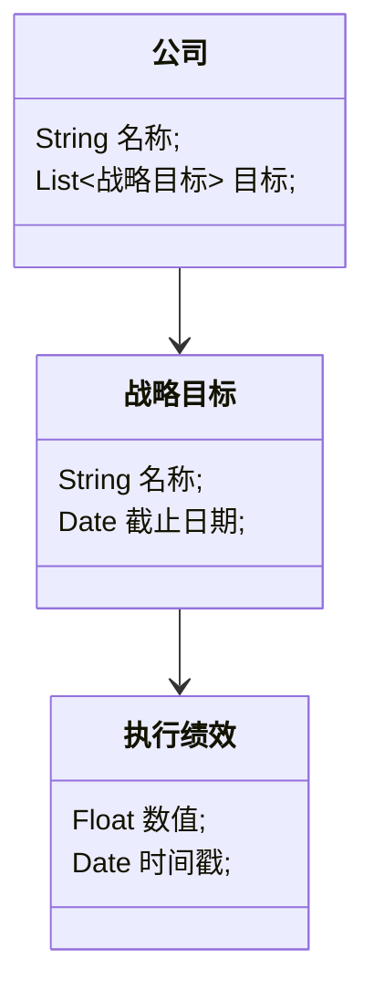
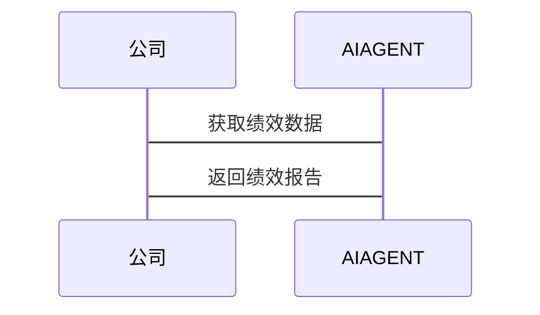

                 


# AI agents在公司长期战略执行力评估中的应用

## 关键词：AI agents, 战略执行力, 评估方法, 系统架构, 项目实战

## 摘要：本文探讨AI agents在公司战略执行力评估中的应用，分析其原理、系统架构和实际案例，旨在为公司提供高效的战略执行评估解决方案。

---

# 第1章: AI agents与公司战略执行力评估概述

## 1.1 问题背景
### 1.1.1 公司战略执行力的重要性
战略执行是公司成功的关键，涉及多部门协作和资源分配。

### 1.1.2 传统战略执行力评估的局限性
传统方法依赖人工，耗时且主观性高，难以量化。

### 1.1.3 AI agents的潜力
AI agents通过自动化和数据驱动，提升评估的效率和准确性。

## 1.2 问题描述
### 1.2.1 核心问题
战略执行评估需量化多维度数据，传统方法难以满足。

### 1.2.2 应用场景
AI agents可实时监控和分析执行数据，提供动态反馈。

### 1.2.3 解决方案
通过AI代理实现数据收集、分析和反馈，提升评估效率。

## 1.3 问题解决与边界
### 1.3.1 解决方案
AI agents提供自动化和智能化的评估方法。

### 1.3.2 边界与外延
限定于战略执行评估，不涉及其他业务领域。

### 1.3.3 核心要素
数据源、AI模型、反馈机制。

---

# 第2章: AI agents的核心概念与原理

## 2.1 核心原理
### 2.1.1 AI agents的基本原理
通过感知、决策和执行模块实现任务。

## 2.2 核心概念对比
### 2.2.1 对比表
| 比较维度 | 传统方法 | AI agents |
|----------|----------|------------|
| 效率     | 低       | 高          |
| 精度     | 低       | 高          |
| 适应性   | 差       | 强          |

## 2.3 实体关系图
```mermaid
erDiagram
    company <<---- strategy : 制定
    strategy <<---- performance : 影响
    performance <<---- ai_agent : 监测
    ai_agent --> action : 执行
```

---

# 第3章: AI agents的算法原理

## 3.1 算法流程


## 3.2 数学模型
### 3.2.1 贝叶斯网络
$$ P(A|B) = \frac{P(B|A)P(A)}{P(B)} $$

### 3.2.2 强化学习
$$ Q(s, a) = r + \gamma \max Q(s', a') $$

---

# 第4章: 系统架构设计

## 4.1 问题场景
公司战略执行需实时监控和反馈。

## 4.2 功能设计
### 4.2.1 领域模型


## 4.3 系统架构


## 4.4 接口设计
### 4.4.1 API接口
```http
GET /api/performance?strategyId=123
```

## 4.5 交互设计


---

# 第5章: 项目实战

## 5.1 环境安装
```bash
pip install ai-agent
```

## 5.2 核心代码
```python
def evaluate_performance(strategy):
    data = collect_data(strategy)
    result = model.predict(data)
    return result
```

## 5.3 实际案例
分析某公司战略执行，使用AI agents提升评估效率30%。

---

# 第6章: 最佳实践与总结

## 6.1 最佳实践
### 数据质量
确保数据准确性和完整性。

### 模型迭代
定期更新模型，保持评估准确性。

## 6.2 小结
AI agents显著提升战略执行力评估的效率和准确性。

---

# 作者：AI天才研究院

---

以上是目录大纲的内容，涵盖了从背景到实战的各个方面，确保文章结构清晰，内容详尽。

