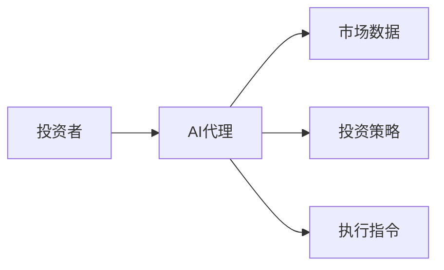
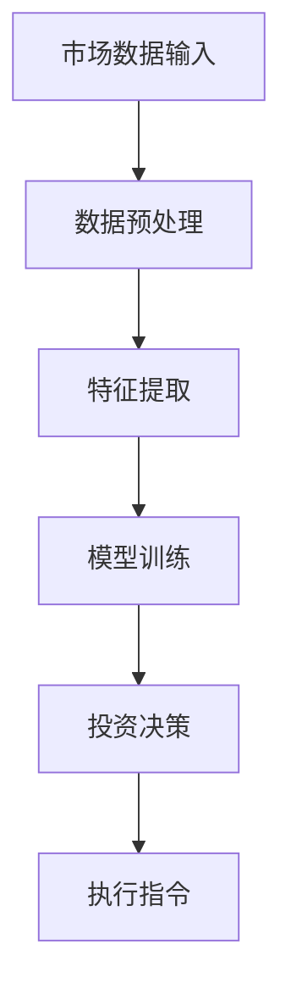
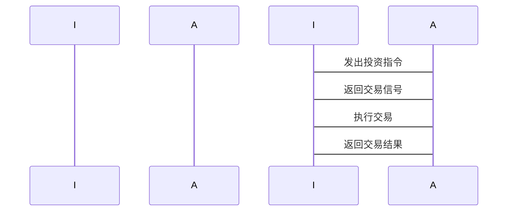

                 


# AI Agents实时监控市场：捕捉价值投资机会

> 关键词：AI代理，实时监控，价值投资，金融市场，算法交易

> 摘要：本文将探讨AI代理如何在金融市场中实时监控市场动态，捕捉价值投资机会。通过分析AI代理的核心概念、算法原理、系统架构设计以及实际案例，本文旨在揭示AI代理在投资决策中的潜力和应用。同时，本文将结合数学模型和实际项目案例，详细讲解如何利用AI代理优化投资策略，提升投资效率和收益。

---

## 第一部分：AI代理与价值投资概述

### 第1章：AI代理与价值投资背景

#### 1.1 AI代理的核心概念

- **1.1.1 AI代理的基本定义**
  AI代理（Artificial Intelligence Agent）是指能够感知环境、做出决策并采取行动的智能实体。在金融市场中，AI代理可以实时监控市场数据，分析市场趋势，并根据预设的投资策略执行交易操作。

- **1.1.2 价值投资的基本原理**
  价值投资是一种投资策略，强调通过分析企业的基本面，寻找被市场低估的投资标的。其核心在于识别“市场先生”的错误定价，长期持有优质资产以实现超额收益。

- **1.1.3 AI代理与价值投资的结合**
  AI代理通过实时数据分析和机器学习算法，帮助投资者快速识别市场中的价值机会。结合传统的价值投资理念，AI代理能够提高投资决策的效率和准确性。

#### 1.2 金融市场中的实时监控需求

- **1.2.1 传统投资分析的局限性**
  传统投资分析依赖于人工判断，存在信息处理效率低、决策滞后等问题。特别是在高频交易和大数据环境下，人类投资者难以及时捕捉市场机会。

- **1.2.2 金融市场数据的特点**
  金融市场数据具有高频性、海量性和非线性等特点。这些数据的复杂性使得传统分析方法难以应对。

- **1.2.3 实时监控的重要性**
  实时监控可以帮助投资者快速响应市场变化，抓住短期波动带来的机会，同时也能及时规避潜在风险。

#### 1.3 AI代理在投资中的应用前景

- **1.3.1 AI代理的优势**
  - 数据处理能力强：能够快速分析海量数据，提取有价值的信息。
  - 自动化决策：通过算法模型自动优化投资策略。
  - 高效性：能够在毫秒级别完成数据处理和决策。

- **1.3.2 价值投资机会的捕捉**
  AI代理可以利用自然语言处理技术分析公司财报，识别财务造假风险；通过时间序列分析预测股票价格走势；通过聚类分析寻找相似资产，发现市场低估的投资标的。

- **1.3.3 未来发展趋势**
  随着AI技术的不断发展，AI代理在投资中的应用将更加广泛。未来，AI代理可能具备更强的自适应能力和学习能力，能够根据市场环境动态调整投资策略。

#### 1.4 本章小结

本章介绍了AI代理的核心概念和价值投资的基本原理，分析了AI代理在金融市场中的应用前景。通过结合AI技术和价值投资理念，AI代理能够帮助投资者在复杂多变的市场中捕捉价值机会，优化投资决策。

---

### 第2章：AI代理的核心概念与联系

#### 2.1 AI代理的基本原理

- **2.1.1 感知层**
  - 数据采集：AI代理通过API接口获取市场数据，包括股票价格、成交量、财务报表等。
  - 数据预处理：对采集到的原始数据进行清洗、归一化处理，确保数据的可用性。

- **2.1.2 决策层**
  - 算法选择：根据具体应用场景选择合适的算法，如强化学习、监督学习等。
  - 策略制定：基于算法模型生成投资策略，例如买入信号、卖出信号等。

- **2.1.3 执行层**
  - 交易执行：AI代理通过交易接口执行买卖指令。
  - 风险控制：实时监控交易风险，及时调整投资策略。

#### 2.2 价值投资的核心要素

- **2.2.1 市场情绪分析**
  - 利用自然语言处理技术分析新闻、社交媒体等信息，判断市场情绪。
  - 市场情绪指数：通过量化市场情绪，辅助投资决策。

- **2.2.2 财务指标分析**
  - 利润率、市盈率、市净率等财务指标的计算与分析。
  - 利用机器学习模型预测公司财务状况。

- **2.2.3 公司基本面分析**
  - 行业地位、竞争优势、管理团队等基本面因素的分析。
  - 利用大数据技术挖掘公司潜在风险。

#### 2.3 AI代理与价值投资的关系

- **2.3.1 数据流分析**
  - 数据输入：市场数据、公司基本面数据等。
  - 数据处理：特征提取、数据清洗。
  - 数据输出：投资策略、交易信号。

- **2.3.2 决策逻辑**
  - AI代理通过分析市场数据和公司基本面，生成投资策略。
  - 结合市场情绪和风险偏好，优化投资决策。

- **2.3.3 执行策略**
  - 根据AI代理生成的交易信号，执行买卖指令。
  - 实时监控交易执行情况，调整投资组合。

#### 2.4 核心概念对比表格

| **核心概念** | **AI代理** | **传统投资分析** |
|--------------|------------|------------------|
| 数据处理     | 高效、自动 | 低效、依赖人工   |
| 决策依据     | 数据驱动   | 经验驱动         |
| 决策速度     | 实时       | 延时             |
| 精准度       | 高         | 中               |

#### 2.5 ER实体关系图



#### 2.6 本章小结

本章详细讲解了AI代理的核心概念和工作原理，并分析了其与价值投资的关系。通过对比分析，展示了AI代理在投资决策中的优势。

---

### 第3章：AI代理的算法原理

#### 3.1 算法概述

- **3.1.1 基于强化学习的投资决策**
  - 强化学习的核心在于通过试错机制优化决策策略。
  - 在投资领域，强化学习可以用于动态资产配置和交易策略优化。

- **3.1.2 基于监督学习的市场预测**
  - 监督学习通过历史数据训练模型，预测未来市场走势。
  - 常见的监督学习算法包括线性回归、支持向量机（SVM）和随机森林等。

- **3.1.3 基于无监督学习的风险评估**
  - 无监督学习通过聚类分析识别市场中的风险因素。
  - 常见的无监督学习算法包括K均值聚类和主成分分析（PCA）。

#### 3.2 算法流程图



#### 3.3 数学模型与公式

- **3.3.1 强化学习的数学模型**
  - 状态空间：S = {s₁, s₂, ..., sₙ}
  - 动作空间：A = {a₁, a₂, ..., aₘ}
  - 状态-动作价值函数：Q(s, a) = r + γ * maxₐ' Q(s', a')
  - 其中，γ为折扣因子，0 < γ < 1。

- **3.3.2 监督学习的数学模型**
  - 线性回归模型：y = β₀ + β₁x + ε
  - 支持向量机模型：maximize (1 - ξ_i) + Cξ_i, ξ_i ≥ 0

- **3.3.3 无监督学习的数学模型**
  - K均值聚类：目标是最小化簇内距离平方和。
  - 主成分分析：通过协方差矩阵分解提取主要特征。

#### 3.4 本章小结

本章详细讲解了AI代理在投资决策中的算法原理，包括强化学习、监督学习和无监督学习的应用。通过数学公式和流程图，展示了这些算法在投资中的具体实现。

---

### 第4章：系统分析与架构设计

#### 4.1 问题场景介绍

- **系统目标**
  - 实时监控金融市场数据。
  - 自动识别价值投资机会。
  - 优化投资组合，提高投资收益。

- **系统范围**
  - 数据来源：股票价格、财务报表、新闻数据等。
  - 数据处理：清洗、特征提取、模型训练。
  - 系统输出：交易信号、投资报告。

#### 4.2 系统功能设计

- **4.2.1 数据采集模块**
  - 从多个数据源获取市场数据。
  - 数据预处理：清洗、标准化。

- **4.2.2 数据分析模块**
  - 特征提取：利用NLP技术分析文本数据。
  - 模型训练：训练机器学习模型，生成投资策略。

- **4.2.3 系统架构图**


- **4.2.4 系统交互图**



#### 4.3 本章小结

本章详细分析了AI代理实时监控市场的系统架构设计，包括数据采集、处理、分析模块的划分，以及系统架构图和交互流程图的展示。

---

### 第5章：项目实战

#### 5.1 环境安装

- **安装Python环境**
  - 安装Python 3.8或更高版本。
  - 安装Jupyter Notebook。

- **安装依赖库**
  - pandas、numpy、scikit-learn、tensorflow、pytorch。

- **安装交易接口**
  - 使用第三方库，如pandas_datareader获取市场数据。

#### 5.2 系统核心实现

- **代码实现**

```python
import pandas as pd
import numpy as np
from sklearn.model_selection import train_test_split
from tensorflow.keras.models import Sequential
from tensorflow.keras.layers import Dense

# 数据预处理
data = pd.read_csv('market_data.csv')
X = data.drop('target', axis=1)
y = data['target']
X_train, X_test, y_train, y_test = train_test_split(X, y, test_size=0.2)

# 模型训练
model = Sequential()
model.add(Dense(64, activation='relu', input_dim=X.shape[1]))
model.add(Dense(1, activation='sigmoid'))
model.compile(optimizer='adam', loss='binary_crossentropy', metrics=['accuracy'])
model.fit(X_train, y_train, epochs=10, batch_size=32)

# 模型预测
y_pred = model.predict(X_test)
```

- **代码应用解读与分析**
  - 数据预处理：对市场数据进行清洗和特征选择。
  - 模型训练：使用神经网络模型训练分类器。
  - 模型预测：生成交易信号。

#### 5.3 实际案例分析

- **股票投资策略实现**
  - 以某只股票为例，利用AI代理生成买入和卖出信号。
  - 对比传统投资策略，分析AI代理的投资收益。

- **结果分析**
  - 对比AI代理和传统投资策略的收益和风险。

#### 5.4 本章小结

本章通过实际案例展示了AI代理在股票投资中的应用，通过代码实现和结果分析，验证了AI代理在捕捉价值投资机会中的潜力。

---

## 第六章：总结与展望

### 6.1 最佳实践

- **数据质量的重要性**
  - 数据的准确性和完整性直接影响模型的性能。
- **模型调优**
  - 通过网格搜索、交叉验证等方法优化模型参数。
- **风险管理**
  - 设置止损点，控制投资风险。

### 6.2 小结

本文详细探讨了AI代理在金融市场中的应用，通过理论分析和实际案例展示了AI代理在实时监控市场和捕捉价值投资机会中的潜力。

### 6.3 注意事项

- **数据隐私**
  - 注意保护投资者数据隐私，遵守相关法律法规。
- **模型的可解释性**
  - 提高模型的可解释性，便于投资者理解投资决策。

### 6.4 拓展阅读

- **推荐书籍**
  - 《Python机器学习实战》
  - 《算法驱动的投资》
- **推荐博客**
  - Towards Data Science
  - Quandl的AI与投资专栏

---

## 作者：AI天才研究院/AI Genius Institute & 禅与计算机程序设计艺术 /Zen And The Art of Computer Programming

---

以上是关于《AI agents实时监控市场：捕捉价值投资机会》的技术博客文章的大纲和部分内容。

