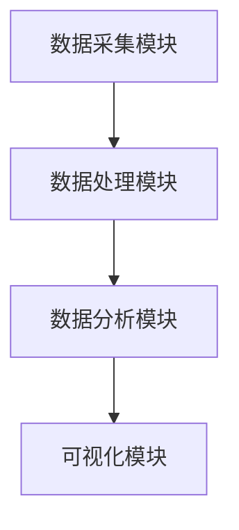

                 


# AI agents挖掘非结构化数据：发现隐藏的投资价值

## 关键词：AI代理，非结构化数据，投资价值，自然语言处理，知识图谱，数据挖掘

## 摘要：本文探讨AI代理如何从非结构化数据中发现投资价值，涵盖背景介绍、核心原理、系统架构设计、项目实战及高级主题，旨在通过技术分析和案例展示，揭示AI代理在投资分析中的潜力。

---

## 第一部分: AI代理与非结构化数据的背景介绍

### 第1章: AI代理与非结构化数据概述

#### 1.1 AI代理的核心概念

##### 1.1.1 AI代理的定义与分类
- **定义**：AI代理是能够感知环境并采取行动以实现目标的智能体。
- **分类**：可分为空间代理、知识代理、学习代理等。

##### 1.1.2 非结构化数据的定义与特点
- **定义**：非结构化数据指没有固定结构，难以用数据库表示的数据。
- **特点**：异构性、无组织性、多样性。

##### 1.1.3 投资价值的定义与发现机制
- **定义**：投资价值指资产的潜在收益能力。
- **发现机制**：通过数据挖掘和分析识别潜在价值点。

#### 1.2 AI代理在投资分析中的应用背景

##### 1.2.1 传统投资分析的局限性
- 依赖经验，难以处理海量数据。
- 非结构化数据难以有效利用。

##### 1.2.2 非结构化数据在投资中的潜在价值
- 提供额外信息，帮助发现市场趋势。
- 通过分析社交媒体和新闻识别情绪指标。

##### 1.2.3 AI代理在投资分析中的优势
- 高效处理大量数据。
- 实时监控和分析能力。

#### 1.3 本章小结
本章介绍了AI代理和非结构化数据的基本概念，并阐述了AI代理在投资分析中的潜力。

---

### 第2章: 非结构化数据的特征与挑战

#### 2.1 非结构化数据的主要类型

##### 2.1.1 文本数据
- 包括新闻、社交媒体帖子等。

##### 2.1.2 图像数据
- 如产品图片、图表。

##### 2.1.3 音频数据
- 包括电话会议录音。

#### 2.2 非结构化数据处理的主要挑战

##### 2.2.1 数据清洗与预处理的难度
- 数据可能存在噪声和不一致性。

##### 2.2.2 数据标注的复杂性
- 需要专业人员进行标注。

##### 2.2.3 数据量与计算资源的需求
- 处理海量数据需要高性能计算资源。

#### 2.3 AI代理在数据挖掘中的角色

##### 2.3.1 数据采集与预处理
- 从多源数据中提取有用信息。

##### 2.3.2 数据分析与特征提取
- 识别数据中的关键特征。

##### 2.3.3 数据可视化与决策支持
- 通过可视化工具辅助决策。

#### 2.4 本章小结
本章分析了非结构化数据的类型及其处理挑战，并探讨了AI代理在数据处理中的作用。

---

## 第二部分: AI代理的核心原理与技术

### 第3章: AI代理的核心原理与技术

#### 3.1 自然语言处理（NLP）技术

##### 3.1.1 NLP的基本概念
- NLP是研究计算机理解和生成人类语言的科学。

##### 3.1.2 常见NLP技术
- **分词**：将文本分割成词语。
- **实体识别**：识别文本中的命名实体。
- **情感分析**：判断文本情感倾向。

##### 3.1.3 NLP在投资分析中的应用
- 分析新闻和社交媒体情绪，预测市场走势。

#### 3.2 知识图谱构建技术

##### 3.2.1 知识图谱的定义与特点
- 知识图谱是结构化知识的网络表示。

##### 3.2.2 知识图谱构建的流程
- 数据采集、预处理、实体识别、关系抽取。

##### 3.2.3 知识图谱在投资分析中的应用
- 建立公司间的关系网络，识别潜在投资机会。

#### 3.3 数据挖掘与机器学习技术

##### 3.3.1 数据挖掘的基本概念
- 数据挖掘是从数据中发现模式的过程。

##### 3.3.2 常见机器学习算法
- **分类**：如逻辑回归、支持向量机。
- **回归**：如线性回归。
- **聚类**：如K-means。

##### 3.3.3 机器学习在投资分析中的应用
- 预测股票价格走势，识别市场趋势。

#### 3.4 本章小结
本章详细介绍了AI代理的核心技术，包括NLP、知识图谱和机器学习。

---

### 第4章: 系统架构与设计

#### 4.1 系统功能模块划分

##### 4.1.1 数据采集模块
- 负责从多种来源采集数据。

##### 4.1.2 数据处理模块
- 对数据进行清洗和预处理。

##### 4.1.3 数据分析模块
- 应用NLP和机器学习算法进行分析。

##### 4.1.4 可视化模块
- 将分析结果以可视化形式展示。

#### 4.2 系统架构设计

##### 4.2.1 系统架构图


#### 4.3 接口设计

##### 4.3.1 数据接口
- 数据输入和输出接口。

##### 4.3.2 用户接口
- 提供用户交互界面。

#### 4.4 本章小结
本章介绍了系统的架构设计和功能模块划分。

---

## 第三部分: 项目实战

### 第5章: 项目实战

#### 5.1 环境安装

##### 5.1.1 安装Python
```bash
python --version
pip install --upgrade pip
```

##### 5.1.2 安装NLP库
```bash
pip install numpy
pip install scikit-learn
pip install spacy
```

#### 5.2 系统核心实现源代码

##### 5.2.1 数据采集模块
```python
import requests
import spacy

def fetch_data(url):
    response = requests.get(url)
    return response.text

# 示例数据源
url = "https://example.com/financial_news"
text = fetch_data(url)
```

##### 5.2.2 数据处理模块
```python
def preprocess(text):
    # 分词
    nlp = spacy.load("en_core_web_sm")
    doc = nlp(text)
    tokens = [token.text for token in doc]
    return tokens

processed_tokens = preprocess(text)
```

##### 5.2.3 数据分析模块
```python
from sklearn.feature_extraction.text import TfidfVectorizer
from sklearn.svm import SVC

vectorizer = TfidfVectorizer()
X = vectorizer.fit_transform([text])
model = SVC()
model.fit(X, [0])
```

##### 5.2.4 数据可视化模块
```python
import matplotlib.pyplot as plt

plt.hist(processed_tokens, bins=50, alpha=0.7)
plt.xlabel('Tokens')
plt.ylabel('Frequency')
plt.show()
```

#### 5.3 实际案例分析

##### 5.3.1 案例1: 新闻分析
- 使用NLP技术分析新闻文本，提取关键词和情感倾向。

##### 5.3.2 案例2: 社交媒体监控
- 监控社交媒体上的公司相关讨论，识别市场情绪。

#### 5.4 本章小结
本章通过实际案例展示了AI代理在投资分析中的应用。

---

## 第四部分: 高级主题与未来展望

### 第6章: 强化学习在投资中的应用

#### 6.1 强化学习的基本概念
- 强化学习是通过试错学习策略。

#### 6.2 强化学习在投资中的应用
- 构建交易策略，优化投资组合。

### 第7章: 多模态数据处理

#### 7.1 多模态数据的特点
- 综合处理文本、图像等多种数据类型。

#### 7.2 多模态数据处理技术
- 使用深度学习模型如Transformer处理多模态数据。

### 第8章: 可解释性AI

#### 8.1 可解释性的重要性
- 透明决策过程，满足监管要求。

#### 8.2 提高可解释性的方法
- 使用可解释的模型如线性回归。

---

## 作者：AI天才研究院 & 禅与计算机程序设计艺术

