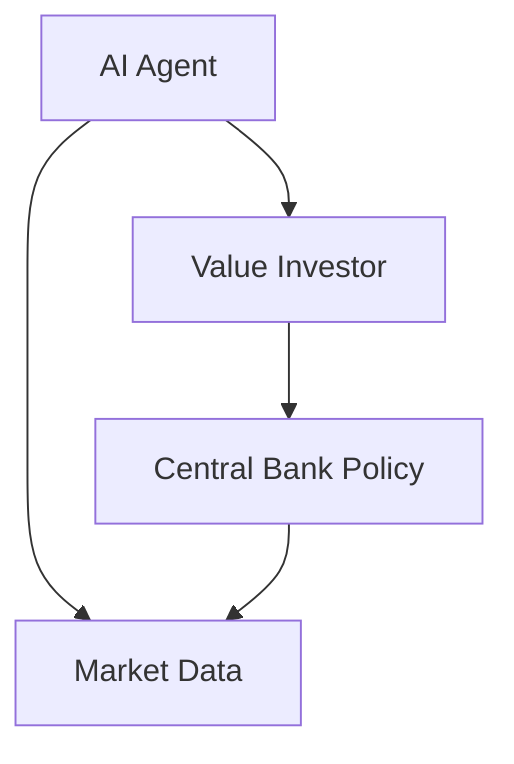
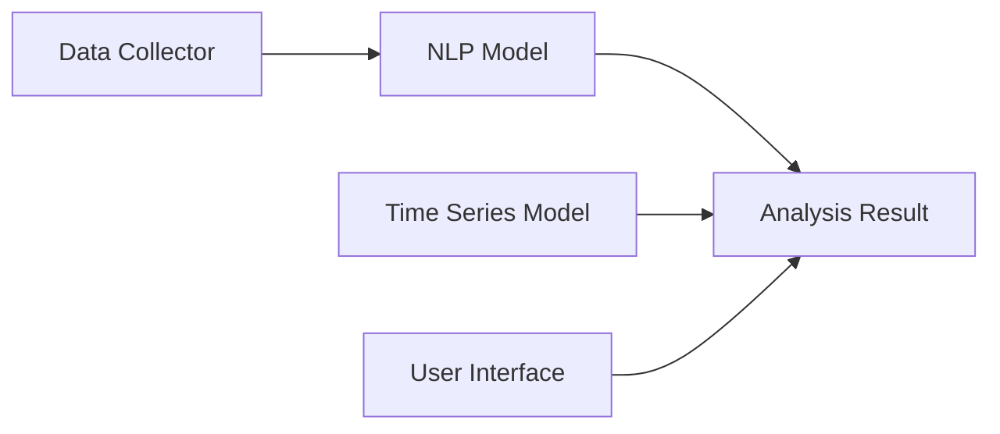

                 


# AI agents辅助价值投资者解读央行政策影响

## 关键词：AI代理，价值投资，央行政策，自然语言处理，时间序列分析，系统架构设计

## 摘要：本文探讨了AI代理如何辅助价值投资者解读央行政策的影响。通过分析AI代理、价值投资和央行政策的核心概念，详细阐述了基于自然语言处理和时间序列分析的算法原理，并设计了完整的系统架构。通过实际案例展示了AI代理在政策解读中的应用，最后总结了最佳实践和未来研究方向。

---

# 第一部分：背景介绍

## 第1章：AI代理与价值投资概述

### 1.1 AI代理的基本概念

AI代理是一种能够感知环境并采取行动以实现目标的智能体。与传统代理相比，AI代理具有以下特点：

- **自主性**：能够在没有外部干预的情况下运行。
- **反应性**：能够根据环境的变化调整行为。
- **学习能力**：通过数据和经验不断优化自身性能。

### 1.2 价值投资的基本原理

价值投资是一种投资策略，旨在通过分析企业的基本面（如财务状况、行业地位等）找到被市场低估的投资标的。其核心在于寻找具有长期增长潜力的企业。

### 1.3 AI代理与价值投资的结合

AI代理可以通过以下方式辅助价值投资者：

- **数据处理**：快速分析大量财务数据，识别潜在的投资机会。
- **模式识别**：发现传统方法难以察觉的市场规律。
- **动态调整**：根据市场变化实时优化投资组合。

---

## 第2章：央行政策对经济的影响

### 2.1 央行政策的类型与特点

央行政策主要包括货币政策和宏观审慎政策，其特点包括：

- **货币政策**：通过调整利率、货币供应量等工具影响经济活动。
- **宏观审慎政策**：旨在维护金融系统的稳定性。

### 2.2 央行政策对市场的具体影响

- **股市**：利率下降通常会降低融资成本，利好股市。
- **债市**：利率上升会增加债券的吸引力。

### 2.3 经济指标与政策的关系

- **GDP增长率**：反映经济整体表现。
- **通胀率**：影响货币政策的制定。

---

# 第二部分：核心概念与联系

## 第3章：核心概念的对比分析

### 3.1 AI代理与传统投资工具的对比

| 特性       | AI代理       | 传统投资工具   |
|------------|--------------|---------------|
| 数据处理能力 | 强大          | 较弱           |
| 决策速度     | 快速          | 较慢           |
| 可定制性     | 高            | 较低           |

### 3.2 价值投资与技术分析的对比

| 特性       | 价值投资       | 技术分析       |
|------------|----------------|----------------|
| 基础       | 公司基本面      | 市场价格走势    |
| 方法       | 财务指标分析    | K线图、技术指标|

### 3.3 央行政策与其他经济政策的对比

| 特性       | 央行政策       | 财政政策       |
|------------|----------------|----------------|
| 制定主体     | 中央银行        | 政府           |
| 工具         | 利率、货币供应量 | 税收、政府支出  |

---

## 第4章：核心概念的ER实体关系图



---

# 第三部分：算法原理

## 第5章：自然语言处理在政策解读中的应用

### 5.1 NLP技术简介

自然语言处理（NLP）是人工智能的一个分支，旨在让计算机能够理解人类语言。常用的NLP技术包括：

- **分词**：将文本分割成词语。
- **实体识别**：识别文本中的专有名词。
- **情感分析**：判断文本的情感倾向。

### 5.2 央行政策文本的特征提取

#### 5.2.1 文本预处理

```python
import spacy
nlp = spacy.load("en_core_web_sm")
doc = nlp("The central bank will cut interest rates.")
for token in doc:
    print(token.text, token.pos_)
```

#### 5.2.2 关键词提取

```python
from keybert import KeyBERT
model = KeyBERT()
text = "The central bank's new policy aims to stimulate economic growth."
keywords = model.extract_keywords(text, key_chunk_size=5)
print(keywords)
```

---

## 第6章：时间序列分析在政策影响评估中的应用

### 6.1 时间序列分析简介

时间序列分析是一种统计方法，用于分析随时间变化的数据。常用的模型包括：

- **ARIMA**：自回归积分滑动平均模型。
- **LSTM**：长短期记忆网络。

### 6.2 基于ARIMA的经济指标预测

#### 6.2.1 ARIMA模型公式

$$ ARIMA(p, d, q) $$

其中，$p$ 是自回归阶数，$d$ 是差分阶数，$q$ 是移动平均阶数。

#### 6.2.2 Python代码实现

```python
from statsmodels.tsa.arima_model import ARIMA
data = [1, 2, 3, 4, 5]
model = ARIMA(data, order=(1, 1, 1))
model_fit = model.fit()
print(model_fit.summary())
```

---

## 第7章：系统分析与架构设计

### 7.1 问题场景介绍

投资者需要快速解读央行政策并评估其对市场的影响。

### 7.2 系统功能设计

- **数据收集模块**：收集政策文本和市场数据。
- **模型训练模块**：训练NLP和时间序列模型。
- **用户界面模块**：展示分析结果。

### 7.3 系统架构设计



---

## 第8章：项目实战

### 8.1 环境配置

安装所需库：

```bash
pip install spacy statsmodels keybert
```

### 8.2 核心代码实现

```python
import spacy
from statsmodels.tsa.arima_model import ARIMA
from keybert import KeyBERT

# NLP部分
nlp = spacy.load("en_core_web_sm")
text = "The central bank will cut interest rates."
doc = nlp(text)

# 关键词提取
model = KeyBERT()
keywords = model.extract_keywords(text, key_chunk_size=5)

# 时间序列分析
data = [1, 2, 3, 4, 5]
model = ARIMA(data, order=(1, 1, 1))
model_fit = model.fit()
```

---

## 第9章：小结与最佳实践

### 9.1 总结

本文详细介绍了AI代理辅助价值投资者解读央行政策的影响，涵盖了从概念到实现的全过程。

### 9.2 最佳实践

- **数据来源**：确保数据的准确性和及时性。
- **模型可解释性**：选择易于解释的模型。
- **持续优化**：定期更新模型参数。

### 9.3 注意事项

- AI代理的结果仅供参考，投资需谨慎。
- 注意数据隐私和合规性。

### 9.4 拓展阅读

- 《Python机器学习实战》
- 《时间序列分析：方法与应用》

---

作者：AI天才研究院/AI Genius Institute & 禅与计算机程序设计艺术 /Zen And The Art of Computer Programming

