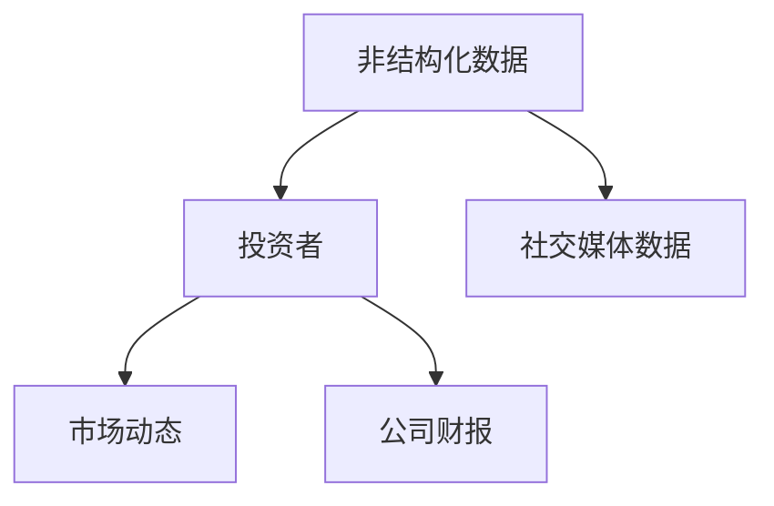
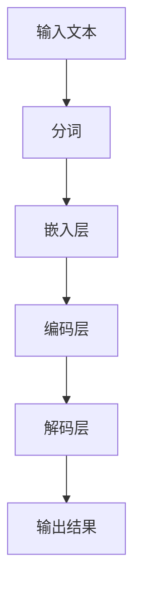
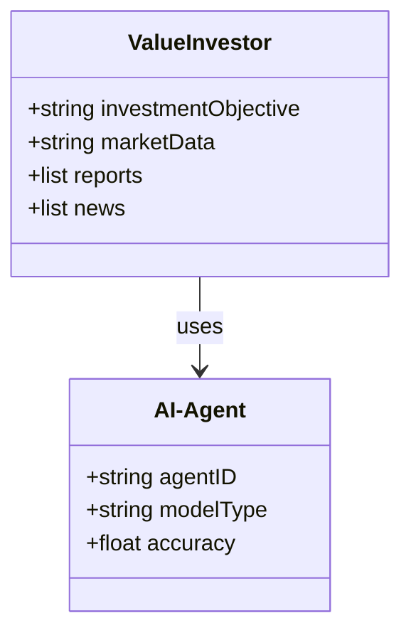
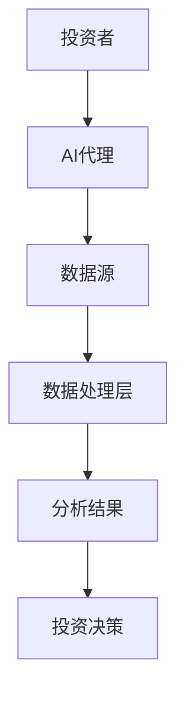
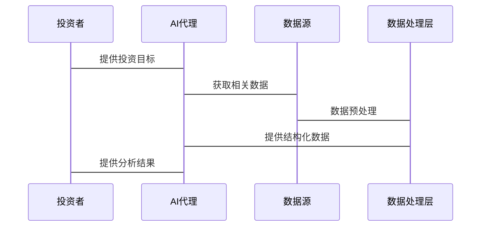

                 


# AI agents辅助价值投资者解读非结构化数据

## 关键词：AI代理、价值投资、非结构化数据、自然语言处理、金融分析

## 摘要：  
本文探讨了AI代理在辅助价值投资者解读非结构化数据中的应用。通过分析非结构化数据的特点及其在投资决策中的重要性，结合AI代理的核心原理和自然语言处理模型（如BERT），本文详细阐述了如何利用AI代理来提高投资分析的效率和准确性。文章还通过系统架构设计和实际案例分析，展示了AI代理在金融领域的潜力和应用前景。

---

# 第1章: 背景介绍与核心概念

## 1.1 非结构化数据的定义与特点

### 1.1.1 非结构化数据的定义  
非结构化数据是指没有固定结构、难以通过传统数据库或表格形式进行组织和存储的数据。常见的非结构化数据包括文本、图像、音频、视频和社交媒体数据等。

### 1.1.2 非结构化数据的特点  
- **多样性**：数据类型多样，难以统一处理。
- **复杂性**：信息分布不规则，难以提取结构化信息。
- **关联性**：数据之间可能存在隐含关联，需要深度分析才能发现价值。

### 1.1.3 非结构化数据在价值投资中的重要性  
价值投资者依赖于对公司基本面、行业趋势和市场情绪的深入分析。非结构化数据（如新闻、财报、社交媒体评论）提供了丰富的信息，但其复杂性使得人工分析效率低下。AI代理可以通过自然语言处理和机器学习技术，帮助投资者快速提取关键信息，发现投资机会。

---

## 1.2 价值投资者的挑战与需求

### 1.2.1 价值投资者的核心目标  
价值投资者的目标是通过分析公司基本面、行业趋势和市场情绪，找到被市场低估的投资标的。

### 1.2.2 非结构化数据对投资决策的影响  
非结构化数据（如行业报告、社交媒体情绪）对投资决策具有重要影响，但其复杂性使得人工分析效率低下，容易遗漏关键信息。

### 1.2.3 传统数据分析方法的局限性  
传统数据分析方法依赖于结构化数据，难以处理非结构化数据的多样性和复杂性。人工分析耗时且容易出错，难以应对海量数据的挑战。

---

## 1.3 AI agents在金融领域的应用前景

### 1.3.1 AI agents的基本概念  
AI代理是一种智能体，能够感知环境、执行任务并做出决策。在金融领域，AI代理可以用于数据处理、信息分析和投资决策支持。

### 1.3.2 AI agents在金融分析中的优势  
- **高效性**：AI代理可以快速处理海量数据，提取关键信息。
- **准确性**：通过机器学习算法，AI代理可以提高分析的准确性。
- **实时性**：AI代理可以实时监控市场动态，及时提供决策支持。

### 1.3.3 价值投资者与AI agents的结合  
通过AI代理，价值投资者可以更高效地处理非结构化数据，发现潜在投资机会，提高投资决策的准确性和效率。

---

## 1.4 本章小结

### 1.4.1 核心问题的总结  
本文介绍了非结构化数据的定义、特点及其在投资中的重要性，分析了价值投资者面临的挑战，探讨了AI代理在金融领域的应用前景。

### 1.4.2 下文将要探讨的内容  
接下来，本文将深入探讨AI代理与非结构化数据的核心概念、算法原理、系统架构设计以及实际应用案例。

---

# 第2章: 核心概念与联系

## 2.1 AI agents与非结构化数据的关系

### 2.1.1 AI agents如何处理非结构化数据  
AI代理可以通过自然语言处理技术，将非结构化数据转化为结构化信息，帮助投资者提取关键信息。

### 2.1.2 非结构化数据对AI agents的挑战  
非结构化数据的多样性和复杂性对AI代理的处理能力提出了更高要求，需要先进的算法和模型支持。

### 2.1.3 两者结合的潜在价值  
AI代理与非结构化数据的结合，可以提高投资分析的效率和准确性，帮助投资者发现潜在投资机会。

---

## 2.2 核心概念的原理与特征

### 2.2.1 非结构化数据的属性特征对比表  

| 属性       | 结构化数据   | 非结构化数据   |
|------------|-------------|----------------|
| 数据格式   | 表格、数据库 | 文本、图像、音频 |
| 处理难度   | 低          | 高            |
| 分析效率   | 高          | 低            |

### 2.2.2 AI agents的核心原理  
AI代理通过感知环境、执行任务和学习优化，实现对非结构化数据的分析和处理。

### 2.2.3 两者的ER实体关系图  



---

## 2.3 本章小结

### 2.3.1 核心概念的总结  
本文详细介绍了AI代理与非结构化数据的核心概念及其关系，分析了两者的特征和优势。

### 2.3.2 下文将要探讨的内容  
接下来，本文将深入探讨AI代理的算法原理、系统架构设计以及实际应用案例。

---

# 第3章: 算法原理与数学模型

## 3.1 自然语言处理模型简介

### 3.1.1 BERT模型的原理  

BERT（Bidirectional Encoder Representations from Transformers）是一种基于Transformer的预训练语言模型，通过双向训练，能够更好地理解上下文关系。

### 3.1.2 BERT模型的数学公式  

BERT的输入嵌入层可以表示为：

$$
\text{Input} = \{x_1, x_2, ..., x_n\}
$$

其中，\(x_i\) 表示输入的第\(i\)个词的嵌入向量。

### 3.1.3 BERT模型的应用  

BERT可以用于文本分类、问答系统和信息提取等任务。在价值投资中，BERT可以用于分析公司财报、新闻和社交媒体数据，提取关键信息。

---

## 3.2 基于BERT的文本分析流程

### 3.2.1 流程图  



### 3.2.2 代码实现  

```python
import transformers

model = transformers.BertForTokenClassification.from_pretrained('bert-base-uncased')
tokenizer = transformers.BertTokenizer.from_pretrained('bert-base-uncased')

inputs = tokenizer("This is a sample text.", return_tensors='pt')
outputs = model(**inputs)
```

---

## 3.3 数学模型与公式

### 3.3.1 Transformer模型的数学公式  

Transformer的注意力机制可以表示为：

$$
\text{Attention}(Q, K, V) = \text{softmax}\left(\frac{QK^T}{\sqrt{d_k}}\right)V
$$

其中，\(Q\)、\(K\)、\(V\)分别表示查询、键和值矩阵，\(d_k\)表示键的维度。

---

## 3.4 本章小结

### 3.4.1 核心内容的总结  
本文介绍了BERT模型的原理及其在文本分析中的应用，展示了基于Transformer的数学公式和代码实现。

### 3.4.2 下文将要探讨的内容  
接下来，本文将讨论系统的架构设计和实际应用案例。

---

# 第4章: 系统分析与架构设计

## 4.1 系统架构设计

### 4.1.1 领域模型  



### 4.1.2 系统架构图  



### 4.1.3 接口设计  
- **输入接口**：接收投资者的目标和数据源。
- **输出接口**：提供分析结果和投资建议。

### 4.1.4 系统交互序列图  



---

## 4.2 本章小结

### 4.2.1 核心内容的总结  
本文设计了一个基于AI代理的系统架构，展示了领域模型、系统架构图和接口设计。

### 4.2.2 下文将要探讨的内容  
接下来，本文将通过实际案例分析，展示AI代理在价值投资中的应用。

---

# 第5章: 项目实战

## 5.1 环境安装

### 5.1.1 安装Python和必要的库  
```bash
pip install transformers
pip install matplotlib
pip install numpy
```

### 5.1.2 安装AI代理框架  
```bash
pip install huggingface
pip install spacy
```

---

## 5.2 系统核心实现

### 5.2.1 代码实现  

```python
from transformers import BertTokenizer, BertModel
import torch

tokenizer = BertTokenizer.from_pretrained('bert-base-uncased')
model = BertModel.from_pretrained('bert-base-uncased')

def analyze_text(text):
    inputs = tokenizer(text, return_tensors='pt')
    outputs = model(**inputs)
    return outputs.last_hidden_state[:, 0, :]

text = "公司Q3净利润增长10%，超出市场预期。"
result = analyze_text(text)
print(result)
```

### 5.2.2 代码解读  
上述代码使用BERT模型对文本进行分析，提取隐藏层的初始状态向量，用于后续分析。

---

## 5.3 案例分析

### 5.3.1 实际案例  
假设某公司发布了一份财报，AI代理通过分析财报文本，提取关键财务指标（如净利润增长率），并结合市场预期，提供投资建议。

### 5.3.2 案例分析结果  
AI代理分析后得出，该公司Q3净利润增长10%，超出市场预期，建议投资者关注。

---

## 5.4 本章小结

### 5.4.1 核心内容的总结  
本文通过实际案例展示了AI代理在价值投资中的应用，提供了环境安装和代码实现的详细步骤。

### 5.4.2 下文将要探讨的内容  
接下来，本文将总结最佳实践和注意事项。

---

# 第6章: 最佳实践与小结

## 6.1 最佳实践 tips

### 6.1.1 数据质量的重要性  
确保数据源的可靠性和准确性，避免错误信息对投资决策的影响。

### 6.1.2 模型选择与调优  
根据具体需求选择合适的模型，并进行参数调优，提高分析的准确性。

### 6.1.3 实时监控与反馈  
建立实时监控机制，及时调整模型和策略，应对市场变化。

---

## 6.2 小结

### 6.2.1 核心内容的总结  
本文详细探讨了AI代理在辅助价值投资者解读非结构化数据中的应用，介绍了核心概念、算法原理和系统架构设计，并通过实际案例展示了其应用价值。

### 6.2.2 未来研究方向  
未来的研究可以进一步探索更先进的自然语言处理模型（如GPT-3、GPT-4）在金融分析中的应用，以及如何提高AI代理的实时性和准确性。

---

# 作者：AI天才研究院 & 禅与计算机程序设计艺术

---

**总结：** 本文通过系统的分析和实际案例，展示了AI代理在辅助价值投资者解读非结构化数据中的巨大潜力。通过结合自然语言处理技术和机器学习算法，AI代理可以帮助投资者更高效地分析数据，发现投资机会，提高决策的准确性。

