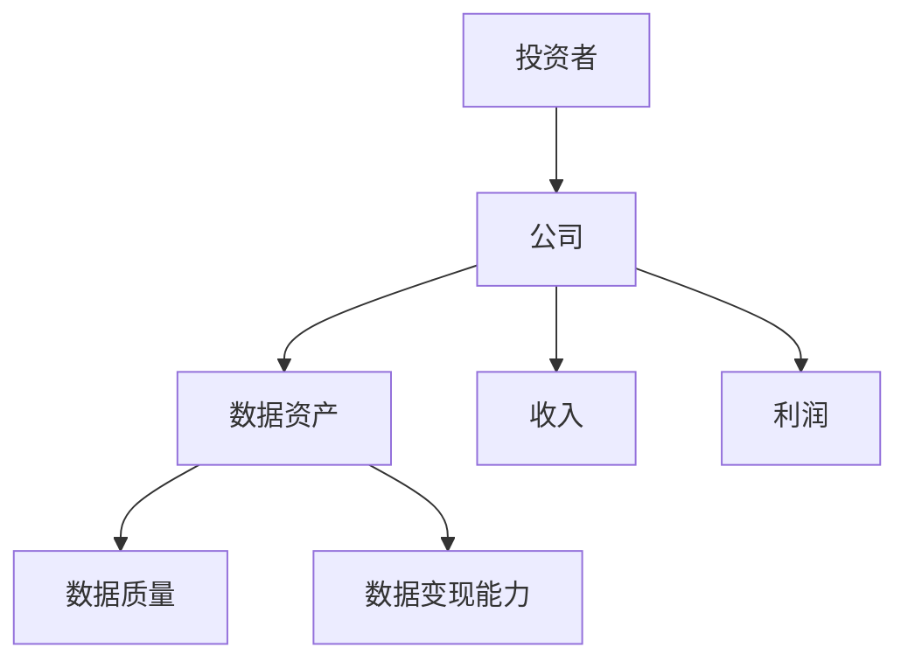
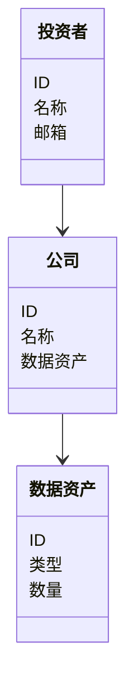
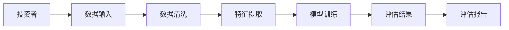
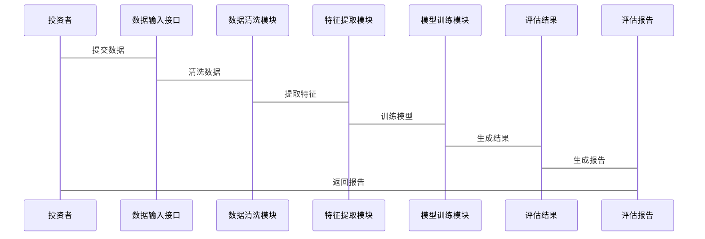

                 


# AI agents辅助价值投资者评估公司的数据变现能力

> 关键词：AI代理，数据变现，价值投资者，数据评估，投资决策，算法模型，技术应用

> 摘要：本文详细探讨了AI代理如何辅助价值投资者评估公司的数据变现能力。通过分析数据变现的核心要素、AI代理的技术原理、算法实现，以及系统架构设计，本文为投资者提供了从理论到实践的全面指导。结合实际案例和最佳实践，本文旨在帮助投资者利用AI技术提升数据驱动的决策能力。

---

## 目录大纲

1. 背景介绍
2. 核心概念与联系
3. 算法原理讲解
4. 系统分析与架构设计
5. 项目实战
6. 最佳实践
7. 总结与展望

---

## 正文

### 第一部分：背景介绍

#### 1.1 问题背景与重要性

数据是企业最重要的资产之一，尤其是在数字化转型的今天，数据变现能力已成为企业价值评估的重要指标。对于价值投资者而言，准确评估公司的数据变现能力能够帮助他们在投资决策中做出更明智的选择。然而，传统的数据分析方法往往依赖于人工经验和复杂的手工分析，效率低下且容易受到主观因素的影响。

AI代理作为一种新兴的技术手段，能够通过自动化学习和分析，帮助投资者快速、准确地评估公司的数据变现能力。这不仅提高了评估的效率，还能够发现传统方法难以察觉的潜在价值点。

#### 1.2 问题描述

在实际投资过程中，价值投资者需要评估多个维度的数据，包括收入来源、成本结构、市场竞争力等。然而，如何量化这些因素并将其与数据变现能力相关联，一直是投资者面临的难题。传统的数据分析方法依赖于大量的人工劳动，且容易受到主观因素的影响，难以保证结果的客观性和准确性。

#### 1.3 问题解决

AI代理通过自动化学习和分析，能够快速处理大量数据，并利用机器学习算法进行预测和评估。这不仅提高了评估的效率，还能够发现传统方法难以察觉的潜在价值点。AI代理的应用能够帮助投资者更准确地评估公司的数据变现能力，从而做出更明智的投资决策。

#### 1.4 边界与外延

数据变现能力的评估范围通常包括数据资产的价值、数据的应用场景、数据的收益能力等。AI代理的应用边界主要在于数据的质量和完整性，以及模型的训练数据是否能够覆盖评估所需的所有维度。与传统数据分析方法相比，AI代理的优势在于其自动化和智能化，能够处理更复杂的数据关系。

#### 1.5 核心概念结构

数据变现能力的评估模型由多个核心要素组成，包括数据资产、收入、利润、数据质量等。AI代理通过分析这些要素之间的关系，能够帮助投资者更好地理解数据的价值。

---

### 第二部分：核心概念与联系

#### 2.1 核心概念原理

AI代理的核心原理是通过机器学习算法对数据进行分析和预测。数据变现能力的评估模型通常包括数据清洗、特征提取、模型训练等步骤。通过这些步骤，AI代理能够生成准确的评估结果，并帮助投资者做出决策。

#### 2.2 概念属性对比

表2-1：AI代理与传统数据分析方法的对比

| 对比维度 | AI代理 | 传统数据分析 |
|----------|---------|--------------|
| 数据处理 | 自动化处理 | 手工处理     |
| 分析效率 | 高效     | 低效         |
| 结果准确性 | 高       | 中等         |
| 适用场景 | 复杂场景 | 简单场景     |

#### 2.3 ER实体关系图



---

### 第三部分：算法原理讲解

#### 3.1 数据预处理

数据预处理是AI代理分析的基础步骤，包括数据清洗和特征提取。

##### 3.1.1 数据清洗

数据清洗的目标是去除噪声数据和异常值，确保数据的完整性和一致性。例如，可以通过删除缺失值、处理重复数据等方法来实现。

##### 3.1.2 特征提取

特征提取是从原始数据中提取具有代表性的特征，以便更好地训练模型。例如，可以使用主成分分析（PCA）等方法来降维。

#### 3.2 模型训练

模型训练是AI代理的核心步骤，通常使用机器学习算法进行。

##### 3.2.1 算法选择

常用的算法包括线性回归、随机森林、神经网络等。选择合适的算法需要根据具体的数据特征和评估目标。

##### 3.2.2 模型训练

以线性回归为例，模型的目标是最小化预测值与实际值之间的平方差之和。

$$ \text{损失函数} = \sum_{i=1}^{n} (y_i - \hat{y}_i)^2 $$

其中，$y_i$ 是实际值，$\hat{y}_i$ 是预测值。

##### 3.2.3 模型评估

模型评估通常通过交叉验证等方法进行，以确保模型的泛化能力。

---

### 第四部分：系统分析与架构设计

#### 4.1 问题场景介绍

本系统旨在帮助价值投资者评估公司的数据变现能力。系统需要处理大量数据，并利用AI代理生成评估结果。

#### 4.2 系统功能设计

系统功能模块包括数据收集、数据分析、评估报告生成等。

##### 4.2.1 领域模型



##### 4.2.2 系统架构



##### 4.2.3 系统接口设计

系统接口包括数据输入接口、模型训练接口和结果输出接口。

#### 4.3 系统交互设计



---

### 第五部分：项目实战

#### 5.1 环境安装

安装Python和相关库（如pandas、scikit-learn）。

#### 5.2 核心代码实现

##### 数据清洗代码

```python
import pandas as pd

# 读取数据
df = pd.read_csv('data.csv')

# 删除缺失值
df.dropna(inplace=True)

# 处理重复数据
df.drop_duplicates(inplace=True)
```

##### 特征提取代码

```python
from sklearn.decomposition import PCA

# 初始化PCA模型
pca = PCA(n_components=2)

# 提取主成分
principal_components = pca.fit_transform(df)
```

##### 模型训练代码

```python
from sklearn.linear_model import LinearRegression

# 初始化模型
model = LinearRegression()

# 训练模型
model.fit(principal_components, target)
```

##### 评估报告生成代码

```python
import numpy as np

# 预测结果
predictions = model.predict(new_data)

# 计算误差
error = np.mean(abs(predictions - actual_values))
```

#### 5.3 案例分析

以某科技公司为例，通过上述代码生成数据清洗、特征提取、模型训练和评估结果，最终生成评估报告。

---

### 第六部分：最佳实践

#### 6.1 小结

AI代理通过自动化学习和分析，能够帮助投资者快速、准确地评估公司的数据变现能力。本文详细介绍了AI代理的核心概念、算法实现和系统架构设计，并通过实际案例展示了其应用价值。

#### 6.2 注意事项

- 数据的质量和完整性直接影响评估结果。
- 模型的选择和调优需要根据具体场景进行。

#### 6.3 拓展阅读

- 《机器学习实战》
- 《数据挖掘导论》
- 《投资学原理》

---

## 结论

AI代理的应用为价值投资者提供了强大的工具，能够帮助他们更准确地评估公司的数据变现能力。通过本文的介绍，读者可以深入了解AI代理的技术原理和实际应用，并能够通过实际项目进一步提升自己的技能。

---

## 作者

作者：AI天才研究院/AI Genius Institute & 禅与计算机程序设计艺术 /Zen And The Art of Computer Programming

