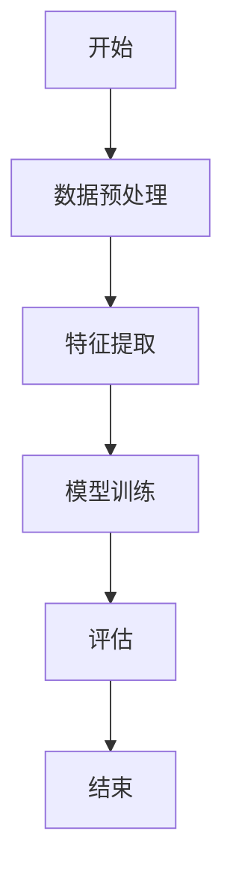
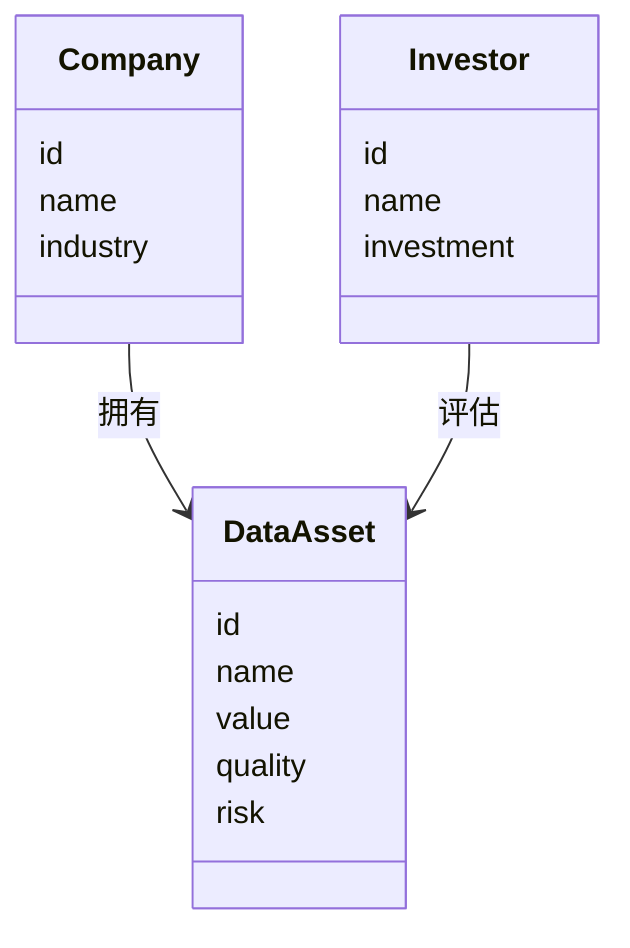

                 


# AI代理辅助价值投资者评估公司的数据资产价值

> 关键词：AI代理，价值投资，数据资产，资产评估，算法原理

> 摘要：本文探讨了AI代理如何辅助价值投资者评估公司的数据资产价值。通过分析数据资产的重要性、价值投资的核心概念，以及AI代理在数据资产评估中的应用，本文详细介绍了算法原理、系统架构设计、项目实战等内容，为读者提供全面的指导和见解。

---

# 第1章：背景介绍

## 1.1 问题背景

### 1.1.1 数据资产的重要性
数据资产是企业的重要资源，其价值体现在驱动业务决策和创新。随着数字化转型的推进，数据已成为企业的核心竞争力。

### 1.1.2 价值投资者的需求
价值投资者注重长期收益，依赖于对公司基本面的深入分析。数据资产的价值评估成为他们决策的关键因素。

### 1.1.3 数据驱动决策的时代需求
在大数据时代，数据驱动的决策越来越重要。价值投资者需要更高效、精准的工具来评估数据资产的价值。

## 1.2 问题描述

### 1.2.1 数据资产评估的难点
数据资产评估涉及复杂因素，如数据的质量、隐私保护和可访问性，传统方法难以全面评估。

### 1.2.2 传统价值评估方法的局限性
传统方法依赖人工分析，耗时且容易受主观因素影响，难以应对海量数据的挑战。

### 1.2.3 AI代理在数据资产评估中的潜力
AI代理能够快速处理大量数据，提供客观的评估结果，帮助价值投资者做出更明智的决策。

## 1.3 问题解决

### 1.3.1 AI代理如何辅助数据资产评估
AI代理通过分析数据特征，提供资产评估建议，优化投资决策。

### 1.3.2 价值投资者的需求与AI代理的结合
价值投资者需要精准的数据评估，AI代理提供高效工具，满足其需求。

### 1.3.3 数据资产评估的标准化流程
制定标准化流程，确保评估过程的客观性和一致性。

## 1.4 边界与外延

### 1.4.1 数据资产评估的边界
明确评估范围，避免超出实际能力。

### 1.4.2 价值投资的外延
价值投资不仅关注财务指标，还考虑数据资产的影响。

### 1.4.3 AI代理的应用范围与限制
AI代理适用于数据密集型任务，但在复杂决策中仍需人类判断。

## 1.5 核心要素组成

### 1.5.1 数据资产的核心要素
包括数据质量、可用性、价值和风险。

### 1.5.2 价值投资的核心要素
关注企业财务状况、行业地位和管理能力。

### 1.5.3 AI代理的核心功能
数据处理、分析和评估建议。

---

# 第2章：核心概念与联系

## 2.1 AI代理的基本概念

### 2.1.1 AI代理的定义
AI代理是智能系统，能感知环境并执行任务。

### 2.1.2 AI代理的分类
分为简单和复杂代理，基于任务需求。

### 2.1.3 AI代理的核心功能
数据处理、学习和决策制定。

## 2.2 价值投资的基本概念

### 2.2.1 价值投资的定义
寻找被市场低估的投资标的，长期持有。

### 2.2.2 价值投资的策略
关注低估值、高分红和稳健增长。

### 2.2.3 价值投资的关键要素
企业基本面、管理能力和行业前景。

## 2.3 数据资产评估的基本概念

### 2.3.1 数据资产的定义
企业拥有的数据资源，可为企业创造价值。

### 2.3.2 数据资产评估的目的
量化数据价值，辅助决策。

### 2.3.3 数据资产评估的挑战
复杂性、动态性和隐私保护。

## 2.4 核心概念对比

| 比较维度 | AI代理 | 价值投资 | 数据资产评估 |
|----------|--------|----------|--------------|
| 目标 | 执行任务 | 寻找低估投资 | 量化数据价值 |
| 方法 | 数据驱动 | 基于财务指标 | 多维度分析 |
| 工具 | AI算法 | 财务模型 | 评估指标 |

## 2.5 ER实体关系图

```mermaid
erDiagram
    company {
        id
        name
        industry
    }
    data_asset {
        id
        name
        value
        quality
        risk
    }
    investor {
        id
        name
        investment
    }
    company --> data_asset : 拥有
    investor --> data_asset : 评估
```

---

# 第3章：算法原理

## 3.1 算法原理概述

### 3.1.1 强化学习简介
通过试错优化策略，适用于复杂决策问题。

### 3.1.2 自然语言处理
解析文本信息，提取关键数据特征。

## 3.2 算法实现流程



## 3.3 核心算法实现

### 3.3.1 Q-learning算法

```python
import numpy as np
from collections import deque

class QLearning:
    def __init__(self, state_space, action_space):
        self.state_space = state_space
        self.action_space = action_space
        self.gamma = 0.9
        self.alpha = 0.1
        self.q_table = np.zeros((state_space, action_space))

    def choose_action(self, state):
        return np.argmax(self.q_table[state])

    def update_q_table(self, state, action, reward):
        self.q_table[state, action] = reward + self.gamma * max(self.q_table[state])
```

### 3.3.2 数据特征提取

```python
def extract_features(data):
    features = []
    for d in data:
        features.append([d['quality'], d['risk']])
    return features
```

### 3.3.3 算法应用示例

$$Q(s,a) = r + \gamma \max Q(s')$$

---

# 第4章：系统分析与架构设计

## 4.1 系统场景介绍

### 4.1.1 问题场景
投资者使用AI代理评估数据资产，优化投资决策。

## 4.2 系统功能设计

### 4.2.1 领域模型



### 4.2.2 系统架构

```mermaid
container 容器 {
    组件1
    组件2
}
```

## 4.3 系统接口设计

### 4.3.1 接口定义
RESTful API，提供数据处理和评估功能。

### 4.3.2 接口交互

```mermaid
sequenceDiagram
    投资者 -> 系统: 请求评估
    系统 -> 数据层: 获取数据
    数据层 -> 算法层: 分析数据
    算法层 -> 系统: 返回结果
    投资者 <- 系统: 结果
```

---

# 第5章：项目实战

## 5.1 环境安装

### 5.1.1 安装Python
安装最新版本的Python，确保兼容性。

### 5.1.2 安装依赖
使用pip安装numpy、pandas和scikit-learn。

## 5.2 核心代码实现

### 5.2.1 数据预处理

```python
import pandas as pd

def preprocess_data(data):
    df = pd.DataFrame(data)
    df = df.dropna()
    return df
```

### 5.2.2 模型训练

```python
from sklearn.tree import DecisionTreeRegressor

def train_model(X, y):
    model = DecisionTreeRegressor()
    model.fit(X, y)
    return model
```

### 5.2.3 评估报告生成

```python
def generate_report(model, data):
    report = []
    for d in data:
        prediction = model.predict([d])
        report.append({'input': d, 'prediction': prediction[0]})
    return report
```

## 5.3 实际案例分析

### 5.3.1 案例介绍
评估某科技公司数据资产，辅助投资决策。

### 5.3.2 数据分析
提取数据特征，训练模型，生成评估报告。

## 5.4 总结与经验

### 5.4.1 项目总结
成功实现了AI代理辅助评估，提高了效率和准确性。

### 5.4.2 经验教训
数据质量影响评估结果，需加强数据清洗。

---

# 第6章：总结与展望

## 6.1 最佳实践

### 6.1.1 工具使用
选择合适的AI工具，提升效率。

### 6.1.2 数据管理
确保数据安全和隐私保护。

## 6.2 小结
AI代理为价值投资者提供了高效的数据评估工具，助力投资决策。

## 6.3 注意事项

### 6.3.1 数据隐私
遵守相关法律法规，保护数据隐私。

### 6.3.2 模型局限
AI代理无法完全替代人类判断，需结合实际情况使用。

## 6.4 拓展阅读

### 6.4.1 推荐书籍
《人工智能：一种现代方法》

### 6.4.2 推荐博客
技术博客链接

---

作者：AI天才研究院

