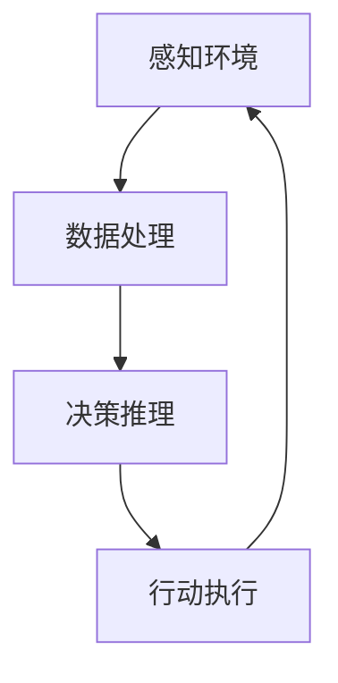
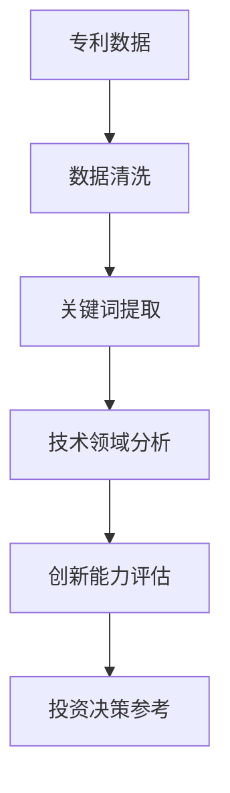
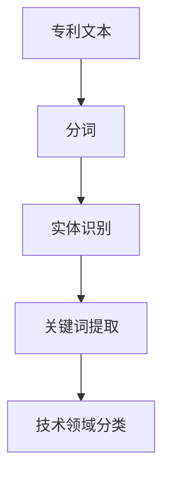
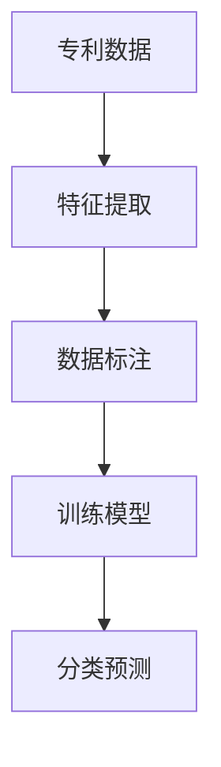
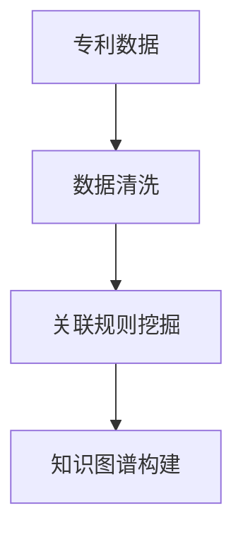
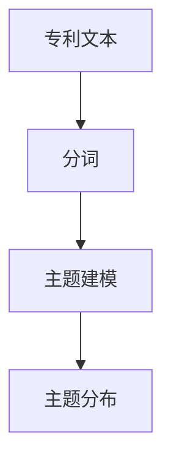
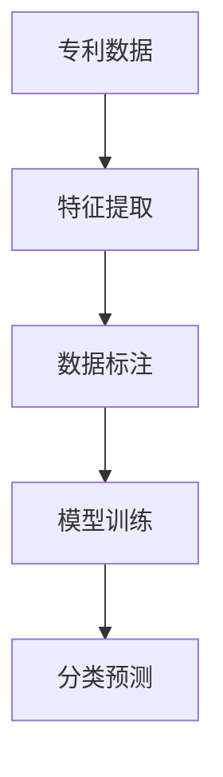
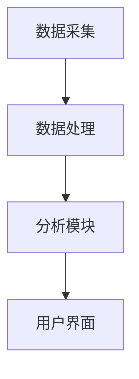
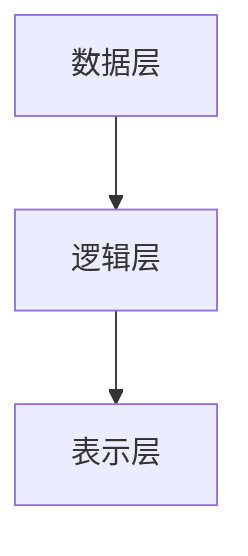
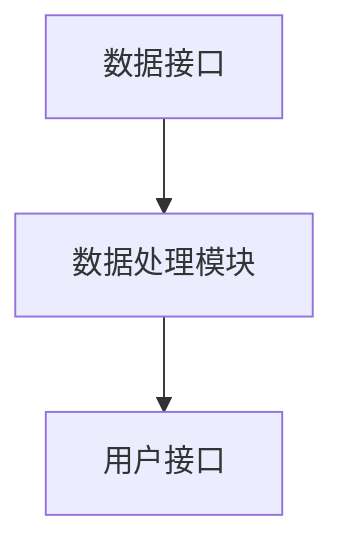

                 


# AI agents辅助价值投资者进行专利分析

## 关键词：AI agents, 价值投资, 专利分析, 自然语言处理, 机器学习, 数据挖掘, 知识图谱

## 摘要：  
随着人工智能技术的快速发展，AI agents在金融领域的应用越来越广泛。本文探讨了AI agents如何辅助价值投资者进行专利分析，揭示了专利分析在价值投资中的重要性，以及AI技术如何提升专利分析的效率和准确性。通过结合自然语言处理、机器学习和数据挖掘等技术，AI agents能够从海量专利数据中提取有价值的信息，帮助投资者识别具有创新潜力的公司。本文还详细介绍了AI agents辅助专利分析的核心算法、系统架构和实际案例，为读者提供了一个全面的技术视角。

---

# 第1章：AI agents与价值投资概述

## 1.1 AI agents的基本概念  
AI agents（智能代理）是指能够感知环境并采取行动以实现目标的智能系统。它们可以是软件程序，也可以是物理设备，通过感知和行动的循环来优化任务执行效率。在金融领域，AI agents通常用于数据挖掘、模式识别和自动化交易等场景。

**表1-1：AI agents的分类与特点**  

| 分类标准       | 类型             | 特点描述                                         |
|----------------|------------------|------------------------------------------------|
| 行为模式       | 基于规则的代理   | 通过预定义的规则执行任务，适用于简单场景       |
|                | 基于模型的代理   | 基于机器学习模型进行决策，适用于复杂场景       |
|                | 混合型代理       | 结合规则和模型的代理，适用于复杂且需要灵活性的场景 |

**图1-1：AI agents的核心特征**  


## 1.2 价值投资的基本原理  
价值投资是一种投资策略，核心在于通过分析企业的基本面（如财务状况、盈利能力、市场地位等）来识别被市场低估的投资标的。专利分析作为企业创新能力的重要指标，是价值投资者评估企业潜力的关键因素之一。

**表1-2：价值投资的关键指标**  

| 指标类别       | 具体指标         | 描述                                         |
|----------------|------------------|----------------------------------------------|
| 财务指标       | 净利润、ROE      | 反映企业的盈利能力                           |
| 市场地位       | 市场份额、行业排名 | 反映企业在行业中的竞争地位                 |
| 创新能力       | 专利数量、技术领域分布 | 反映企业的技术储备和创新能力                 |

## 1.3 AI agents与专利分析的结合  
AI agents可以通过自然语言处理（NLP）和机器学习技术，从海量专利数据中提取有价值的信息，帮助价值投资者快速识别具有创新潜力的企业。例如，AI agents可以自动分析专利的关键词、技术领域分布和申请趋势，从而为企业创新能力提供量化评估。

**图1-2：AI agents辅助专利分析的流程图**  


---

# 第2章：专利分析的AI技术基础  

## 2.1 自然语言处理（NLP）在专利分析中的应用  
NLP技术可以用于专利文本的分词、实体识别和情感分析。例如，通过分词技术，AI agents可以将专利文本分解为关键词和短语，进而提取技术领域的分布信息。

**图2-1：NLP在专利分析中的应用流程图**  


**代码示例：基于TF-IDF的关键词提取**  
```python
from sklearn.feature_extraction.text import TfidfVectorizer

# 示例专利文本
text = "一种基于深度学习的图像识别方法，涉及卷积神经网络和数据增强技术。"

# 初始化TF-IDF模型
vectorizer = TfidfVectorizer()
tfidf = vectorizer.fit_transform([text])

# 输出关键词
keywords = vectorizer.get_feature_names_out()[tfidf[0].indices]
print(keywords)
```

## 2.2 机器学习在专利分析中的应用  
机器学习算法可以用于专利分类和聚类。例如，通过支持向量机（SVM）算法，AI agents可以将专利分为不同的技术领域，从而帮助企业识别技术趋势。

**图2-2：机器学习在专利分类中的应用流程图**  


**代码示例：基于SVM的专利分类**  
```python
from sklearn import svm

# 示例特征向量
X = [[0.1, 0.2], [0.3, 0.4], [0.5, 0.6]]
y = [0, 1, 0]

# 初始化SVM模型
model = svm.SVC()
model.fit(X, y)

# 预测新样本
new_sample = [[0.2, 0.3]]
print(model.predict(new_sample))
```

## 2.3 数据挖掘与知识图谱构建  
数据挖掘技术可以帮助识别专利之间的关联性，例如通过关联规则挖掘发现技术组合的趋势。知识图谱则可以将专利数据结构化，便于后续分析和可视化。

**图2-3：数据挖掘在专利分析中的应用流程图**  


---

# 第3章：AI agents辅助专利分析的算法与模型  

## 3.1 基于NLP的专利文本分析算法  
NLP算法可以帮助提取专利文本中的技术关键词和创新点。例如，通过主题模型（如LDA）可以识别专利文本中的主题分布。

**图3-1：主题模型在专利分析中的应用流程图**  


**代码示例：基于LDA的主题建模**  
```python
from sklearn.decomposition import LatentDirichletAllocation

# 示例文本数据
text_data = ["This is a sample text about AI technology.",
             "AI technology involves machine learning and deep learning."]

# 初始化LDA模型
lda = LatentDirichletAllocation(n_components=2)
lda.fit(text_data)

# 输出主题分布
print(lda.components_)
```

## 3.2 基于机器学习的专利分类模型  
机器学习模型可以用于专利分类和预测。例如，通过随机森林算法可以预测专利的生命周期和价值。

**图3-2：随机森林在专利分类中的应用流程图**  


**代码示例：基于随机森林的专利分类**  
```python
from sklearn.ensemble import RandomForestClassifier

# 示例特征向量
X = [[0.1, 0.2], [0.3, 0.4], [0.5, 0.6]]
y = [0, 1, 0]

# 初始化随机森林模型
model = RandomForestClassifier(n_estimators=3)
model.fit(X, y)

# 预测新样本
new_sample = [[0.2, 0.3]]
print(model.predict(new_sample))
```

---

# 第4章：系统设计与架构方案  

## 4.1 系统功能设计  
AI agents辅助专利分析的系统可以分为以下几个模块：  
1. 数据采集模块：从专利数据库中获取专利数据。  
2. 数据处理模块：对专利数据进行清洗和预处理。  
3. 分析模块：基于NLP和机器学习技术进行专利分析。  
4. 用户界面模块：展示分析结果并提供交互功能。

**图4-1：系统功能模块图**  


## 4.2 系统架构设计  
系统架构采用分层设计，包括数据层、逻辑层和表示层。数据层负责存储和管理专利数据，逻辑层负责数据处理和分析，表示层负责展示结果。

**图4-2：系统架构设计图**  


## 4.3 系统接口设计  
系统接口包括数据接口和用户接口。数据接口用于与专利数据库对接，用户接口用于与投资者交互。

**图4-3：系统接口设计图**  


---

# 第5章：项目实战  

## 5.1 项目环境与数据准备  
首先，需要安装必要的Python库，如`scikit-learn`、`nltk`和`pandas`。然后，获取专利数据并进行清洗和预处理。

**代码示例：数据清洗与预处理**  
```python
import pandas as pd
from sklearn.feature_extraction.text import TfidfVectorizer

# 读取专利数据
data = pd.read_csv('patents.csv')

# 初始化TF-IDF模型
vectorizer = TfidfVectorizer()
tfidf = vectorizer.fit_transform(data['text'])

# 保存特征向量
pd.DataFrame(tfidf.toarray(), columns=vectorizer.get_feature_names_out()).to_csv('tfidf.csv')
```

## 5.2 项目实现与代码解读  
通过实现一个简单的专利分类系统，展示AI agents在专利分析中的应用。

**代码示例：专利分类系统实现**  
```python
from sklearn.naive_bayes import MultinomialNB
from sklearn.metrics import accuracy_score

# 加载数据
data = pd.read_csv('patents.csv')
X = data['tfidf'].values
y = data['label'].values

# 初始化模型
model = MultinomialNB()
model.fit(X, y)

# 验证模型
new_data = pd.read_csv('new_patents.csv')
new_X = new_data['tfidf'].values
new_y = model.predict(new_X)
print(accuracy_score(new_y, new_data['label'].values))
```

## 5.3 实际案例分析  
通过一个实际案例，展示AI agents如何辅助投资者进行专利分析。

**案例分析：某科技公司的专利分析**  
假设某科技公司申请了大量人工智能相关的专利，AI agents可以通过分析这些专利的关键词和分类，评估其技术优势和市场潜力。

---

# 第6章：高级策略与最佳实践  

## 6.1 高级策略  
在实际应用中，可以结合多种技术（如深度学习和知识图谱）来提升专利分析的准确性。

## 6.2 最佳实践 tips  
- 定期更新模型以适应技术变化。  
- 结合多种数据源进行综合分析。  
- 注意数据隐私和合规性问题。  

## 6.3 小结  
通过AI agents辅助专利分析，投资者可以更高效地识别具有创新潜力的企业，从而做出更明智的投资决策。

---

# 结语  
AI agents在专利分析中的应用为价值投资者提供了强大的工具，帮助他们在复杂多变的市场中找到投资机会。未来，随着技术的进步，AI agents在金融领域的应用将更加广泛和深入。

---

# 作者：AI天才研究院 & 禅与计算机程序设计艺术  
本文版权归作者所有，转载请注明出处。

