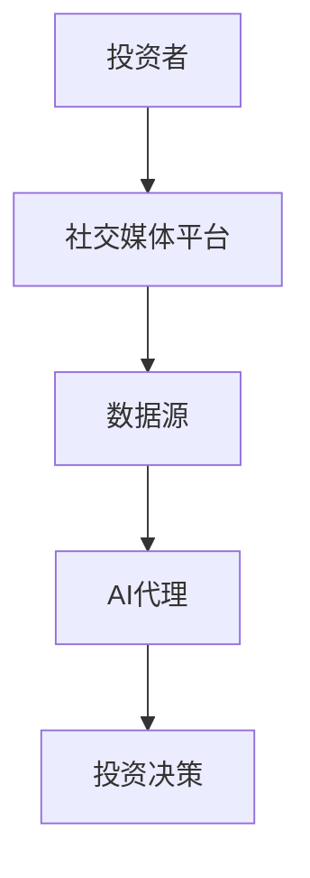

                 


# AI agents辅助价值投资者进行社交媒体分析

> 关键词：AI代理，价值投资，社交媒体分析，情感分析，主题分类，趋势预测

> 摘要：本文探讨了如何利用AI代理辅助价值投资者进行社交媒体分析，结合大语言模型和机器学习技术，分析社交媒体数据，帮助投资者做出更明智的投资决策。

---

## 第一部分: AI代理与价值投资概述

### 第1章: AI代理与价值投资的背景

#### 1.1 AI代理的基本概念
- **AI代理的定义与特点**  
  AI代理是一种能够感知环境并采取行动以实现目标的智能体。它具有自主性、反应性、目标导向性和社会性等特征。
- **AI代理的核心原理**  
  AI代理通过感知输入数据，利用算法进行分析和决策，输出行动指令。其核心在于数据处理能力、算法模型和决策机制的优化。

- **价值投资的基本概念与策略**  
  价值投资是一种长期投资策略，强调通过分析企业基本面，寻找被市场低估的投资标的。其核心在于对企业内在价值的评估。

#### 1.2 社交媒体分析的现状
- **社交媒体在金融分析中的作用**  
  社交媒体数据反映了市场情绪和投资者 sentiment，为金融分析提供了新的数据源。
- **当前社交媒体分析的主要方法**  
  主要包括文本挖掘、情感分析、主题分类等技术，但传统方法在处理复杂数据和实时分析方面存在局限性。
- **价值投资者面临的挑战与机遇**  
  价值投资者需要从海量社交媒体数据中提取有用信息，以辅助投资决策。社交媒体分析为其提供了新的数据来源和分析工具。

#### 1.3 AI代理辅助价值投资的必要性
- **传统价值投资的局限性**  
  传统方法依赖于人工分析，效率低、覆盖面有限，难以应对海量数据。
- **AI代理在投资决策中的优势**  
  AI代理能够快速处理海量数据，发现潜在投资机会，提供实时市场动态。
- **结合社交媒体分析的价值投资新范式**  
  通过AI代理对社交媒体数据的实时分析，价值投资者可以更精准地把握市场情绪，优化投资策略。

---

## 第二部分: AI代理与社交媒体分析的核心概念

### 第2章: AI代理的核心原理

#### 2.1 AI代理的基本原理
- **代理的定义与分类**  
  AI代理可以分为反应式代理和基于模型的代理。反应式代理实时感知环境并采取行动；基于模型的代理则通过构建环境模型来辅助决策。
- **基于大模型的代理实现**  
  大模型（如GPT系列）通过预训练和微调，能够处理复杂语言任务，实现自然语言理解与生成。
- **代理的决策机制与学习方法**  
  AI代理通过监督学习、强化学习等方法，不断优化决策模型，提升分析精度。

#### 2.2 社交媒体分析的核心技术
- **文本挖掘与情感分析**  
  通过自然语言处理技术，识别文本中的情感倾向，判断市场情绪。
- **实体识别与主题分类**  
  识别文本中的实体（如公司、人物）并进行主题分类，帮助投资者关注特定领域动态。
- **时间序列分析与趋势预测**  
  利用时间序列模型预测市场趋势，辅助投资决策。

#### 2.3 AI代理与社交媒体分析的结合
- **代理如何处理社交媒体数据**  
  AI代理通过数据清洗、特征提取和模型训练，对社交媒体数据进行分析。
- **代理如何辅助投资决策**  
  通过实时监控市场情绪、识别行业趋势，代理为投资者提供实时反馈和决策支持。
- **代理在社交媒体分析中的优势**  
  高效性、准确性、实时性，能够处理海量数据并快速生成分析结果。

#### 2.4 核心概念对比表格
| **技术**         | **特点**                     | **应用场景**               |
|------------------|------------------------------|---------------------------|
| 情感分析         | 判断文本情感倾向             | 市场情绪分析               |
| 实体识别         | 识别文本中的实体             | 监控特定公司动态           |
| 主题分类         | 分类文本主题                 | 行业趋势分析               |
| 时间序列分析     | 预测未来趋势                 | 市场趋势预测               |

#### 2.5 ER实体关系图


---

## 第三部分: AI代理辅助社交媒体分析的算法原理

### 第3章: AI代理的算法实现

#### 3.1 情感分析算法
- **情感分析流程**  
  数据清洗 → 特征提取 → 模型训练 → 情感预测。
- **情感分析的数学模型**  
  使用逻辑回归或支持向量机（SVM）进行分类。
  $$ P(y=1|x) = \frac{e^{w \cdot x + b}}{1 + e^{w \cdot x + b}} $$
  其中，$w$ 是权重向量，$x$ 是输入特征，$b$ 是偏置项。
- **情感分析的Mermaid流程图**  
  ```mermaid
  graph TD
      A[数据清洗] --> B[特征提取]
      B --> C[模型训练]
      C --> D[情感预测]
  ```

#### 3.2 主题分类算法
- **主题分类的实现步骤**  
  数据预处理 → 特征工程 → 模型训练 → 主题分类。
- **主题分类的数学模型**  
  使用朴素贝叶斯或随机森林进行分类。
  $$ P(y=c|x) = \prod_{i=1}^{n} P(x_i|y=c) \cdot P(y=c) $$
  其中，$x_i$ 是输入特征，$c$ 是类别。
- **主题分类的Mermaid流程图**  
  ```mermaid
  graph TD
      A[数据预处理] --> B[特征工程]
      B --> C[模型训练]
      C --> D[主题分类]
  ```

#### 3.3 趋势预测算法
- **时间序列分析的基本原理**  
  利用历史数据预测未来趋势，常用ARIMA或LSTM模型。
- **趋势预测的数学模型**  
  使用LSTM进行时间序列预测：
  $$ h_t = \tanh(W_{h}x_t + U_{h}h_{t-1} + b_h) $$
  $$ c_t = \tanh(W_{c}x_t + U_{c}c_{t-1} + b_c) $$
  $$ o_t = \tanh(W_{o}x_t + U_{o}o_{t-1} + b_o) $$
- **趋势预测的Mermaid流程图**  
  ```mermaid
  graph TD
      A[数据输入] --> B[特征提取]
      B --> C[模型训练]
      C --> D[趋势预测]
  ```

#### 3.4 算法实现的Python代码示例
- **情感分析模型训练代码**
  ```python
  import pandas as pd
  from sklearn.model import SVC

  # 数据加载与预处理
  data = pd.read_csv('sentiment_data.csv')
  X = data['text'].values
  y = data['label'].values

  # 特征提取
  from sklearn.feature_extraction.text import TfidfVectorizer
  vectorizer = TfidfVectorizer()
  X_vec = vectorizer.fit_transform(X)

  # 模型训练
  model = SVC()
  model.fit(X_vec, y)

  # 模型预测
  test_text = ["This company is doing great!"]
  test_vec = vectorizer.transform(test_text)
  print("Predicted label:", model.predict(test_vec)[0])
  ```

---

## 第四部分: 系统架构与设计

### 第4章: 系统架构设计方案

#### 4.1 问题场景介绍
- **价值投资者的社交媒体分析需求**  
  投资者需要实时监控市场情绪、行业趋势和公司动态。
- **系统需要解决的主要问题**  
  如何高效处理海量社交媒体数据，提供实时分析结果。
- **系统的目标与范围**  
  开发一个基于AI代理的社交媒体分析系统，辅助价值投资者做出投资决策。

#### 4.2 系统功能设计
- **功能模块**  
  数据采集模块、数据处理模块、模型训练模块、结果展示模块。
- **系统架构设计**  
  ```mermaid
  graph TD
      A[数据采集] --> B[数据处理]
      B --> C[模型训练]
      C --> D[结果展示]
  ```

#### 4.3 系统交互设计
- **用户交互流程**  
  用户输入查询关键词 → 系统展示相关社交媒体数据 → 提供情感分析和主题分类结果 → 输出投资建议。
- **系统交互序列图**  
  ```mermaid
  graph TD
      U[user] --> S[系统输入]
      S --> D[数据处理]
      D --> M[模型分析]
      M --> U[user]
  ```

#### 4.4 系统接口设计
- **API接口**  
  提供RESTful API，供投资者调用社交媒体分析结果。
- **数据接口**  
  与社交媒体平台API对接，实时获取数据。

---

## 第五部分: 项目实战与总结

### 第5章: 项目实战

#### 5.1 项目环境安装
- **安装Python环境**  
  使用Anaconda或virtualenv创建虚拟环境。
- **安装依赖库**  
  安装pandas、numpy、scikit-learn、transformers等库。

#### 5.2 系统核心实现源代码
- **数据清洗代码**
  ```python
  import pandas as pd
  import re

  def clean_text(text):
      text = re.sub(r'[^\w\s]', '', text)
      return text.lower()

  data['clean_text'] = data['text'].apply(clean_text)
  ```

- **特征提取代码**
  ```python
  from transformers import AutoTokenizer, AutoModel

  tokenizer = AutoTokenizer.from_pretrained('bert-base-uncased')
  model = AutoModel.from_pretrained('bert-base-uncased')

  def extract_features(text):
      inputs = tokenizer(text, return_tensors='np')
      outputs = model(**inputs)
      return outputs.last_hidden_state.numpy().mean(axis=1)
  ```

- **模型训练代码**
  ```python
  from sklearn.model import SVC

  X = data['clean_text'].apply(extract_features).values
  y = data['label'].values

  model = SVC()
  model.fit(X, y)
  ```

#### 5.3 实际案例分析
- **案例背景**  
  假设分析某科技公司社交媒体数据，判断市场情绪。
- **分析过程**  
  数据清洗 → 特征提取 → 模型预测 → 输出情感分析结果。
- **结果解读**  
  情感分析结果显示市场情绪偏向积极，可能影响投资决策。

#### 5.4 项目小结
- **项目实现的难点**  
  数据清洗和特征提取过程复杂，需要处理大量非结构化数据。
- **项目实现的关键点**  
  选择合适的模型和算法，确保分析结果的准确性和实时性。

---

## 第六部分: 总结与展望

### 第6章: 总结与展望

#### 6.1 最佳实践 tips
- **数据质量管理**  
  确保数据来源可靠，清洗过程细致。
- **模型优化**  
  定期更新模型，适应市场变化。
- **用户体验优化**  
  提供直观的可视化界面，便于投资者理解和使用。

#### 6.2 小结
本文详细介绍了AI代理在社交媒体分析中的应用，从理论到实践，全面探讨了如何利用AI技术辅助价值投资者做出更明智的投资决策。

#### 6.3 注意事项
- 数据隐私问题：确保处理数据符合相关法律法规。
- 模型局限性：AI分析结果仅供参考，不能完全替代人工判断。

#### 6.4 拓展阅读
- 《机器学习实战》
- 《自然语言处理入门》
- 《投资学基础》

---

## 作者：AI天才研究院 & 禅与计算机程序设计艺术

---

**结束语**：通过本文的详细探讨，读者可以了解到AI代理在社交媒体分析中的强大能力，以及如何将其应用于价值投资领域。未来，随着技术的进步，AI代理将为金融分析带来更多的创新和突破。

