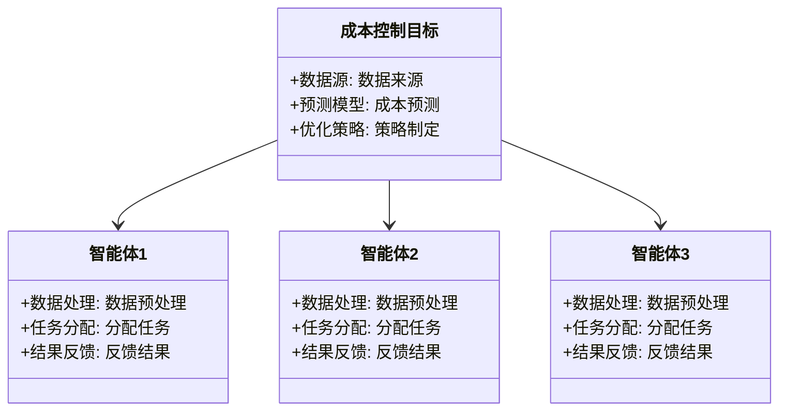
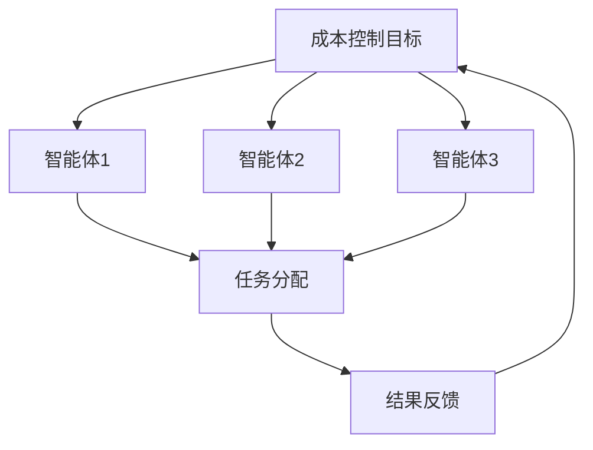

                 


# AI优化的约翰·伯格成本控制策略：多智能体协作

> 关键词：AI优化，约翰·伯格成本控制策略，多智能体协作，算法原理，系统架构，项目实战

> 摘要：本文将探讨如何利用AI技术，特别是通过多智能体协作的方法，优化约翰·伯格成本控制策略。文章从背景介绍、核心概念、算法原理、系统架构到项目实战，详细阐述了AI在成本控制中的应用，展示了如何通过多智能体协作实现更高效的成本优化。

---

# 第1章: 背景介绍

## 1.1 问题背景与描述
### 1.1.1 成本控制在企业管理中的重要性
在现代企业管理中，成本控制是实现利润最大化的重要手段。企业通过优化成本结构，可以提高竞争力，增强市场应对能力。传统的成本控制方法依赖于人工分析和经验判断，存在效率低下、精度不足的问题。

### 1.1.2 约翰·伯格成本控制策略的核心目标
约翰·伯格成本控制策略是一种以数据驱动的方法，旨在通过优化资源分配、预测成本变化和实时监控，实现成本的最小化。该策略强调数据的准确性和实时性，适合复杂的企业环境。

### 1.1.3 多智能体协作在成本控制中的应用价值
多智能体协作通过多个智能体的协同工作，能够更全面地分析成本因素，实时调整策略。这种协作方式能够提高成本控制的灵活性和响应速度，适用于动态变化的市场环境。

## 1.2 约翰·伯格成本控制策略的定义与特点
### 1.2.1 约翰·伯格成本控制策略的定义
约翰·伯格成本控制策略是一种基于数据驱动的优化方法，通过分析历史数据和实时数据，预测成本变化趋势，并制定相应的控制措施。

### 1.2.2 约翰·伯格策略的核心特点
- **数据驱动**：依赖大量数据进行分析和预测。
- **实时性**：能够实时调整策略，应对市场变化。
- **灵活性**：适用于不同行业和企业规模。

### 1.2.3 约翰·伯格策略与传统成本控制方法的区别
传统成本控制方法依赖人工经验，而约翰·伯格策略利用AI技术，能够更精准地预测和优化成本。

## 1.3 多智能体协作的定义与特点
### 1.3.1 多智能体协作的定义
多智能体协作是指多个智能体通过协同工作，共同完成任务或解决问题。每个智能体都有自己的目标和功能，能够通过通信和协调实现整体优化。

### 1.3.2 多智能体协作的核心特点
- **分布式计算**：智能体之间通过分布式计算，提高处理效率。
- **协作性**：智能体之间能够协同工作，共同完成复杂任务。
- **动态适应性**：能够根据环境变化动态调整协作策略。

### 1.3.3 多智能体协作与单智能体方法的对比
多智能体协作在处理复杂问题时更具优势，能够通过多个智能体的协同工作，实现更高效的优化。

## 1.4 问题解决与边界
### 1.4.1 约翰·伯格策略在成本控制中的问题解决路径
通过AI技术，约翰·伯格策略能够快速分析大量数据，预测成本变化，并制定相应的控制措施。

### 1.4.2 约翰·伯格策略的应用边界与外延
该策略适用于需要精确成本控制的企业，尤其适合数据量大、变化快的复杂环境。

### 1.4.3 多智能体协作在成本控制中的具体应用范围
多智能体协作可以应用于供应链管理、生产优化、库存控制等多个方面，帮助企业在复杂环境中实现成本优化。

## 1.5 本章小结
本章介绍了约翰·伯格成本控制策略的背景、定义、特点以及多智能体协作的应用价值，为后续章节的深入分析奠定了基础。

---

# 第2章: 核心概念与联系

## 2.1 约翰·伯格成本控制策略的核心概念
### 2.1.1 成本控制的核心要素
- 数据采集与处理
- 成本预测与分析
- 策略制定与优化

### 2.1.2 多智能体协作的核心机制
- 智能体之间的通信与协调
- 分布式计算与任务分配
- 协作目标的达成

### 2.1.3 约翰·伯格策略与多智能体协作的结合点
- 数据驱动的成本预测
- 多智能体协同优化

## 2.2 核心概念的属性特征对比
### 2.2.1 成本控制策略的属性特征
| 属性 | 特征 |
|------|------|
| 数据来源 | 多源化 |
| 处理方式 | 数据驱动 |
| 调整频率 | 实时或定期 |

### 2.2.2 多智能体协作的属性特征
| 属性 | 特征 |
|------|------|
| 智能体数量 | 多个 |
| 通信方式 | 分布式 |
| 协作目标 | 共同优化 |

### 2.2.3 对比分析表格
| 属性 | 成本控制策略 | 多智能体协作 |
|------|--------------|-------------|
| 数据处理 | 数据驱动 | 分布式计算 |
| 调整频率 | 实时或定期 | 动态调整 |

## 2.3 ER实体关系图架构
### 2.3.1 实体关系图的构建
以下是约翰·伯格成本控制策略的ER实体关系图：

```
```mermaid
erd
 entity 成本控制目标
 entity 智能体1
 entity 智能体2
 entity 智能体3
```
```

### 2.3.2 实体间的关系描述
成本控制目标与多个智能体相关联，每个智能体负责不同的任务，共同实现成本优化。

## 2.4 本章小结
本章通过对比分析和ER实体关系图，详细阐述了约翰·伯格成本控制策略和多智能体协作的核心概念及其联系。

---

# 第3章: 算法原理讲解

## 3.1 多智能体协作算法概述
### 3.1.1 分布式优化算法
分布式优化算法通过将任务分解到多个智能体，实现并行计算和优化。

### 3.1.2 博弈论与纳什均衡
博弈论在多智能体协作中起到关键作用，纳什均衡是多个智能体协作的稳定状态。

### 3.1.3 联合学习与协作机制
联合学习通过多个智能体的协作，实现模型的共同优化。

## 3.2 算法原理的数学模型

### 3.2.1 分布式优化算法的数学表达
$$ \text{目标函数} = \sum_{i=1}^{n} f_i(x_i) $$

### 3.2.2 博弈论与纳什均衡的数学表达
$$ \text{纳什均衡} = (x_1^*, x_2^*, ..., x_n^*) $$

### 3.2.3 联合学习与协作机制的数学表达
$$ \text{联合模型} = \sum_{i=1}^{n} \theta_i $$

## 3.3 算法实现的Python代码示例

```python
import numpy as np

def distributed_optimization(n, tasks):
    agents = [i for i in range(n)]
    results = []
    for agent in agents:
        result = tasks[agent]()
        results.append(result)
    return results

# 示例任务
class Task:
    def __init__(self, id):
        self.id = id
    def __call__(self):
        return f"Task {self.id} completed"

# 多智能体协作
n = 3
tasks = [Task(0), Task(1), Task(2)]
results = distributed_optimization(n, tasks)
print(results)
```

## 3.4 本章小结
本章通过数学模型和代码示例，详细讲解了多智能体协作算法的原理和实现方法。

---

# 第4章: 系统分析与架构设计

## 4.1 系统问题场景介绍
### 4.1.1 成本控制问题场景
企业需要实时监控成本变化，优化资源配置。

### 4.1.2 约翰·伯格策略的应用场景
适用于复杂环境中的成本优化。

## 4.2 系统功能设计
### 4.2.1 领域模型设计
以下是领域模型的Mermaid类图：

```

```

### 4.2.2 系统架构设计
以下是系统架构的Mermaid图：

```

```

### 4.2.3 系统接口设计
系统接口包括数据输入接口、任务分配接口和结果反馈接口。

### 4.2.4 系统交互设计
以下是系统交互的Mermaid序列图：

```
```mermaid
sequenceDiagram
    智能体1 ->> 成本控制目标: 请求任务
    成本控制目标 ->> 智能体1: 分配任务
    智能体1 ->> 成本控制目标: 返回结果
    同时
        智能体2 ->> 成本控制目标: 请求任务
        成本控制目标 ->> 智能体2: 分配任务
        智能体2 ->> 成本控制目标: 返回结果
        同时
            智能体3 ->> 成本控制目标: 请求任务
            成本控制目标 ->> 智能体3: 分配任务
            智能体3 ->> 成本控制目标: 返回结果
```
```

## 4.3 本章小结
本章通过系统分析和架构设计，详细描述了约翰·伯格成本控制策略的实现框架。

---

# 第5章: 项目实战

## 5.1 环境安装
### 5.1.1 Python环境安装
安装Python 3.8及以上版本。

### 5.1.2 依赖库安装
安装numpy和mermaid相关库。

## 5.2 系统核心实现源代码
以下是核心代码示例：

```python
import numpy as np

def john_birch_cost_control():
    # 数据采集
    data = np.random.rand(100, 5)
    # 数据预处理
    processed_data = data[:, :2]
    # 成本预测
    cost_prediction = np.mean(processed_data, axis=0)
    return cost_prediction

# 多智能体协作
class Agent:
    def __init__(self, id):
        self.id = id
    def process_data(self, data):
        return f"Agent {self.id} processed data"

# 系统运行
john_birch_cost_control()
agent1 = Agent(1)
agent2 = Agent(2)
agent3 = Agent(3)
```

## 5.3 代码应用解读与分析
### 5.3.1 数据采集与预处理
数据采集后，需要进行预处理，提取关键特征。

### 5.3.2 成本预测与分析
通过AI模型预测成本变化，制定优化策略。

## 5.4 案例分析
### 5.4.1 案例背景
某制造企业需要优化生产成本。

### 5.4.2 案例分析与解读
通过多智能体协作，企业实现了生产成本的实时优化。

## 5.5 项目小结
本章通过项目实战，展示了约翰·伯格成本控制策略在实际中的应用。

---

# 第6章: 最佳实践和扩展

## 6.1 总结与经验分享
### 6.1.1 约翰·伯格策略的优势
数据驱动、实时优化。

### 6.1.2 多智能体协作的关键点
智能体之间的通信与协调。

## 6.2 注意事项与风险提示
### 6.2.1 数据质量的重要性
数据质量直接影响预测结果。

### 6.2.2 系统安全与稳定性
确保系统安全，避免数据泄露和系统崩溃。

## 6.3 拓展与延伸
### 6.3.1 更复杂的AI模型
探索更先进的AI模型，如深度学习。

### 6.3.2 多智能体协作的新模式
研究新的协作机制，如区块链技术。

## 6.4 本章小结
本章总结了约翰·伯格成本控制策略的应用经验，并提出了未来的发展方向。

---

# 附录

## 附录A: 参考文献
1. 约翰·伯格成本控制策略的相关文献
2. 多智能体协作的经典论文

## 附录B: 工具与资源
1. Python安装与配置
2. Mermaid工具的使用

---

# 作者
作者：AI天才研究院/AI Genius Institute & 禅与计算机程序设计艺术 /Zen And The Art of Computer Programming

