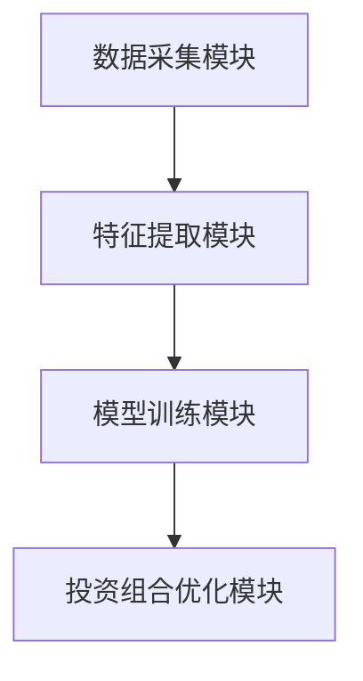

                 


# AI优化的约翰·伯格指数化策略：多智能体协作

> 关键词：AI优化，约翰·伯格指数化策略，多智能体协作，强化学习，投资组合优化，系统架构设计

> 摘要：本文深入探讨了如何利用人工智能技术优化约翰·伯格的指数化投资策略，重点分析了多智能体协作在投资组合优化中的应用。通过结合强化学习算法和多智能体协作机制，提出了一种高效的AI优化方案，并通过实际案例展示了其优越性。文章内容涵盖了从理论基础到算法实现，再到系统架构设计的全过程，为读者提供了一个全面的技术视角。

---

# 第一部分：AI优化的约翰·伯格指数化策略基础

## 第1章：指数化投资与约翰·伯格策略概述

### 1.1 指数化投资的背景与意义

#### 1.1.1 指数化投资的定义与特点
指数化投资是一种通过跟踪特定市场指数来构建投资组合的投资策略。其核心思想是通过复制市场的平均表现，而非试图通过个股选择或市场 timing 来获得超额收益。

- **定义**：指数化投资是指通过投资于特定的市场指数（如标普500）的成分股，以复制该指数的收益。
- **特点**：
  - 分散化：投资于多个股票，降低个股风险。
  - 低成本：指数基金的管理费用通常低于主动管理型基金。
  - 简单易行：无需频繁交易，适合长期投资。

#### 1.1.2 约翰·伯格与指数化投资的关联
约翰·伯格是指数化投资的倡导者和实践者，他创立了 Vanguard 集团，并推出了一系列低成本的指数基金。伯格认为，长期来看，指数基金能够为投资者提供稳定的超额收益。

- **伯格的投资哲学**：
  - 长期投资：避免频繁交易，降低交易成本。
  - 分散化投资：通过投资于广泛市场指数来降低风险。
  - 低成本运作：通过规模经济降低管理费用。

#### 1.1.3 指数化投资的优缺点分析
| 优点 | 缺点 |
|------|------|
| 分散化风险 | 无法获得超越市场的超额收益 |
| 低成本 | 不适合短期投资 |
| 简单易行 | 无法应对市场剧烈波动 |

### 1.2 约翰·伯格指数化策略的核心思想

#### 1.2.1 约翰·伯格的投资哲学
伯格强调投资的目的是为了实现财富的保值和增值，而不是追求短期的暴利。他提倡通过长期持有指数基金来实现财富增长。

#### 1.2.2 约翰·伯格指数化策略的数学模型
指数化投资的核心是通过复制市场指数的表现来实现收益。假设市场指数的收益为 \( R_m \)，投资组合的收益 \( R_p \) 应该接近 \( R_m \)。

$$ R_p = \alpha R_m + \beta \epsilon $$

其中，\( \alpha \) 是跟踪误差系数，\( \beta \) 是回归系数，\( \epsilon \) 是误差项。

#### 1.2.3 约翰·伯格策略的适用场景与限制
- **适用场景**：适合长期投资，尤其是对于风险承受能力较低的投资者。
- **限制**：在市场剧烈波动或结构性变化时，指数化策略可能无法及时调整，导致收益损失。

### 1.3 AI优化的指数化策略的必要性

#### 1.3.1 传统指数化策略的局限性
传统指数化策略虽然简单有效，但在以下方面存在不足：
- 无法动态调整投资组合。
- 无法应对市场环境的变化。
- 无法利用大数据和AI技术捕捉市场机会。

#### 1.3.2 AI技术如何提升指数化策略的效率
AI技术可以通过以下方式优化指数化策略：
- 数据挖掘：利用大数据分析市场趋势。
- 动态调整：通过机器学习算法实时优化投资组合。
- 风险控制：利用AI技术预测和规避市场风险。

#### 1.3.3 AI优化的指数化策略的未来趋势
未来的指数化策略将更加智能化和个性化，AI技术将在以下几个方面发挥重要作用：
- 动态调整投资组合。
- 实时监控市场风险。
- 提供个性化的投资建议。

---

## 第2章：多智能体协作的基本理论

### 2.1 多智能体协作的定义与特点

#### 2.1.1 多智能体系统的定义
多智能体系统（Multi-Agent System, MAS）是由多个智能体组成的系统，这些智能体通过协作完成特定任务。

- **智能体**：具有感知环境、自主决策和执行任务能力的实体。
- **协作**：智能体之间通过信息共享和任务分配实现共同目标。

#### 2.1.2 多智能体协作的核心特征
- **分布性**：多个智能体分布在不同的位置。
- **自主性**：每个智能体都能自主决策。
- **协作性**：智能体之间通过协作完成任务。

#### 2.1.3 多智能体协作的优势与挑战
| 优势 | 挑战 |
|------|------|
| 高效性：多个智能体可以同时处理任务 | 复杂性：协作过程需要协调和同步 |
| 智能性：智能体之间可以共享信息 | 安全性：可能存在信息泄露风险 |

### 2.2 多智能体协作的数学模型

#### 2.2.1 多智能体协作的基本模型
多智能体协作可以通过以下模型表示：

$$ C = \sum_{i=1}^{n} c_i $$

其中，\( C \) 是协作成本，\( c_i \) 是第 \( i \) 个智能体的协作成本。

#### 2.2.2 协作任务分配的数学公式
任务分配可以通过以下优化问题表示：

$$ \min \sum_{i=1}^{n} c_i $$
$$ \text{s.t.} \quad \sum_{i=1}^{n} x_i = 1 $$

其中，\( x_i \) 是第 \( i \) 个智能体的任务分配比例。

#### 2.2.3 多智能体协作的优化算法
常用的优化算法包括遗传算法和蚁群算法。以下是一个简单的遗传算法流程：

1. 初始化种群。
2. 计算适应度。
3. 选择优秀个体。
4. 进行交叉和变异。
5. 重复步骤2-4，直到满足终止条件。

### 2.3 多智能体协作的典型应用场景

#### 2.3.1 金融领域的多智能体协作
在金融领域，多智能体协作可以用于投资组合优化、风险控制等。

#### 2.3.2 其他领域的多智能体协作案例
- 机器人协作
- 自动驾驶
- 物流调度

---

## 第3章：约翰·伯格指数化策略的AI优化方法

### 3.1 约翰·伯格指数化策略的AI优化目标

#### 3.1.1 提高投资组合的收益
通过AI技术优化投资组合，提高收益。

#### 3.1.2 降低投资组合的风险
通过动态调整投资组合，降低风险。

#### 3.1.3 提高投资决策的效率
通过AI技术快速分析市场数据，提高决策效率。

### 3.2 约翰·伯格指数化策略的AI优化流程

#### 3.2.1 数据收集与预处理
- 数据来源：市场数据、历史价格、财务报表等。
- 数据预处理：清洗、标准化、特征提取。

#### 3.2.2 特征工程与模型选择
- 特征工程：提取关键特征，如市盈率、市净率等。
- 模型选择：选择合适的机器学习模型，如随机森林、支持向量机等。

#### 3.2.3 模型训练与优化
- 模型训练：使用历史数据训练模型。
- 模型优化：通过交叉验证优化模型参数。

### 3.3 基于多智能体协作的优化策略

#### 3.3.1 多智能体协作在投资组合优化中的应用
通过多智能体协作优化投资组合，提高收益和降低风险。

#### 3.3.2 多智能体协作的策略设计
- 任务分配：每个智能体负责不同的资产类别。
- 信息共享：智能体之间共享市场信息。
- 协作决策：智能体共同决策投资组合调整。

#### 3.3.3 多智能体协作的实现步骤
1. 初始化智能体。
2. 信息共享。
3. 任务分配。
4. 协作决策。
5. 实时调整。

---

## 第4章：基于强化学习的多智能体协作算法

### 4.1 强化学习的基本原理

#### 4.1.1 强化学习的定义与特点
强化学习是一种通过试错学习来优化决策的算法。

- **定义**：智能体通过与环境交互，学习最优策略。
- **特点**：基于奖励机制，动态调整策略。

#### 4.1.2 强化学习的核心算法
常用的强化学习算法包括Q-learning和Deep Q-Network（DQN）。

#### 4.1.3 强化学习的核心要素
- **状态**：环境中的当前情况。
- **动作**：智能体的决策。
- **奖励**：环境对智能体的反馈。

### 4.2 基于强化学习的多智能体协作算法

#### 4.2.1 多智能体强化学习的挑战
- 状态空间复杂。
- 动作空间复杂。
- 协作与竞争并存。

#### 4.2.2 多智能体强化学习的解决方案
- **任务分解**：将复杂任务分解为简单任务。
- **协作机制**：设计协作规则，确保智能体之间协作。
- **通信机制**：设计通信协议，实现智能体之间信息共享。

#### 4.2.3 多智能体强化学习的实现步骤
1. 初始化智能体。
2. 设计协作规则。
3. 设计通信机制。
4. 实现实例的交互与协作。
5. 动态调整策略。

---

## 第5章：系统架构设计与实现

### 5.1 系统功能设计

#### 5.1.1 系统功能模块
- 数据采集模块：采集市场数据。
- 特征提取模块：提取投资组合特征。
- 模型训练模块：训练强化学习模型。
- 投资组合优化模块：优化投资组合。

#### 5.1.2 系统功能流程
1. 数据采集：获取市场数据。
2. 特征提取：提取关键特征。
3. 模型训练：训练强化学习模型。
4. 投资组合优化：优化投资组合。

### 5.2 系统架构设计

#### 5.2.1 系统架构图


#### 5.2.2 系统接口设计
- 数据接口：与数据源对接。
- 模型接口：与机器学习模型对接。
- 投资组合接口：与投资组合管理系统对接。

#### 5.2.3 系统交互流程
1. 数据采集模块获取市场数据。
2. 特征提取模块提取关键特征。
3. 模型训练模块训练强化学习模型。
4. 投资组合优化模块优化投资组合。

---

## 第6章：项目实战与案例分析

### 6.1 项目实战

#### 6.1.1 环境配置
- 数据源：获取市场数据。
- 工具：Python、Pandas、NumPy、TensorFlow、Keras。

#### 6.1.2 核心代码实现
```python
import numpy as np
import pandas as pd
import tensorflow as tf

# 数据预处理
data = pd.read_csv('market_data.csv')
features = data[['open', 'close', 'high', 'low']]
labels = data['target']

# 模型训练
model = tf.keras.Sequential([
    tf.keras.layers.Dense(64, activation='relu'),
    tf.keras.layers.Dense(1, activation='sigmoid')
])
model.compile(optimizer='adam', loss='binary_crossentropy')
model.fit(features, labels, epochs=100, batch_size=32)
```

#### 6.1.3 案例分析
假设我们有一个包含10只股票的投资组合，目标是通过强化学习优化投资组合。我们可以通过以下步骤实现：

1. 数据采集：获取10只股票的历史价格数据。
2. 特征提取：提取每只股票的市盈率、市净率等特征。
3. 模型训练：训练强化学习模型。
4. 投资组合优化：优化投资组合，提高收益和降低风险。

---

## 第7章：最佳实践与小结

### 7.1 最佳实践

#### 7.1.1 投资组合优化的注意事项
- 数据质量：确保数据准确性和完整性。
- 模型选择：选择适合的机器学习模型。
- 风险控制：制定有效的风险管理策略。

#### 7.1.2 多智能体协作的优化技巧
- 任务分解：将复杂任务分解为简单任务。
- 通信机制：设计有效的通信协议。
- 协作规则：制定明确的协作规则。

### 7.2 小结

通过本文的分析与实践，我们了解了如何利用AI技术优化约翰·伯格的指数化策略。多智能体协作在投资组合优化中具有重要的应用价值，可以通过强化学习算法实现高效的协作与优化。未来，随着AI技术的不断发展，指数化策略将更加智能化和个性化。

---

# 作者

作者：AI天才研究院/AI Genius Institute & 禅与计算机程序设计艺术 /Zen And The Art of Computer Programming

---

希望这篇文章能够为您提供有价值的见解和启发，如果需要进一步的讨论或深入的技术细节，请随时与我联系！

