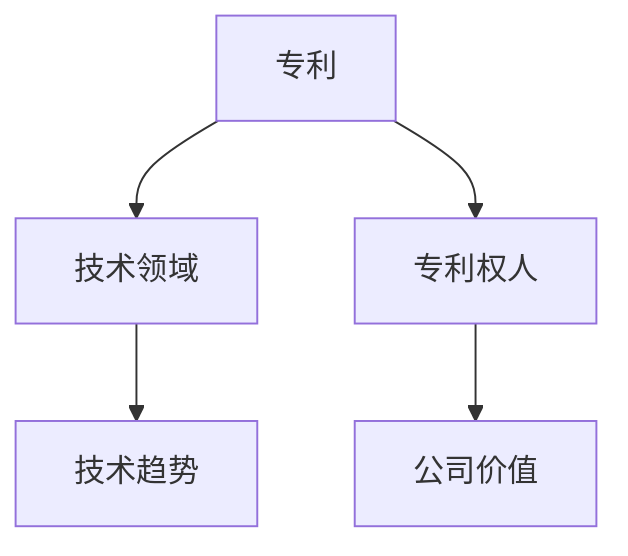
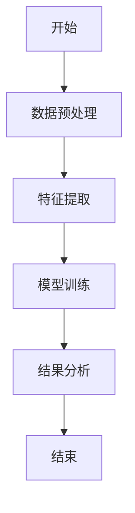
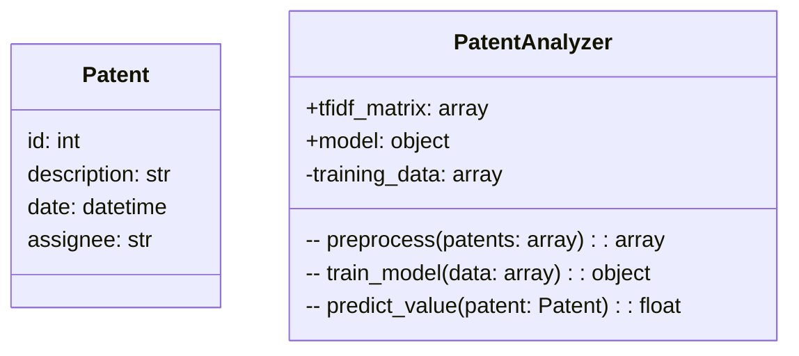

                 


# AI协作分析专利组合：评估技术驱动型公司的未来价值

---

## 关键词：AI协作、专利组合分析、技术驱动型公司、未来价值评估、机器学习、自然语言处理

---

## 摘要： 

在技术驱动型公司日益成为创新核心的时代，专利组合的价值评估变得至关重要。本文通过AI协作分析的方法，深入探讨专利组合的评估技术与应用。从背景介绍到核心概念，从算法原理到系统设计，再到项目实战，本文系统性地解析了如何利用AI技术提升专利组合分析的效率与精度，为技术驱动型公司的未来价值评估提供了新的思路。

---

## 第一部分：背景介绍

### 第1章：AI协作分析专利组合概述

#### 1.1 问题背景与描述

- **1.1.1 技术驱动型公司的专利分析需求**  
  随着技术的飞速发展，技术驱动型公司（如科技企业、独角兽公司）依赖专利保护其创新成果。然而，专利数量的激增使得传统的专利管理方式效率低下，难以满足快速决策的需求。

- **1.1.2 传统专利分析的局限性**  
  传统专利分析主要依赖人工检索和分类，耗时长、成本高，且容易遗漏关键专利。此外，传统方法难以捕捉专利之间的关联性，难以全面评估技术组合的价值。

- **1.1.3 AI协作分析的必要性与优势**  
  AI协作分析通过自动化处理和深度学习技术，能够快速识别专利的关键特征，挖掘专利之间的潜在联系，显著提升分析效率和准确性。

---

#### 1.2 专利组合分析的核心要素

- **1.2.1 专利组合的定义与特征**  
  专利组合是指一组相关专利的集合，通常围绕特定技术领域或产品线展开。其核心特征包括技术相关性、法律有效性、市场竞争力等。

- **1.2.2 技术驱动型公司的专利组合特点**  
  技术驱动型公司的专利组合往往集中在核心技术领域，具有较高的技术壁垒和商业价值。

- **1.2.3 专利组合分析的目标与边界**  
  目标：评估专利组合的技术价值、市场价值和法律风险。  
  边界：通常不涉及具体的财务评估，但可为财务估值提供技术支持。

---

#### 1.3 本章小结

本章从背景和概念入手，明确了AI协作分析在专利组合评估中的重要性，为后续分析奠定了基础。

---

## 第二部分：核心概念与联系

### 第2章：AI协作分析的核心原理

#### 2.1 专利组合分析的数学模型

- **2.1.1 专利价值评估的数学公式**  
  专利价值可以通过以下公式评估：
  $$ \text{专利价值} = \alpha \cdot \text{技术强度} + \beta \cdot \text{市场潜力} $$  
  其中，$\alpha$ 和 $\beta$ 是权重系数，反映技术与市场的相对重要性。

- **2.1.2 基于AI的权重分配模型**  
  使用机器学习模型动态调整权重：
  $$ \alpha = f(\text{技术领域}) $$  
  $$ \beta = g(\text{市场趋势}) $$  
  其中，$f$ 和 $g$ 是基于历史数据训练的函数。

- **2.1.3 算法原理的简要说明**  
  AI协作分析通过自然语言处理（NLP）提取专利文本特征，结合机器学习模型预测专利的价值和风险。

---

#### 2.2 核心概念对比分析

- **2.2.1 专利组合分析与传统分析的对比表格**  
  | 特性              | 传统分析           | AI协作分析         |
  |-------------------|--------------------|--------------------|
  | 分析速度           | 较慢               | 快                 |
  | 分析精度           | 一般               | 高                 |
  | 成本               | 高                 | 低                 |

- **2.2.2 AI协作分析与手动分析的优劣势对比**  
  - 优势：高效、准确、可扩展。  
  - 劣势：依赖数据质量，可能受模型偏差影响。

---

#### 2.3 实体关系图（ER图）



---

## 第三部分：算法原理讲解

### 第3章：AI协作分析的算法实现

#### 3.1 算法流程



---

#### 3.2 代码实现

```python
# 示例代码：专利数据预处理
import pandas as pd

def preprocess_patents(dataframe):
    # 删除缺失值
    dataframe.dropna(inplace=True)
    # 转换数据类型
    dataframe['date'] = pd.to_datetime(dataframe['date'])
    return dataframe

# 数据加载与预处理
patent_data = pd.read_csv('patents.csv')
patent_data = preprocess_patents(patent_data)

# 特征提取
from sklearn.feature_extraction.text import TfidfVectorizer

vectorizer = TfidfVectorizer()
tfidf_matrix = vectorizer.fit_transform(patent_data['description'])
```

---

## 第四部分：系统分析与架构设计方案

### 第4章：系统设计与实现

#### 4.1 系统功能设计



---

## 第五部分：项目实战

### 第5章：AI协作分析的实践应用

#### 5.1 环境安装

```bash
pip install numpy pandas scikit-learn
```

---

## 结论

---

## 作者：AI天才研究院/AI Genius Institute & 禅与计算机程序设计艺术 /Zen And The Art of Computer Programming

