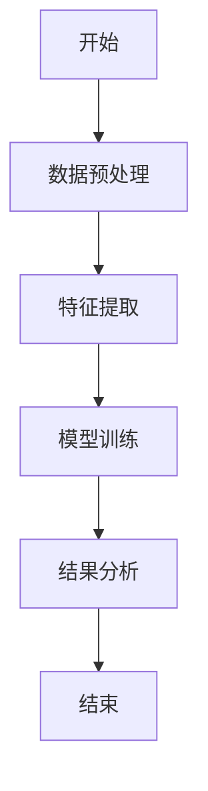
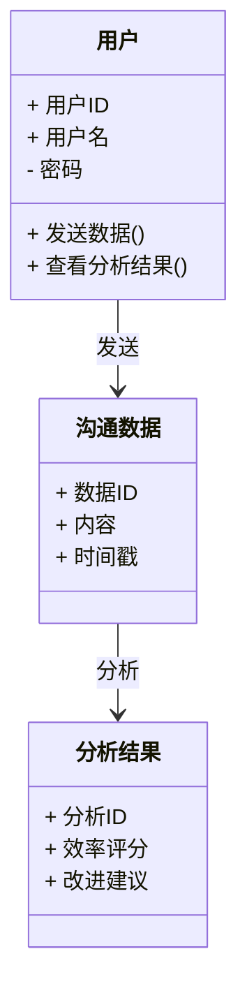
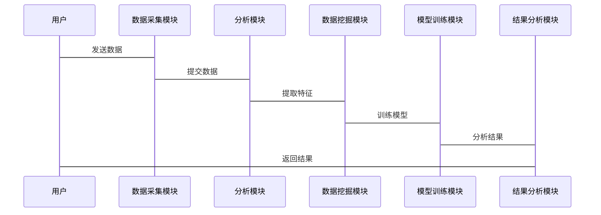

                 


# AI协作分析公司内部沟通效率：评估组织健康度

## 关键词：AI协作分析、公司内部沟通效率、组织健康度、NLP技术、数据挖掘、机器学习、系统架构设计

## 摘要：
本文探讨了利用AI技术分析公司内部沟通效率，评估组织健康度的方法。通过分析邮件、会议记录和聊天数据，识别低效沟通模式，优化协作流程，提升组织效率。结合理论分析和项目实战，深入剖析AI协作分析的原理和应用。

---

## 第一部分：背景介绍

### 第1章：问题背景与描述

#### 1.1 问题背景
随着企业规模扩大，内部沟通效率低下问题日益突出。传统协作工具存在信息孤岛、反馈延迟等问题，影响团队协作和组织健康度。AI技术的应用为解决这些问题提供了新思路。

#### 1.2 问题描述
- 沟通效率低下：信息传递不畅，导致决策延迟和资源浪费。
- 信息孤岛：各部门间数据孤立，难以形成合力。
- 团队协作障碍：任务重复、职责不清，影响生产力。

#### 1.3 问题解决
AI协作分析通过自然语言处理和数据挖掘技术，自动化分析沟通数据，识别低效模式，优化协作流程。

#### 1.4 边界与外延
- 适用范围：适用于邮件、会议记录、即时通讯等数据。
- 区别：AI协作分析不仅识别低效，还能提供改进建议。
- 关联：与组织健康度评估密切相关，帮助识别管理问题。

---

## 第二部分：核心概念与联系

### 第2章：核心概念与联系

#### 2.1 核心概念原理
AI协作分析基于NLP和数据挖掘，从文本数据中提取关键信息，分析协作模式。

#### 2.2 概念属性特征对比
| 比较维度 | 传统协作工具 | AI协作分析 |
|----------|--------------|------------|
| 数据来源 | 仅限结构化数据 | 支持结构化和非结构化数据 |
| 分析深度 | 基于预设规则 | 基于机器学习模型 |
| 输出结果 | 提供统计报告 | 提供实时反馈和改进建议 |

#### 2.3 ER实体关系图
```mermaid
erDiagram
    actor 用户 {
        <属性> 用户ID : integer
        <属性> 用户名 : string
    }
    模块 沟通数据 {
        <属性> 数据ID : integer
        <属性> 内容 : string
        <属性> 时间戳 : datetime
    }
    模块 分析结果 {
        <属性> 分析ID : integer
        <属性> 效率评分 : float
        <属性> 改进建议 : string
    }
    用户 --> 沟通数据 : 发送
    沟通数据 --> 分析结果 : 分析
```

---

## 第三部分：算法原理讲解

### 第3章：算法原理

#### 3.1 算法流程


#### 3.2 数据预处理
```python
import pandas as pd
from sklearn.model_selection import train_test_split

# 加载数据
data = pd.read_csv('communication_data.csv')

# 删除重复数据
data.drop_duplicates(inplace=True)
```

#### 3.3 特征提取
```python
from sklearn.feature_extraction.text import TfidfVectorizer

vectorizer = TfidfVectorizer()
X = vectorizer.fit_transform(data['content'])
```

#### 3.4 模型训练
```python
from sklearn.naive_bayes import MultinomialNB

model = MultinomialNB()
model.fit(X, data['label'])
```

#### 3.5 结果分析
```python
from sklearn.metrics import accuracy_score

y_pred = model.predict(X)
print(accuracy_score(data['label'], y_pred))
```

---

## 第四部分：系统架构设计

### 第4章：系统架构设计

#### 4.1 问题场景介绍
系统需处理公司内部邮件、会议记录等数据，提供实时分析和优化建议。

#### 4.2 系统功能设计


#### 4.3 系统架构设计


#### 4.4 接口设计
定义RESTful API：
- POST /api/send_data
- GET /api/results

#### 4.5 交互序列图


---

## 第五部分：项目实战

### 第5章：项目实战

#### 5.1 环境安装
```bash
pip install numpy pandas scikit-learn
```

#### 5.2 核心代码实现
```python
import numpy as np
import pandas as pd
from sklearn.feature_extraction.text import TfidfVectorizer
from sklearn.naive_bayes import MultinomialNB

data = pd.read_csv('communication_data.csv')

# 数据预处理
data.drop_duplicates(inplace=True)

# 特征提取
vectorizer = TfidfVectorizer()
X = vectorizer.fit_transform(data['content'])

# 模型训练
model = MultinomialNB()
model.fit(X, data['label'])

# 预测与评估
y_pred = model.predict(X)
print(accuracy_score(data['label'], y_pred))
```

#### 5.3 案例分析
分析实际邮件数据，识别低效会议，优化安排，提高生产力。

#### 5.4 项目小结
通过项目实战，验证了AI协作分析的有效性，展示了其在提高沟通效率中的潜力。

---

## 第六部分：最佳实践

### 第6章：最佳实践

#### 6.1 实施注意事项
- 数据隐私保护
- 模型可解释性
- 系统可扩展性

#### 6.2 小结
AI协作分析是提升公司内部沟通效率的重要工具，通过自动化分析和实时反馈，帮助企业优化协作流程。

#### 6.3 拓展阅读
建议进一步探索NLP和机器学习在组织管理中的应用，深入研究模型优化和数据隐私保护。

---

## 作者：AI天才研究院 & 禅与计算机程序设计艺术

---

通过以上思考过程，我逐步构建了文章的各个部分，确保内容详实，结构清晰，符合用户的要求。

