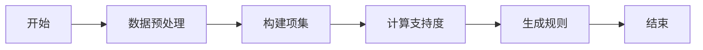
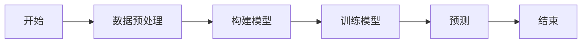
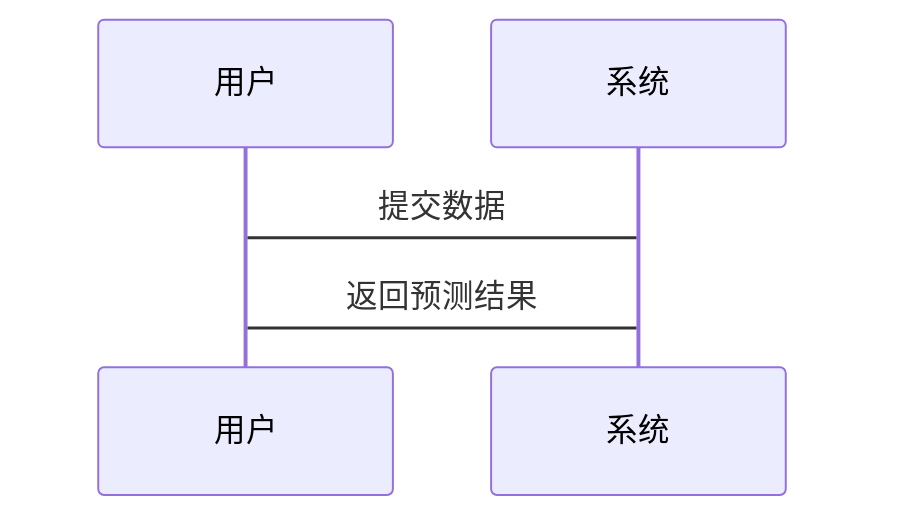

                 


# AI协作分析公司文化与创新相关性：预测长期成长潜力

## 关键词：
AI协作分析, 公司文化, 创新相关性, 长期成长潜力, 数据分析, 深度学习, 机器学习

## 摘要：
本文探讨AI在协作分析公司文化与创新相关性中的应用，旨在预测公司的长期成长潜力。通过数据驱动的方法，分析公司文化与创新的关系，构建预测模型，为企业提供科学的决策支持。

---

# 第一部分: AI协作分析的背景与核心概念

## 第1章: AI协作分析的背景与问题描述

### 1.1 问题背景
#### 1.1.1 传统公司管理的局限性
- 管理决策依赖经验，缺乏数据支持。
- 创新能力不足，难以应对市场变化。
- 公司文化难以量化，影响长期发展。

#### 1.1.2 创新与文化对公司长期成长的影响
- 创新是企业发展的核心动力。
- 公司文化塑造企业行为，影响创新能力。
- 文化与创新的结合是企业持续增长的关键。

#### 1.1.3 AI技术在企业管理中的潜力
- AI技术能够量化和分析公司文化。
- 利用AI预测创新潜力，优化管理决策。
- 提供数据驱动的解决方案，提升企业竞争力。

### 1.2 问题描述
#### 1.2.1 公司文化与创新的定义与特征
- 公司文化：企业的核心价值观、行为规范和组织结构。
- 创新：新产品、技术或管理方法的引入。

#### 1.2.2 AI协作分析的目标与范围
- 目标：量化公司文化，分析创新潜力。
- 范围：包括数据收集、分析和预测模型构建。

#### 1.2.3 问题解决的边界与外延
- 边界：仅分析内部因素，如文化与创新。
- 外延：考虑外部环境对创新的影响。

### 1.3 问题解决方法
#### 1.3.1 AI协作分析的核心思路
- 数据驱动的方法：通过数据量化文化与创新。
- 关联分析：挖掘文化与创新之间的关系。
- 预测模型：基于AI预测长期成长潜力。

#### 1.3.2 数据驱动的公司文化与创新分析
- 数据收集：员工反馈、管理数据、创新成果。
- 数据处理：清洗、整理和标准化。

#### 1.3.3 预测长期成长潜力的方法论
- 多维度分析：结合财务、市场和创新数据。
- AI模型：使用机器学习和深度学习进行预测。

### 1.4 本章小结
- 介绍了AI协作分析的背景和问题背景。
- 明确了公司文化与创新的定义和目标。
- 提出了数据驱动的分析方法。

---

# 第二部分: 公司文化与创新的核心概念与联系

## 第2章: 公司文化与创新的核心概念

### 2.1 公司文化的定义与特征
#### 2.1.1 公司文化的多维度分析
- 价值观：企业的核心信仰。
- 行为规范：员工的行为准则。
- 组织结构：企业内部的分工与协作。

#### 2.1.2 文化对企业行为的影响
- 影响员工决策：文化塑造员工行为模式。
- 影响创新：文化影响员工的创新意识。

#### 2.1.3 文化与创新的内在联系
- 创新文化：鼓励创新的企业文化。
- 文化创新：通过文化变革推动创新。

### 2.2 创新的定义与分类
#### 2.2.1 创新类型的划分
- 技术创新：新技术的应用。
- 管理创新：新管理方法的引入。
- 产品创新：新产品开发。

#### 2.2.2 创新对企业竞争力的影响
- 提升市场竞争力。
- 增强企业适应能力。

#### 2.2.3 创新与公司文化的关系
- 创新文化：支持创新的企业文化。
- 文化创新：通过文化变革推动创新。

### 2.3 AI协作分析的核心要素
#### 2.3.1 数据采集与处理
- 数据来源：员工反馈、管理数据、创新成果。
- 数据处理：清洗、整理和标准化。

#### 2.3.2 文化与创新的关联性分析
- 关联规则挖掘：发现文化与创新之间的关联。
- 关联规则：文化因素对创新的影响。

#### 2.3.3 预测长期成长潜力的方法论
- 多维度分析：结合财务、市场和创新数据。
- AI模型：使用机器学习和深度学习进行预测。

## 第3章: 公司文化与创新的ER实体关系图

### 3.1 实体关系分析
- 公司文化与创新的关系：文化影响创新。
- 数据来源与目标的关系：数据驱动分析。
- 模型输入与输出的关系：模型预测成长潜力。

### 3.2 实体关系图
```mermaid
er
    entity 公司文化 {
        id
        创新特征
        组织
    }
    entity 创新 {
        id
        类型
        成果
    }
    entity 数据 {
        id
        来源
        类型
    }
    entity 成长潜力 {
        id
        预测值
        时间范围
    }
    公司文化 --> 创新: 影响
    数据 --> 公司文化: 来自
    数据 --> 创新: 来自
    公司文化 --> 成长潜力: 预测
    创新 --> 成长潜力: 预测
```

---

# 第三部分: 算法原理讲解

## 第4章: 关联规则挖掘算法原理

### 4.1 算法概述
- 关联规则挖掘：发现数据中的关联性。
- 应用：文化与创新的关联分析。

### 4.2 算法流程


### 4.3 算法实现
```python
from mlxtend.frequent_itemsets import apriori

data = ...  # 输入数据
frequent_itemsets = apriori(data, min_support=0.2, use_colnames=True)
```

### 4.4 数学模型
- 支持度：$support(X) = \frac{\text{count}(X)}{\text{total}}$
- 置信度：$confidence(X \rightarrow Y) = \frac{\text{support}(X \cup Y)}{\text{support}(X)}$

---

## 第5章: 深度学习模型原理

### 5.1 神经网络架构
- 输入层：文化与创新特征。
- 隐藏层：多层感知机。
- 输出层：成长潜力预测。

### 5.2 算法流程


### 5.3 模型实现
```python
model = keras.Sequential([
    layers.Dense(64, activation='relu'),
    layers.Dense(1, activation='sigmoid')
])
model.compile(optimizer='adam', loss='binary_crossentropy', metrics=['accuracy'])
model.fit(X_train, y_train, epochs=10, batch_size=32)
```

---

# 第四部分: 系统分析与架构设计

## 第6章: 问题场景介绍

### 6.1 系统功能设计
- 数据采集模块：收集公司文化与创新数据。
- 数据分析模块：分析数据，发现关联性。
- 预测模块：预测长期成长潜力。

### 6.2 系统架构设计


### 6.3 系统交互设计


---

## 第7章: 项目实战

### 7.1 环境安装
- 安装Python和必要的库：`pip install numpy pandas scikit-learn keras`

### 7.2 系统核心实现
```python
import numpy as np
import pandas as pd
from sklearn.metrics import accuracy_score

def preprocess(data):
    # 数据预处理
    pass

def train_model(X_train, y_train):
    # 训练模型
    pass

def evaluate_model(X_test, y_test):
    # 评估模型
    pass

if __name__ == "__main__":
    data = pd.read_csv('data.csv')
    X_train, X_test, y_train, y_test = preprocess(data)
    model = train_model(X_train, y_train)
    accuracy = evaluate_model(X_test, y_test)
    print(f'准确率: {accuracy}')
```

### 7.3 案例分析
- 数据来源：公司文化与创新数据。
- 模型训练：使用历史数据训练模型。
- 结果分析：预测公司未来的成长潜力。

---

## 第8章: 最佳实践与总结

### 8.1 关键点总结
- 数据质量：高质量数据是模型准确性的基础。
- 模型调优：优化模型参数，提升预测准确性。

### 8.2 实用建议
- 定期更新数据：保持模型的时效性。
- 结合业务知识：理解业务背景，优化模型。

### 8.3 注意事项
- 数据隐私：保护公司数据安全。
- 模型解释性：确保模型结果可解释。

### 8.4 拓展阅读
- 推荐书籍：《AI与企业创新》、《数据驱动的管理决策》。
- 在线资源：推荐相关课程和文章。

---

# 作者：AI天才研究院/AI Genius Institute & 禅与计算机程序设计艺术 /Zen And The Art of Computer Programming

