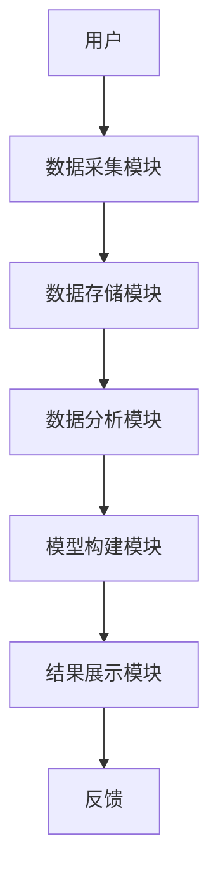

                 


# AI协作分析公司环境足迹：评估长期可持续发展能力

> 关键词：AI协作分析、环境足迹、可持续发展、企业环境影响、数据分析

> 摘要：本文探讨了利用人工智能协作分析公司环境足迹的方法，通过系统化的数据处理、模型构建和评估，帮助企业评估和优化其长期可持续发展能力。文章从背景介绍、核心概念、算法原理、系统架构、项目实战到最佳实践，全面分析了AI在环境足迹评估中的应用。

---

# 第一部分: AI协作分析公司环境足迹概述

# 第1章: 环境足迹与可持续发展概述

## 1.1 环境足迹的定义与重要性

### 1.1.1 环境足迹的基本概念
环境足迹（Environmental Footprint）是指企业在整个生命周期中对环境的影响，包括能源消耗、碳排放、资源消耗、废物产生等方面。它衡量了企业对环境资源的占用和对生态系统的压力。

### 1.1.2 环境足迹对企业的影响
企业环境足迹的大小直接影响其社会声誉、合规风险和运营成本。随着全球环保意识的增强，减少环境足迹已成为企业社会责任的重要组成部分。

### 1.1.3 可持续发展的核心目标
可持续发展强调在满足当前需求的同时，不损害后代满足其需求的能力。通过分析环境足迹，企业可以识别改进点，优化资源利用，减少对环境的负面影响。

## 1.2 AI在环境足迹分析中的作用

### 1.2.1 AI技术在环境数据处理中的优势
AI能够处理海量、复杂的数据，通过机器学习算法识别数据中的模式和趋势，帮助企业在噪声中提取有价值的信息。

### 1.2.2 AI协作分析的定义与特点
AI协作分析是指利用人工智能技术，与企业内部数据系统、业务部门协作，共同完成环境足迹的分析与评估。

### 1.2.3 AI在企业可持续发展中的应用前景
AI技术的应用将推动环境足迹分析的智能化和自动化，帮助企业更高效地实现可持续发展目标。

## 1.3 企业环境足迹分析的背景与挑战

### 1.3.1 环境问题对企业的影响
环境问题如气候变化、资源枯竭等对企业运营和未来发展构成威胁，企业必须采取措施减少环境足迹。

### 1.3.2 传统环境足迹分析的局限性
传统分析方法依赖人工数据收集和统计分析，效率低、覆盖面窄，难以应对复杂多变的环境问题。

### 1.3.3 AI协作分析的优势与挑战
AI协作分析的优势在于高效、精准，但其挑战包括数据隐私、模型准确性以及技术实施的成本和复杂性。

## 1.4 本章小结
本章介绍了环境足迹的基本概念和重要性，分析了AI在环境足迹分析中的作用，并探讨了企业在环境足迹分析中面临的挑战与机遇。

---

# 第二部分: AI协作分析的核心概念与原理

# 第2章: 环境足迹分析的核心要素

## 2.1 环境足迹分析的基本框架

### 2.1.1 数据来源与处理
环境数据来源包括企业内部数据（如能源消耗、碳排放）和外部数据（如供应链环境影响）。数据处理包括清洗、整合和标准化。

### 2.1.2 分析模型与方法
常用的分析方法包括生命周期评估（LCA）、碳足迹分析和资源效率分析。AI技术可以提升这些方法的效率和准确性。

### 2.1.3 结果解读与应用
分析结果用于指导企业优化运营流程、制定环保政策和提升品牌形象。

## 2.2 AI协作分析的系统架构

### 2.2.1 数据流与信息处理流程
数据从企业系统中提取，经过清洗、分析和建模，生成环境足迹报告。

### 2.2.2 系统模块划分与功能描述
系统模块包括数据采集、数据分析、模型构建和结果展示。

### 2.2.3 系统架构的可扩展性与灵活性
模块化设计使系统具备良好的扩展性和灵活性，能够适应不同企业的需求。

## 2.3 核心概念的ER实体关系图

```mermaid
er
    actor: 用户
    model: 分析模型
    data: 环境数据
    result: 分析结果
    actor --> model: 提供输入
    model --> data: 处理数据
    model --> result: 生成结果
    result --> actor: 提供反馈
```

## 2.4 本章小结
本章详细介绍了环境足迹分析的核心要素和AI协作分析的系统架构，强调了数据处理和模型构建的重要性。

---

# 第三部分: 算法原理与数学模型

# 第3章: 环境足迹分析的算法原理

## 3.1 数据预处理

### 3.1.1 数据清洗
去除噪声数据，处理缺失值和异常值。

### 3.1.2 数据标准化
将不同量纲的数据进行标准化处理，便于模型训练。

## 3.2 机器学习模型的构建

### 3.2.1 算法选择
常用算法包括线性回归、随机森林和神经网络。根据数据特点选择最优算法。

### 3.2.2 模型训练
使用训练数据对模型进行训练，调整模型参数以优化预测精度。

## 3.3 模型评估与优化

### 3.3.1 评估指标
常用的评估指标包括均方误差（MSE）、R²值和准确率。

### 3.3.2 模型优化
通过交叉验证和超参数调优提升模型性能。

## 3.4 算法原理的数学模型

### 3.4.1 线性回归模型
$$ y = \beta_0 + \beta_1 x + \epsilon $$

### 3.4.2 随机森林模型
随机森林通过集成学习提升模型的准确性和鲁棒性。

## 3.5 本章小结
本章详细讲解了环境足迹分析中机器学习算法的原理和实现，强调了数据预处理和模型优化的重要性。

---

# 第四部分: 系统分析与架构设计

# 第4章: 系统架构与功能设计

## 4.1 问题场景介绍

### 4.1.1 企业环境数据管理
企业需要整合内部和外部的环境数据，建立统一的数据管理系统。

### 4.1.2 数据分析与建模
通过AI技术对环境数据进行深度分析，构建预测模型。

## 4.2 项目介绍

### 4.2.1 项目目标
开发一个基于AI的环境足迹分析系统，帮助企业评估和优化环境表现。

### 4.2.2 项目范围
涵盖数据采集、分析、建模和结果展示等功能。

## 4.3 系统功能设计

### 4.3.1 数据采集模块
从企业系统中采集环境数据，支持多种数据源的接入。

### 4.3.2 数据分析模块
对数据进行清洗、转换和分析，生成初步的环境影响评估结果。

### 4.3.3 模型构建模块
基于机器学习算法构建预测模型，评估企业的环境足迹。

### 4.3.4 结果展示模块
以可视化的方式呈现分析结果，便于企业理解和应用。

## 4.4 系统架构设计



## 4.5 系统交互设计

```mermaid
sequenceDiagram
    actor 用户
    system 数据采集模块
    system 数据分析模块
    system 模型构建模块
    用户 -> 数据采集模块: 提供环境数据
    数据采集模块 -> 数据分析模块: 分析数据
    数据分析模块 -> 模型构建模块: 构建预测模型
    模型构建模块 -> 用户: 提供分析结果
```

## 4.6 本章小结
本章详细描述了系统架构的设计和功能模块的划分，强调了各模块之间的协作和交互。

---

# 第五部分: 项目实战

# 第5章: 项目实施与案例分析

## 5.1 环境数据采集与预处理

### 5.1.1 数据源选择
选择企业内部的能源消耗数据和供应链的环境数据。

### 5.1.2 数据清洗与转换
处理缺失值和异常值，统一数据格式。

## 5.2 AI模型的训练与优化

### 5.2.1 模型选择
选择随机森林算法进行环境足迹预测。

### 5.2.2 模型训练
使用训练数据对随机森林模型进行训练，调整超参数提升性能。

## 5.3 环境足迹分析报告的生成

### 5.3.1 分析结果展示
以可视化图表的形式展示环境足迹分析结果。

### 5.3.2 报告生成
根据分析结果生成环境足迹评估报告，提出优化建议。

## 5.4 案例分析

### 5.4.1 案例背景
某制造企业希望通过AI协作分析减少碳排放。

### 5.4.2 数据分析过程
通过模型预测，发现主要的碳排放来源，提出优化措施。

### 5.4.3 结果解读
分析结果显示主要碳排放来源于生产过程，建议采用绿色能源和优化工艺流程。

## 5.5 本章小结
本章通过实际案例展示了AI协作分析的应用过程，强调了数据处理和模型优化的重要性。

---

# 第六部分: 最佳实践与总结

# 第6章: 最佳实践与小结

## 6.1 数据质量管理

### 6.1.1 数据清洗与验证
确保数据的准确性和完整性。

### 6.1.2 数据安全与隐私保护
在处理环境数据时，需注意数据的安全性和隐私保护。

## 6.2 模型优化与维护

### 6.2.1 模型调优
通过交叉验证和网格搜索优化模型性能。

### 6.2.2 模型维护
定期更新模型，确保其适应环境数据的变化。

## 6.3 结果应用与反馈

### 6.3.1 结果解读
将分析结果转化为具体的优化措施。

### 6.3.2 反馈与改进
根据反馈不断优化模型和分析流程。

## 6.4 未来展望

### 6.4.1 技术进步
AI技术的不断进步将推动环境足迹分析的智能化和自动化。

### 6.4.2 应用扩展
AI协作分析的应用将扩展到更多领域，帮助企业实现更全面的可持续发展目标。

## 6.5 本章小结
本章总结了项目实施中的最佳实践，并对未来的发展方向进行了展望。

---

# 作者：AI天才研究院（AI Genius Institute） & 禅与计算机程序设计艺术（Zen And The Art of Computer Programming）

---

这篇文章系统地介绍了AI协作分析在公司环境足迹评估中的应用，从理论到实践，详细探讨了环境足迹的定义、AI技术的优势、算法原理、系统架构设计以及实际案例分析。通过本文的指导，企业可以更好地利用AI技术优化环境表现，实现长期可持续发展目标。

