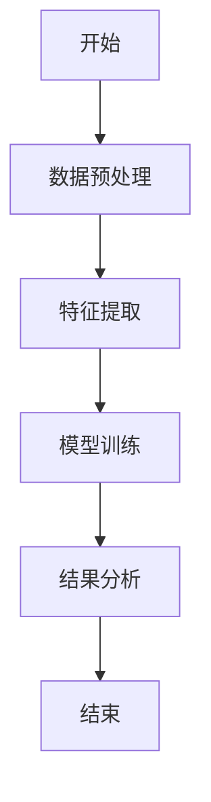
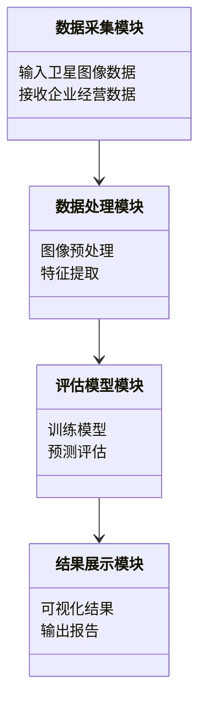
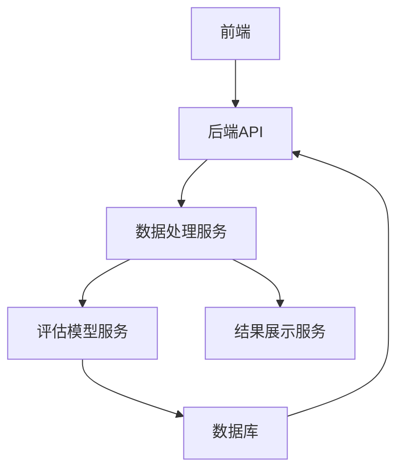
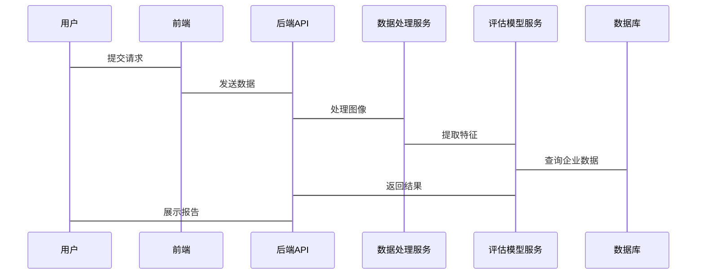

                 


# AI协作分析卫星图像数据：评估公司实际经营状况

> 关键词：卫星图像数据，企业经营状况，AI协作分析，图像识别，深度学习

> 摘要：本文探讨了利用AI协作分析卫星图像数据来评估公司实际经营状况的方法。通过分析卫星图像中的多种特征，结合深度学习技术，我们可以提取有价值的信息，从而对企业经营状况进行全面评估。本文详细介绍了AI协作分析的基本原理、算法实现、系统架构设计以及实际案例分析。

---

## 第一部分: 背景介绍

### 第1章: 问题背景与描述

#### 1.1 问题背景
- **卫星图像数据的特性与挑战**：卫星图像数据具有高分辨率、多光谱和时间序列的特点，但数据量巨大且复杂。如何高效利用这些数据是一个挑战。
- **企业经营状况评估的传统方法及其局限性**：传统方法依赖于财务报表和现场调查，存在数据滞后、成本高、覆盖面窄等问题。
- **AI技术在企业经营评估中的潜力**：AI技术可以快速处理大量数据，提取隐含信息，提供实时动态的评估结果。

#### 1.2 问题描述
- **卫星图像数据的多维特征**：包括地物特征、纹理特征、颜色特征等。
- **企业经营状况的多维度评估指标**：如经营稳定性、市场竞争力、发展潜力等。
- **AI协作分析的目标与范围**：目标是通过卫星图像数据，结合企业经营指标，构建一个实时、动态的评估系统。

### 第2章: 问题解决与边界

#### 2.1 问题解决方法
- **AI协作分析的基本思路**：利用深度学习模型，从卫星图像中提取企业相关特征，并结合企业经营数据，进行综合评估。
- **卫星图像数据处理的关键步骤**：包括数据预处理、特征提取、模型训练等。
- **企业经营状况评估的指标体系**：构建多维度的评估指标，涵盖财务、市场、运营等多个方面。

#### 2.2 边界与外延
- **数据范围的界定**：限定在特定区域和时间范围内的卫星图像数据。
- **企业类型与规模的限制**：主要针对中大型企业，小型企业的评估可能需要其他数据支持。
- **应用场景的边界**：目前主要应用于制造业、物流业等领域，其他行业可能需要进一步调整模型。

### 第3章: 核心概念与结构

#### 3.1 核心概念
- **卫星图像数据的定义与分类**：卫星图像数据可以分为光学图像和雷达图像，光学图像包括多光谱和高光谱数据。
- **企业经营状况评估的定义与维度**：经营状况评估是对企业运营状态的全面分析，包括财务状况、市场表现、生产效率等。
- **AI协作分析的基本原理**：通过AI技术，从卫星图像中提取相关信息，并结合企业经营数据，进行综合评估。

#### 3.2 概念结构与核心要素
- **数据流的构成与流向**：卫星图像数据 → 数据预处理 → 特征提取 → 模型训练 → 经营评估。
- **评估模型的构建与输入输出**：输入为卫星图像数据和企业经营数据，输出为评估结果。
- **AI协作的关键环节与要素**：数据采集、特征提取、模型训练、结果分析。

---

## 第二部分: 核心概念与联系

### 第4章: 核心概念原理

#### 4.1 AI协作分析的基本原理
- **数据预处理**：包括图像增强、噪声消除、几何校正等步骤。
- **特征提取**：利用CNN等深度学习模型提取图像特征。
- **模型训练**：通过大量标注数据训练模型，使其能够识别企业相关的图像特征。

#### 4.2 概念属性特征对比
| 特征类型 | 卫星图像特征 | 企业经营特征 |
|----------|--------------|--------------|
| 分类      | 地物类型      | 财务指标      |
| 时间序列  | 多时相图像     | 经营数据      |
| 空间分布  | 地理位置      | 企业分布      |

#### 4.3 ER实体关系图
```mermaid
erd
    entity 企业 (id, 名称, 经营指标)
    entity 卫星图像 (id, 时间, 地理位置, 光谱信息)
    relationship 卫星图像属于 (企业id, 卫星图像id)
```

---

## 第三部分: 算法原理讲解

### 第5章: 算法原理

#### 5.1 算法选择与原理
- **卷积神经网络（CNN）**：用于图像特征提取。
- **目标检测算法**（如YOLO、Faster R-CNN）：用于识别企业相关的目标（如工厂、仓库）。

#### 5.2 算法实现步骤
1. 数据预处理：图像归一化、数据增强。
2. 模型训练：使用标注数据训练模型，提取图像特征。
3. 特征提取：将图像特征与企业经营数据结合。
4. 模型优化：调整超参数，提高评估精度。

#### 5.3 算法流程图


#### 5.4 核心代码实现
```python
import tensorflow as tf
from tensorflow.keras import layers

def build_model(input_shape):
    model = tf.keras.Sequential()
    model.add(layers.Conv2D(32, (3, 3), activation='relu', input_shape=input_shape))
    model.add(layers.MaxPooling2D(pool_size=(2, 2)))
    model.add(layers.Conv2D(64, (3, 3), activation='relu'))
    model.add(layers.MaxPooling2D(pool_size=(2, 2)))
    model.add(layers.Flatten())
    model.add(layers.Dense(128, activation='relu'))
    model.add(layers.Dense(1, activation='sigmoid'))
    return model

model = build_model((256, 256, 3))
model.compile(optimizer='adam', loss='binary_crossentropy', metrics=['accuracy'])
```

#### 5.5 数学模型与公式
- **卷积层公式**：$$output = \max(0, W \cdot input + b)$$
- **池化层公式**：$$pooling = \max(input[i, j], input[i+1, j], input[i, j+1], input[i+1, j+1])$$

---

## 第四部分: 系统分析与架构设计方案

### 第6章: 系统分析

#### 6.1 问题场景介绍
- **项目背景**：利用卫星图像数据评估企业经营状况，提供实时动态的评估结果。
- **系统功能需求**：数据采集、处理、分析、展示。

#### 6.2 系统功能设计
- **领域模型**：包括数据采集模块、数据处理模块、评估模型模块、结果展示模块。


#### 6.3 系统架构设计


#### 6.4 系统接口设计
- **输入接口**：接收卫星图像和企业数据。
- **输出接口**：提供评估结果和可视化报告。

#### 6.5 系统交互流程


---

## 第五部分: 项目实战

### 第7章: 项目实现

#### 7.1 环境搭建
- 安装Python、TensorFlow、OpenCV等库。

#### 7.2 核心代码实现
```python
import cv2
import numpy as np

def preprocess_image(image_path):
    image = cv2.imread(image_path)
    image = cv2.resize(image, (256, 256))
    image = image / 255.0
    return image

# 训练模型（假设已训练好）
model.load_weights('model.h5')

# 预测
test_image = preprocess_image('test.jpg')
prediction = model.predict(np.array([test_image]))
print("预测结果:", prediction)
```

#### 7.3 案例分析
- **案例背景**：某制造企业，卫星图像显示生产区扩展，但财务数据下降。
- **分析结果**：企业可能存在产能过剩或市场需求下降的问题。

---

## 第六部分: 最佳实践

### 第8章: 实践总结

#### 8.1 小结
- AI协作分析卫星图像数据是一种高效的企业经营评估方法。
- 关键在于数据质量、模型优化和结果解读。

#### 8.2 注意事项
- 数据标注需准确，避免影响模型性能。
- 模型需定期更新，适应数据变化。

#### 8.3 拓展阅读
- 《深度学习实战》
- 《卫星图像处理技术》

---

## 作者：AI天才研究院 & 禅与计算机程序设计艺术

---

以上是《AI协作分析卫星图像数据：评估公司实际经营状况》的技术博客文章的完整内容，涵盖了从背景介绍到项目实战的各个方面，希望对您有所帮助！

