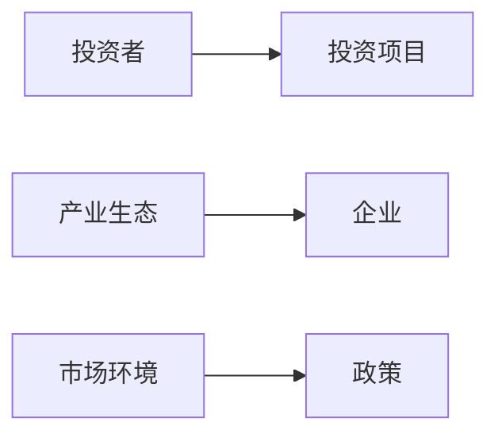
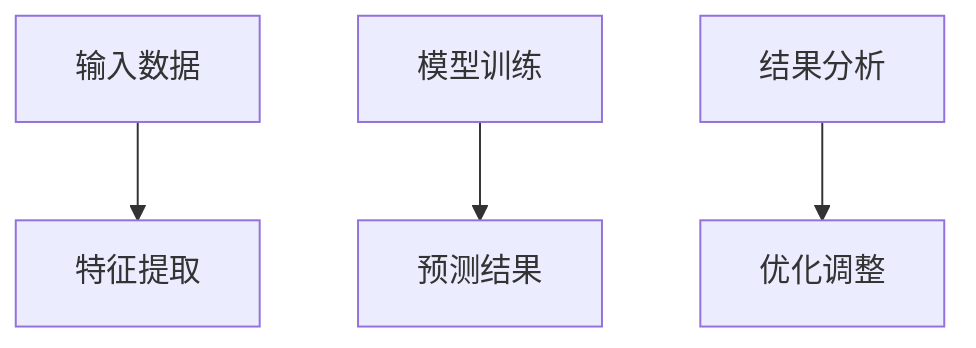
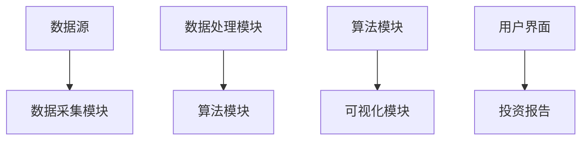
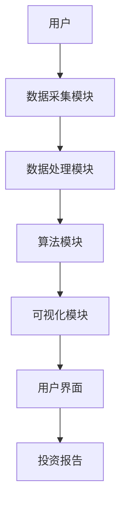

                 


```markdown
# AI协作构建动态产业生态图：全面把握投资环境

> 关键词：AI协作，产业生态图，投资环境，动态分析，系统架构，算法原理

> 摘要：本文深入探讨AI协作如何构建动态产业生态图，并全面分析投资环境。通过详细讲解核心概念、算法原理、系统架构和项目实战，帮助读者掌握AI协作在产业生态中的应用及其对投资决策的支持。

---

## 第一部分: AI协作与产业生态图基础

### 第1章: AI协作与产业生态图概述

#### 1.1 AI协作的基本概念
- **1.1.1 什么是AI协作**  
  AI协作是指人工智能系统与人类或其他AI系统共同完成任务的过程，强调互动、学习和优化。  
- **1.1.2 AI协作的核心特点**  
  - 自适应性：根据环境变化调整协作策略。  
  - 智能性：利用机器学习算法优化协作过程。  
  - 实时性：快速响应数据变化和用户需求。  
- **1.1.3 产业生态图的定义与作用**  
  产业生态图是一个动态的网络结构，展示产业之间的相互作用和依赖关系，帮助企业识别战略机会和风险。

#### 1.2 问题背景与描述
- **1.2.1 传统产业生态的局限性**  
  - 信息孤岛：企业间数据孤立，难以形成全局优化。  
  - 响应迟缓：传统方法难以实时捕捉市场变化。  
  - 知识碎片化：缺乏系统化的产业知识整合。  
- **1.2.2 当前投资环境的复杂性**  
  - 市场波动加剧：经济全球化和地缘政治影响投资决策。  
  - 技术革新快：新技术的出现对企业投资策略提出新挑战。  
  - 信息过载：投资者难以从海量数据中提取有价值的信息。  
- **1.2.3 AI协作在产业生态中的应用前景**  
  - 提高决策效率：通过AI协作快速分析市场趋势。  
  - 实现动态优化：实时调整产业布局和投资策略。  
  - 促进跨领域协作：打破行业界限，形成协同效应。

#### 1.3 问题解决与边界
- **1.3.1 AI协作如何解决产业生态问题**  
  - 数据整合：AI协作将分散的数据整合，形成统一的产业图谱。  
  - 智能分析：利用机器学习算法分析产业趋势和风险。  
  - 动态优化：实时调整协作策略，适应市场变化。  
- **1.3.2 产业生态图的边界与外延**  
  - 边界：聚焦于产业内部的协作关系，不涉及外部政策和法规。  
  - 外延：AI协作可以扩展到供应链管理、市场营销等领域。  
- **1.3.3 AI协作的应用场景与限制**  
  - 场景：企业战略规划、投资决策支持、风险管理。  
  - 限制：数据隐私问题、模型准确性的依赖性、计算资源的消耗。

#### 1.4 核心概念与联系
- **1.4.1 AI协作的核心要素**  
  - 数据源：产业数据、市场数据、企业数据。  
  - 协作算法：协同过滤、聚类分析、强化学习。  
  - 应用场景：投资决策、供应链优化、风险管理。  
- **1.4.2 产业生态图的构成**  
  - 企业：节点，代表企业或组织。  
  - 关系：边，表示企业之间的协作或竞争关系。  
  - 属性：权重，表示关系的强度或重要性。  
- **1.4.3 投资环境的动态变化**  
  - 市场波动：影响企业协作和投资决策。  
  - 技术进步：推动产业生态的重构。  
  - 政策变化：对企业协作模式产生深远影响。

#### 1.5 本章小结  
本章介绍了AI协作的基本概念和产业生态图的构成，分析了当前投资环境的复杂性，并探讨了AI协作在解决产业生态问题中的作用。

---

### 第2章: AI协作的核心概念与联系

#### 2.1 核心概念原理
- **2.1.1 AI协作的基本原理**  
  AI协作通过数据整合、模型训练和实时反馈，优化协作过程。  
- **2.1.2 产业生态图的构建方法**  
  - 数据采集：收集企业、市场、政策等数据。  
  - 数据清洗：去除噪声，确保数据质量。  
  - 数据建模：构建产业生态图的网络模型。  
- **2.1.3 投资环境的分析框架**  
  - 宏观分析：经济、政治、社会因素。  
  - 微观分析：企业绩效、市场竞争力。  
  - 动态分析：实时监控市场变化，预测投资趋势。

#### 2.2 核心概念对比
- **2.2.1 AI协作与传统协作的对比**  
  | 特性 | AI协作 | 传统协作 |  
  |------|--------|----------|  
  | 速度 | 实时响应 | 周期性调整 |  
  | 智能性 | 自动优化 | 依赖人工判断 |  
  | 数据依赖 | 高 | 低 |  
- **2.2.2 产业生态图与传统产业图的对比**  
  - 传统产业图：静态、局部。  
  - 产业生态图：动态、全局。  
- **2.2.3 投资环境的动态变化与稳定性对比**  
  - 动态变化：高频波动，不确定性高。  
  - 稳定性：通过AI协作实现动态平衡。  

#### 2.3 ER实体关系图


#### 2.4 本章小结  
本章通过对比分析，深入探讨了AI协作与传统协作的差异，以及产业生态图的构建方法和投资环境的动态变化。

---

### 第3章: AI协作的算法原理

#### 3.1 算法原理概述
- **3.1.1 协同过滤算法**  
  协同过滤是一种基于用户相似性推荐的算法，广泛应用于推荐系统。  
- **3.1.2 机器学习在产业生态中的应用**  
  - 监督学习：预测企业绩效。  
  - 非监督学习：发现市场趋势。  
- **3.1.3 深度学习在投资环境分析中的作用**  
  - 深度学习用于复杂模式识别，如市场情绪分析。

#### 3.2 算法流程图


#### 3.3 算法实现代码
```python
def collaborative_filtering(data):
    # 特征提取
    features = extract_features(data)
    # 模型训练
    model = train_model(features)
    # 预测结果
    predictions = predict(model, features)
    return predictions
```

#### 3.4 数学模型与公式
- **余弦相似度计算**  
  $$\text{similarity}(u, v) = \frac{\sum_{i=1}^{n} u_i v_i}{\sqrt{\sum_{i=1}^{n} u_i^2} \sqrt{\sum_{i=1}^{n} v_i^2}}$$  
  余弦相似度衡量两个向量在方向上的差异。

#### 3.5 本章小结  
本章详细讲解了AI协作的核心算法，包括协同过滤算法、机器学习和深度学习的应用，并通过代码示例和公式推导，帮助读者理解算法原理。

---

## 第二部分: 系统分析与架构设计

### 第4章: 系统分析与架构设计

#### 4.1 系统分析
- **问题场景介绍**  
  企业需要构建一个动态的产业生态图，实时监控投资环境，优化协作策略。

#### 4.2 系统功能设计
- **功能模块**  
  - 数据采集模块：收集企业、市场、政策数据。  
  - 数据处理模块：清洗和建模。  
  - 算法模块：协同过滤、聚类分析。  
  - 可视化模块：生成产业生态图和投资报告。

#### 4.3 系统架构设计


#### 4.4 接口设计与交互流程图


#### 4.5 本章小结  
本章通过系统分析和架构设计，展示了如何构建一个基于AI协作的动态产业生态图系统。

---

## 第三部分: 项目实战

### 第5章: 项目实战

#### 5.1 环境安装
- **Python环境**：安装Python 3.8及以上版本。  
- **依赖库安装**：使用pip安装numpy、pandas、scikit-learn、networkx。

#### 5.2 核心代码实现
```python
import numpy as np
from sklearn.metrics.pairwise import cosine_similarity

def compute_similarity(matrix):
    # 计算余弦相似度
    return cosine_similarity(matrix)

def main():
    # 示例数据矩阵
    data = np.array([[1, 2, 3],
                     [4, 5, 6],
                     [7, 8, 9]])
    similarity = compute_similarity(data)
    print(similarity)

if __name__ == "__main__":
    main()
```

#### 5.3 代码应用解读
- **数据矩阵**：表示企业之间的关系或属性。  
- **相似度计算**：余弦相似度衡量企业之间的相似性。  
- **结果分析**：高相似度表示企业间协作性强。

#### 5.4 实际案例分析
- **案例背景**：假设三个企业A、B、C，数据矩阵表示它们的协作关系。  
- **分析过程**：计算相似度矩阵，识别协作性强的企业。  
- **结果解读**：企业A与B协作性强，适合合作。

#### 5.5 项目总结
- **项目成果**：构建了一个动态产业生态图系统，支持投资决策。  
- **经验总结**：数据质量和算法选择对系统性能影响重大。  
- **未来改进**：引入实时数据流和更复杂的深度学习模型。

#### 5.6 本章小结  
本章通过实际案例，展示了如何利用AI协作构建动态产业生态图，并支持投资环境的分析。

---

## 第四部分: 最佳实践

### 第6章: 最佳实践

#### 6.1 小结
- AI协作是构建动态产业生态图的核心技术。  
- 通过算法和系统设计，可以优化投资决策。  

#### 6.2 注意事项
- 数据隐私：确保数据安全和隐私保护。  
- 模型优化：定期更新模型，适应市场变化。  
- 人员培训：培养具备AI技术的复合型人才。  

#### 6.3 拓展阅读
- 推荐书籍：《机器学习实战》、《深度学习》。  
- 在线资源：Kaggle上的相关数据集和教程。  

#### 6.4 本章小结  
本章总结了AI协作构建动态产业生态图的经验，并提供了实用的建议和拓展资源。

---

## 作者：AI天才研究院 & 禅与计算机程序设计艺术
```

