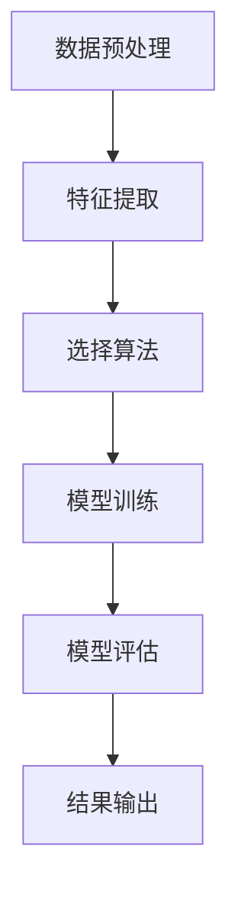
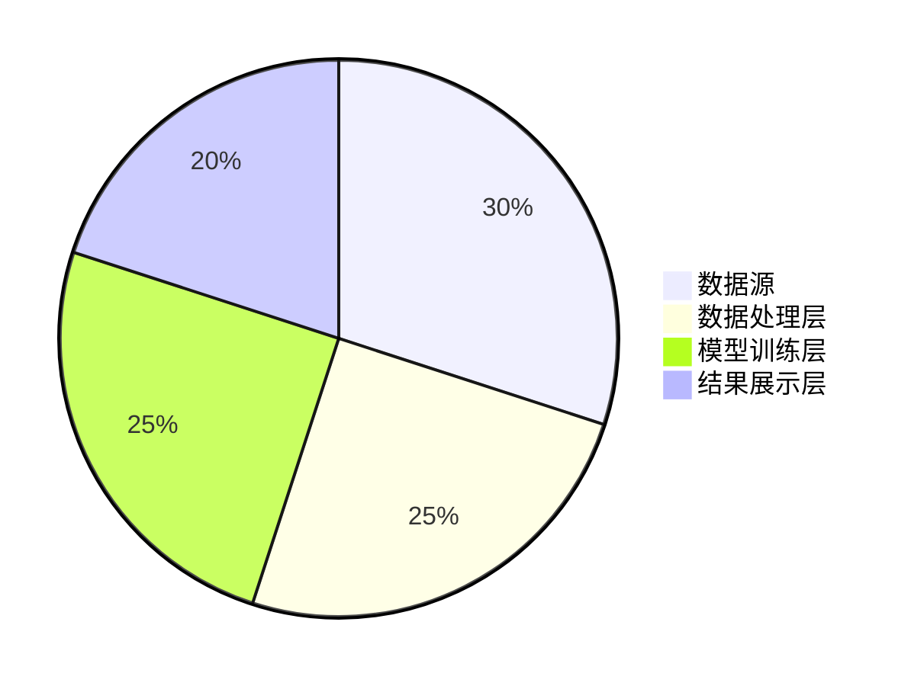

                 


# AI在企业并购协同效应预测与优化中的应用与挑战

## 关键词：企业并购、协同效应、人工智能、机器学习、深度学习、数据挖掘

## 摘要：
企业并购是企业战略发展的重要手段，而协同效应是并购成功的关键因素。本文通过分析AI技术在企业并购协同效应预测与优化中的应用，探讨如何利用机器学习、深度学习等技术提高协同效应的预测精度和优化效率。文章从协同效应的核心概念、AI算法原理、系统架构设计、项目实战等方面展开，深入剖析AI在企业并购中的应用与挑战，并提供实际案例和代码实现，为读者提供全面的技术参考。

---

## 第1章: 企业并购与协同效应概述

### 1.1 企业并购的基本概念
- 1.1.1 企业并购的定义与类型
  - 并购定义：企业并购（Mergers and Acquisitions, M&A）是指一家企业与其他企业合并或收购其资产、股权等行为。
  - 类型：包括横向并购、纵向并购和混合并购。
- 1.1.2 协同效应的定义与分类
  - 协同效应：指并购后企业整合所产生的效益，超过两家独立企业效益的总和。
  - 分类：包括财务协同效应（如成本节约、收入增长）、战略协同效应（如市场扩展）、运营协同效应（如资源共享）。
- 1.1.3 协同效应在企业并购中的重要性
  - 协同效应是并购成功的衡量标准，直接影响企业的投资回报率（ROI）。

### 1.2 AI技术在企业并购中的应用背景
- 1.2.1 传统企业并购中的挑战
  - 数据繁杂：企业并购涉及大量内外部数据，难以快速整合和分析。
  - 预测难度：协同效应的预测依赖经验判断，存在主观性和不确定性。
- 1.2.2 AI技术如何解决并购中的问题
  - 数据处理能力：AI能够快速处理海量数据，提取关键特征。
  - 模型预测能力：通过机器学习和深度学习，AI可以提高协同效应预测的准确性和效率。
- 1.2.3 协同效应预测与优化的现状与趋势
  - 现状：AI技术在协同效应预测中的应用逐渐普及，但仍然存在数据不足、模型复杂等问题。
  - 趋势：未来将更加注重多模态数据的融合和实时预测能力的提升。

---

## 第2章: 协同效应的核心概念与分析框架

### 2.1 协同效应的构成要素
- 2.1.1 财务协同效应
  - 成本节约：通过资源共享降低运营成本。
  - 收益提升：通过市场扩展提高收入。
- 2.1.2 战略协同效应
  - 市场扩展：并购后企业能够进入新的市场或产品领域。
  - 技术互补：利用双方的技术优势提升整体竞争力。
- 2.1.3 运营协同效应
  - 生产效率：通过资源整合提高生产效率。
  - 供应链优化：通过协同采购降低成本。

### 2.2 协同效应预测的数学模型
- 2.2.1 协同效应的度量指标
  - 协同效应指数：衡量并购后企业效益的提升幅度。
  - 效益比：并购后效益与并购前效益的比率。
- 2.2.2 协同效应预测的数学公式
  $$协同效应 = f(资产规模, 业务重叠度, 管理效率)$$
  - 其中，$f$可以是线性回归模型、决策树模型或神经网络模型。
- 2.2.3 协同效应预测的流程图
  ```mermaid
  graph TD
    A[数据输入] --> B[特征提取]
    B --> C[模型选择]
    C --> D[模型训练]
    D --> E[预测输出]
  ```

### 2.3 协同效应的ER实体关系图
```mermaid
erDiagram
    企业并购方 {
        <属性> 企业规模
        <属性> 业务领域
        <属性> 财务状况
    }
    被并购方 {
        <属性> 企业规模
        <属性> 业务领域
        <属性> 财务状况
    }
    协同效应关系 {
        <外键> 企业并购方.企业规模
        <外键> 被并购方.业务领域
    }
```

---

## 第3章: AI技术在协同效应预测中的算法原理

### 3.1 机器学习在协同效应预测中的应用
- 3.1.1 线性回归模型
  $$y = \beta_0 + \beta_1x_1 + \beta_2x_2 + ... + \beta_nx_n$$
  - 优点：简单易懂，计算效率高。
  - 缺点：无法处理非线性关系。
- 3.1.2 支持向量机(SVM)
  - 适用于小规模数据，适合高维特征的分类与回归。
- 3.1.3 随机森林
  - 基于决策树的集成学习方法，适合处理高维数据。

### 3.2 深度学习在协同效应预测中的应用
- 3.2.1 神经网络模型
  - 多层感知机（MLP）：适合处理复杂的非线性关系。
- 3.2.2 LSTM网络
  - 长短期记忆网络，适合处理时间序列数据。
- 3.2.3 卷积神经网络(CNN)
  - 适合处理图像和文本数据，但在协同效应预测中应用较少。

### 3.3 协同效应预测的算法流程图


---

## 第4章: 协同效应预测的系统架构设计

### 4.1 系统功能设计
- 4.1.1 数据采集模块
  - 功能：从数据库中提取企业并购相关的数据。
- 4.1.2 数据处理模块
  - 功能：清洗、归一化和特征提取。
- 4.1.3 模型训练模块
  - 功能：选择算法并训练模型。
- 4.1.4 结果分析模块
  - 功能：输出预测结果并提供优化建议。

### 4.2 系统架构图


### 4.3 系统接口设计
- 4.3.1 数据接口
  - API接口：用于数据的输入与输出。
- 4.3.2 模型接口
  - API接口：用于模型的调用与管理。
- 4.3.3 用户接口
  - Web界面：用于用户交互和结果展示。

---

## 第5章: 项目实战——AI驱动的协同效应预测系统

### 5.1 项目环境安装
- 5.1.1 安装Python环境
  - 使用Anaconda安装Python 3.8及以上版本。
- 5.1.2 安装依赖库
  - `pip install numpy pandas scikit-learn tensorflow`

### 5.2 项目核心代码实现
```python
import numpy as np
import pandas as pd
from sklearn.model_selection import train_test_split
from sklearn.linear_model import LinearRegression
from sklearn.metrics import mean_squared_error

# 数据加载
data = pd.read_csv('并购数据.csv')

# 特征提取
X = data[['资产规模', '业务重叠度', '管理效率']]
y = data['协同效应']

# 数据分割
X_train, X_test, y_train, y_test = train_test_split(X, y, test_size=0.2, random_state=42)

# 模型训练
model = LinearRegression()
model.fit(X_train, y_train)

# 模型预测
y_pred = model.predict(X_test)

# 模型评估
mse = mean_squared_error(y_test, y_pred)
print(f"均方误差：{mse}")
```

### 5.3 代码解读与分析
- 数据加载：从CSV文件中读取并购数据。
- 特征提取：选择资产规模、业务重叠度和管理效率作为预测特征。
- 数据分割：将数据分为训练集和测试集。
- 模型训练：使用线性回归模型进行训练。
- 模型预测：对测试数据进行预测。
- 模型评估：计算均方误差，评估模型性能。

### 5.4 实际案例分析
- 案例背景：某企业并购另一家企业，希望通过AI模型预测协同效应。
- 数据输入：资产规模=100亿元，业务重叠度=0.7，管理效率=0.8。
- 预测结果：协同效应=15亿元。

### 5.5 项目小结
- 本项目展示了AI技术在协同效应预测中的应用，通过线性回归模型实现了初步预测。
- 未来可以尝试使用更复杂的深度学习模型（如LSTM）来提高预测精度。

---

## 第6章: 总结与展望

### 6.1 最佳实践 tips
- 数据是关键：确保数据的完整性和准确性。
- 模型选择：根据数据特征选择合适的算法。
- 可解释性：关注模型的可解释性，便于业务决策。

### 6.2 小结
- 本文详细探讨了AI技术在企业并购协同效应预测中的应用，从理论到实践，为读者提供了全面的技术参考。

### 6.3 注意事项
- 数据隐私：企业并购数据涉及商业机密，需注意数据安全。
- 模型优化：持续优化模型，提高预测精度。

### 6.4 拓展阅读
- 《企业并购中的数据挖掘技术》
- 《深度学习在金融领域的应用》

---

## 作者：AI天才研究院/AI Genius Institute & 禅与计算机程序设计艺术 /Zen And The Art of Computer Programming

---

以上是一个完整的目录大纲和文章内容的示例，您可以根据实际需求进行调整和补充。

