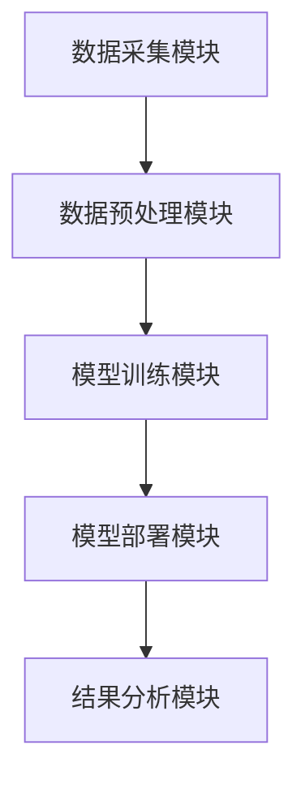

                 


# AI在企业并购协同效应预测中的应用与挑战

> 关键词：企业并购，协同效应，人工智能，机器学习，深度学习

> 摘要：企业并购中的协同效应预测是一个复杂的系统工程，传统方法存在诸多局限性。本文深入分析了AI技术在协同效应预测中的应用，重点探讨了机器学习和深度学习算法的核心原理，结合实际案例，详细阐述了系统设计与实现方案，并展望了未来的研究方向。

---

# 第一部分：企业并购协同效应预测的背景与基础

# 第1章：企业并购协同效应概述

## 1.1 协同效应的基本概念

### 1.1.1 协同效应的定义
协同效应（Synergy）是指在企业并购后，由于资源优化配置和业务整合，所产生的效益超过单独两家公司效益的总和。协同效应的实现通常涉及成本节约、收入增长或效率提升。

### 1.1.2 协同效应的分类
协同效应可以分为两类：
- **成本协同效应**：通过合并运营、共享资源等方式降低成本。
- **收入协同效应**：通过市场扩展、产品互补等方式增加收入。

### 1.1.3 协同效应的衡量指标
协同效应的衡量指标包括：
- 成本节约金额
- 收入增长金额
- 效率提升比例
- 股东价值提升

## 1.2 企业并购中的协同效应

### 1.2.1 企业并购的基本概念
企业并购是指一家企业通过购买另一家企业股权或资产，以实现战略目标的过程。并购可以是横向并购、纵向并购或混合并购。

### 1.2.2 协同效应在企业并购中的重要性
协同效应是企业并购成功的关键因素之一，能够显著提升并购后的企业价值。然而，协同效应的实现受到多种因素的影响，包括企业战略、管理能力、文化整合等。

### 1.2.3 协同效应的实现路径
协同效应的实现路径包括：
- 业务整合
- 资源共享
- 管理优化
- 文化融合

## 1.3 AI在协同效应预测中的应用背景

### 1.3.1 AI技术的发展与应用现状
人工智能技术近年来取得了显著进展，广泛应用于金融、医疗、教育等领域。在企业并购领域，AI技术可以用于协同效应预测、风险评估和并购决策优化。

### 1.3.2 协同效应预测的难点与挑战
协同效应预测的难点包括数据获取难、预测模型复杂、影响因素多样等。传统方法难以准确预测协同效应，而AI技术可以通过大数据分析和机器学习算法提供更精准的预测。

### 1.3.3 AI在协同效应预测中的优势
AI技术的优势在于能够处理海量数据，发现数据中的潜在规律，并通过模型优化实现精准预测。AI技术还可以实时更新模型，适应市场变化。

## 1.4 本书的研究目标与意义

### 1.4.1 研究目标
本书旨在探讨AI技术在企业并购协同效应预测中的应用，分析传统方法的局限性，提出基于机器学习和深度学习的预测模型，并通过实际案例验证模型的可行性。

### 1.4.2 研究意义
通过研究AI技术在协同效应预测中的应用，可以为企业的并购决策提供科学依据，降低并购风险，提升并购成功率。

### 1.4.3 本书的结构安排
本书共分为六章，内容安排如下：
1. 企业并购协同效应概述
2. 协同效应预测的核心概念与联系
3. 协同效应预测的算法原理
4. 协同效应预测的系统分析与架构设计
5. 协同效应预测的项目实战
6. 总结与展望

---

# 第2章：协同效应预测的核心概念与联系

## 2.1 协同效应预测的核心要素

### 2.1.1 企业并购的基本要素
企业并购的基本要素包括并购方、被并购方、并购价格、并购方式等。

### 2.1.2 协同效应的影响因素
协同效应的影响因素包括行业、规模、地理位置、管理能力、文化差异等。

### 2.1.3 数据驱动的协同效应预测
数据驱动的协同效应预测需要收集和分析大量数据，包括财务数据、业务数据、市场数据等。

## 2.2 协同效应预测的理论基础

### 2.2.1 协同效应的经济学理论
协同效应的经济学理论包括规模经济、范围经济等，这些理论为协同效应预测提供了理论依据。

### 2.2.2 协同效应的管理学理论
协同效应的管理学理论包括战略管理、组织行为学等，这些理论为协同效应预测提供了管理依据。

### 2.2.3 协同效应的数学模型
协同效应的数学模型包括线性回归模型、多元回归模型等，这些模型为协同效应预测提供了数学工具。

## 2.3 协同效应预测的核心概念对比

### 2.3.1 协同效应与企业绩效的关系
协同效应与企业绩效密切相关，协同效应的实现能够显著提升企业绩效。

### 2.3.2 协同效应与企业战略的关系
协同效应是企业战略的重要组成部分，企业战略的制定和实施直接影响协同效应的实现。

### 2.3.3 协同效应与企业文化的关联
协同效应的实现需要企业文化的支撑，良好的企业文化能够促进协同效应的实现。

## 2.4 协同效应预测的ER实体关系图

```mermaid
er
actor: 协同效应预测系统
model: 协同效应预测模型
data: 并购数据
result: 预测结果
actor --> model: 输入数据
model --> result: 输出预测结果
data --> model: 数据支持
```

---

# 第3章：协同效应预测的算法原理

## 3.1 协同效应预测的算法概述

### 3.1.1 传统统计方法
传统统计方法包括线性回归、多元回归等，这些方法简单易懂，但预测精度有限。

### 3.1.2 机器学习算法
机器学习算法包括决策树、随机森林、支持向量机等，这些算法能够处理非线性关系，预测精度更高。

### 3.1.3 深度学习算法
深度学习算法包括神经网络、卷积神经网络等，这些算法能够自动提取特征，预测精度更高。

## 3.2 协同效应预测模型的构建

### 3.2.1 数据预处理
数据预处理包括数据清洗、数据转换、数据标准化等。

### 3.2.2 特征选择
特征选择包括特征筛选、特征降维等，目的是提高模型的预测精度。

### 3.2.3 模型训练
模型训练包括选择合适的算法、调整模型参数、训练模型等。

## 3.3 协同效应预测算法的实现

### 3.3.1 机器学习算法的实现
以下是一个基于随机森林算法的协同效应预测模型的实现示例：

```python
import pandas as pd
from sklearn.ensemble import RandomForestRegressor
from sklearn.metrics import mean_squared_error

# 数据加载
data = pd.read_csv('并购数据.csv')

# 特征与标签分离
X = data.drop('协同效应', axis=1)
y = data['协同效应']

# 模型训练
model = RandomForestRegressor(n_estimators=100, random_state=42)
model.fit(X, y)

# 模型预测
y_pred = model.predict(X)

# 模型评估
print(mean_squared_error(y, y_pred))
```

### 3.3.2 深度学习算法的实现
以下是一个基于神经网络的协同效应预测模型的实现示例：

```python
import tensorflow as tf
from tensorflow.keras import layers

# 数据加载
data = pd.read_csv('并购数据.csv')

# 特征与标签分离
X = data.drop('协同效应', axis=1)
y = data['协同效应']

# 数据预处理
X = X.values.reshape(-1, 1)
y = y.values.reshape(-1, 1)

# 模型构建
model = tf.keras.Sequential([
    layers.Dense(64, activation='relu'),
    layers.Dense(1)
])

# 模型编译
model.compile(optimizer='adam', loss='mean_squared_error')

# 模型训练
model.fit(X, y, epochs=100, batch_size=32)

# 模型预测
y_pred = model.predict(X)

# 模型评估
print(mean_squared_error(y, y_pred))
```

## 3.4 协同效应预测算法的数学模型

### 3.4.1 线性回归模型
线性回归模型的数学表达式为：
$$ y = \beta_0 + \beta_1 x_1 + \beta_2 x_2 + \ldots + \beta_n x_n + \epsilon $$
其中，$y$ 是预测目标，$x_i$ 是输入特征，$\beta_i$ 是回归系数，$\epsilon$ 是误差项。

### 3.4.2 随机森林模型
随机森林模型是一种基于决策树的集成学习算法，其数学表达式为：
$$ y = \sum_{i=1}^{n} \text{Tree}_i(x) $$
其中，$\text{Tree}_i(x)$ 是第 $i$ 棵决策树的预测结果，$n$ 是决策树的数量。

### 3.4.3 神经网络模型
神经网络模型的数学表达式为：
$$ y = f(W_1 x + b_1) $$
$$ z = f(W_2 y + b_2) $$
其中，$x$ 是输入特征，$W$ 是权重矩阵，$b$ 是偏置项，$f$ 是激活函数。

---

# 第4章：协同效应预测的系统分析与架构设计

## 4.1 问题场景介绍

### 4.1.1 问题背景
企业并购协同效应预测是一个复杂的系统工程，涉及多个业务领域和数据源。

### 4.1.2 问题描述
企业并购协同效应预测需要考虑的因素包括行业、规模、地理位置、管理能力等。

## 4.2 项目介绍

### 4.2.1 项目目标
项目目标是通过AI技术实现企业并购协同效应的精准预测。

### 4.2.2 项目范围
项目范围包括数据采集、模型训练、模型部署和结果分析。

## 4.3 系统功能设计

### 4.3.1 系统功能模块
系统功能模块包括数据采集模块、模型训练模块、模型部署模块和结果分析模块。

### 4.3.2 系统功能流程
系统功能流程包括数据采集、数据预处理、模型训练、模型部署和结果分析。

## 4.4 系统架构设计

### 4.4.1 系统架构图
以下是协同效应预测系统的架构图：



### 4.4.2 系统接口设计
系统接口设计包括数据接口、模型接口和结果接口。

### 4.4.3 系统交互流程
系统交互流程包括用户请求、数据处理、模型预测和结果返回。

---

# 第5章：协同效应预测的项目实战

## 5.1 环境安装与配置

### 5.1.1 环境需求
项目需要安装Python、TensorFlow、Scikit-learn等依赖库。

### 5.1.2 环境配置
安装Python 3.8以上版本，安装TensorFlow 2.0以上版本，安装Scikit-learn 0.24以上版本。

## 5.2 系统核心实现

### 5.2.1 数据采集与处理
数据采集与处理包括数据清洗、数据转换、数据标准化等。

### 5.2.2 模型训练与优化
模型训练与优化包括选择合适的算法、调整模型参数、训练模型等。

### 5.2.3 模型部署与应用
模型部署与应用包括将模型部署到生产环境，提供API接口，供其他系统调用。

## 5.3 实际案例分析

### 5.3.1 案例背景
某企业计划并购另一家企业，希望通过AI技术预测并购后的协同效应。

### 5.3.2 数据分析
通过数据分析，发现两家企业的协同效应潜力较大，但存在一定的风险因素。

### 5.3.3 模型预测
模型预测结果显示，协同效应为正，但需要关注文化整合和管理优化。

## 5.4 项目小结

### 5.4.1 项目成果
项目成果包括一个协同效应预测模型和一个基于模型的预测系统。

### 5.4.2 项目经验
项目经验包括数据获取难、模型调优难、系统部署难等挑战。

### 5.4.3 项目总结
项目总结包括AI技术在协同效应预测中的优势和局限性。

---

# 第6章：总结与展望

## 6.1 本书的核心内容总结

### 6.1.1 协同效应预测的核心概念
协同效应预测的核心概念包括协同效应的定义、分类和衡量指标。

### 6.1.2 AI技术的应用优势
AI技术的应用优势包括数据处理能力强、预测精度高、适应性好。

## 6.2 协同效应预测的未来发展方向

### 6.2.1 算法优化
未来可以通过优化算法结构、引入新的算法模型等方式提升协同效应预测的精度。

### 6.2.2 数据融合
未来可以通过融合更多的数据源、引入新的数据类型等方式提升协同效应预测的全面性。

### 6.2.3 系统集成
未来可以通过系统集成、模块优化等方式提升协同效应预测系统的效率和稳定性。

## 6.3 本书的不足与展望

### 6.3.1 本书的不足
本书主要探讨了AI技术在协同效应预测中的应用，但对实际应用中的法律、伦理等问题探讨不足。

### 6.3.2 未来展望
未来可以进一步研究AI技术在企业并购中的其他应用，如风险评估、决策优化等。

---

# 作者：AI天才研究院/AI Genius Institute & 禅与计算机程序设计艺术 /Zen And The Art of Computer Programming

