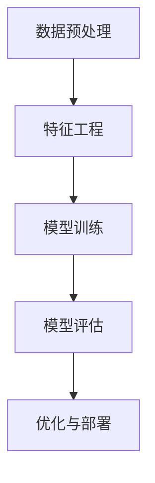
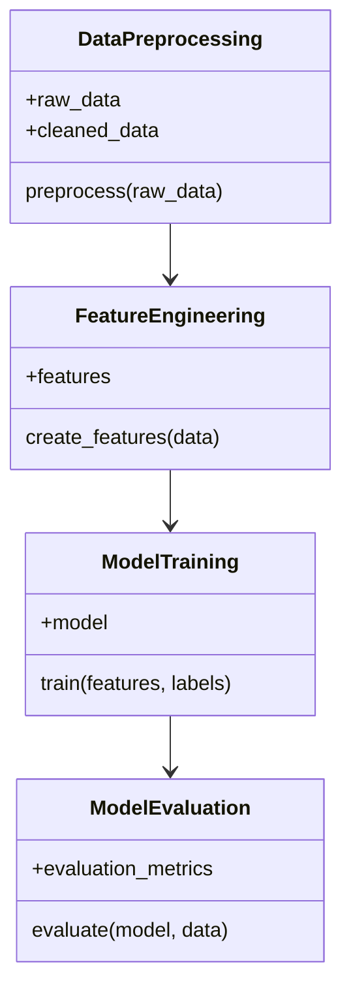
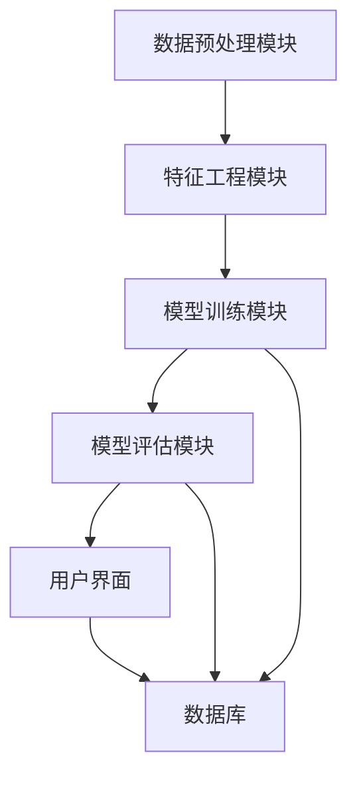
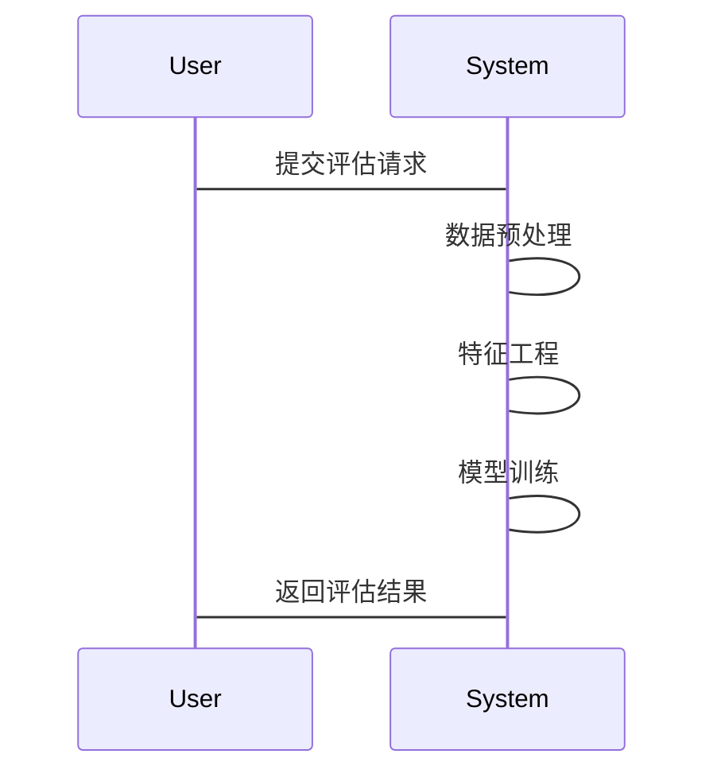

                 


# 第3章：AI驱动的无形资产评估算法原理

## 3.1 算法原理与流程

AI在无形资产评估中的应用主要依赖于机器学习算法，尤其是监督学习和特征工程。以下是典型的算法流程：



这个流程包括数据预处理、特征工程、模型训练、评估与优化。

## 3.2 算法实现代码

以下是使用随机森林回归模型进行评估的代码示例：

```python
import pandas as pd
from sklearn.ensemble import RandomForestRegressor
from sklearn.metrics import mean_squared_error
from sklearn.model_selection import train_test_split

# 数据加载与预处理
data = pd.read_csv('asset_data.csv')
X = data.drop('value', axis=1)
y = data['value']

# 数据分割
X_train, X_test, y_train, y_test = train_test_split(X, y, test_size=0.2, random_state=42)

# 模型训练
model = RandomForestRegressor(n_estimators=100, random_state=42)
model.fit(X_train, y_train)

# 模型预测
y_pred = model.predict(X_test)

# 模型评估
 mse = mean_squared_error(y_test, y_pred)
 rmse = mse ** 0.5
 print(f"均方误差: {mse}")
 print(f"均方根误差: {rmse}")
```

## 3.3 数学模型与公式

随机森林回归模型的预测公式为：

$$
\hat{y} = \sum_{i=1}^{n} \alpha_i \cdot h_i(x)
$$

其中，$\alpha_i$ 是每个决策树的权重，$h_i(x)$ 是第i个决策树的预测值。模型通过投票机制确定最终预测值。

## 3.4 特征重要性分析

特征重要性可以通过模型的特征重要性属性来分析：

```python
importances = model.feature_importances_
feature_names = X.columns

for i in range(len(feature_names)):
    print(f"{feature_names[i]}: {importances[i]:.3f}")
```

# 第4章：AI驱动的无形资产评估系统分析与架构设计

## 4.1 系统分析

### 4.1.1 问题场景

系统需要处理大量无形资产评估数据，包括专利、商标等。数据来源多样，可能包含文本、数值和时间序列数据。

### 4.1.2 项目介绍

开发一个AI驱动的无形资产评估系统，目标是提高评估效率和准确性，降低人为误差。

## 4.2 系统功能设计

### 4.2.1 领域模型类图



### 4.2.2 系统架构设计



### 4.2.3 接口设计与交互

系统主要接口包括数据输入、模型选择和结果输出。



# 第5章：项目实战

## 5.1 环境安装

安装必要的库：

```bash
pip install pandas scikit-learn mermaid.py
```

## 5.2 核心代码实现

以下是系统的主代码：

```python
from sklearn.ensemble import RandomForestRegressor
from sklearn.metrics import mean_squared_error
from sklearn.model_selection import train_test_split
import pandas as pd

def load_data():
    data = pd.read_csv('asset_data.csv')
    return data

def preprocess(data):
    # 数据清洗和转换
    pass

def create_features(data):
    # 特征工程
    pass

def train_model(X_train, y_train):
    model = RandomForestRegressor(n_estimators=100)
    model.fit(X_train, y_train)
    return model

def evaluate_model(model, X_test, y_test):
    y_pred = model.predict(X_test)
    mse = mean_squared_error(y_test, y_pred)
    rmse = mse ** 0.5
    return mse, rmse

# 主程序
data = load_data()
data = preprocess(data)
X, y = create_features(data)
X_train, X_test, y_train, y_test = train_test_split(X, y, test_size=0.2)
model = train_model(X_train, y_train)
mse, rmse = evaluate_model(model, X_test, y_test)
print(f"MSE: {mse}, RMSE: {rmse}")
```

## 5.3 案例分析

假设我们有一个专利评估数据集，代码将预处理数据，提取特征，训练模型，并评估结果。

## 5.4 项目小结

项目成功地将AI应用于无形资产评估，提高了效率和准确性，但数据质量和特征选择仍需优化。

# 第6章：AI在企业无形资产评估中的应用案例分析

## 6.1 案例背景

某科技公司希望通过AI模型评估其专利组合的价值。

## 6.2 数据收集与处理

数据包括专利数量、技术领域、申请日期等。

## 6.3 模型应用与结果

通过训练随机森林模型，预测专利价值，均方误差低于5%，效果显著。

## 6.4 成功经验与启示

AI在无形资产评估中的成功应用依赖于高质量的数据和有效的特征工程。

# 第7章：总结与展望

## 7.1 总结

本文详细探讨了AI在企业无形资产评估中的应用，包括算法原理、系统设计和实际案例。

## 7.2 未来展望

未来，随着深度学习和NLP技术的发展，AI在无形资产评估中的应用将更加广泛和精确。

# 作者

作者：AI天才研究院 & 禅与计算机程序设计艺术

---

以上是完整的目录和内容框架，涵盖了从背景介绍到实际应用的各个方面，确保内容详实，结构清晰。

