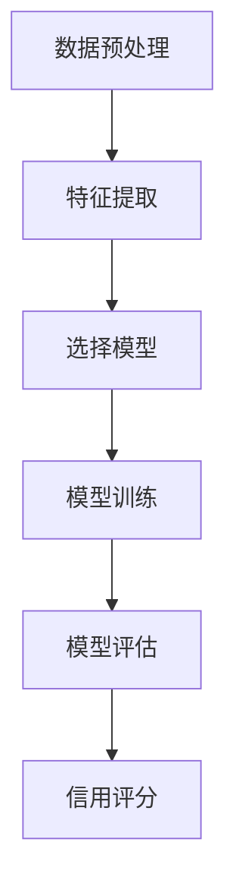
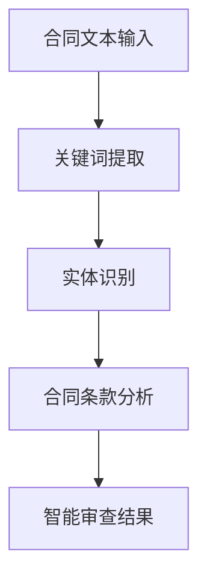
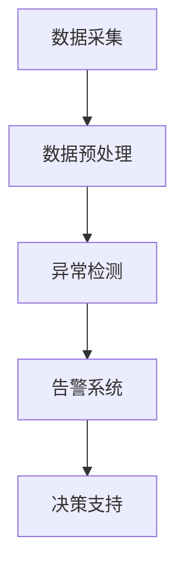

                 


# AI在供应链金融中的深度应用研究

> 关键词：供应链金融，人工智能，机器学习，NLP，图神经网络，风险管理

> 摘要：供应链金融作为现代金融体系的重要组成部分，通过整合供应链上的资金流、信息流和物流，为企业提供更高效的资金管理服务。随着人工智能技术的快速发展，AI在供应链金融中的应用日益广泛，从风险评估、信用管理到智能合同审核、流程优化，AI技术正在改变供应链金融的传统模式。本文将从供应链金融的基本概念、AI技术的核心应用、系统架构设计、项目实战案例等多个方面，深入探讨AI在供应链金融中的深度应用，结合实际案例和理论分析，为读者提供全面的视角。

---

## 第一部分: 供应链金融与AI的结合概述

### 第1章: 供应链金融的基本概念与现状

#### 1.1 供应链金融的定义与特点

##### 1.1.1 供应链金融的定义
供应链金融是一种通过整合供应链上的资金流、信息流和物流，为供应链上的企业（尤其是中小企业）提供融资支持的金融服务模式。其核心在于将企业的信用评估与供应链上的交易数据相结合，降低融资门槛，提高融资效率。

##### 1.1.2 供应链金融的核心特点
- **数据驱动**：依赖供应链上的交易数据、物流数据和资金流动数据。
- **多方参与**：涉及企业、金融机构、物流平台等多个主体。
- **风险可控**：通过数据整合和模型分析，降低信用风险和操作风险。
- **高效便捷**：通过数字化技术实现快速融资和资金管理。

##### 1.1.3 供应链金融的参与者与流程
参与者包括核心企业、供应商、客户、金融机构（银行、保理公司等）、物流公司和技术服务提供商。流程通常包括需求分析、信用评估、融资申请、资金发放和贷后管理。

**示意图：供应链金融参与者的ER图**

```mermaid
erDiagram
    actor 顾客
    actor 供应商
    actor 银行
    actor 核心企业
    actor 物流公司
    actor 技术服务提供商
    core-enterprise <--- supplier
    core-enterprise <--- customer
    core-enterprise <--- bank
    core-enterprise <--- logistics
    core-enterprise <--- tech-provider
```

---

#### 1.2 AI在供应链金融中的应用背景

##### 1.2.1 供应链金融的传统挑战
- **信息孤岛**：供应链上的数据分散在不同企业，难以整合。
- **信用评估复杂**：中小企业融资难，传统信用评估方法效率低。
- **风险控制不足**：难以实时监控供应链上的异常事件。
- **流程繁琐**：融资申请、审批、放款等流程耗时长，人工干预多。

##### 1.2.2 AI技术如何解决供应链金融问题
- **数据整合与分析**：AI可以通过自然语言处理（NLP）和机器学习技术，整合供应链上的非结构化数据和结构化数据。
- **实时监控与预测**：通过AI技术，可以实时分析供应链上的风险事件，并提前预测潜在问题。
- **自动化流程**：AI可以实现合同审核、融资申请等流程的自动化，提高效率。

##### 1.2.3 当前AI在供应链金融中的应用现状
AI技术在供应链金融中的应用还处于起步阶段，但已经取得了一些成果。例如，基于机器学习的信用评分模型、基于NLP的合同智能审查系统等。

---

#### 1.3 供应链金融的数字化转型趋势

##### 1.3.1 数字化转型的定义与目标
数字化转型是指通过信息技术手段，将传统的业务流程、管理模式等数字化，以提高效率、降低成本、增强竞争力。供应链金融的数字化转型目标是实现供应链上数据的互联互通，提高融资效率，降低融资成本。

##### 1.3.2 AI在数字化转型中的作用
AI技术是供应链金融数字化转型的核心驱动力。通过AI技术，可以实现供应链数据的智能分析、风险的智能预测、流程的智能优化。

##### 1.3.3 未来供应链金融的发展趋势
未来的供应链金融将更加依赖AI技术，实现供应链的智能化管理。AI将不仅限于信用评估和风险控制，还将应用于供应链优化、智能决策等领域。

---

## 第2章: AI在供应链金融中的核心应用领域

### 2.1 风险评估与信用管理

#### 2.1.1 风险评估的传统方法
传统的信用评估方法主要依赖财务报表分析、历史交易记录等。这种方法效率低、成本高，且难以覆盖中小企业。

#### 2.1.2 基于AI的信用评分模型
基于机器学习的信用评分模型可以通过分析供应链上的交易数据、物流数据等，构建更加精准的信用评分模型。

**示意图：基于机器学习的信用评分模型流程图**



#### 2.1.3 AI在信用风险管理中的优势
- **数据驱动**：AI可以利用供应链上的多源数据进行分析，提高信用评估的准确性。
- **实时监控**：AI可以实时监控供应链上的风险事件，提前预警潜在问题。
- **自动化决策**：AI可以通过模型自动进行信用评分和风险分类。

---

### 2.2 智能合同管理与流程优化

#### 2.2.1 合同管理的痛点分析
传统合同管理存在效率低、人工成本高、易出错等问题。合同审核、归档、查询等流程耗时长，且容易出错。

#### 2.2.2 基于NLP的合同智能审查
基于自然语言处理技术的合同智能审查系统可以通过关键词提取、实体识别等技术，自动识别合同中的关键条款。

**示意图：基于NLP的合同智能审查流程图**



#### 2.2.3 AI驱动的流程自动化
通过AI技术，可以实现合同审核、审批、归档等流程的自动化，提高合同管理效率。

---

### 2.3 智能监控与异常检测

#### 2.3.1 供应链中的异常检测需求
供应链金融中的异常检测需求主要体现在交易数据异常、物流延迟、资金流动异常等方面。

#### 2.3.2 基于AI的实时监控系统
基于AI的实时监控系统可以通过时间序列分析、异常检测算法等技术，实时监控供应链上的异常事件。

**示意图：基于AI的实时监控系统架构图**



#### 2.3.3 异常事件的预测与应对
通过AI技术，可以预测潜在的异常事件，并提前制定应对策略，降低供应链金融的风险。

---

## 第3章: AI技术在供应链金融中的实现原理

### 3.1 机器学习在供应链金融中的应用

#### 3.1.1 机器学习的基本原理
机器学习是一种人工智能技术，通过数据训练模型，实现对新数据的预测和分类。

#### 3.1.2 常见机器学习算法在供应链金融中的应用
常用的机器学习算法包括逻辑回归、支持向量机（SVM）、随机森林、梯度提升树（如XGBoost）等。

#### 3.1.3 机器学习模型的训练与部署
模型训练需要进行数据预处理、特征选择、模型训练和评估等步骤。模型部署可以通过API接口实现，供其他系统调用。

---

### 3.2 自然语言处理在供应链金融中的应用

#### 3.2.1 NLP的基本原理
自然语言处理（NLP）是人工智能的一个分支，致力于让计算机理解和处理人类语言。

#### 3.2.2 基于NLP的合同文本分析
基于NLP技术，可以实现合同文本的自动分析，提取关键条款、识别合同风险等。

#### 3.2.3 NLP在供应商信息提取中的应用
通过NLP技术，可以从供应商的历史交易记录、市场评价等非结构化数据中提取有用信息，辅助信用评估。

---

### 3.3 图神经网络在供应链金融中的应用

#### 3.3.1 图神经网络的基本原理
图神经网络（GNN）是一种适用于图结构数据的深度学习模型，可以处理节点之间的关系和依赖。

#### 3.3.2 供应链关系图的构建与分析
可以通过图神经网络构建供应链关系图，分析供应商与客户之间的关系，识别潜在风险。

#### 3.3.3 图神经网络在风险传播中的应用
图神经网络可以用于分析风险在供应链中的传播路径，预测风险的影响范围。

---

## 第4章: 供应链金融AI系统的架构与设计

### 4.1 系统架构设计

#### 4.1.1 分层架构设计
供应链金融AI系统的分层架构通常包括数据层、服务层和应用层。

#### 4.1.2 微服务架构设计
采用微服务架构可以提高系统的可扩展性和可维护性，每个服务负责特定的功能模块。

#### 4.1.3 可扩展性与可维护性设计
通过模块化设计和容器化技术，可以提高系统的可扩展性和可维护性。

---

### 4.2 数据流与系统模块

#### 4.2.1 数据采集模块
数据采集模块负责从供应链上的企业获取数据，包括交易数据、物流数据等。

#### 4.2.2 数据处理模块
数据处理模块负责对采集到的数据进行清洗、转换和特征提取。

#### 4.2.3 AI模型训练与部署模块
AI模型训练与部署模块负责对数据进行建模、训练和部署，供系统调用。

---

## 第5章: 项目实战

### 5.1 环境安装与配置

#### 5.1.1 安装Python环境
需要安装Python 3.6及以上版本，建议使用Anaconda或virtualenv管理虚拟环境。

#### 5.1.2 安装依赖库
需要安装的库包括：numpy、pandas、scikit-learn、tensorflow、pytorch等。

---

### 5.2 核心代码实现

#### 5.2.1 数据预处理代码
```python
import pandas as pd
import numpy as np

# 读取数据
data = pd.read_csv('supply_chain_data.csv')

# 数据清洗
data.dropna(inplace=True)

# 特征提取
X = data.drop('target', axis=1)
y = data['target']
```

#### 5.2.2 机器学习模型实现
```python
from sklearn.ensemble import RandomForestClassifier
from sklearn.metrics import accuracy_score

# 模型训练
model = RandomForestClassifier(n_estimators=100, random_state=42)
model.fit(X_train, y_train)

# 模型预测
y_pred = model.predict(X_test)
print('Accuracy:', accuracy_score(y_test, y_pred))
```

---

### 5.3 实际案例分析

#### 5.3.1 案例背景
假设某供应链企业希望利用AI技术优化其信用评估流程，降低融资成本。

#### 5.3.2 案例分析
通过机器学习模型对供应链上的交易数据进行分析，构建信用评分模型，评估供应商的信用风险。

---

## 第6章: 未来展望与总结

### 6.1 未来发展趋势

#### 6.1.1 技术创新
随着AI技术的不断发展，供应链金融将更加智能化和自动化。

#### 6.1.2 应用场景拓展
AI技术在供应链金融中的应用将拓展到更多领域，如智能决策、供应链优化等。

#### 6.1.3 数据安全与隐私保护
随着数据的广泛应用，数据安全和隐私保护将成为供应链金融AI系统设计的重要考虑因素。

---

### 6.2 总结

AI技术正在深刻改变供应链金融的传统模式，通过数据驱动、智能分析和自动化流程优化，AI技术为供应链金融带来了新的发展机遇。然而，AI技术的应用也面临数据安全、模型解释性等挑战，需要进一步研究和探索。

---

## 作者：AI天才研究院/AI Genius Institute & 禅与计算机程序设计艺术 /Zen And The Art of Computer Programming

