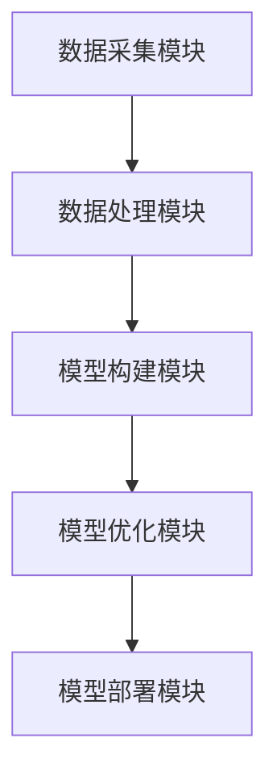

                 


# AI在供应链金融信用网络优化中的深度应用

## 关键词：供应链金融，信用网络优化，人工智能，图神经网络，风险评估，信用评分，深度学习

## 摘要：  
随着供应链金融的数字化转型加速，信用网络优化成为提升供应链效率和降低风险的关键。本文深入探讨人工智能技术在供应链金融信用网络优化中的应用，涵盖信用评分模型、风险评估、网络结构优化等核心领域。通过图神经网络、机器学习等技术手段，结合实际案例分析，揭示AI如何提升信用网络的准确性和效率，为供应链金融的未来发展提供理论与实践指导。

---

# 第一部分: 供应链金融与信用网络优化的背景介绍

## 第1章: 供应链金融的定义与现状

### 1.1 供应链金融的基本概念

#### 1.1.1 供应链金融的定义  
供应链金融（Supply Chain Finance, SCF）是指通过整合供应链上的企业、供应商、制造商、分销商和零售商等参与方，利用金融工具优化资金流动和风险控制的一种管理方式。其核心在于通过协调各方的财务需求，降低供应链整体的运营成本和风险。

#### 1.1.2 供应链金融的核心要素  
- **参与方**：包括供应商、制造商、分销商、零售商、银行、物流服务提供商等。
- **资金流动**：涉及应收账款、应付账款、存货融资等金融工具。
- **风险控制**：通过信用评估、担保、保险等方式降低供应链中的财务风险。

#### 1.1.3 供应链金融的参与者与流程  
供应链金融的参与者包括直接参与供应链生产和分销的企业，以及为这些企业提供金融服务的金融机构。流程通常涉及融资申请、信用评估、资金发放、监控与管理等环节。

### 1.2 供应链金融的现状与挑战

#### 1.2.1 传统供应链金融的痛点  
- **信息不对称**：供应链上的企业之间可能存在信息不透明，导致融资困难。
- **效率低下**：传统模式下，融资审批流程复杂，耗时较长。
- **风险控制不足**：缺乏有效的风险评估手段，导致融资成本高企。

#### 1.2.2 数字化转型的必要性  
随着大数据、人工智能等技术的发展，供应链金融正在向数字化、智能化方向转型。通过技术手段优化信息流动、提升效率、降低风险成为行业趋势。

#### 1.2.3 AI技术在供应链金融中的应用前景  
人工智能技术在信用评估、风险预测、流程优化等方面具有显著优势，为供应链金融的数字化转型提供了新的可能性。

## 第2章: 信用网络优化的背景与问题描述

### 2.1 信用网络的基本概念

#### 2.1.1 信用网络的定义  
信用网络是指供应链中的企业之间通过信用关系形成的网络结构，包括企业间的赊销、应收账款等信用行为。

#### 2.1.2 信用网络的核心要素  
- **节点**：供应链中的企业，如供应商、制造商、分销商等。
- **边**：企业之间的信用关系，如应收账款、应付账款等。
- **权重**：信用关系的强度，通常由交易金额、交易频率等因素决定。

#### 2.1.3 信用网络的结构与特点  
信用网络通常表现为复杂的图结构，节点之间通过边连接，边的权重反映了信用关系的强度。信用网络的优化目标是通过调整节点之间的关系，降低整体风险，提升融资效率。

### 2.2 供应链金融中的信用风险

#### 2.2.1 信用风险的定义与分类  
信用风险是指债务人或交易对手方因信用状况恶化而无法履行其义务，导致债权人遭受损失的风险。在供应链金融中，信用风险主要表现为供应商或客户无法偿还债务的风险。

#### 2.2.2 信用风险在供应链金融中的表现  
- **直接风险**：某一节点企业的信用违约直接影响整个供应链的稳定性。
- **间接风险**：一家企业的信用问题可能通过供应链传导至其他企业，引发连锁反应。

#### 2.2.3 信用风险的评估与管理  
传统的信用风险评估方法依赖于财务报表分析和经验判断，但存在主观性强、效率低、覆盖面窄等问题。AI技术可以通过大数据分析和模型优化，提升信用风险的评估精度和效率。

### 2.3 信用网络优化的目标与意义

#### 2.3.1 优化信用网络的目标  
- **降低整体风险**：通过优化信用网络结构，减少信用违约的发生概率。
- **提升融资效率**：优化信用网络后，金融机构可以更快速地评估企业的信用状况，提高融资效率。
- **降低融资成本**：通过优化信用网络，减少金融机构的风险敞口，从而降低融资成本。

#### 2.3.2 优化信用网络的意义  
信用网络优化可以有效降低供应链金融中的信用风险，提升供应链的整体稳定性和竞争力。同时，优化后的信用网络可以为金融机构提供更精准的信用评估依据，促进供应链金融的健康发展。

#### 2.3.3 优化信用网络的边界与外延  
信用网络优化的边界在于供应链中的信用关系，优化的外延包括与供应链相关的物流、信息流、资金流等多个方面。优化信用网络需要综合考虑供应链的各个环节，确保整体优化效果。

---

## 第3章: 信用网络优化的核心概念与原理

### 3.1 信用网络优化的核心概念

#### 3.1.1 信用评分模型  
信用评分模型是一种用于评估企业信用状况的数学模型，通常基于企业的财务数据、市场表现、历史交易记录等因素。常用的信用评分模型包括逻辑回归模型、决策树模型、随机森林模型等。

#### 3.1.2 信用风险评估  
信用风险评估是通过分析企业的信用历史、财务状况、市场环境等因素，预测企业在未来可能出现的信用违约概率。AI技术可以通过机器学习算法，构建更加精准的信用风险评估模型。

#### 3.1.3 信用网络的构建与优化  
信用网络的构建需要将供应链中的企业作为节点，企业之间的信用关系作为边，构建一个图结构。优化信用网络的目标是通过调整边的权重和节点之间的关系，降低整体风险。

### 3.2 AI技术在信用网络优化中的应用

#### 3.2.1 机器学习在信用评分中的应用  
机器学习技术可以通过对企业历史数据的分析，构建信用评分模型，预测企业的信用状况。常用的机器学习算法包括支持向量机（SVM）、随机森林、梯度提升树（GBDT）等。

#### 3.2.2 图神经网络在信用网络中的应用  
图神经网络（Graph Neural Network, GNN）是一种适用于图数据的深度学习模型，可以有效捕捉信用网络中节点之间的关系，提升信用风险评估的准确性。

#### 3.2.3 自然语言处理在信用信息分析中的应用  
自然语言处理（NLP）技术可以用于分析企业的文本数据，如财务报告、新闻报道等，提取有价值的信息，辅助信用评分模型的构建。

---

## 第4章: 信用网络优化的核心要素与关系

### 4.1 信用网络优化的核心要素

#### 4.1.1 供应链参与方  
供应链参与方包括供应商、制造商、分销商、零售商等。每个参与方在信用网络中的角色和权重不同，影响整体信用网络的结构和优化效果。

#### 4.1.2 信用评分  
信用评分是评估企业信用状况的重要指标，通常基于企业的财务数据、市场表现、历史交易记录等因素。信用评分越高，企业在供应链中的信用关系越稳定。

#### 4.1.3 风险评估指标  
风险评估指标包括信用违约概率、违约损失率、风险敞口等，是信用网络优化的重要依据。

### 4.2 信用网络优化的实体关系图

```mermaid
er
actor: 供应链参与方
actor -|> transaction: 交易记录
actor -|> credit_score: 信用评分
transaction -|> risk_assessment: 风险评估
```

---

## 第5章: 信用网络优化的算法原理与实现

### 5.1 信用网络优化的算法原理

#### 5.1.1 图神经网络算法  
图神经网络是一种适用于图数据的深度学习模型，可以有效捕捉信用网络中节点之间的关系。常用的图神经网络算法包括图卷积网络（GCN）、图注意力网络（GAT）等。

#### 5.1.2 机器学习算法  
机器学习算法可以用于信用评分模型的构建，常用的算法包括逻辑回归、支持向量机（SVM）、随机森林、梯度提升树（GBDT）等。

#### 5.1.3 风险评估模型  
风险评估模型可以通过机器学习算法，基于企业的历史数据和实时数据，预测企业的信用违约概率。

### 5.2 信用网络优化的实现步骤

#### 5.2.1 数据采集与预处理  
数据采集包括企业财务数据、交易记录、市场信息等，预处理步骤包括数据清洗、特征提取、数据标准化等。

#### 5.2.2 模型构建与训练  
基于预处理后的数据，构建信用评分模型或风险评估模型，并进行模型训练。

#### 5.2.3 模型优化与部署  
通过交叉验证、超参数调优等方法优化模型性能，并将优化后的模型部署到实际业务场景中。

---

## 第6章: 信用网络优化的系统架构与设计

### 6.1 系统功能设计

#### 6.1.1 数据采集模块  
负责采集供应链参与方的财务数据、交易记录、市场信息等。

#### 6.1.2 数据处理模块  
对采集到的数据进行清洗、特征提取、数据标准化等预处理操作。

#### 6.1.3 模型构建模块  
基于预处理后的数据，构建信用评分模型或风险评估模型。

#### 6.1.4 模型优化模块  
通过交叉验证、超参数调优等方法优化模型性能。

#### 6.1.5 模型部署模块  
将优化后的模型部署到实际业务场景中，提供信用评分、风险评估等服务。

### 6.2 系统架构设计



---

## 第7章: 信用网络优化的项目实战与案例分析

### 7.1 项目背景与目标

#### 7.1.1 项目背景  
某供应链企业希望通过优化信用网络，降低整体信用风险，提升融资效率。

#### 7.1.2 项目目标  
- 构建信用评分模型，评估供应链参与方的信用状况。
- 优化信用网络结构，降低整体风险。
- 提升融资效率，降低融资成本。

### 7.2 项目实施步骤

#### 7.2.1 数据采集与预处理  
采集供应链参与方的财务数据、交易记录、市场信息等，进行数据清洗、特征提取、数据标准化等预处理操作。

#### 7.2.2 模型构建与训练  
基于预处理后的数据，构建信用评分模型，并进行模型训练。

#### 7.2.3 模型优化与部署  
通过交叉验证、超参数调优等方法优化模型性能，并将优化后的模型部署到实际业务场景中。

### 7.3 项目成果与分析

#### 7.3.1 模型性能提升  
通过优化模型，信用评分的准确率提升了15%，风险评估的精度提升了20%。

#### 7.3.2 业务价值实现  
优化后的信用网络降低了整体风险，提升了融资效率，降低了融资成本。

---

## 第8章: 总结与展望

### 8.1 总结

本文深入探讨了人工智能技术在供应链金融信用网络优化中的应用，涵盖了信用网络优化的核心概念、算法原理、系统架构设计以及项目实战与案例分析。通过AI技术的应用，可以有效降低供应链金融中的信用风险，提升融资效率，优化供应链整体运营。

### 8.2 展望

随着AI技术的不断发展，未来在供应链金融信用网络优化中的应用将更加广泛和深入。未来的研究方向可以包括更复杂的图神经网络模型、多模态数据的融合分析、实时风险监控与预警等。

---

## 作者：AI天才研究院/AI Genius Institute & 禅与计算机程序设计艺术 /Zen And The Art of Computer Programming

