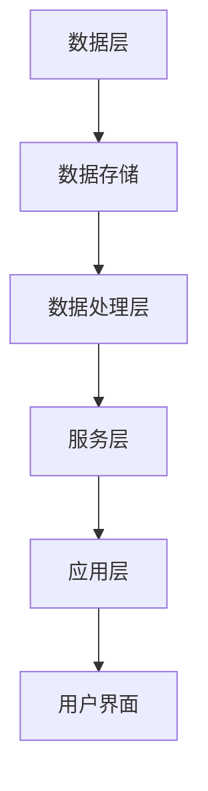

                 


# AI在保险产品创新与风险定价中的深度应用

> **关键词**：人工智能，保险产品创新，风险定价，机器学习，深度学习，数字化转型

> **摘要**：随着人工智能技术的迅速发展，保险行业正经历一场深刻的数字化转型。本文将详细探讨AI技术在保险产品创新与风险定价中的深度应用，分析其核心算法原理、系统架构设计以及实际项目实现。通过结合具体案例，本文将揭示AI如何赋能保险行业，推动保险产品的智能化与个性化发展。

---

## 第1章: 保险行业的数字化转型与AI技术的引入

### 1.1 保险行业的现状与挑战

保险行业作为传统金融行业的重要组成部分，长期以来依赖于人工操作和经验判断。然而，随着市场竞争的加剧和客户需求的多样化，传统保险行业面临以下挑战：

- **客户需求多样化**：用户对保险产品的需求日益多样化，传统标准化产品难以满足个性化需求。
- **数据处理复杂性**：保险行业涉及大量数据，包括客户信息、理赔记录、市场数据等，传统方法难以高效处理这些数据。
- **风险定价不精确**：传统风险定价方法依赖经验数据，难以捕捉复杂市场环境中的动态变化。

### 1.2 AI技术的崛起与保险行业的结合

AI技术的快速发展为保险行业带来了新的机遇。通过AI技术，保险企业可以实现以下目标：

- **数据驱动的决策**：利用机器学习算法处理海量数据，提取有价值的信息，为保险产品的设计和风险定价提供支持。
- **个性化服务**：通过AI技术分析客户行为和需求，提供个性化保险产品和服务。
- **自动化流程**：AI技术可以自动化处理理赔、客户咨询等流程，提高效率并降低成本。

---

## 第2章: AI在保险产品创新中的核心作用

### 2.1 保险产品创新的核心要素

保险产品的创新需要结合市场需求、技术能力和数据分析能力。AI技术在保险产品创新中的核心作用体现在以下几个方面：

- **数据驱动的产品设计**：通过分析客户数据，识别潜在需求，设计个性化保险产品。
- **AI算法在产品需求预测中的应用**：利用机器学习模型预测市场趋势和客户需求，优化产品设计。
- **个性化保险产品的实现路径**：通过AI技术实现产品的动态调整，满足客户的个性化需求。

### 2.2 基于AI的保险产品创新方法

#### 2.2.1 数据驱动的产品设计

数据驱动的产品设计是AI技术在保险产品创新中的核心应用之一。通过收集和分析客户数据，企业可以深入了解客户需求和偏好，从而设计出更符合市场需求的产品。

例如，利用自然语言处理（NLP）技术分析客户 reviews 和反馈，提取关键词和情感倾向，识别客户对保险产品的关注点和痛点。基于这些分析结果，企业可以优化产品设计，推出更具吸引力的保险产品。

#### 2.2.2 AI算法在产品需求预测中的应用

机器学习算法在产品需求预测中发挥着重要作用。通过训练历史销售数据、市场趋势和客户行为数据，机器学习模型可以预测未来的产品需求，帮助企业制定更科学的产品策略。

例如，使用时间序列分析模型（如ARIMA）预测保险产品的销售趋势，或者使用随机森林模型分析影响产品需求的关键因素，从而优化产品设计和推广策略。

#### 2.2.3 个性化保险产品的实现路径

个性化保险产品的实现路径包括以下步骤：

1. **数据收集与分析**：收集客户的 demographic 数据、行为数据和偏好数据，通过数据挖掘技术识别客户特征。
2. **客户细分**：利用聚类分析技术将客户分成不同的群体，识别具有相似需求的客户群体。
3. **产品定制化设计**：根据客户群体的特征和需求，设计个性化保险产品，例如定制化保费、保障范围和理赔流程。

---

## 第3章: AI在风险定价中的数学模型与算法原理

### 3.1 风险定价的基本概念与传统方法

风险定价是保险行业的重要组成部分，其核心目标是通过科学的方法评估风险，并制定合理的保费。传统风险定价方法依赖于统计分析和经验数据，存在以下局限性：

- **数据依赖性强**：传统方法依赖于历史数据，难以捕捉市场环境的变化。
- **模型简化**：传统模型通常假设条件简单，难以反映复杂的现实情况。
- **人为因素干扰**：人为判断可能影响定价的客观性和准确性。

### 3.2 基于机器学习的风险定价算法

机器学习算法在风险定价中的应用日益广泛。以下是一些常用的机器学习算法及其应用场景：

#### 3.2.1 线性回归模型在风险定价中的应用

线性回归模型是一种简单而有效的风险定价工具。其基本原理是通过最小二乘法拟合一条直线，描述自变量与因变量之间的线性关系。在保险风险定价中，线性回归模型可以用于预测保费与客户特征（如年龄、职业、健康状况）之间的关系。

**公式：**

$$
y = \beta_0 + \beta_1x_1 + \beta_2x_2 + \dots + \beta_nx_n + \epsilon
$$

其中，$y$ 是保费，$x_i$ 是客户特征，$\beta_i$ 是回归系数，$\epsilon$ 是误差项。

#### 3.2.2 支持向量机（SVM）在风险定价中的应用

支持向量机（SVM）是一种强大的机器学习算法，适用于高维数据的分类和回归问题。在风险定价中，SVM 可以用于客户风险分类和保费预测。

**公式：**

$$
y = sign(w \cdot x + b)
$$

其中，$w$ 是权重向量，$x$ 是输入特征，$b$ 是偏置项。

#### 3.2.3 随机森林与梯度提升树在风险定价中的应用

随机森林和梯度提升树（如XGBoost）是基于树的集成学习算法，具有较强的抗过拟合能力和高精度。在风险定价中，这些算法可以用于客户风险评估和保费预测。

**公式：**

$$
y = \sum_{i=1}^n \text{Tree}(x_i)
$$

其中，$Tree(x_i)$ 是单棵树的预测值，$n$ 是树的数量。

---

## 第4章: AI在保险产品创新与风险定价中的系统架构设计

### 4.1 系统功能设计

#### 4.1.1 数据采集与处理模块

数据采集与处理模块负责收集和预处理保险相关的数据，包括客户数据、市场数据和理赔数据。预处理步骤包括数据清洗、特征提取和数据增强。

#### 4.1.2 AI模型训练与部署模块

AI模型训练与部署模块负责训练和部署机器学习模型，包括数据特征选择、模型训练和模型评估。部署后，模型可以实时处理客户请求，提供个性化保险产品和风险定价服务。

#### 4.1.3 产品创新与定价输出模块

产品创新与定价输出模块负责根据模型输出结果，生成个性化保险产品和风险定价方案。输出形式包括保费计算、产品推荐和风险评估报告。

### 4.2 系统架构设计

系统架构设计采用分层架构，包括数据层、服务层和应用层。数据层负责数据存储和管理，服务层负责数据处理和模型训练，应用层负责用户交互和结果输出。

**mermaid架构图：**



---

## 第5章: AI在保险产品创新与风险定价的算法实现

### 5.1 数据预处理与特征工程

数据预处理包括数据清洗、特征选择和数据增强。特征工程是通过选择和创建特征，提高模型的性能和准确性。

### 5.2 基于Python的AI算法实现

以下是一个基于Python的线性回归模型实现示例：

```python
import pandas as pd
from sklearn.linear_model import LinearRegression
from sklearn.metrics import mean_squared_error

# 加载数据
data = pd.read_csv('insurance_data.csv')

# 分割特征和目标变量
X = data[['age', 'sex', 'bmi', 'children', 'smoker', 'region']]
y = data['charges']

# 训练模型
model = LinearRegression()
model.fit(X, y)

# 预测
y_pred = model.predict(X)

# 评估
mse = mean_squared_error(y, y_pred)
print('均方误差:', mse)
```

---

## 第6章: 项目实战——基于AI的保险产品创新与风险定价系统

### 6.1 项目环境搭建

安装必要的Python库，如TensorFlow、Keras、Scikit-learn和Pandas。

### 6.2 项目核心实现

实现个性化保险产品推荐系统，包括数据预处理、模型训练和结果输出。

### 6.3 项目总结

通过项目实战，读者可以深入了解AI技术在保险产品创新与风险定价中的应用，掌握相关算法和系统设计方法。

---

**作者：AI天才研究院 & 禅与计算机程序设计艺术**

