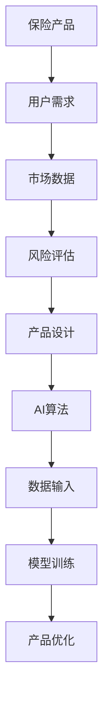
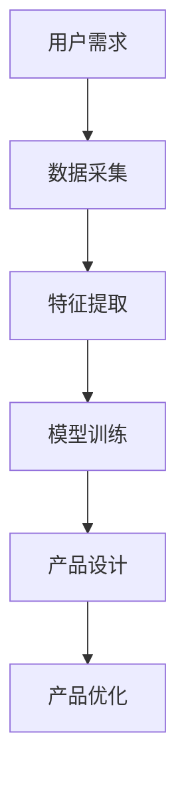

                 


# AI在保险产品创新设计中的应用

## 关键词：人工智能, 保险产品, 创新设计, 机器学习, 深度学习

## 摘要：本文探讨了人工智能技术在保险产品创新设计中的应用，分析了AI如何赋能保险产品的个性化、智能化和数据驱动化设计。文章从保险行业的现状与挑战入手，详细阐述了AI技术的核心概念、算法原理、系统架构设计和项目实战，最后总结了AI在保险产品创新设计中的最佳实践和未来发展方向。

---

## 第一部分：AI在保险产品创新设计中的应用概述

### 第1章：保险行业的现状与挑战

#### 1.1 保险行业的现状

保险行业作为金融领域的重要组成部分，近年来面临着产品同质化严重、客户需求多样化、市场竞争加剧等挑战。传统保险产品设计依赖人工经验，难以快速响应市场变化和客户需求。此外，保险行业对风险控制的要求极高，传统方法在处理复杂风险时显得力不从心。

#### 1.2 AI技术的发展与应用前景

人工智能技术的快速发展为保险行业带来了新的机遇。通过AI技术，保险公司可以更高效地处理海量数据，提取有价值的信息，从而优化产品设计、提升风险评估能力。AI技术在保险产品创新设计中的应用前景广阔，尤其是在个性化产品定制、动态风险评估和智能化客户服务方面。

#### 1.3 AI在保险产品创新设计中的背景

AI技术的应用背景主要体现在以下方面：
- 数据驱动的保险产品设计：通过AI技术对海量数据进行分析，提取用户需求和市场趋势，从而设计出更符合市场需求的产品。
- AI技术赋能保险创新：AI技术可以帮助保险公司快速迭代产品设计，优化产品结构，降低设计成本。
- 保险产品创新的边界与外延：AI技术的应用扩展了保险产品的创新边界，使得保险产品可以覆盖更多场景和服务。

### 第2章：AI在保险产品创新设计中的核心概念

#### 2.1 核心概念的定义与属性

- **保险产品**：保险产品是保险公司提供的一种风险保障服务，通常包括保险合同、保险条款、保险金额等内容。
- **AI技术**：人工智能技术是指通过计算机模拟人类智能的技术，包括机器学习、深度学习、自然语言处理等领域。
- **数据驱动**：数据驱动是指通过分析大量数据来指导决策和行动，AI技术在保险产品设计中的应用高度依赖数据。

#### 2.2 核心概念的对比分析

| 对比维度       | 传统保险产品设计 | AI驱动的保险产品设计 |
|----------------|------------------|-----------------------|
| 数据使用       | 依赖经验数据     | 依赖海量数据分析     |
| 设计效率       | 较低             | 高                    |
| 个性化能力     | 有限             | 强                    |
| 风险评估能力   | 简单             | 复杂且精准            |

#### 2.3 实体关系图



### 第3章：AI在保险产品创新设计中的算法原理

#### 3.1 机器学习算法

- **线性回归模型**：用于预测保险产品的市场需求和风险评估。
  - 方程：$$ y = \beta_0 + \beta_1x + \epsilon $$
- **支持向量机（SVM）**：用于分类问题，例如客户分类。
- **随机森林算法**：用于特征选择和风险评估。
- **K均值聚类**：用于客户群体划分。

#### 3.2 深度学习算法

- **神经网络**：用于复杂模式识别，例如非结构化数据的分析。
- **卷积神经网络（CNN）**：用于图像识别，例如保单条款的OCR识别。
- **循环神经网络（RNN）**：用于时间序列分析，例如历史赔付数据的预测。

#### 3.3 自然语言处理（NLP）

- **分词与实体识别**：用于分析客户反馈和市场报告。
- **情感分析**：用于客户满意度分析。

### 第4章：系统分析与架构设计

#### 4.1 系统功能设计

- **数据采集模块**：收集用户需求、市场数据和历史赔付数据。
- **特征提取模块**：提取关键特征，例如客户画像和风险因子。
- **模型训练模块**：训练AI模型，生成产品设计方案。
- **产品优化模块**：根据模型反馈优化产品设计。

#### 4.2 系统架构设计



### 第5章：项目实战

#### 5.1 环境安装

- **Python环境**：安装Python 3.8以上版本。
- **库的安装**：安装NumPy、Pandas、Scikit-learn、TensorFlow等库。

#### 5.2 核心实现代码

```python
import numpy as np
from sklearn.linear_model import LinearRegression

# 示例数据
X = np.array([[1], [2], [3], [4], [5]])
y = np.array([2, 4, 5, 4, 7])

# 训练模型
model = LinearRegression()
model.fit(X, y)

# 预测
print(model.predict([[6]]))  # 输出：[[7.5]]
```

#### 5.3 案例分析

- **案例背景**：某保险公司希望设计一款针对年轻人的健康保险产品。
- **数据收集**：收集年轻人的健康数据、生活习惯和保险需求。
- **模型训练**：使用随机森林算法进行客户画像和需求预测。
- **产品设计**：根据模型输出设计个性化的产品条款和保费。

### 第6章：最佳实践与总结

#### 6.1 小结

- AI技术在保险产品创新设计中的应用显著提升了设计效率和产品个性化。
- 通过数据驱动的方法，保险公司可以更精准地满足客户需求。

#### 6.2 注意事项

- 数据质量对AI模型的性能影响重大，需确保数据的准确性和完整性。
- 在实际应用中，需考虑模型的解释性和合规性。

#### 6.3 拓展阅读

- 推荐阅读《机器学习实战》和《深度学习》等书籍，深入理解AI算法的实现原理。

---

## 作者：AI天才研究院 & 禅与计算机程序设计艺术

---

以上是《AI在保险产品创新设计中的应用》的技术博客文章的完整目录和内容概述。如需进一步扩展或调整，请随时告知！

