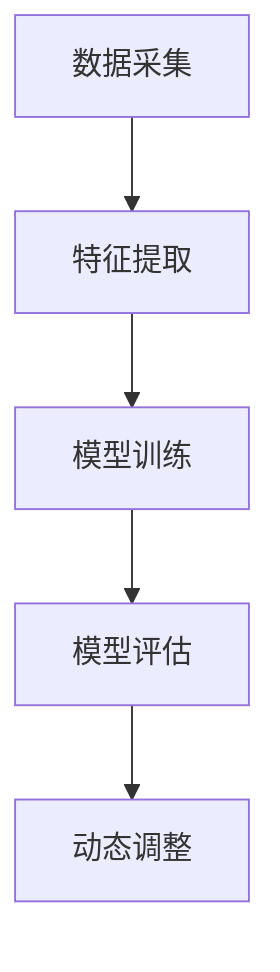
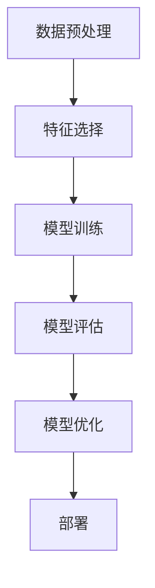
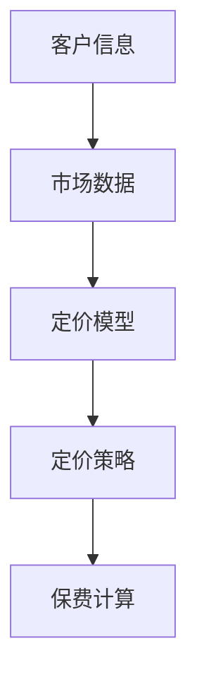

                 


# AI在保险产品动态定价中的创新应用

## 关键词：人工智能, 保险定价, 动态定价, 机器学习, 深度学习, 强化学习

## 摘要：  
随着人工智能技术的快速发展，保险产品动态定价逐渐成为行业关注的焦点。本文从保险定价的基本原理出发，深入探讨了AI技术在动态定价中的创新应用，分析了不同算法在动态定价中的优势与挑战，并结合实际案例，展示了AI如何通过动态定价模型优化保险产品的定价策略，提升企业竞争力。  

---

## 第一部分：保险产品动态定价的背景与问题  

### 第1章：保险产品动态定价的背景介绍  

#### 1.1 保险产品的基本概念与分类  
保险产品是指保险公司向客户提供的风险保障服务，常见的保险产品包括寿险、财险、健康险等。保险产品的定价需要考虑多个因素，包括客户风险、市场需求、成本收益等。  

#### 1.2 保险定价的基本原理与方法  
传统保险定价方法主要包括：  
1. **基于经验的定价**：根据历史数据和经验，确定保费。  
2. **基于风险的定价**：根据客户的个体风险特征（如年龄、健康状况等）进行定价。  
3. **基于市场的定价**：根据市场需求和竞争情况调整保费。  

#### 1.3 保险定价的动态变化特点  
保险产品的定价并不是一成不变的，随着市场环境的变化、客户需求的变化以及保险公司策略的调整，保费需要动态调整。动态定价的核心在于实时捕捉市场变化，快速响应客户需求。  

### 第2章：AI技术在保险定价中的应用背景  

#### 2.1 AI技术的发展与保险行业的结合  
人工智能技术的发展为保险行业带来了新的机遇。通过AI技术，保险公司可以更高效地处理大量数据，提高定价的准确性和效率。  

#### 2.2 传统保险定价的局限性  
传统保险定价方法存在以下问题：  
1. 数据量有限：传统定价方法依赖历史数据，难以捕捉实时变化。  
2. 人工干预过多：定价过程需要大量人工参与，效率较低。  
3. 风险评估不精准：传统方法难以准确评估客户的个体风险。  

#### 2.3 AI技术如何解决传统定价问题  
AI技术可以通过以下方式解决传统定价问题：  
1. **数据驱动**：利用大数据技术，实时分析客户行为和市场变化。  
2. **自动化**：通过机器学习模型，自动调整定价策略。  
3. **精准定价**：基于客户特征和行为数据，实现个性化定价。  

### 第3章：动态定价的核心问题与挑战  

#### 3.1 动态定价的定义与目标  
动态定价是指根据市场环境和客户需求的变化，实时调整产品价格的过程。其目标是通过动态调整价格，实现企业利润最大化和客户满意度的平衡。  

#### 3.2 动态定价中的关键问题  
1. **数据实时性**：需要实时获取和处理数据。  
2. **模型更新**：需要不断更新定价模型以适应市场变化。  
3. **风险管理**：动态定价可能导致价格波动，需防范风险。  

#### 3.3 AI在动态定价中的创新应用  
1. **实时数据分析**：利用AI技术实时分析市场数据，快速调整定价策略。  
2. **个性化定价**：通过机器学习模型，实现客户级别的个性化定价。  
3. **预测与优化**：利用深度学习和强化学习，预测价格变化并优化定价策略。  

---

## 第二部分：动态定价的理论基础与方法  

### 第4章：动态定价的理论基础  

#### 4.1 动态定价的经济学基础  
动态定价的经济学基础包括需求弹性、市场均衡、成本收益分析等理论。通过这些理论，可以更好地理解价格变化对市场和客户的影响。  

#### 4.2 动态定价的数学模型  
动态定价的数学模型主要包括：  
1. **线性回归模型**：用于预测价格变化。  
2. **马尔可夫链模型**：用于预测未来价格的变化趋势。  
3. **博弈论模型**：用于分析市场竞争中的定价策略。  

#### 4.3 动态定价的实现方法  
动态定价的实现方法包括：  
1. **基于规则的定价**：根据预设规则进行定价。  
2. **基于机器学习的定价**：利用机器学习模型进行定价。  
3. **基于市场的定价**：根据市场反馈动态调整价格。  

### 第5章：保险定价的动态变化机制  

#### 5.1 客户需求的动态变化  
客户需求会随着市场环境和个人情况的变化而变化。例如，健康险的需求可能受到客户健康状况的影响。  

#### 5.2 市场环境的动态变化  
市场环境的变化（如经济波动、政策变化）会影响保险产品的定价。  

#### 5.3 产品策略的动态调整  
保险公司需要根据市场反馈和客户需求，动态调整产品策略。  

### 第6章：AI在动态定价中的应用方法  

#### 6.1 基于机器学习的动态定价  
基于机器学习的动态定价方法包括：  
1. **监督学习**：利用历史数据训练模型，预测未来价格。  
2. **无监督学习**：发现数据中的隐含模式，优化定价策略。  

#### 6.2 基于深度学习的动态定价  
深度学习可以通过神经网络模型，捕捉数据中的复杂关系，实现更精准的定价。  

#### 6.3 基于强化学习的动态定价  
强化学习可以通过不断试错，优化定价策略，实现动态调整。  

---

## 第三部分：AI在保险定价中的核心概念与联系  

### 第7章：AI在保险定价中的核心概念  

#### 7.1 AI定价模型的原理与流程  
1. **数据采集**：收集客户数据、市场数据等。  
2. **特征提取**：提取有用的特征，如客户年龄、健康状况等。  
3. **模型训练**：利用机器学习算法训练定价模型。  
4. **模型评估**：评估模型的准确性和稳定性。  
5. **模型优化**：根据评估结果优化模型。  

#### 7.2 AI定价模型的优缺点  
1. **优点**：精准、高效、实时性强。  
2. **缺点**：需要大量数据支持，模型可能过拟合。  

### 第8章：AI定价模型的系统架构设计  

#### 8.1 系统功能设计  
1. **数据采集模块**：负责采集客户数据和市场数据。  
2. **特征提取模块**：提取客户特征，如年龄、职业等。  
3. **模型训练模块**：训练定价模型。  
4. **模型评估模块**：评估模型性能。  
5. **动态调整模块**：根据模型预测结果动态调整定价策略。  

#### 8.2 系统架构图  


---

## 第四部分：AI动态定价的算法原理与实现  

### 第9章：AI动态定价的算法实现  

#### 9.1 常见算法原理  
1. **线性回归模型**：用于预测价格变化。  
2. **决策树模型**：用于分类和预测。  
3. **随机森林模型**：通过集成学习提高准确性。  
4. **神经网络模型**：用于捕捉数据中的复杂关系。  

#### 9.2 算法实现流程  


#### 9.3 算法实现代码  
```python
import pandas as pd
from sklearn.linear_model import LinearRegression
from sklearn.metrics import mean_squared_error

# 数据加载
data = pd.read_csv('insurance_data.csv')

# 特征选择
X = data[['age', 'sex', 'bmi', 'children', 'smoker', 'region']]
y = data['charges']

# 模型训练
model = LinearRegression()
model.fit(X, y)

# 模型预测
y_pred = model.predict(X)

# 模型评估
mse = mean_squared_error(y, y_pred)
print(f"均方误差: {mse}")
```

---

## 第五部分：系统分析与架构设计方案  

### 第10章：系统分析与架构设计  

#### 10.1 问题场景介绍  
保险公司在动态定价过程中需要考虑客户风险、市场需求和成本收益等因素。  

#### 10.2 系统功能设计  
1. **客户信息管理**：管理客户信息，包括客户年龄、健康状况等。  
2. **市场数据分析**：分析市场数据，了解市场趋势。  
3. **定价模型管理**：管理定价模型，包括训练和优化。  
4. **定价策略调整**：根据模型预测结果调整定价策略。  

#### 10.3 系统架构图  


#### 10.4 系统接口设计  
1. **数据接口**：与数据源对接，获取客户和市场数据。  
2. **模型接口**：与定价模型对接，获取定价建议。  
3. **用户接口**：与用户交互，展示定价结果。  

#### 10.5 系统交互序列图  
```mermaid
graph TD
    A[用户] --> B[数据接口]: 请求数据
    B --> C[市场数据]: 返回市场数据
    A --> D[模型接口]: 请求定价建议
    D --> E[定价模型]: 计算定价建议
    E --> A[用户]: 返回定价建议
```

---

## 第六部分：项目实战  

### 第11章：项目实战  

#### 11.1 环境安装  
1. 安装Python和相关库：`pip install pandas scikit-learn`  
2. 安装Mermaid工具：用于绘制图表。  

#### 11.2 代码实现  
```python
import pandas as pd
from sklearn.ensemble import RandomForestRegressor
from sklearn.metrics import mean_absolute_error

# 数据加载
data = pd.read_csv('insurance_data.csv')

# 特征选择
X = data[['age', 'sex', 'bmi', 'children', 'smoker', 'region']]
y = data['charges']

# 模型训练
model = RandomForestRegressor(n_estimators=100)
model.fit(X, y)

# 模型预测
y_pred = model.predict(X)

# 模型评估
mae = mean_absolute_error(y, y_pred)
print(f"平均绝对误差: {mae}")
```

#### 11.3 案例分析  
以健康险为例，分析AI如何动态调整保费。  

#### 11.4 项目总结  
通过项目实战，验证了AI在动态定价中的有效性，提高了定价的准确性和效率。  

---

## 第七部分：最佳实践与小结  

### 第12章：最佳实践  

#### 12.1 小结  
AI技术为保险产品动态定价提供了新的思路和方法，通过实时数据分析和个性化定价，提高了企业的竞争力。  

#### 12.2 注意事项  
1. 数据隐私保护：确保客户数据的安全。  
2. 模型解释性：确保模型的可解释性，避免“黑箱”问题。  
3. 模型更新：定期更新模型，确保其准确性和稳定性。  

#### 12.3 拓展阅读  
1. 《机器学习实战》：了解机器学习的基本原理和实现方法。  
2. 《深度学习》：深入学习深度学习技术。  
3. 《强化学习》：了解强化学习在动态定价中的应用。  

---

## 作者：AI天才研究院 & 禅与计算机程序设计艺术

