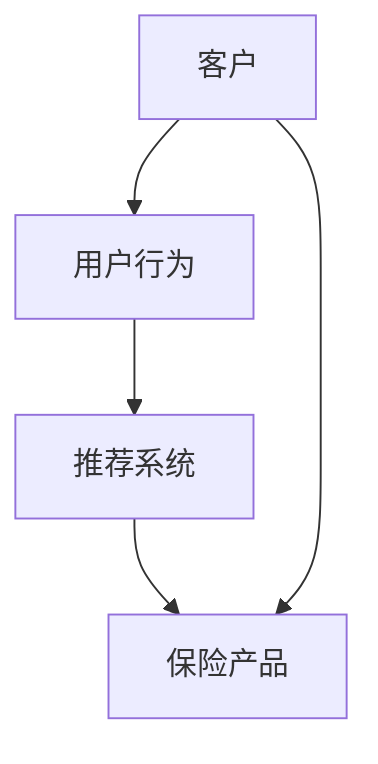

                 

# AI在保险产品需求预测与个性化推荐中的深度应用

> **关键词**：人工智能、保险产品、需求预测、个性化推荐、机器学习、深度学习、推荐系统

> **摘要**：本文详细探讨了人工智能技术在保险产品需求预测与个性化推荐中的深度应用。通过分析保险行业的现状与挑战，结合机器学习和深度学习的核心算法，本文重点介绍了如何利用这些技术实现保险产品的精准需求预测与个性化推荐。同时，文章从系统架构设计、项目实战等多个维度，详细解读了AI技术在保险行业中的具体应用场景与实现方法，为保险行业的数字化转型提供了理论与实践的双重指导。

---

# 第1章: 保险行业与AI技术的结合背景

## 1.1 保险行业的现状与挑战

### 1.1.1 保险行业的基本概念与业务模式

保险行业作为金融行业的重要组成部分，其核心业务模式是通过承保风险和提供风险保障服务来实现盈利。传统保险业务主要包括寿险、健康险、财险、意外险等类型，其业务流程通常涉及产品设计、精算分析、销售推广、客户服务和理赔管理等环节。

保险行业的核心痛点在于如何精准预测客户需求，降低销售成本，提高客户满意度。传统的保险产品销售模式依赖于销售人员的经验和主观判断，存在效率低、精准度差的问题。

### 1.1.2 传统保险产品需求预测的局限性

传统保险产品需求预测主要依赖于历史数据分析和经验判断。这种方法存在以下问题：
- 数据维度有限，难以捕捉客户的个性化需求；
- 预测结果的准确性较低，难以应对市场环境的变化；
- 需要大量人工干预，效率低下。

### 1.1.3 个性化推荐在保险销售中的重要性

个性化推荐是通过分析客户的特征和行为数据，为其推荐符合其需求的产品。在保险销售中，个性化推荐可以帮助保险公司实现以下目标：
- 提高客户购买保险产品的概率；
- 提升客户满意度和忠诚度；
- 降低销售成本。

---

## 1.2 AI技术在保险行业的应用背景

### 1.2.1 人工智能技术的发展与成熟

人工智能技术近年来取得了长足的进步，特别是在深度学习领域的突破，使得机器学习算法在处理复杂数据和任务时表现出色。这些技术为保险行业的智能化转型提供了强大的技术支撑。

### 1.2.2 大数据技术对保险行业的推动作用

大数据技术的应用使得保险公司能够收集和分析海量的客户数据，包括客户行为数据、市场数据、产品数据等。这些数据为保险产品的精准需求预测和个性化推荐提供了丰富的数据来源。

### 1.2.3 保险行业数字化转型的需求

随着互联网和移动技术的快速发展，保险行业的数字化转型已成为必然趋势。通过引入AI技术，保险公司可以实现业务流程的智能化和自动化，提高运营效率和客户体验。

---

## 1.3 保险产品需求预测与推荐的核心问题

### 1.3.1 需求预测的基本概念与目标

需求预测的核心目标是根据历史数据和当前市场环境，预测未来某一时间段内客户对保险产品的购买需求。需求预测的结果可以为保险公司的产品设计、销售策略和风险管理提供数据支持。

### 1.3.2 个性化推荐的定义与实现方式

个性化推荐是指根据客户的行为、偏好和特征，推荐符合其需求的保险产品。其实现方式主要包括基于协同过滤的推荐、基于内容的推荐和基于混合模型的推荐。

### 1.3.3 保险产品推荐的边界与外延

保险产品的推荐需要考虑客户的风险承受能力、保险需求和预算等因素。推荐的边界包括客户的基本信息、健康状况、财务状况和保险需求等。

---

## 1.4 本章小结

本章从保险行业的现状和挑战出发，介绍了AI技术在保险行业的应用背景，重点阐述了保险产品需求预测与推荐的核心问题。下一章将深入探讨AI技术在保险产品需求预测中的核心概念与联系。

---

# 第2章: AI在保险产品需求预测中的核心概念与联系

## 2.1 机器学习与深度学习的基本原理

### 2.1.1 机器学习的定义与核心算法

机器学习是一种通过数据训练模型，使其能够从数据中学习规律并进行预测的技术。常见的机器学习算法包括线性回归、决策树、随机森林、支持向量机（SVM）等。

### 2.1.2 深度学习的定义与特点

深度学习是一种基于人工神经网络的机器学习技术，其特点包括多层非线性变换和端到端的特征学习能力。深度学习在处理复杂数据和任务时表现出色，例如图像识别、自然语言处理和语音识别等。

### 2.1.3 机器学习与深度学习的对比分析

| 对比维度       | 机器学习                | 深度学习                |
|----------------|-------------------------|-------------------------|
| 数据需求       | 数据量较小              | 数据量较大              |
| 特征工程       | 特征工程复杂            | 特征工程相对简单        |
| 模型复杂度     | 模型复杂度低            | 模型复杂度高            |

---

## 2.2 保险产品需求预测的核心模型

### 2.2.1 线性回归模型

线性回归是一种简单而有效的回归模型，其数学表达式为：

$$y = \beta_0 + \beta_1x + \epsilon$$

其中，$y$ 是目标变量，$x$ 是输入变量，$\beta_0$ 和 $\beta_1$ 是模型参数，$\epsilon$ 是误差项。

### 2.2.2 支持向量机模型

支持向量机（SVM）是一种监督学习算法，主要用于分类和回归问题。其核心思想是将数据映射到高维空间，并在高维空间中寻找一个超平面来分离数据。

### 2.2.3 随机森林模型

随机森林是一种基于决策树的集成学习算法，其通过构建多个决策树并进行投票或平均来提高模型的准确性和稳定性。

### 2.2.4 神经网络模型

神经网络是一种由多个神经元组成的复杂模型，其灵感来源于人脑的神经网络。神经网络模型通常包括输入层、隐藏层和输出层。

---

## 2.3 推荐系统的核心概念与分类

### 2.3.1 基于协同过滤的推荐系统

协同过滤是一种基于用户行为相似性推荐产品的技术。其核心思想是：如果两个用户在过去的行为（如购买、评分）相似，则他们未来的行为也会相似。

### 2.3.2 基于内容的推荐系统

基于内容的推荐系统通过分析产品的特征和属性，推荐与当前用户需求匹配的产品。例如，根据保险产品的保费、保障范围和保险期限等特征进行推荐。

### 2.3.3 基于混合模型的推荐系统

混合模型推荐系统是将协同过滤和基于内容的推荐方法结合起来，充分利用两种方法的优点，提高推荐的准确性和多样性。

---

## 2.4 保险产品推荐系统的实体关系图

---

## 2.5 本章小结

本章从机器学习和深度学习的基本原理出发，介绍了保险产品需求预测的核心模型和推荐系统的分类。通过实体关系图展示了保险产品推荐系统的整体架构。下一章将详细讲解AI在保险产品需求预测中的算法原理与实现。

---

接下来的章节将围绕算法原理、数学模型、系统架构设计和项目实战展开，通过具体的案例和代码示例，深入探讨AI技术在保险产品需求预测与个性化推荐中的应用。

