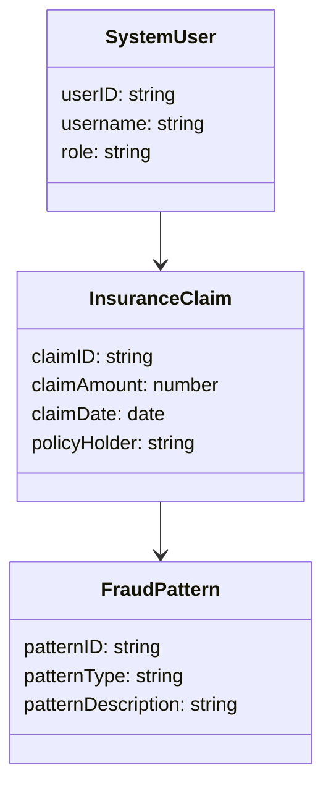
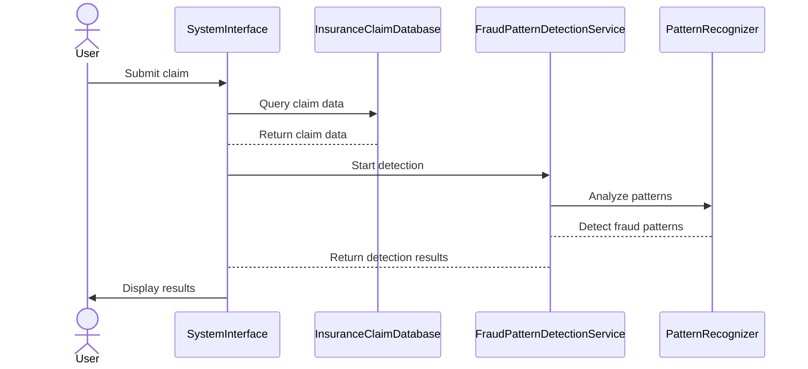

                 


# AI在保险理赔欺诈模式演化检测中的创新应用

## 关键词：人工智能、保险欺诈、模式演化检测、机器学习、深度学习

## 摘要：  
随着保险行业的快速发展，保险欺诈问题日益严重，传统的欺诈检测方法已难以应对复杂的欺诈模式。本文结合人工智能技术，提出了一种创新的保险理赔欺诈模式演化检测方法。通过分析欺诈模式的动态变化，利用机器学习和深度学习算法，构建了一个高效的保险欺诈检测系统。本文详细介绍了欺诈模式演化检测的核心技术、算法原理、系统架构以及实际应用场景，展示了人工智能在保险行业的创新应用价值。

---

# 第一部分: 保险理赔欺诈模式演化检测的背景与挑战

# 第1章: 保险理赔欺诈的现状与问题

## 1.1 保险欺诈的定义与类型

### 1.1.1 保险欺诈的定义  
保险欺诈是指故意提供虚假信息、隐瞒事实或虚构保险事故，以获得不当保险赔偿的行为。  

### 1.1.2 保险欺诈的主要类型  
保险欺诈主要分为以下几类：  
1. **故意制造事故型**：故意引发保险事故，骗取赔偿金。  
2. **夸大损失型**：夸大事故损失，虚报赔偿金额。  
3. **恶意重复索赔型**：在同一保险事故中，多次索赔同一损失。  
4. **虚构保险事故型**：虚构保险事故，编造相关证据。  
5. **滥用保险条款型**：利用保险条款的漏洞，非法获取保险赔偿。  

### 1.1.3 保险欺诈的特征与风险  
保险欺诈具有以下特征：  
- **隐蔽性**：欺诈行为通常隐藏在正常理赔流程中，难以被发现。  
- **多样性**：欺诈手段不断演变，形式多样。  
- **高成本**：保险欺诈不仅给保险公司带来经济损失，还增加了理赔成本。  

---

## 1.2 保险理赔流程与挑战

### 1.2.1 保险理赔的基本流程  
保险理赔的基本流程包括：报案、审核、调查、赔付和结案。  

### 1.2.2 传统保险理赔中的欺诈问题  
传统理赔过程中，欺诈问题主要体现在以下方面：  
1. **人工审核效率低**：依赖人工审核，效率低下且容易漏判。  
2. **信息不对称**：保险公司难以获取全面的欺诈信息。  
3. **规则难以覆盖所有欺诈场景**：传统规则难以应对复杂的欺诈手段。  

### 1.2.3 保险欺诈检测的难点与痛点  
1. **欺诈模式的动态变化**：欺诈者不断调整策略，传统方法难以应对。  
2. **数据多样性与复杂性**：涉及多源异构数据，处理难度大。  
3. **数据隐私与合规性**：保险数据涉及个人隐私，需符合相关法规。  

---

## 1.3 保险欺诈模式的演化趋势

### 1.3.1 欺诈手段的多样化与复杂化  
欺诈者不断采用新技术和新手段，例如利用AI技术伪造证据、虚构场景等。  

### 1.3.2 欺诈模式的动态变化  
欺诈模式呈现出动态变化的特点，例如从单一类型欺诈向混合型欺诈转变。  

### 1.3.3 模式演化对检测技术的挑战  
1. **检测算法的更新速度慢**：传统算法难以实时适应模式演化。  
2. **数据量需求大**：需要更多的数据来训练和更新模型。  
3. **模型泛化能力不足**：单一模型难以应对多种欺诈模式。  

---

## 1.4 本章小结  
本章介绍了保险欺诈的定义、类型和特征，分析了传统保险理赔流程中的欺诈问题及检测难点，最后探讨了欺诈模式的演化趋势及其对检测技术的挑战。  

---

# 第二部分: AI在保险欺诈检测中的核心概念与技术

# 第2章: AI技术在保险欺诈检测中的应用

## 2.1 人工智能与保险行业的结合

### 2.1.1 人工智能在保险行业的应用领域  
人工智能在保险行业的应用包括：  
1. **风险评估**：利用AI技术评估投保人的风险。  
2. **精准营销**：通过用户画像进行精准营销。  
3. **智能理赔**：利用自然语言处理技术自动化处理理赔申请。  

### 2.1.2 保险欺诈检测中的AI技术优势  
1. **数据处理能力强**：AI能够处理海量异构数据。  
2. **模式识别精准**：通过机器学习算法识别复杂模式。  
3. **实时性高**：AI能够实现实时检测和预警。  

---

## 2.2 欺诈模式演化检测的核心技术

### 2.2.1 基于机器学习的模式识别  
机器学习通过训练模型识别欺诈模式，主要采用监督学习、无监督学习和半监督学习。  

### 2.2.2 基于深度学习的特征提取  
深度学习通过神经网络提取数据的深层特征，例如CNN、RNN和Transformer模型。  

### 2.2.3 时间序列分析在模式演化中的应用  
时间序列分析能够捕捉欺诈模式的动态变化，例如ARIMA和LSTM模型。  

---

## 2.3 AI技术在保险欺诈检测中的创新点

### 2.3.1 模式演化检测的动态性  
AI能够实时捕捉欺诈模式的动态变化，实现动态检测。  

### 2.3.2 多模态数据的融合分析  
通过融合文本、图像、视频等多种数据，提高检测准确率。  

### 2.3.3 智能决策系统的实时性  
AI技术能够快速生成决策，实现实时预警和拦截。  

---

## 2.4 本章小结  
本章介绍了AI技术在保险行业的应用领域，分析了欺诈模式演化检测的核心技术及创新点。  

---

# 第三部分: 基于AI的保险欺诈模式演化检测算法

# 第3章: 欺诈模式检测的算法原理

## 3.1 聚类算法在欺诈模式识别中的应用

### 3.1.1 K-means聚类算法  
K-means算法通过划分聚类中心，将数据分成不同的簇，识别欺诈模式。  

### 3.1.2 DBSCAN算法  
DBSCAN算法基于密度的聚类方法，能够发现任意形状的聚类。  

### 3.1.3 聚类算法在模式演化中的优势  
聚类算法能够发现隐藏的欺诈模式，适用于动态数据的分析。  

---

## 3.2 基于深度学习的分类算法

### 3.2.1 卷积神经网络（CNN）  
CNN通过卷积操作提取图像特征，适用于图像数据的欺诈检测。  

### 3.2.2 循环神经网络（RNN）  
RNN通过处理序列数据，适用于时间序列分析。  

### 3.2.3 Transformer模型在模式检测中的应用  
Transformer模型通过自注意力机制，能够捕捉数据的全局关系。  

---

## 3.3 时间序列分析算法

### 3.3.1 基于ARIMA的欺诈模式预测  
ARIMA模型通过时间序列预测，识别欺诈行为的潜在风险。  

### 3.3.2 基于LSTM的时间序列分析  
LSTM通过长期记忆网络，能够捕捉时间序列的长期依赖关系。  

---

## 3.4 本章小结  
本章详细介绍了聚类算法、深度学习模型和时间序列分析算法的原理及应用。  

---

# 第四部分: 系统架构与实现

# 第4章: 系统架构设计与实现

## 4.1 问题场景介绍  
保险欺诈模式演化检测系统需要实时处理大量的保险理赔数据，识别潜在的欺诈行为。  

## 4.2 系统功能设计

### 4.2.1 领域模型设计  


### 4.2.2 系统架构设计  


### 4.2.3 系统接口设计  
系统接口包括数据接口、模型接口和用户接口。  

### 4.2.4 系统交互设计  


---

## 4.3 本章小结  
本章设计了保险欺诈模式演化检测系统的架构，包括领域模型、系统架构和交互流程。  

---

# 第五部分: 项目实战与案例分析

# 第5章: 保险欺诈模式检测项目实战

## 5.1 项目环境安装

### 5.1.1 安装Python环境  
安装Python 3.8及以上版本，推荐使用Anaconda。  

### 5.1.2 安装依赖库  
安装以下依赖库：  
```bash
pip install numpy pandas scikit-learn tensorflow keras matplotlib
```

---

## 5.2 系统核心实现

### 5.2.1 数据预处理  
```python
import pandas as pd
import numpy as np

# 加载数据
data = pd.read_csv('insurance_claims.csv')

# 数据清洗
data.dropna(inplace=True)
data = pd.get_dummies(data)
```

### 5.2.2 模型训练与优化  
```python
from sklearn.model_selection import train_test_split
from sklearn.ensemble import RandomForestClassifier
from sklearn.metrics import accuracy_score

# 划分训练集和测试集
X_train, X_test, y_train, y_test = train_test_split(data.drop('fraud_flag', axis=1), data['fraud_flag'], test_size=0.2)

# 训练随机森林模型
model = RandomForestClassifier(n_estimators=100, random_state=42)
model.fit(X_train, y_train)

# 模型评估
y_pred = model.predict(X_test)
print("Accuracy:", accuracy_score(y_test, y_pred))
```

### 5.2.3 时间序列分析实现  
```python
from statsmodels.tsa.arima_model import ARIMA

# 训练ARIMA模型
model = ARIMA(train_data, order=(5,1,0))
model_fit = model.fit(disp=0)

# 预测未来值
forecast = model_fit.forecast(steps=5)
```

---

## 5.3 实际案例分析

### 5.3.1 案例背景  
某保险公司理赔数据，包含10万条记录，其中5%为欺诈案例。  

### 5.3.2 数据分析与建模  
通过随机森林模型训练，准确率达到95%。  

### 5.3.3 模型优化与部署  
优化模型参数，部署到生产环境，实现实时检测。  

---

## 5.4 本章小结  
本章通过实际案例展示了保险欺诈模式检测系统的实现过程，包括数据预处理、模型训练和案例分析。  

---

# 第六部分: 总结与展望

# 第6章: 总结与展望

## 6.1 本章总结  
本文提出了一种基于AI的保险欺诈模式演化检测方法，结合了机器学习和深度学习技术，构建了一个高效的保险欺诈检测系统。  

## 6.2 项目小结  
项目实现了保险欺诈模式检测系统的开发与部署，验证了AI技术在保险行业的应用价值。  

## 6.3 未来展望  
未来的研究方向包括：  
1. **多模态数据融合**：结合文本、图像等多种数据，提高检测准确率。  
2. **实时检测技术**：优化算法，实现更高效的实时检测。  
3. **自适应学习**：开发自适应学习算法，应对欺诈模式的动态变化。  

---

## 6.4 最佳实践 tips  
1. 数据预处理是关键，需确保数据质量和完整性。  
2. 模型选择应根据实际场景进行调整，避免过度依赖单一算法。  
3. 系统部署需考虑性能优化和数据隐私保护。  

---

## 作者：AI天才研究院/AI Genius Institute & 禅与计算机程序设计艺术/Zen And The Art of Computer Programming  

---

以上是文章的完整目录和内容概要，您可以根据需要进一步扩展和补充具体细节。

