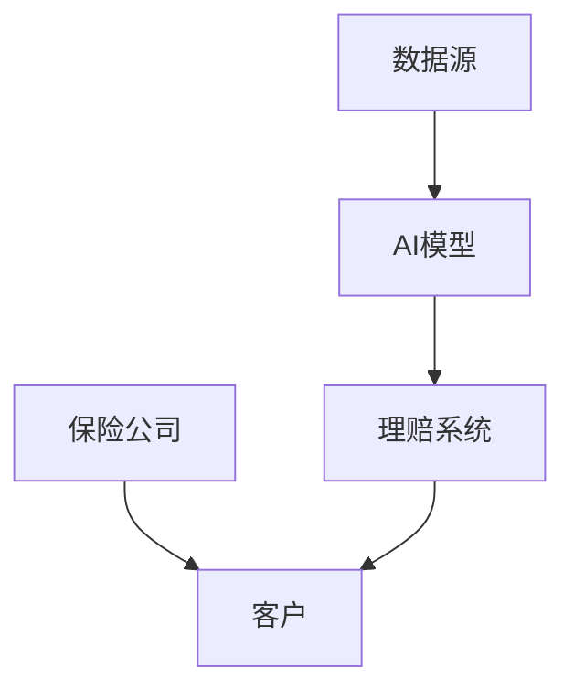
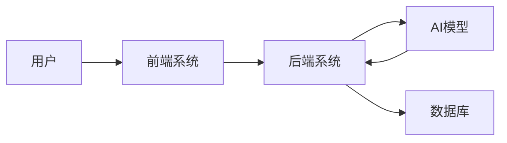

                 


# AI在保险理赔流程优化与客户体验提升中的应用

---

## 关键词：人工智能、保险理赔、客户体验、流程优化、机器学习、自然语言处理、计算机视觉

---

## 摘要：  
随着人工智能（AI）技术的快速发展，AI在保险行业的应用越来越广泛，特别是在保险理赔流程优化和客户体验提升方面。本文将深入探讨AI如何通过机器学习、自然语言处理和计算机视觉等技术，优化保险理赔流程、提高理赔效率、降低运营成本，同时提升客户满意度和体验。通过具体的技术分析和案例研究，本文将展示AI在保险行业中的巨大潜力和实际应用价值。

---

# 第1章: 保险行业与AI技术的结合背景

## 1.1 保险行业的现状与挑战  
保险行业作为金融行业的重要组成部分，传统业务流程复杂，人工操作较多，效率较低。以下是一些关键问题和挑战：  
- **传统理赔流程的痛点**：  
  - 理赔申请处理时间长，人工审核环节多。  
  - 理赔资料繁杂，容易出错。  
  - 欺诈行为难以识别，增加了理赔成本。  
- **客户体验问题**：  
  - 客户等待理赔结果的时间长，容易产生不满。  
  - 客户服务渠道单一，难以满足多样化的需求。  

## 1.2 AI技术的发展与应用前景  
- **AI技术的定义与核心能力**：  
  - AI是指模拟人类智能的计算机系统，核心能力包括学习、推理、识别和自然语言处理等。  
- **AI在保险行业的潜在应用场景**：  
  - 理赔自动化：通过AI自动处理理赔申请、识别欺诈行为。  
  - 客户服务：智能客服、个性化推荐。  
  - 风险评估：利用AI分析客户数据，评估保险风险。  

## 1.3 保险理赔流程优化与客户体验提升的结合  
- **保险理赔流程优化的必要性**：  
  - 提高理赔效率，降低成本。  
  - 提升客户满意度，增强品牌形象。  
- **客户体验在保险行业中的重要性**：  
  - 客户体验直接影响客户忠诚度和业务增长。  
  - 通过AI技术，提供更个性化的服务，增强客户黏性。  

---

# 第2章: AI技术在保险理赔中的核心概念与联系

## 2.1 AI技术的核心概念  
- **机器学习**：  
  - 通过数据训练模型，实现对保险理赔的预测和分类。  
- **自然语言处理**：  
  - 对保险合同、客户咨询等文本进行理解和分析。  
- **计算机视觉**：  
  - 对保险单、理赔单据等图像进行识别和处理。  

## 2.2 AI技术在保险理赔中的应用原理  
- **数据采集与处理**：  
  - 从理赔申请、历史数据中提取特征。  
- **模型训练与部署**：  
  - 使用训练好的模型进行预测和分类。  
- **系统集成与应用**：  
  - 将AI模型集成到保险理赔系统中，实现自动化处理。  

## 2.3 AI技术与保险理赔流程的实体关系图  


---

# 第3章: AI技术在保险理赔中的算法原理与数学模型

## 3.1 机器学习算法在保险理赔中的应用  
- **监督学习**：  
  - 使用历史数据训练分类模型，预测理赔结果。  
  - 例如：随机森林、支持向量机（SVM）。  
- **无监督学习**：  
  - 对客户数据进行聚类分析，识别潜在风险。  
- **强化学习**：  
  - 通过模拟环境训练模型，优化理赔决策。  

## 3.2 自然语言处理在保险理赔中的应用  
- **分词算法**：  
  - 将文本分割成词语或短语。  
- **情感分析**：  
  - 分析客户反馈，识别客户情绪。  
- **文本生成**：  
  - 自动生成理赔相关的文档。  

## 3.3 计算机视觉在保险理赔中的应用  
- **图像识别**：  
  - 识别保险单、理赔单据中的文字信息。  
- **图像分割**：  
  - 对图像进行分割，提取关键信息。  
- **视频分析**：  
  - 分析理赔相关的视频数据，如交通事故视频。  

## 3.4 常用算法的数学模型与公式  
- **线性回归模型**：  
  $$y = \beta_0 + \beta_1x + \epsilon$$  
- **支持向量机模型**：  
  $$\text{max} \frac{1}{2}\|w\|^2$$  
  $$\text{subject to} \ y_i(w \cdot x_i + b) \geq 1$$  

---

# 第4章: 保险理赔系统与AI技术的系统分析与架构设计

## 4.1 保险理赔系统的功能需求  
- **理赔申请处理**：  
  - 收集和验证理赔资料。  
- **理赔审核流程**：  
  - 使用AI模型进行风险评估和欺诈检测。  
- **理赔结果反馈**：  
  - 快速通知客户理赔结果。  

## 4.2 系统架构设计  


## 4.3 系统接口设计  
- **API接口定义**：  
  - 提供RESTful API，供前端调用。  
- **系统交互流程**：  
  - 用户提交理赔申请，系统调用AI模型进行处理。  

---

# 第5章: 项目实战——基于AI的保险欺诈检测系统

## 5.1 项目背景与目标  
- **项目背景**：  
  - 保险欺诈行为日益猖獗，传统检测方法效率低。  
- **项目目标**：  
  - 使用AI技术构建一个高效的保险欺诈检测系统。  

## 5.2 项目实现  
- **环境安装**：  
  - 安装Python、TensorFlow、Keras等工具。  
- **核心代码实现**：  
  ```python
  import tensorflow as tf
  model = tf.keras.Sequential([
      tf.keras.layers.Dense(64, activation='relu'),
      tf.keras.layers.Dense(1, activation='sigmoid')
  ])
  model.compile(optimizer='adam', loss='binary_crossentropy', metrics=['accuracy'])
  model.fit(X_train, y_train, epochs=10, batch_size=32)
  ```

## 5.3 项目小结  
- **项目总结**：  
  - 基于AI的保险欺诈检测系统能够有效识别欺诈行为。  
  - 提高了理赔效率，降低了保险公司的损失。  

---

# 第6章: 总结与展望

## 6.1 总结  
- AI技术在保险理赔流程优化和客户体验提升中发挥了重要作用。  
- 通过机器学习、自然语言处理和计算机视觉等技术，保险行业实现了自动化、智能化的理赔流程。  

## 6.2 未来展望  
- **技术趋势**：  
  - 更加智能化的理赔系统，如自适应学习模型。  
  - 结合区块链技术，提高理赔透明度和安全性。  
- **应用拓展**：  
  - 在保险产品设计、客户服务等领域进一步应用AI技术。  

---

# 结语  
AI技术正在深刻改变保险行业，未来保险理赔流程将更加智能化、个性化。通过持续的技术创新和实践应用，AI将为保险行业带来更大的价值。

---

# 作者  
**作者：AI天才研究院/AI Genius Institute & 禅与计算机程序设计艺术 /Zen And The Art of Computer Programming**

