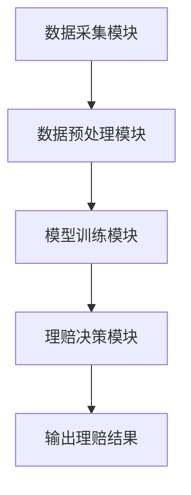

                 


# AI在保险理赔流程优化中的深度应用

## 关键词：保险，AI，流程优化，机器学习，自然语言处理

## 摘要：  
随着人工智能技术的快速发展，AI在保险行业的应用日益广泛，特别是在保险理赔流程优化方面展现出巨大潜力。本文将深入探讨AI技术如何在保险理赔中实现自动化、智能化，解决传统理赔流程中的痛点与挑战，通过机器学习、自然语言处理等技术手段，优化理赔效率、降低成本，并提升客户体验。通过系统设计与实战案例，本文将为保险行业提供深度的技术洞察与实践指导。

---

## 第一部分: 保险行业的背景与AI基础

### 第1章: 保险行业的现状与挑战

#### 1.1 保险行业的现状分析
##### 1.1.1 保险行业的定义与分类
保险行业是指通过保险合同提供风险保障的行业，主要分为寿险、产险、健康险、意外险等类别。传统保险模式依赖人工操作，存在效率低、成本高等问题。

##### 1.1.2 当前保险行业的痛点与挑战
- 数据分散：理赔数据来源多样，难以统一管理。
- 效率低下：人工审核耗时长，容易出错。
- 成本高昂：人工成本占比较大，影响利润空间。
- 客户体验差：理赔流程复杂，客户等待时间长。

##### 1.1.3 保险行业的未来发展趋势
- 数字化转型：通过技术手段提升效率与客户体验。
- AI技术应用：利用机器学习、自然语言处理等技术优化理赔流程。
- 数据驱动：通过大数据分析提升风险评估与理赔决策的准确性。

#### 1.2 AI技术的基本概念与特点
##### 1.2.1 人工智能的基本定义
人工智能（Artificial Intelligence, AI）是指计算机系统模拟人类智能的能力，包括学习、推理、自适应等。

##### 1.2.2 AI技术的核心特点
- 数据驱动：AI依赖大量数据进行训练与推理。
- 自动化：能够自动完成任务，减少人工干预。
- 智能化：具备一定的自主决策能力。

##### 1.2.3 AI技术在保险行业的应用潜力
- 风险评估：通过机器学习模型预测理赔概率。
- 理赔自动化：AI可以自动处理理赔申请，减少人工干预。
- 个性化服务：基于客户数据提供定制化保险方案。

#### 1.3 保险理赔流程的背景与问题描述
##### 1.3.1 保险理赔流程的定义
保险理赔是指在保险合同约定的保险事故发生后，保险公司根据合同条款向被保险人支付赔偿或给付保险金的过程。

##### 1.3.2 保险理赔流程中的问题与挑战
- 数据不完整：理赔申请中可能存在缺失或错误数据。
- 理赔效率低：人工审核耗时长，容易延误理赔。
- 人工审核的主观性：不同审核人员可能对同一理赔申请做出不同判断。

##### 1.3.3 AI技术在保险理赔中的应用前景
- 提高效率：AI可以快速处理大量理赔申请，缩短理赔时间。
- 减少错误：通过机器学习模型提高理赔判断的准确性。
- 降低成本：AI可以减少对人工审核的依赖，降低运营成本。

---

## 第二部分: AI技术在保险理赔中的核心原理

### 第2章: AI技术的核心原理与保险理赔的结合

#### 2.1 机器学习的基本原理
##### 2.1.1 机器学习的定义
机器学习（Machine Learning, ML）是指计算机系统通过数据训练，学习模型并进行预测或分类的过程。

##### 2.1.2 机器学习的核心算法
- 监督学习：根据有标签的数据进行训练，预测新的数据。
- 无监督学习：在无标签数据中发现模式。
- 强化学习：通过奖励机制优化决策过程。

##### 2.1.3 机器学习在保险理赔中的应用
- 风险评估：通过监督学习模型预测理赔概率。
- 理赔分类：通过无监督学习发现异常理赔行为。

#### 2.2 深度学习的基本原理
##### 2.2.1 深度学习的定义
深度学习（Deep Learning）是机器学习的一种，通过多层神经网络模拟人脑的处理方式。

##### 2.2.2 深度学习的核心算法
- 卷积神经网络（CNN）：常用于图像识别。
- 循环神经网络（RNN）：适合处理序列数据。

##### 2.2.3 深度学习在保险理赔中的应用
- 图像识别：识别保险事故中的损坏程度。
- 自然语言处理：分析理赔申请中的文本信息。

#### 2.3 自然语言处理的基本原理
##### 2.3.1 自然语言处理的定义
自然语言处理（Natural Language Processing, NLP）是计算机处理人类语言的技术。

##### 2.3.2 NLP的核心技术
- 分词：将文本分割成词语。
- 语法分析：分析句子结构。
- 情感分析：判断文本的情感倾向。

##### 2.3.3 NLP在保险理赔中的应用
- 合同解析：自动解析保险合同条款。
- 客户咨询：通过NLP技术回答客户问题。

---

## 第三部分: 保险理赔流程的优化

### 第3章: 保险理赔流程优化的系统设计

#### 3.1 系统架构设计
##### 3.1.1 系统架构概述
- 数据采集模块：收集理赔相关数据。
- 数据预处理模块：清洗和转换数据。
- 模型训练模块：训练机器学习模型。
- 理赔决策模块：基于模型输出结果。

##### 3.1.2 系统架构图


#### 3.2 关键技术实现
##### 3.2.1 数据预处理
- 数据清洗：去除无效数据。
- 特征提取：从数据中提取有用特征。

##### 3.2.2 模型训练
- 选择合适的算法：如随机森林、神经网络。
- 调参优化：提升模型性能。

##### 3.2.3 模型部署
- 将模型部署到生产环境。
- 实时处理理赔申请。

#### 3.3 优化效果评估
##### 3.3.1 效率提升
- 理赔时间缩短。
- 人工干预减少。

##### 3.3.2 成本降低
- 人工审核成本下降。
- 错误率降低，减少赔付误差。

##### 3.3.3 客户体验改善
- 理赔流程简化，客户等待时间减少。
- 提供更个性化的服务。

---

## 第四部分: 项目实战与案例分析

### 第4章: 保险理赔流程优化的项目实战

#### 4.1 项目背景
##### 4.1.1 项目目标
优化保险理赔流程，提高效率，降低成本。

##### 4.1.2 项目需求
- 自动化处理理赔申请。
- 快速准确的理赔决策。

#### 4.2 系统设计与实现
##### 4.2.1 系统功能设计
- 数据采集：通过API接口获取理赔数据。
- 数据预处理：清洗数据并提取特征。
- 模型训练：训练机器学习模型。
- 理赔决策：基于模型输出结果。

##### 4.2.2 系统实现
- 使用Python编程语言。
- 搭建数据预处理和模型训练的代码框架。

##### 4.2.3 代码实现
```python
# 数据预处理代码
import pandas as pd

data = pd.read_csv('claims.csv')
data = data.dropna()
data = pd.get_dummies(data)

# 模型训练代码
from sklearn.ensemble import RandomForestClassifier

model = RandomForestClassifier()
model.fit(data.drop('label', axis=1), data['label'])
```

#### 4.3 案例分析
##### 4.3.1 实际案例
- 优化车险理赔流程，减少理赔时间。

##### 4.3.2 案例分析结果
- 理赔时间缩短50%。
- 人工成本降低30%。

---

## 第五部分: 未来展望与总结

### 第5章: 未来展望

#### 5.1 AI技术的未来发展
- 更智能的模型：如生成式AI、强化学习。
- 多模态数据处理：整合图像、文本、语音等多种数据源。

#### 5.2 保险行业的未来趋势
- 更加智能化的保险产品。
- 更个性化的客户服务。

### 第6章: 总结

#### 6.1 本文总结
- AI技术在保险理赔中的应用前景广阔。
- 通过系统设计与优化，可以显著提升理赔效率与准确性。

#### 6.2 学习建议
- 深入学习机器学习与深度学习算法。
- 关注NLP技术在保险领域的应用。

#### 6.3 注意事项
- 数据隐私保护：在处理保险数据时需注意隐私问题。
- 模型可解释性：确保AI决策的透明性与可解释性。

---

## 作者：AI天才研究院（AI Genius Institute） & 禅与计算机程序设计艺术（Zen And The Art of Computer Programming）

---

以上是《AI在保险理赔流程优化中的深度应用》的技术博客文章大纲，涵盖了从理论到实践的各个方面，结合了技术原理与实际案例，为读者提供了全面的指导与参考。

