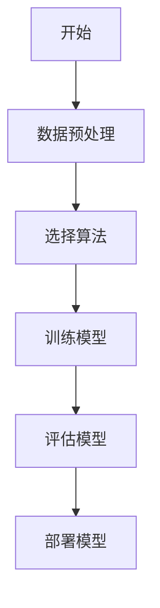
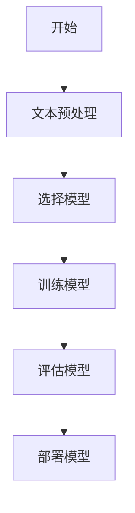
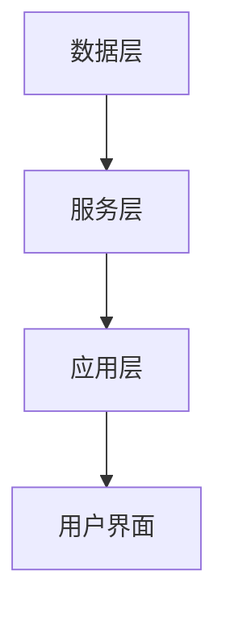
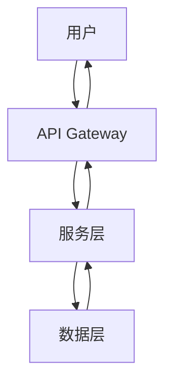

                 


# AI在保险理赔自动化中的创新应用

> 关键词：AI技术，保险理赔，自动化流程，机器学习，自然语言处理，计算机视觉

> 摘要：本文探讨了人工智能技术在保险理赔自动化中的创新应用，详细分析了AI技术如何解决传统保险理赔中的效率低下、成本高昂等问题，介绍了AI驱动的保险理赔自动化流程，包括智能受理、自动化审核和智能输出等环节，通过具体的技术实现和系统架构设计，展示了AI在保险行业的深远影响。

---

# 第一部分: 保险理赔自动化背景与挑战

## 第1章: 保险行业的现状与痛点

### 1.1 传统保险理赔流程的复杂性
#### 1.1.1 保险理赔的流程概述
保险理赔是保险业务中的核心环节，传统流程通常包括理赔申请、资料审核、风险评估、理赔计算和结果输出等多个步骤。每个步骤都需要大量的人工干预，导致效率低下。

#### 1.1.2 保险理赔中的效率问题
传统理赔流程中的信息孤岛、重复劳动和人工审核等问题，导致理赔周期长、成本高，用户体验差。例如，理赔申请可能需要数周时间才能完成，且容易出错。

#### 1.1.3 成本与资源浪费的现状
传统保险理赔模式需要大量的人力资源投入，尤其是在审核、计算和文档处理等环节。这不仅增加了企业的运营成本，还可能导致客户流失。

### 1.2 AI技术在保险行业的应用前景
#### 1.2.1 AI技术的核心优势
AI技术具有高效性、准确性、可扩展性等优势，能够显著提高保险理赔的效率和准确性。例如，AI可以通过机器学习模型快速分析理赔申请，减少人工审核的时间。

#### 1.2.2 保险行业对AI技术的需求
保险行业对AI技术的需求主要集中在风险评估、理赔自动化和客户服务等方面。AI技术可以帮助保险公司更好地管理风险，优化理赔流程，并提升客户满意度。

#### 1.2.3 保险理赔自动化的目标与意义
保险理赔自动化的目标是通过AI技术实现理赔流程的智能化和自动化，减少人工干预，提高效率和准确性。其意义在于降低企业成本、提升客户体验，并推动保险行业的数字化转型。

---

## 第2章: AI在保险理赔自动化中的核心概念

### 2.1 AI技术与保险理赔的结合点
#### 2.1.1 机器学习在风险评估中的应用
机器学习可以通过分析历史数据，识别潜在的风险因素，帮助保险公司更好地评估客户的风险等级。

#### 2.1.2 自然语言处理在理赔文档处理中的应用
自然语言处理（NLP）技术可以用于自动解析理赔文档中的关键信息，如保单条款、理赔金额和责任范围等，从而提高处理效率。

#### 2.1.3 计算机视觉在理赔单证识别中的应用
计算机视觉技术可以用于识别和处理理赔单证中的图像信息，如车牌识别、人脸识别和文档扫描等，从而减少人工操作。

### 2.2 AI驱动的保险理赔自动化流程
#### 2.2.1 理赔申请的智能受理
通过AI技术，理赔申请可以实现自动受理，包括信息提取、分类和初步审核等环节，减少人工干预。

#### 2.2.2 理赔审核的自动化处理
AI技术可以通过机器学习模型自动审核理赔申请，识别潜在的欺诈行为，确保理赔的准确性和合规性。

#### 2.2.3 理赔结果的智能输出
通过AI技术，理赔结果可以实现自动输出，包括理赔金额计算、赔付方案制定和结果通知等环节，提高效率和客户满意度。

### 2.3 保险理赔自动化的核心要素
#### 2.3.1 数据采集与处理
数据是AI技术的基础，保险理赔自动化需要采集和处理大量的理赔数据，包括文本、图像和结构化数据等。

#### 2.3.2 AI模型的训练与部署
AI模型需要基于理赔数据进行训练，优化算法参数，提高模型的准确性和效率。同时，模型需要部署到生产环境中，实现自动化处理。

#### 2.3.3 系统集成与接口设计
保险理赔自动化系统需要与现有的保险管理系统、客户数据库和第三方服务进行集成，设计良好的接口和交互流程，确保系统的稳定性和可扩展性。

---

## 第3章: AI在保险理赔自动化中的技术实现

### 3.1 机器学习在理赔预测中的应用
#### 3.1.1 监督学习与非监督学习的对比
监督学习需要标注的数据进行训练，适用于分类和回归任务；非监督学习适用于聚类和异常检测任务。

#### 3.1.2 常见算法（如随机森林、神经网络）的优缺点
随机森林具有高准确性和鲁棒性，适用于分类和回归任务；神经网络适用于复杂模式识别，但需要大量的训练数据。

#### 3.1.3 算法流程图（使用 mermaid）


### 3.2 自然语言处理在理赔文档分析中的应用
#### 3.2.1 文本预处理与特征提取
文本预处理包括分词、去除停用词和词干提取等；特征提取包括TF-IDF和Word2Vec等方法。

#### 3.2.2 基于BERT的文本分类模型
BERT是一种基于Transformer的预训练语言模型，可以用于文本分类、问答系统和文本摘要等任务。

#### 3.2.3 NLP算法流程图（使用 mermaid）


### 3.3 计算机视觉在理赔单证识别中的应用
#### 3.3.1 图像分割与OCR技术
图像分割用于识别图像中的特定区域，OCR技术用于将图像中的文字提取出来。

#### 3.3.2 基于卷积神经网络的图像识别
卷积神经网络（CNN）适用于图像分类和目标检测任务，可以用于识别保险单证中的关键信息。

#### 3.3.3 CV算法流程图（使用 mermaid）


---

## 第4章: 保险理赔自动化中的系统架构设计

### 4.1 系统功能模块设计
#### 4.1.1 理赔申请模块
负责接收和处理客户的理赔申请，提取关键信息并分类处理。

#### 4.1.2 理赔审核模块
基于AI模型自动审核理赔申请，识别潜在的欺诈行为，并生成审核结果。

#### 4.1.3 理赔结果输出模块
根据审核结果生成赔付方案，并通过多种渠道通知客户。

### 4.2 系统架构设计
#### 4.2.1 分层架构设计
系统分为数据层、服务层和应用层，每层负责不同的功能模块。

#### 4.2.2 系统架构图（使用 mermaid）


### 4.3 系统接口设计
#### 4.3.1 API接口设计
定义RESTful API接口，用于与其他系统进行数据交互。

#### 4.3.2 接口交互流程图（使用 mermaid）


---

## 第5章: 项目实战

### 5.1 环境安装
安装必要的开发工具和库，如Python、TensorFlow和PyTorch等。

### 5.2 核心代码实现
#### 5.2.1 机器学习模型实现
```python
# 示例代码：机器学习模型实现
import pandas as pd
from sklearn.ensemble import RandomForestClassifier

# 数据加载
data = pd.read_csv('claims.csv')

# 特征提取
features = data.drop('label', axis=1)
labels = data['label']

# 模型训练
model = RandomForestClassifier()
model.fit(features, labels)

# 模型预测
预测结果 = model.predict(features)
```

#### 5.2.2 NLP模型实现
```python
# 示例代码：NLP模型实现
from transformers import BertTokenizer, BertModel

# 模型加载
tokenizer = BertTokenizer.from_pretrained('bert-base-uncased')
model = BertModel.from_pretrained('bert-base-uncased')

# 文本处理
text = "理赔金额为10000元"
inputs = tokenizer(text, return_tensors='np')

# 模型推理
outputs = model(**inputs)
```

### 5.3 案例分析
通过实际案例分析，展示AI技术在保险理赔自动化中的应用效果和优势。

### 5.4 项目小结
总结项目实施的过程、成果和经验教训，为后续优化提供参考。

---

## 第6章: 最佳实践与注意事项

### 6.1 小结
总结全文内容，强调AI技术在保险理赔自动化中的重要性和应用前景。

### 6.2 注意事项
提醒读者在实际应用中需要注意的问题，如数据隐私、模型优化和系统稳定性等。

### 6.3 拓展阅读
推荐相关领域的书籍和资源，供读者进一步学习和研究。

---

# 作者：AI天才研究院/AI Genius Institute & 禅与计算机程序设计艺术 /Zen And The Art of Computer Programming

