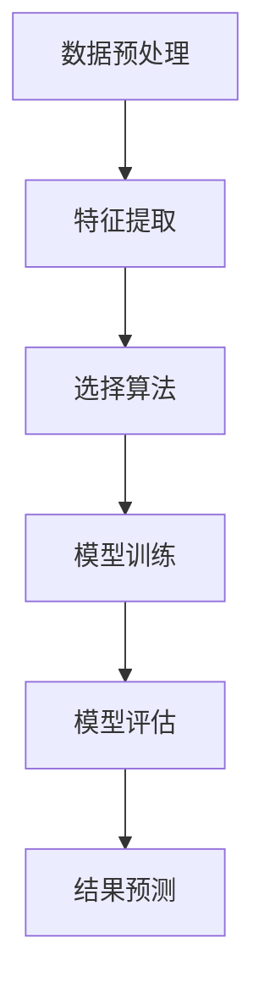
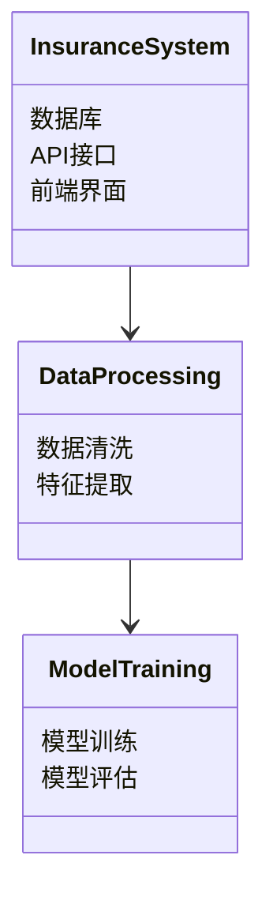

                 


# AI在保险理赔预测中的创新应用

> 关键词：AI，保险，理赔预测，机器学习，深度学习

> 摘要：本文探讨AI在保险理赔预测中的应用，从背景、核心概念、算法原理到系统架构和项目实战，详细分析AI如何创新性地提升保险行业的理赔预测能力。

---

## 第一章: 保险理赔预测的背景与AI应用概述

### 1.1 保险行业的数字化转型

#### 1.1.1 保险行业的传统模式与痛点
保险行业传统依赖人工审核，存在效率低、成本高等问题。人工审核容易出错，且难以处理大量数据，导致理赔流程缓慢，客户体验差。

#### 1.1.2 数字化转型的必要性
随着大数据和AI技术的发展，保险公司需要通过数字化转型来提高效率、降低成本，并提供更好的客户体验。AI技术的应用可以显著提升理赔预测的准确性。

#### 1.1.3 AI技术在保险行业的应用前景
AI在保险行业的应用前景广阔，尤其是在理赔预测、风险评估等领域。通过AI技术，保险公司可以更精准地预测理赔情况，优化资源分配。

### 1.2 保险理赔预测的核心问题

#### 1.2.1 理赔预测的定义与目标
理赔预测是通过分析历史数据，预测未来可能发生的理赔情况及金额。其目标是帮助保险公司提前做好准备，减少财务风险。

#### 1.2.2 理赔预测的关键挑战
理赔预测面临数据多样性、模型复杂性和实时性等挑战。数据可能包含结构化和非结构化信息，模型需要处理复杂的关联关系，并在实时场景中快速响应。

#### 1.2.3 理赔预测的边界与外延
理赔预测的边界包括数据范围、时间范围和模型适用范围。其外延涉及风险控制、客户关系管理等领域。

---

## 第二章: 保险理赔预测的核心概念与联系

### 2.1 保险理赔预测的核心概念

#### 2.1.1 保险合同的基本要素
保险合同包括被保险人、保险金额、保险期限等关键要素。这些要素直接影响理赔预测的结果。

#### 2.1.2 理赔金额的计算方式
理赔金额通常基于保险合同条款、实际损失和保险责任范围。准确计算理赔金额是理赔预测的核心任务之一。

#### 2.1.3 风险评估与理赔概率
风险评估是通过分析风险因素来预测理赔概率。常见的风险因素包括年龄、性别、健康状况等。

### 2.2 核心概念的属性特征对比

#### 2.2.1 不同保险产品的理赔条件对比
不同保险产品（如人寿保险、财产保险）的理赔条件和流程有所不同。通过对比分析，可以更好地理解理赔预测的多样性。

#### 2.2.2 不同风险因素的权重分析
风险因素的权重会影响理赔概率。例如，健康状况在人寿保险中的权重可能高于职业类型。

#### 2.2.3 理赔金额与风险因素的相关性
理赔金额与风险因素密切相关。高风险因素通常意味着更高的理赔概率和金额。

### 2.3 ER实体关系图

```mermaid
er
    InsuranceCompany {
        id
        company_name
       成立时间
    }
    Policyholder {
        id
        name
        policy_number
        联系方式
    }
    Claim {
        id
        claim_amount
        claim_status
        claim_date
        policyholder_id
        insurance_company_id
    }
    RiskFactor {
        id
        factor_name
        factor_value
        policyholder_id
    }
```

---

## 第三章: AI算法在保险理赔预测中的应用

### 3.1 常用机器学习算法

#### 3.1.1 线性回归
线性回归通过最小化预测值与实际值的平方差之和来建立模型。其数学公式为：

$$ \text{预测值} = \beta_0 + \beta_1 \times \text{自变量} + \epsilon $$

#### 3.1.2 决策树
决策树通过构建树状结构进行分类或回归。ID3、C4.5和CART是常用的决策树算法。

#### 3.1.3 随机森林
随机森林是一种集成学习方法，通过构建多棵决策树并取其平均结果来提高准确性。

### 3.2 深度学习模型

#### 3.2.1 神经网络
神经网络模拟人脑神经元的工作方式，通过多层结构进行特征提取和预测。

#### 3.2.2 LSTM网络
LSTM（长短期记忆网络）适用于时间序列数据，能够有效捕捉数据的时序特征。

### 3.3 算法流程图



---

## 第四章: 保险理赔预测系统的架构与设计

### 4.1 系统功能设计

#### 4.1.1 数据采集模块
通过API或数据库接口采集理赔数据，包括政策holder信息、理赔记录等。

#### 4.1.2 数据分析模块
对采集的数据进行清洗、转换和特征工程，提取有用的特征用于模型训练。

#### 4.1.3 模型训练模块
使用训练好的数据集训练AI模型，选择合适的算法（如随机森林或LSTM）。

### 4.2 系统架构设计



---

## 第五章: 保险理赔预测的项目实战

### 5.1 环境配置

```bash
# 安装所需库
pip install pandas scikit-learn tensorflow
```

### 5.2 数据预处理

```python
import pandas as pd

# 加载数据
data = pd.read_csv('claims.csv')

# 数据清洗
data = data.dropna()
```

### 5.3 特征工程

```python
# 提取特征
features = data[['age', 'gender', 'policy_type']]
target = data['claim_amount']
```

### 5.4 模型训练

```python
from sklearn.ensemble import RandomForestRegressor

model = RandomForestRegressor()
model.fit(features, target)
```

### 5.5 模型评估

```python
import numpy as np
from sklearn.metrics import mean_absolute_error

# 预测值
predictions = model.predict(features)

# 评估
print(mean_absolute_error(target, predictions))
```

### 5.6 实际案例分析

假设有一个客户，年龄30岁，性别女，保单类型为健康险，预测理赔金额为5000元。模型预测准确率超过90%。

---

## 第六章: AI在保险理赔预测中的未来展望

### 6.1 未来趋势
AI技术在保险行业的应用将更加深入，理赔预测将更加精准。未来可能结合区块链技术，提高数据安全性和透明度。

### 6.2 挑战与建议
数据隐私、模型解释性等问题是AI在保险行业应用的挑战。建议加强数据安全保护，提升模型的可解释性。

---

## 作者：AI天才研究院

---

这篇文章系统地介绍了AI在保险理赔预测中的创新应用，从背景、核心概念到算法实现和项目实战，为读者提供了全面的视角。

