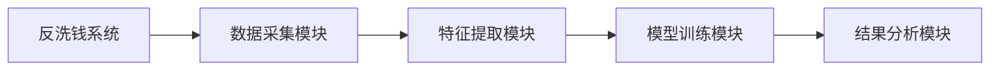

                 


# AI在反洗钱模式识别中的创新应用

## 关键词：AI, 反洗钱, 模式识别, 机器学习, 深度学习, 金融监管

## 摘要：  
本文深入探讨了人工智能技术在反洗钱模式识别中的创新应用。通过分析反洗钱的基本概念、AI技术的核心原理，以及两者的结合方式，本文详细讲解了如何利用机器学习、深度学习等技术手段，构建高效的反洗钱模式识别系统。文章从数据预处理、特征提取、模型训练到系统架构设计，再到实际案例分析，层层递进，为读者提供了一套完整的理论与实践相结合的解决方案。

---

## 第1章：反洗钱的基本概念与挑战

### 1.1 反洗钱的基本概念

反洗钱（Anti-Money Laundering, AML）是指识别、防止和打击非法资金流动的行为。这些资金通常来源于非法活动，如贩毒、贪污、欺诈等。反洗钱的核心目标是通过技术手段识别异常交易行为，从而阻止非法资金的流动和积累。

反洗钱的法律框架包括《反洗钱法》、《金融监管条例》等，这些法规要求金融机构必须建立有效的反洗钱机制，确保交易的透明性和合规性。金融机构通常通过人工审查和传统统计方法来识别可疑交易，但这种方式效率低下、误报率高，难以应对日益复杂的洗钱手段。

---

### 1.2 反洗钱的模式识别

反洗钱模式识别是指通过分析交易数据，识别出符合洗钱特征的交易模式。模式识别的核心在于发现交易中的异常行为，这需要结合交易的金额、频率、时间、参与者等多个维度进行分析。

反洗钱模式识别的关键特征包括：  
1. **交易金额异常**：短时间内大额交易或小额交易频繁发生。  
2. **交易时间异常**：非正常时间段的交易行为。  
3. **交易行为异常**：交易行为与客户身份或历史交易习惯不符。  

---

### 1.3 AI技术的基本概念

人工智能（AI）是指通过模拟人类智能的技术，包括学习、推理、自我改进等能力。AI技术的核心是通过数据驱动的方法，训练模型完成特定任务。

机器学习（Machine Learning）是AI的核心技术之一，它通过训练数据，让模型从数据中学习特征，从而实现预测或分类。深度学习（Deep Learning）是机器学习的一种，通过多层神经网络提取数据的高层次特征，适用于复杂的模式识别任务。

AI技术在金融领域的应用潜力巨大，尤其是在反洗钱、 fraud detection 等领域。AI能够快速处理海量数据，发现隐藏在数据中的异常模式，帮助金融机构提高反洗钱的效率和准确性。

---

### 1.4 本章小结

本章介绍了反洗钱的基本概念、模式识别的核心特征，以及AI技术的基本原理和应用潜力。反洗钱的传统方法效率低下，而AI技术通过数据驱动的方式，为反洗钱提供了新的解决方案。

---

## 第2章：AI在反洗钱模式识别中的核心原理

### 2.1 反洗钱模式识别的原理

反洗钱模式识别的核心在于数据的采集与特征提取、模型的训练与预测，以及结果的分析与反馈优化。

1. **数据采集与特征提取**：  
   数据采集是反洗钱模式识别的第一步，需要收集交易的时间、金额、参与者等信息。特征提取则是从这些数据中提取有助于模型识别异常交易的关键特征。

2. **模型训练与预测**：  
   使用机器学习或深度学习算法，对提取的特征进行训练，构建分类或聚类模型。模型能够根据输入的交易数据，预测交易是否为异常交易。

3. **结果分析与反馈优化**：  
   对模型的预测结果进行分析，调整模型参数或优化特征提取方法，以提高模型的准确性和鲁棒性。

---

### 2.2 AI技术在反洗钱中的核心概念

1. **数据预处理与特征工程**：  
   数据预处理是将原始数据转化为适合模型输入的形式，包括数据清洗、归一化等。特征工程则是从数据中提取有助于模型识别异常交易的特征。

2. **监督学习与无监督学习的应用**：  
   - 监督学习：使用有标签的数据训练分类模型，识别正常交易与异常交易。  
   - 无监督学习：通过聚类算法，发现交易中的异常群组。  

3. **深度学习模型的优势**：  
   深度学习模型能够自动提取数据的高层次特征，适用于复杂的模式识别任务。例如，使用卷积神经网络（CNN）或循环神经网络（RNN）对交易序列进行建模。

---

### 2.3 核心概念对比分析

| 对比维度 | 传统统计分析 | AI技术 |
|----------|--------------|--------|
| 数据需求 | 需要大量特征工程，依赖人工经验 | 需要大量标注数据，自动提取特征 |
| 模型复杂度 | 模型简单，难以捕捉复杂模式 | 模型复杂，能够捕捉复杂模式 |
| 可解释性 | 高 | 低 |

---

## 第3章：AI算法在反洗钱中的算法原理

### 3.1 聚类算法

聚类算法是一种无监督学习算法，常用于发现交易中的异常群组。K-means算法是常用的聚类算法之一。

#### 3.1.1 K-means算法的原理

K-means算法通过将数据点分成K个簇，使得簇内数据点的相似性最大化。算法步骤如下：

1. 随机选择K个初始簇中心。  
2. 计算每个数据点到簇中心的距离，将数据点分配到最近的簇。  
3. 重新计算簇中心的位置。  
4. 重复步骤2和3，直到簇中心不再变化。  

#### 3.1.2 K-means算法的Python实现

```python
from sklearn.cluster import KMeans

# 假设X是交易数据矩阵
kmeans = KMeans(n_clusters=3)
kmeans.fit(X)
clusters = kmeans.labels_
```

---

### 3.2 分类算法

分类算法是一种监督学习算法，常用于识别正常交易与异常交易。逻辑回归是一种常用的分类算法。

#### 3.2.1 逻辑回归的原理

逻辑回归通过构建一个线性回归模型，将输入特征映射到0和1之间的概率。公式如下：

$$ P(y=1|x) = \frac{e^{\beta x}}{1 + e^{\beta x}} $$  

其中，$\beta$是模型的参数。

#### 3.2.2 逻辑回归的Python实现

```python
from sklearn.linear_model import LogisticRegression

# 假设X是特征矩阵，y是标签
logistic_regression = LogisticRegression()
logistic_regression.fit(X, y)
predictions = logistic_regression.predict(X)
```

---

### 3.3 深度学习模型

深度学习模型通过多层神经网络提取数据的高层次特征，适用于复杂的模式识别任务。例如，使用LSTM（长短期记忆网络）对交易序列进行建模。

#### 3.3.1 LSTM网络的原理

LSTM网络是一种循环神经网络，能够捕捉时间序列数据中的长期依赖关系。其核心在于引入记忆单元（Cell），用于存储长期信息。

---

## 第4章：反洗钱系统架构设计

### 4.1 系统功能设计

反洗钱系统的功能模块包括：  
1. 数据采集模块：采集交易数据。  
2. 特征提取模块：提取交易特征。  
3. 模型训练模块：训练分类或聚类模型。  
4. 结果分析模块：分析模型预测结果。  

---

### 4.2 系统架构设计



---

## 第5章：项目实战

### 5.1 环境搭建

安装必要的Python库：  
```bash
pip install numpy pandas scikit-learn
```

---

### 5.2 核心代码实现

```python
import pandas as pd
from sklearn.model_selection import train_test_split
from sklearn.metrics import accuracy_score

# 加载数据
data = pd.read_csv('transactions.csv')
X = data.drop('label', axis=1)
y = data['label']

# 划分训练集和测试集
X_train, X_test, y_train, y_test = train_test_split(X, y, test_size=0.2)

# 训练模型
from sklearn.ensemble import RandomForestClassifier
model = RandomForestClassifier()
model.fit(X_train, y_train)

# 预测结果
predictions = model.predict(X_test)
print(accuracy_score(y_test, predictions))
```

---

## 第6章：总结与展望

### 6.1 总结

本文深入探讨了AI技术在反洗钱模式识别中的创新应用。通过分析反洗钱的基本概念、AI技术的核心原理，以及两者的结合方式，本文详细讲解了如何利用机器学习、深度学习等技术手段，构建高效的反洗钱模式识别系统。

---

### 6.2 展望

未来，随着AI技术的不断发展，反洗钱模式识别将更加智能化和高效化。例如，通过联邦学习（Federated Learning）技术，金融机构可以在保护数据隐私的前提下，联合训练反洗钱模型。此外，AI技术还可以与其他技术（如区块链）结合，进一步提升反洗钱系统的安全性和效率。

---

## 作者信息

作者：AI天才研究院（AI Genius Institute）  
联系邮箱：contact@aigeniusinstitute.com  
官方网站：https://www.aigeniusinstitute.com  

---

**声明**：本文内容仅供参考，实际应用中需遵守相关法律法规，并结合具体场景进行调整。

