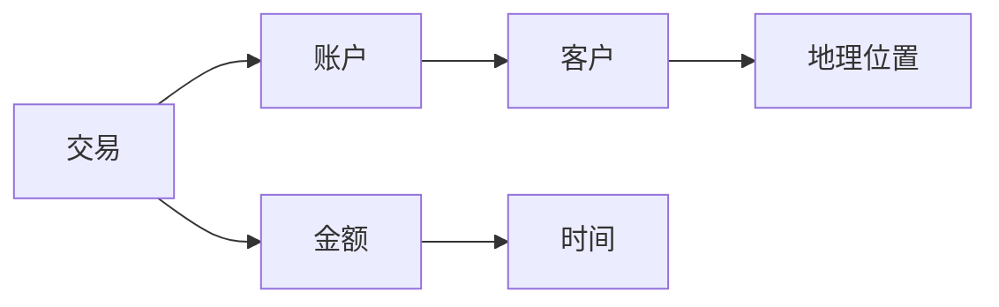
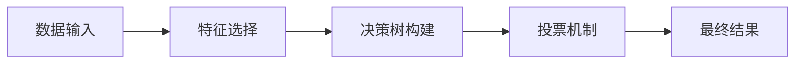
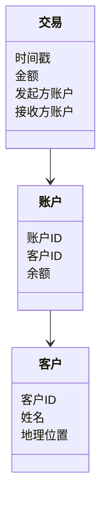
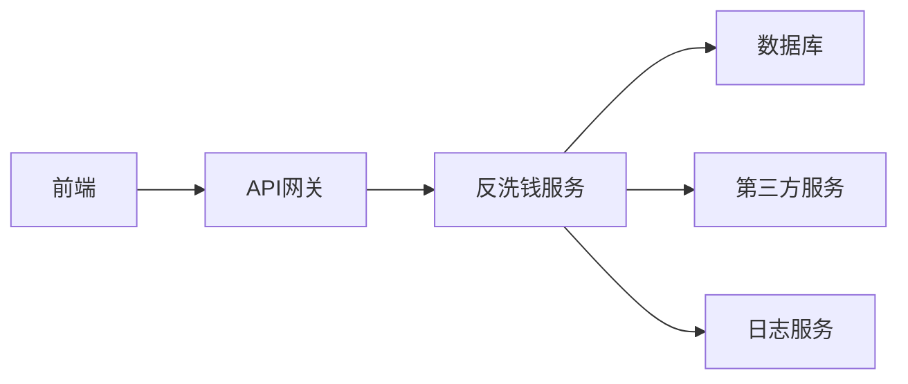
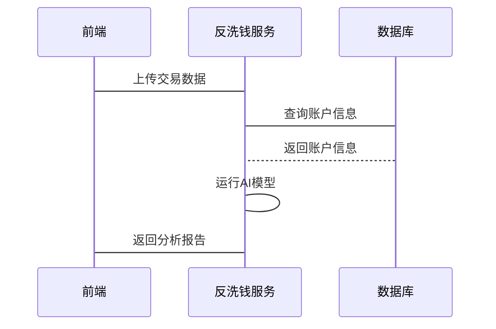

                 


# AI在反洗钱模式识别中的深度应用研究

## 关键词：反洗钱，人工智能，机器学习，深度学习，模式识别

## 摘要：  
本文深入探讨了人工智能（AI）在反洗钱模式识别中的应用，从背景、核心概念、算法原理到系统架构设计、项目实战，全面分析了AI技术如何提升反洗钱的效率和准确性。文章结合实际案例，详细讲解了随机森林和神经网络等算法的原理，并通过系统架构设计展示了AI在反洗钱系统中的应用场景。最后，本文总结了研究的成果和经验，并提出了未来的研究方向。

---

# 第1章: 反洗钱与AI概述

## 1.1 反洗钱的基本概念

### 1.1.1 洗钱的定义与流程  
洗钱是指将非法资金通过复杂的交易过程转化为合法资金的行为。洗钱通常包括三个阶段：  
1. **放置阶段**：将非法资金投入合法金融系统。  
2. **清洗阶段**：通过复杂的交易操作，掩盖资金来源。  
3. **提取阶段**：将清洗后的资金用于合法用途或转移至其他账户。

### 1.1.2 反洗钱的法律与监管要求  
反洗钱是全球金融监管的重要组成部分。各国政府和金融机构需要通过法律法规和技术手段，识别和阻止洗钱行为。例如，欧盟的《反洗钱指令》（AML）和美国的《爱国者法案》都对金融机构提出了严格的要求。

### 1.1.3 反洗钱的传统技术手段  
传统反洗钱技术主要包括基于规则的检测、人工审核和简单的统计分析。然而，这些方法存在效率低、误报率高、难以应对复杂模式识别等问题。

---

## 1.2 AI技术在反洗钱中的应用背景

### 1.2.1 传统反洗钱技术的局限性  
传统反洗钱技术主要依赖于预定义的规则和简单的统计分析，难以应对以下挑战：  
1. **数据量大**：金融机构每天处理的交易数据可能以百万计，传统方法难以高效处理。  
2. **模式复杂**：洗钱行为越来越隐蔽，传统的规则难以覆盖复杂的洗钱模式。  
3. **误报率高**：基于规则的系统容易产生大量误报，导致人工审核成本高昂。

### 1.2.2 AI技术的优势与潜力  
AI技术，尤其是机器学习和深度学习，具有以下优势：  
1. **自动化分析**：AI能够自动处理海量数据，发现隐藏的模式和异常行为。  
2. **高准确性**：通过训练模型，AI可以在复杂场景中实现高精度的模式识别。  
3. **适应性强**：AI模型能够动态适应洗钱行为的变化，及时调整检测策略。

### 1.2.3 反洗钱与AI结合的必要性  
随着全球化和数字化的发展，洗钱手段日益复杂，传统方法已难以应对。AI技术的引入能够显著提升反洗钱的效率和准确性，是现代反洗钱技术发展的必然趋势。

---

## 1.3 本书研究的核心问题

### 1.3.1 问题背景与目标  
本文研究的核心问题是：如何利用AI技术，特别是机器学习和深度学习方法，实现对反洗钱模式的高效识别和预测。

### 1.3.2 问题解决的关键技术  
本文将重点研究以下关键技术：  
1. **监督学习**：用于已知标签的交易数据分类。  
2. **无监督学习**：用于发现隐藏的异常模式。  
3. **特征工程**：用于提取交易数据中的关键特征。

### 1.3.3 研究的边界与外延  
本文的研究范围主要集中在AI算法在反洗钱模式识别中的应用，不涉及具体的法律合规和技术实现的细节。

---

## 1.4 本章小结  
本章介绍了反洗钱的基本概念、传统技术的局限性以及AI技术在反洗钱中的潜力和必要性。通过分析，明确了本文研究的核心问题和关键技术。

---

# 第2章: AI在反洗钱中的核心概念与联系

## 2.1 核心概念原理

### 2.1.1 机器学习在反洗钱中的应用  
机器学习通过训练模型，能够自动识别异常交易模式。例如，监督学习可以用于分类交易为正常或异常；无监督学习可以用于聚类分析，发现隐藏的异常交易群组。

### 2.1.2 深度学习在反洗钱中的优势  
深度学习通过多层神经网络，能够捕捉复杂的交易特征和模式。例如，卷积神经网络（CNN）可以用于分析交易的时间序列数据，而循环神经网络（RNN）可以用于处理序列数据。

### 2.1.3 异常检测的核心原理  
异常检测是反洗钱中的核心任务之一。通过训练模型，AI能够识别与正常交易模式显著不同的异常交易。

---

## 2.2 核心概念属性特征对比

### 2.2.1 传统方法与AI方法的对比  
| 对比维度 | 传统方法 | AI方法 |  
|----------|----------|--------|  
| 数据处理 | 简单规则 | 复杂模式识别 |  
| 准确性 | 低 | 高 |  
| 灵活性 | 低 | 高 |  

### 2.2.2 监督学习与无监督学习的对比  
| 对比维度 | 监督学习 | 无监督学习 |  
|----------|----------|----------|  
| 数据需求 | 需要标签 | 不需要标签 |  
| 适用场景 | 已知异常类型 | 未知异常类型 |  

### 2.2.3 强化学习与迁移学习的对比  
| 对比维度 | 强化学习 | 迁移学习 |  
|----------|----------|----------|  
| 学习目标 | 最大化奖励 | 利用已有知识 |  
| 应用场景 | 自动化决策 | 跨任务学习 |  

---

## 2.3 ER实体关系图架构



图2-1：反洗钱系统的ER实体关系图。交易（A）与账户（B）相关联，账户与客户（C）相关联，交易金额（D）与时间（E）相关联，客户地理位置（F）也与交易相关。

---

## 2.4 本章小结  
本章通过对比分析，明确了AI技术在反洗钱中的核心概念和优势。通过ER实体关系图，展示了反洗钱系统中各实体之间的关系。

---

# 第3章: AI反洗钱算法原理与数学模型

## 3.1 算法原理讲解

### 3.1.1 随机森林算法



随机森林通过构建多个决策树，并通过投票机制选择最终结果。这种方法能够有效降低过拟合风险，提高模型的泛化能力。

### 3.1.2 神经网络算法


神经网络通过多层非线性变换，能够捕捉复杂的交易特征。输出层的激活函数（如sigmoid）用于分类任务。

---

## 3.2 数学模型与公式

### 3.2.1 随机森林模型
$$ \text{预测值} = \sum_{i=1}^{n} \text{投票权重} \times \text{特征重要性} $$

### 3.2.2 神经网络模型
$$ \text{输出} = \sigma(w \cdot x + b) $$
其中，$\sigma$为激活函数，$w$为权重，$x$为输入，$b$为偏置。

---

## 3.3 本章小结  
本章详细讲解了随机森林和神经网络的算法原理，并通过公式和流程图展示了模型的工作机制。

---

# 第4章: 系统架构设计

## 4.1 问题场景介绍  
反洗钱系统需要实时处理海量交易数据，快速识别异常交易，并生成报告供监管机构审查。

## 4.2 系统功能设计

### 4.2.1 领域模型



### 4.2.2 系统架构



### 4.2.3 接口设计  
系统接口包括：  
1. `/api/transaction/upload`：上传交易数据。  
2. `/api/analysis/run`：启动反洗钱分析任务。  
3. `/api/report/download`：下载分析报告。  

### 4.2.4 交互流程  



---

## 4.3 本章小结  
本章通过系统架构设计，展示了AI技术在反洗钱系统中的应用场景和实现方式。

---

# 第5章: 项目实战

## 5.1 环境配置  
安装Python、Scikit-learn、TensorFlow和Flask框架。

## 5.2 系统核心实现源代码

### 5.2.1 数据预处理

```python
import pandas as pd

# 加载数据
df = pd.read_csv('transactions.csv')

# 删除缺失值
df.dropna(inplace=True)

# 标签编码
from sklearn.preprocessing import LabelEncoder
le = LabelEncoder()
df['label'] = le.fit_transform(df['label'])
```

### 5.2.2 特征工程

```python
from sklearn.feature_selection import SelectKBest

selector = SelectKBest(k=10)
selector.fit_transform(df.drop('label', axis=1), df['label'])
```

### 5.2.3 模型训练

```python
from sklearn.ensemble import RandomForestClassifier

model = RandomForestClassifier(n_estimators=100, max_depth=10)
model.fit(X_train, y_train)
```

### 5.2.4 模型部署

```python
from flask import Flask, request, jsonify

app = Flask(__name__)

@app.route('/predict', methods=['POST'])
def predict():
    data = request.json['data']
    prediction = model.predict([data])
    return jsonify({'prediction': int(prediction[0])})

if __name__ == '__main__':
    app.run(debug=True)
```

---

## 5.3 本章小结  
本章通过具体代码示例，展示了如何实现反洗钱系统的数据预处理、特征工程、模型训练和部署。

---

# 第6章: 总结与展望

## 6.1 研究成果总结  
本文通过AI技术，特别是随机森林和神经网络算法，实现了对反洗钱模式的高效识别和预测。

## 6.2 改进建议  
1. **模型优化**：引入更复杂的深度学习模型（如GAN和Transformer）提升检测精度。  
2. **数据隐私保护**：采用联邦学习等技术，保护数据隐私。  
3. **实时性提升**：优化系统架构，提升实时交易的处理能力。  

## 6.3 未来研究方向  
1. **多模态数据融合**：结合文本、图像等多种数据源，提升检测能力。  
2. **可解释性增强**：提升模型的可解释性，便于监管机构审查。  
3. **动态对抗**：研究动态对抗策略，应对洗钱行为的不断变化。

---

## 作者：AI天才研究院/AI Genius Institute & 禅与计算机程序设计艺术 /Zen And The Art of Computer Programming

---

通过本文的研究，我们深入探讨了AI技术在反洗钱模式识别中的应用，展示了如何通过算法创新和系统设计，提升反洗钱的效率和准确性。未来，随着AI技术的不断发展，反洗钱技术也将迎来更多新的机遇和挑战。

