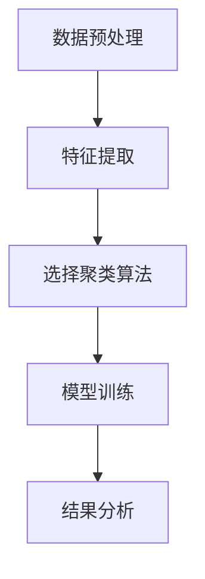
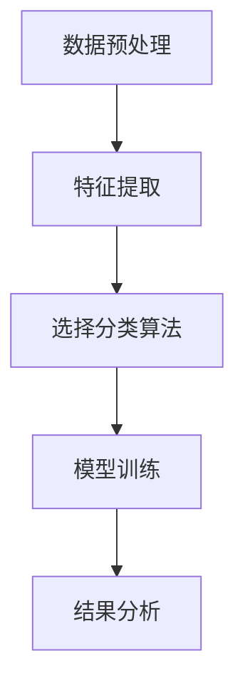
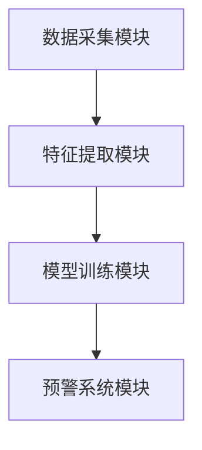

                 


# AI在反洗钱模式进化检测与预警中的深度应用研究

> 关键词：反洗钱，人工智能，模式进化检测，预警系统，深度学习

> 摘要：  
随着全球金融体系的复杂化和非法资金流动的多样化，传统的反洗钱方法面临着越来越大的挑战。本文深入探讨了人工智能技术在反洗钱模式进化检测与预警中的应用，结合实际案例和算法实现，分析了基于机器学习和深度学习的反洗钱系统的设计与实现过程，提出了结合模式识别与实时预警的创新解决方案，为金融领域的安全防护提供了新的思路。

---

## 第一部分：反洗钱模式进化检测的背景与核心概念

### 第1章：反洗钱与AI的结合背景

#### 1.1 反洗钱的基本概念与问题背景
反洗钱（Anti-Money Laundering, AML）是指识别和防止非法资金通过金融机构进行转移和洗白的过程。传统的反洗钱手段主要包括合规性检查、交易监控和人工审核。然而，随着金融交易的复杂化和犯罪手段的智能化，传统的反洗钱方法逐渐暴露出效率低、误报率高、难以应对新型洗钱模式等问题。

#### 1.2 AI技术在反洗钱中的应用潜力
人工智能（Artificial Intelligence, AI）技术，特别是机器学习（Machine Learning, ML）和深度学习（Deep Learning, DL），在处理海量数据和复杂模式识别方面具有显著优势。AI能够通过分析交易数据中的异常模式，快速识别潜在的洗钱行为，并提供实时预警。

#### 1.3 本研究的目标与意义
本研究旨在探索AI技术在反洗钱模式进化检测中的深度应用，结合模式识别和实时预警技术，构建一个高效、智能的反洗钱系统。通过分析洗钱模式的进化趋势，提出一种基于AI的动态检测方法，为金融机构提供技术支持。

---

### 第2章：AI在反洗钱中的核心概念与联系

#### 2.1 模式进化检测的核心概念
模式进化检测是指通过分析交易数据中的模式变化，识别洗钱行为的新型特征。洗钱者通常会通过改变交易模式、金额大小、交易频率等方式规避传统反洗钱系统的检测。AI技术能够通过学习历史数据中的模式进化趋势，预测未来的洗钱行为。

#### 2.2 AI技术的核心原理与特征
- **机器学习**：通过训练数据学习特征，识别异常模式。
- **深度学习**：利用神经网络提取高维特征，捕捉非线性关系。
- **实时分析**：通过流数据处理技术，实现交易的实时监控。

#### 2.3 反洗钱模式进化检测中的实体关系分析
通过构建实体关系图（ER图），我们可以清晰地看到洗钱交易中的各个实体及其关系。例如，交易主体（如个人、公司）、交易金额、交易时间、交易地点等实体特征的变化可以帮助识别洗钱模式的进化。

---

## 第二部分：基于AI的反洗钱模式进化检测算法原理

### 第3章：基于聚类算法的模式进化检测

#### 3.1 聚类算法的数学模型
聚类算法的目标是将相似的交易数据分组，识别出异常交易。常用的聚类算法包括K-means、DBSCAN等。例如，K-means算法的数学模型如下：

$$
\text{目标函数} = \sum_{i=1}^{k} \sum_{j=1}^{n_i} \|x_j - c_i\|^2
$$

其中，$k$ 是聚类数，$n_i$ 是第 $i$ 个聚类中的样本数，$x_j$ 是样本，$c_i$ 是第 $i$ 个聚类的中心。

#### 3.2 聚类算法的流程图分析
以下是聚类算法的流程图：



#### 3.3 聚类算法的Python实现
以下是基于K-means算法的Python实现示例：

```python
from sklearn.cluster import KMeans
from sklearn.preprocessing import StandardScaler

# 数据预处理
data = ...  # 输入数据
scaler = StandardScaler()
data_scaled = scaler.fit_transform(data)

# 聚类模型训练
kmeans = KMeans(n_clusters=3, random_state=42)
kmeans.fit(data_scaled)

# 获取聚类结果
clusters = kmeans.labels_
```

---

### 第4章：基于分类算法的模式进化检测

#### 4.1 分类算法的数学模型
分类算法的目标是将交易数据分类为正常交易和异常交易。常用的分类算法包括逻辑回归、支持向量机（SVM）和随机森林等。例如，逻辑回归的数学模型如下：

$$
P(y=1|x) = \frac{1}{1 + e^{-\beta x}}
$$

其中，$\beta$ 是模型参数，$x$ 是输入特征。

#### 4.2 分类算法的流程图分析
以下是分类算法的流程图：



#### 4.3 分类算法的Python实现
以下是基于逻辑回归算法的Python实现示例：

```python
from sklearn.linear_model import LogisticRegression
from sklearn.model_selection import train_test_split

# 数据预处理
data = ...  # 输入数据
X_train, X_test, y_train, y_test = train_test_split(data, labels, test_size=0.2, random_state=42)

# 分类模型训练
lr = LogisticRegression(random_state=42)
lr.fit(X_train, y_train)

# 获取分类结果
predictions = lr.predict(X_test)
```

---

## 第三部分：反洗钱模式进化检测系统的架构设计

### 第5章：系统功能模块划分

#### 5.1 数据采集模块
数据采集模块负责从金融机构获取交易数据，包括交易金额、交易时间、交易地点、交易主体等信息。

#### 5.2 特征提取模块
特征提取模块通过对原始数据进行特征提取，生成可用于模型训练的特征向量。

#### 5.3 模型训练模块
模型训练模块负责对特征向量进行训练，生成能够识别异常交易的模型。

#### 5.4 预警系统模块
预警系统模块实时监控交易数据，并根据模型预测结果发出预警信号。

---

### 第6章：系统架构设计

#### 6.1 系统架构图
以下是系统的架构图：



#### 6.2 模块之间的交互关系
数据采集模块将数据传递给特征提取模块，特征提取模块将特征传递给模型训练模块，模型训练模块将模型传递给预警系统模块。

---

## 第四部分：项目实战与案例分析

### 第7章：项目环境安装与配置

#### 7.1 Python环境的安装
安装Python 3.8或更高版本。

#### 7.2 依赖库的安装
安装所需的依赖库，例如：

```bash
pip install numpy pandas scikit-learn
```

#### 7.3 开发环境的配置
配置Jupyter Notebook或其他开发环境。

---

### 第8章：系统核心功能实现

#### 8.1 数据采集与预处理
从金融机构获取交易数据，并进行数据清洗和特征提取。

#### 8.2 模型训练与优化
训练聚类和分类模型，并对模型进行调优。

#### 8.3 实时预警系统开发
开发实时预警系统，实现对异常交易的实时监控和预警。

---

## 第五部分：总结与展望

### 9.1 最佳实践与注意事项
- 数据质量和完整性是模型性能的关键。
- 模型需要定期更新以应对洗钱模式的变化。
- 需要注意模型的可解释性，确保符合监管要求。

### 9.2 小结
本文深入探讨了AI技术在反洗钱模式进化检测与预警中的应用，结合实际案例和算法实现，提出了一种高效、智能的反洗钱系统设计方案。

### 9.3 拓展阅读
- 《Python机器学习实战》
- 《深度学习实战》

---

作者：AI天才研究院 & 禅与计算机程序设计艺术

