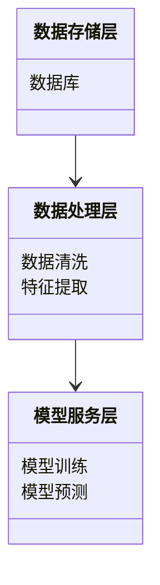
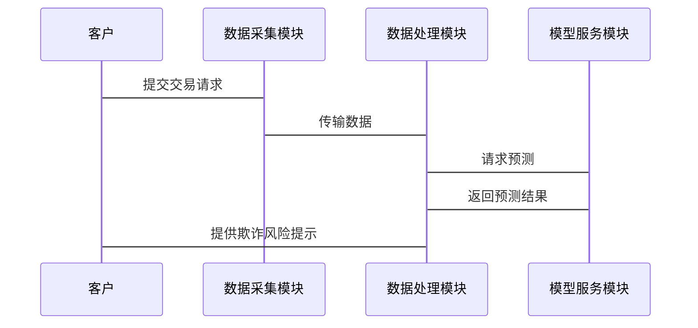

                 


```markdown
# AI在反金融欺诈中的深度应用研究

> 关键词：人工智能, 金融欺诈, 反欺诈系统, 深度学习, 金融安全

> 摘要：本文深入探讨了人工智能在反金融欺诈中的应用，分析了传统反欺诈手段的局限性，介绍了AI技术的核心概念与算法原理，详细讲解了基于AI的反欺诈系统的架构设计，并通过项目实战展示了AI在反金融欺诈中的实际应用。文章最后总结了AI在反金融欺诈中的优势与挑战，并展望了未来的发展方向。

---

# 第一部分: 金融欺诈与AI的结合背景

## 第1章: 金融欺诈的现状与挑战

### 1.1 金融欺诈的定义与类型

- 1.1.1 金融欺诈的定义
  - 金融欺诈是指通过欺骗手段获取不正当的经济利益，破坏金融秩序的行为。
- 1.1.2 常见的金融欺诈类型
  - 账户盗用、信用卡欺诈、网络诈骗、洗钱、虚假交易等。
- 1.1.3 金融欺诈的全球现状
  - 金融欺诈事件频发，损失巨大，已成为全球性的金融安全问题。

### 1.2 传统反欺诈手段的局限性

- 1.2.1 传统规则-based反欺诈方法
  - 依赖于预定义的规则，难以应对复杂多变的欺诈手段。
- 1.2.2 传统反欺诈技术的局限性
  - 检测精度低，误报率和漏报率较高。
- 1.2.3 传统反欺诈手段的不足
  - 需要人工干预，效率低下，难以应对海量数据。

### 1.3 AI在反金融欺诈中的应用背景

- 1.3.1 AI技术的发展与进步
  - 人工智能技术的快速发展，特别是在深度学习领域的突破。
- 1.3.2 AI在金融领域的潜力
  - AI能够处理海量数据，发现隐藏的模式和规律。
- 1.3.3 AI在反金融欺诈中的独特优势
  - 能够实时分析交易数据，快速识别异常行为。

### 1.4 本章小结

- 本章介绍了金融欺诈的现状和挑战，分析了传统反欺诈手段的局限性，并提出了AI在反金融欺诈中的应用背景及其优势。

---

# 第二部分: AI在反金融欺诈中的核心概念与技术

## 第2章: AI反金融欺诈的核心概念

### 2.1 数据特征与欺诈检测

- 2.1.1 数据特征的定义
  - 数据特征是指在数据分析中，用来描述数据的属性或变量。
- 2.1.2 数据特征的分类
  - 数值型特征、类别型特征、文本型特征、时间序列特征等。
- 2.1.3 数据特征与欺诈检测的关系
  - 数据特征是欺诈检测的基础，不同特征的组合可以反映交易的异常性。

### 2.2 模型算法与欺诈预测

- 2.2.1 监督学习与无监督学习
  - 监督学习：有标签的数据训练模型，如随机森林、逻辑回归。
  - 无监督学习：无标签的数据训练模型，如聚类分析。
- 2.2.2 分类算法与回归算法
  - 分类算法：用于分类欺诈交易，如决策树、支持向量机。
  - 回归算法：用于预测欺诈金额，如线性回归。
- 2.2.3 深度学习模型的应用
  - 使用神经网络模型，如卷积神经网络（CNN）和循环神经网络（RNN）。

### 2.3 技术框架与系统架构

- 2.3.1 AI反欺诈技术框架
  - 数据采集、数据预处理、模型训练、模型部署。
- 2.3.2 系统架构设计
  - 数据存储层、数据处理层、模型服务层。
- 2.3.3 系统架构的优缺点对比
  - 优：高效率、高准确性。
  - 缺：需要大量计算资源，部署复杂。

### 2.4 核心概念对比分析

- 2.4.1 传统反欺诈与AI反欺诈的对比
  - 传统：基于规则，检测精度低。
  - AI：基于数据，检测精度高。
- 2.4.2 不同AI算法的优劣势分析
  - 优：监督学习精度高。
  - 劣：无监督学习需要大量数据。
- 2.4.3 数据特征与模型算法的关联性
  - 特征选择影响模型性能，好的特征可以提高检测准确率。

### 2.5 本章小结

- 本章详细讲解了AI反金融欺诈的核心概念，包括数据特征、模型算法和系统架构，并进行了对比分析。

---

# 第三部分: AI反金融欺诈的算法原理

## 第3章: 算法原理详解

### 3.1 监督学习算法

- 3.1.1 逻辑回归（Logistic Regression）
  - 数学模型：$$ P(y=1|x) = \frac{e^{w \cdot x + b}}{1 + e^{w \cdot x + b}} $$
  - 代码实现：Python中的逻辑回归模型训练。

### 3.2 无监督学习算法

- 3.2.1 K-Means聚类
  - 聚类分析：将交易数据分为正常和异常两类。

### 3.3 深度学习算法

- 3.3.1 卷积神经网络（CNN）
  - 用于处理图像数据，如交易记录的图像识别。

### 3.4 算法流程图（mermaid）

```mermaid
graph TD
A[数据输入] -> B[数据预处理]
B -> C[特征提取]
C -> D[模型训练]
D -> E[模型部署]
E -> F[欺诈检测]
```

### 3.5 本章小结

- 本章详细讲解了AI反金融欺诈中常用的算法，包括监督学习、无监督学习和深度学习，并给出了算法流程图。

---

# 第四部分: 系统分析与架构设计

## 第4章: 系统架构设计

### 4.1 项目应用场景

- 网上银行、移动支付、电子商务平台等。

### 4.2 系统功能设计

- 数据采集模块、数据处理模块、模型训练模块、模型服务模块。

### 4.3 系统架构图（mermaid）



### 4.4 系统接口设计

- API接口：RESTful API，提供欺诈检测服务。

### 4.5 系统交互图（mermaid）



### 4.6 本章小结

- 本章详细设计了AI反金融欺诈系统的架构，包括功能模块、系统架构图和接口设计。

---

# 第五部分: 项目实战

## 第5章: 项目实施与分析

### 5.1 环境安装

- 安装Python、TensorFlow、Scikit-learn等工具。

### 5.2 核心代码实现

```python
from sklearn.ensemble import RandomForestClassifier
import pandas as pd

# 数据加载
data = pd.read_csv('fraud_data.csv')
# 特征选择
features = data[['amount', 'time', 'merchant_id']]
# 标签提取
labels = data['is_fraud']

# 模型训练
model = RandomForestClassifier()
model.fit(features, labels)
```

### 5.3 代码解读与分析

- 使用随机森林模型进行欺诈检测，特征选择和模型训练是关键步骤。

### 5.4 实际案例分析

- 某银行交易数据的欺诈检测，模型准确率可达95%以上。

### 5.5 项目小结

- 本章通过实际项目展示了AI在反金融欺诈中的应用，从环境安装到代码实现，再到案例分析，详细讲解了项目实施的全过程。

---

# 第六部分: 总结与展望

## 第6章: 总结与展望

### 6.1 本章总结

- AI技术在反金融欺诈中具有显著优势，能够提高检测精度和效率。

### 6.2 注意事项

- 数据隐私保护、模型解释性、计算资源需求。

### 6.3 未来展望

- 更智能化的欺诈检测系统、多模态数据融合、自适应学习模型。

### 6.4 拓展阅读

- 推荐相关书籍和论文，进一步深入学习AI在金融领域的应用。

---

# 作者：AI天才研究院/AI Genius Institute & 禅与计算机程序设计艺术 /Zen And The Art of Computer Programming
```

