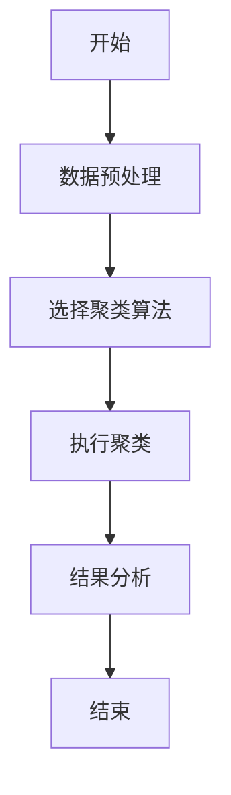
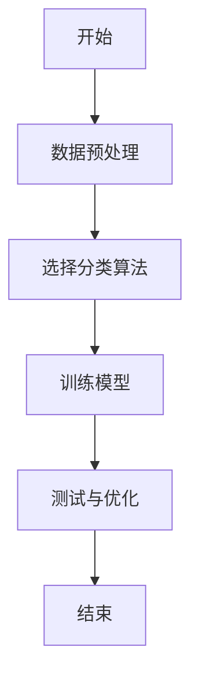
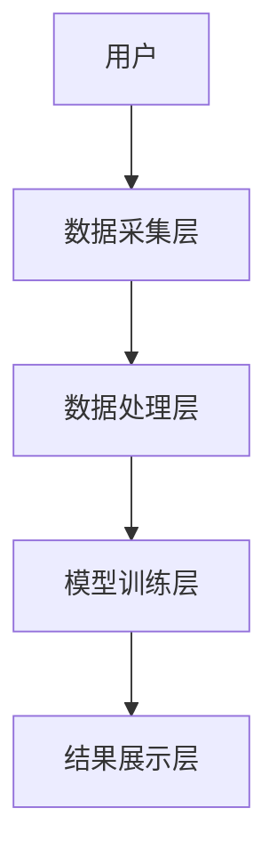

                 


# 《AI在反金融犯罪模式识别中的深度应用研究》

**关键词**：人工智能，反金融犯罪，模式识别，金融安全，深度学习

**摘要**：本文深入探讨了人工智能在反金融犯罪模式识别中的应用，分析了传统方法的局限性，介绍了基于AI的模式识别技术的核心原理，并通过系统设计和实际案例展示了其在反金融犯罪中的深度应用。文章结合数学模型、算法流程和系统架构，详细阐述了AI技术如何有效识别和预防金融犯罪，为金融安全提供了新的思路和解决方案。

---

## 目录大纲

### 第一部分: AI在反金融犯罪模式识别中的背景与核心概念

#### 第1章: 问题背景与描述

##### 1.1 问题背景
- 1.1.1 金融犯罪的现状与挑战
  - 全球金融犯罪的规模与趋势
  - 传统反金融犯罪手段的局限性
- 1.1.2 传统反金融犯罪模式的局限性
  - 人工审核的低效性
  - 规则-based系统的局限性
- 1.1.3 AI技术在金融安全中的潜力
  - AI在金融领域的应用前景

##### 1.2 问题描述
- 1.2.1 金融犯罪的主要类型与特征
  - 洗钱、欺诈、内幕交易等
- 1.2.2 模式识别在反金融犯罪中的关键作用
  - 异常交易检测、行为模式分析
- 1.2.3 反金融犯罪模式识别的核心问题
  - 数据特征提取、分类器设计、模型优化

##### 1.3 问题解决与边界
- 1.3.1 AI技术如何解决反金融犯罪问题
  - 自动化异常检测、实时监控、预测分析
- 1.3.2 反金融犯罪模式识别的边界与外延
  - 数据范围、时间范围、模型精度
- 1.3.3 核心概念与要素的结构化分析
  - 数据特征、算法模型、评估指标

#### 第2章: 核心概念与联系

##### 2.1 AI与金融犯罪模式识别的核心原理
- 2.1.1 人工智能的基本原理
  - 机器学习、深度学习、自然语言处理
- 2.1.2 模式识别的定义与分类
  - 分类、聚类、回归、异常检测
- 2.1.3 反金融犯罪模式识别的数学基础
  - 线性代数、概率论、统计学

##### 2.2 核心概念属性对比
- 2.2.1 AI算法的属性特征
  - 算法类型、计算复杂度、可解释性
- 2.2.2 金融犯罪模式识别的特征
  - 数据维度、特征相关性、时间序列性
- 2.2.3 两者属性对比分析
  - 数据需求、计算能力、结果解读

##### 2.3 ER实体关系图
```mermaid
er
  actor: 用户
  model: AI模型
  transaction: 金融交易
  crime: 金融犯罪行为
  actor --> model: 提供数据
  model --> transaction: 分析交易
  transaction --> crime: 识别犯罪行为
```

#### 第3章: AI在反金融犯罪模式识别中的算法原理

##### 3.1 常用算法概述
- 3.1.1 聚类算法
  - K-means、DBSCAN
- 3.1.2 分类算法
  - 支持向量机、随机森林
- 3.1.3 神经网络算法
  - 卷积神经网络、循环神经网络

##### 3.2 算法原理与流程
- 3.2.1 聚类算法流程

- 3.2.2 分类算法流程


##### 3.3 数学模型与公式
- 3.3.1 聚类算法的数学模型
  $$距离 = \sqrt{(x_2 - x_1)^2 + (y_2 - y_1)^2}$$
- 3.3.2 分类算法的数学模型
  $$P(y|x) = \frac{P(x|y)P(y)}{P(x)}$$

### 第二部分: 系统分析与架构设计

#### 第4章: 问题场景介绍

##### 4.1 问题场景介绍
- 4.1.1 反金融犯罪模式识别的典型场景
  - 银行交易监控、信用卡欺诈检测
- 4.1.2 系统目标与功能需求
  - 实时监控、异常检测、风险评估
- 4.1.3 系统的约束与边界
  - 数据隐私、计算资源限制

#### 第5章: 系统功能设计

##### 5.1 领域模型设计
```mermaid
cla
    actor: 用户
    model: AI模型
    transaction: 金融交易
    crime: 金融犯罪行为
    user --> model: 提供数据
    model --> transaction: 分析交易
    transaction --> crime: 识别犯罪行为
```

##### 5.2 系统架构设计


##### 5.3 系统接口与交互
```mermaid
sequence
    actor -> model: 提供金融交易数据
    model -> transaction: 分析交易行为
    transaction -> crime: 识别异常交易
    crime -> actor: 提醒潜在风险
```

### 第三部分: 项目实战与优化

#### 第6章: 项目实战

##### 6.1 环境安装
- Python 3.8+
- 库的安装：numpy, pandas, scikit-learn, tensorflow

##### 6.2 核心代码实现
```python
import numpy as np
from sklearn.svm import SVC
from sklearn.metrics import accuracy_score

# 数据预处理
X_train = ...
y_train = ...
model = SVC()
model.fit(X_train, y_train)

# 模型评估
y_pred = model.predict(X_test)
print(accuracy_score(y_test, y_pred))
```

##### 6.3 案例分析
- 案例1：信用卡欺诈检测
  - 数据特征：交易金额、时间、地点、用户行为
  - 模型选择：随机森林、XGBoost

##### 6.4 项目小结
- 项目成果
- 经验总结
- 改进方向

### 第四部分: 总结与展望

#### 第7章: 总结与展望

##### 7.1 最佳实践
- 数据质量的重要性
- 模型选择的策略
- 解释性与可操作性的平衡

##### 7.2 未来展望
- 更先进的AI技术应用
- 多模态数据的融合
- 智能化系统的进化

#### 第8章: 小结与注意事项

##### 8.1 小结
- AI在反金融犯罪中的关键作用
- 模式识别的核心地位
- 系统设计的重要性

##### 8.2 注意事项
- 数据隐私保护
- 模型的可解释性
- 技术的持续更新

### 附录: 拓展阅读

- 推荐书籍：《机器学习实战》、《深度学习》
- 推荐论文：NIPS、ICML、KDD相关论文
- 推荐工具：Python机器学习库、TensorFlow框架

---

**作者**：AI天才研究院 / AI Genius Institute & 禅与计算机程序设计艺术 / Zen And The Art of Computer Programming

