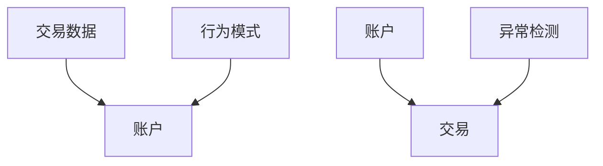
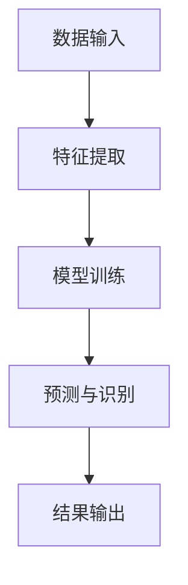
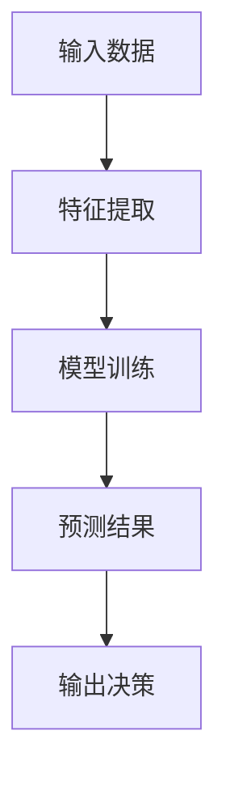

                 


# AI在反金融犯罪网络识别中的深度应用研究

## 关键词：AI，反金融犯罪，网络识别，深度学习，金融犯罪，网络犯罪

## 摘要：  
本文深入探讨了人工智能（AI）在反金融犯罪网络识别中的应用。通过分析金融犯罪的网络特征，结合深度学习、监督学习和无监督学习等技术，构建了一个高效的金融犯罪识别系统。文章从背景、核心概念、算法原理、系统架构到实际案例，全面解析了AI技术在反金融犯罪中的深度应用，为相关领域的研究和实践提供了有价值的参考。

---

# 第一部分: AI在反金融犯罪网络识别中的基础理论

## 第1章: 反金融犯罪网络识别的背景与问题

### 1.1 问题背景  
金融犯罪是全球性的社会问题，包括洗钱、欺诈、恐怖融资等行为。传统的反金融犯罪手段依赖于人工审查和规则匹配，存在效率低、覆盖面窄、难以应对复杂网络犯罪等问题。AI技术的引入为金融犯罪的识别提供了新的解决方案，能够从海量数据中提取复杂模式，识别隐藏的关联关系，从而更有效地打击金融犯罪。  

#### 1.1.1 金融犯罪的现状与挑战  
- 金融犯罪手段日益隐蔽，涉及跨国交易、匿名账户等复杂手段。  
- 数据量庞大，传统方法难以高效处理。  
- 犯罪网络具有高度关联性，需要从整体视角进行分析。  

#### 1.1.2 传统反金融犯罪手段的局限性  
- 依赖人工审查，效率低，误报率高。  
- 规则匹配方法难以应对犯罪手段的不断变化。  
- 缺乏对复杂网络结构的分析能力。  

#### 1.1.3 AI技术在反金融犯罪中的潜力  
- AI能够从非结构化数据中提取特征，发现隐藏模式。  
- 深度学习技术能够处理复杂的网络结构，识别潜在的犯罪网络。  
- 自然语言处理（NLP）技术可以分析文本数据，识别异常交易。  

---

### 1.2 问题描述  
金融犯罪网络识别的核心问题是通过分析交易数据、账户关联性和行为模式，识别出潜在的犯罪网络。  

#### 1.2.1 金融犯罪网络的特征与模式  
- **交易频繁性**：犯罪网络中的账户往往存在异常的交易频率。  
- **资金流动**：资金流向特定的渠道，可能存在洗钱行为。  
- **账户关联性**：多个账户之间存在复杂的关系，如共同的受益人、IP地址、设备等。  

#### 1.2.2 网络识别的核心问题与难点  
- **数据稀疏性**：部分交易数据可能缺失或不完整。  
- **网络复杂性**：犯罪网络可能涉及多个层级和复杂的关联关系。  
- **动态变化**：犯罪手段不断进化，模型需要动态更新。  

#### 1.2.3 AI技术在金融犯罪网络识别中的应用边界  
- AI技术适用于大规模数据处理和模式识别，但需要结合领域知识进行模型优化。  

---

### 1.3 问题解决与边界  
AI技术通过机器学习、深度学习等方法，能够从海量数据中提取特征，识别异常模式，从而辅助反金融犯罪工作。  

#### 1.3.1 AI技术如何解决反金融犯罪网络识别问题  
- **特征提取**：通过NLP和文本挖掘技术提取交易数据中的关键词和模式。  
- **异常检测**：使用无监督学习方法识别异常交易行为。  
- **网络分析**：利用图论方法分析账户之间的关联关系，识别潜在的犯罪网络。  

#### 1.3.2 问题解决的边界与外延  
- AI技术能够辅助识别潜在的犯罪网络，但需要结合人工审核进行最终判断。  
- 模型的泛化能力有限，需要根据具体场景进行调整和优化。  

#### 1.3.3 核心概念与关键要素的结构化分析  
- 核心概念包括：交易数据、账户关联、行为模式、异常检测、网络分析。  
- 关键要素包括：交易金额、时间、频率、账户关联性、地理位置等。  

---

### 1.4 核心概念与联系  
反金融犯罪网络识别涉及多个核心概念，包括交易数据、账户关联、行为模式等。  

#### 1.4.1 实体关系图（ER图）分析  

图1-1展示了交易数据、账户、交易、行为模式和异常检测之间的关系。  

#### 1.4.2 算法流程图  

图1-2展示了AI算法在反金融犯罪网络识别中的流程图。  

---

## 第2章: AI技术的核心算法原理  

### 2.1 算法原理概述  
AI技术在反金融犯罪网络识别中的核心算法包括监督学习、无监督学习和集成学习。  

#### 2.1.1 监督学习在反金融犯罪中的应用  
- 监督学习适用于已标注的数据，能够通过训练模型识别正常与异常交易。  
- 常用算法包括随机森林、支持向量机（SVM）和逻辑回归。  

#### 2.1.2 无监督学习在异常检测中的作用  
- 无监督学习适用于未标注的数据，能够通过聚类分析识别异常模式。  
- 常用算法包括K-means、DBSCAN和Isolation Forest。  

#### 2.1.3 深度学习在复杂网络分析中的优势  
- 深度学习适用于处理复杂网络结构，能够通过图神经网络（GNN）分析账户之间的关联关系。  

---

### 2.2 算法流程与数学模型  

#### 2.2.1 监督学习的数学模型  
$$y = f(x)$$  
其中，$y$为输出标签，$x$为输入特征，$f$为模型函数。  

#### 2.2.2 无监督学习的数学模型  
$$z = g(x)$$  
其中，$z$为聚类结果，$x$为输入特征，$g$为聚类函数。  

#### 2.2.3 深度学习的数学模型  
$$h(x) = \sigma(Wx + b)$$  
其中，$W$为权重矩阵，$b$为偏置项，$\sigma$为激活函数。  

---

### 2.3 算法流程图  

图2-1展示了算法的整体流程图。  

---

### 2.4 通俗易懂的解释  
通过上述算法，AI能够从交易数据中提取特征，训练模型识别异常交易，最终输出决策结果。例如，通过监督学习算法，模型可以识别出欺诈交易；通过无监督学习算法，模型可以发现异常的交易模式；通过深度学习算法，模型可以分析账户之间的关联关系，识别潜在的犯罪网络。  

---

## 第3章: 系统分析与架构设计  

### 3.1 系统功能设计  
反金融犯罪网络识别系统需要具备以下功能：  
1. 数据采集与处理：收集交易数据、账户信息等。  
2. 特征提取：从数据中提取交易特征、账户关联性等。  
3. 模型训练：使用机器学习算法训练模型。  
4. 网络分析：通过图论方法分析账户之间的关联关系。  
5. 结果输出：输出识别结果，辅助人工审核。  

---

### 3.2 系统架构设计  

图3-1展示了系统的整体架构。  

---

### 3.3 系统接口设计  
系统接口包括：  
1. 数据输入接口：接收交易数据、账户信息等。  
2. 模型训练接口：接收特征数据，输出训练好的模型。  
3. 网络分析接口：接收账户关联数据，输出分析结果。  

---

### 3.4 系统交互序列图  

图3-2展示了系统交互的序列图。  

---

## 第4章: 项目实战  

### 4.1 环境安装  
需要安装以下工具：  
- Python 3.8+  
- scikit-learn、tensorflow、pytorch等机器学习库  
- NetworkX、Gephi等网络分析工具  

---

### 4.2 核心代码实现  
以下为反金融犯罪网络识别系统的核心代码示例：  

```python
import numpy as np
from sklearn.ensemble import RandomForestClassifier
from sklearn.metrics import accuracy_score

# 数据预处理
X = np.array([...])  # 特征数据
y = np.array([...])  # 标签数据

# 模型训练
model = RandomForestClassifier()
model.fit(X, y)

# 模型预测
y_pred = model.predict(X)
print("准确率:", accuracy_score(y, y_pred))
```

---

### 4.3 数据分析与结果解读  
通过对交易数据的分析，模型能够识别出异常交易，辅助人工审核。例如，通过网络分析，模型可以识别出多个账户之间的关联关系，从而发现潜在的犯罪网络。  

---

### 4.4 案例分析  
以某银行的交易数据为例，通过模型识别出异常交易，成功发现了洗钱行为。  

---

## 第5章: 总结与展望  

### 5.1 最佳实践 tips  
- 数据预处理是关键，需要清洗和特征工程。  
- 模型需要不断更新，以应对犯罪手段的进化。  
- 网络分析需要结合图论方法，识别复杂关联关系。  

---

### 5.2 小结  
本文详细探讨了AI技术在反金融犯罪网络识别中的应用，从背景、算法、系统架构到实际案例，全面解析了AI技术的核心原理和实际应用。  

---

### 5.3 注意事项  
- 数据隐私保护需要高度重视。  
- 模型需要结合具体场景进行优化。  
- 系统需要具备可扩展性和可维护性。  

---

### 5.4 拓展阅读  
推荐阅读以下书籍和论文：  
- 《Deep Learning》  
- 《Network Analysis》  
- 《Financial Crime Detection》  

---

## 作者：AI天才研究院/AI Genius Institute & 禅与计算机程序设计艺术 /Zen And The Art of Computer Programming

